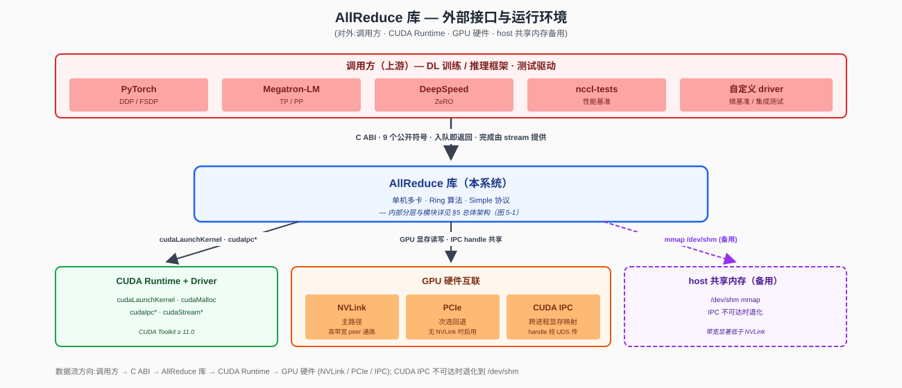
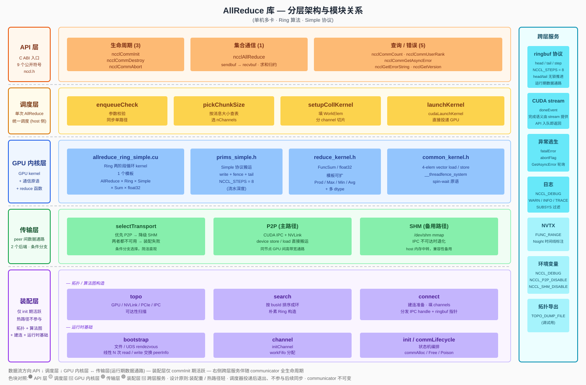
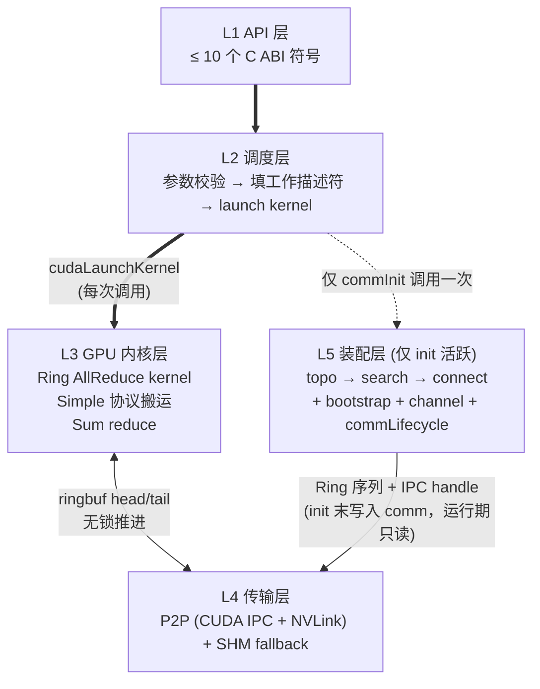
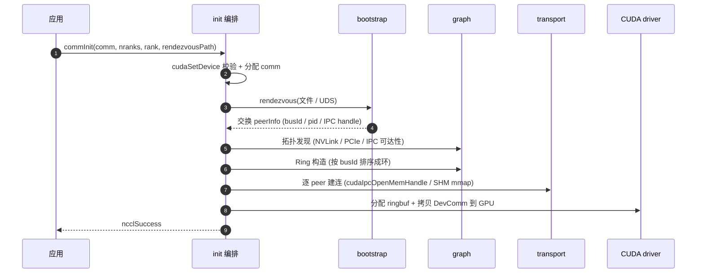
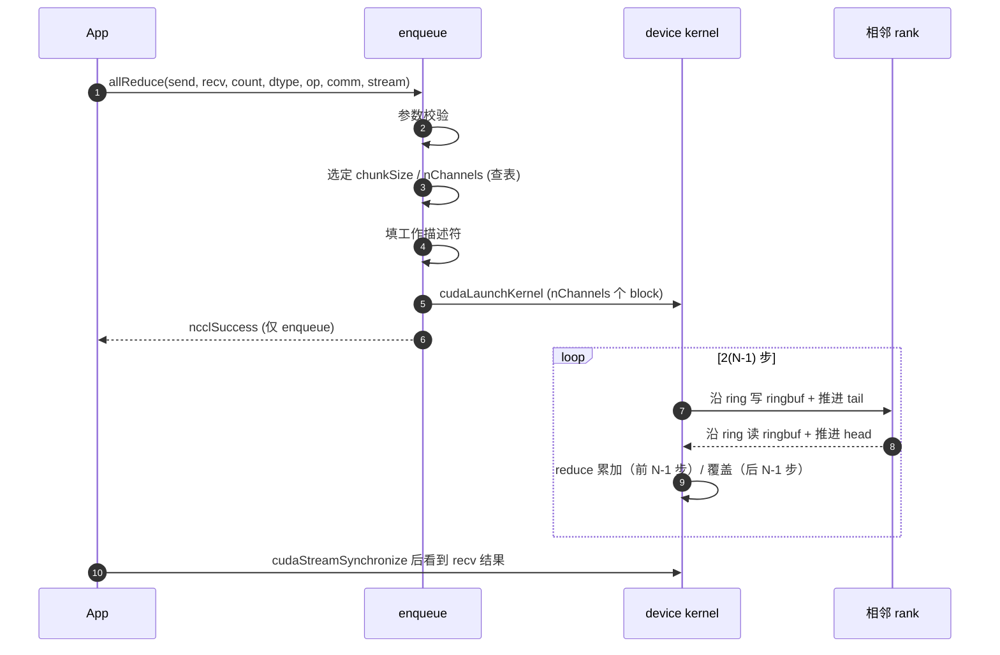
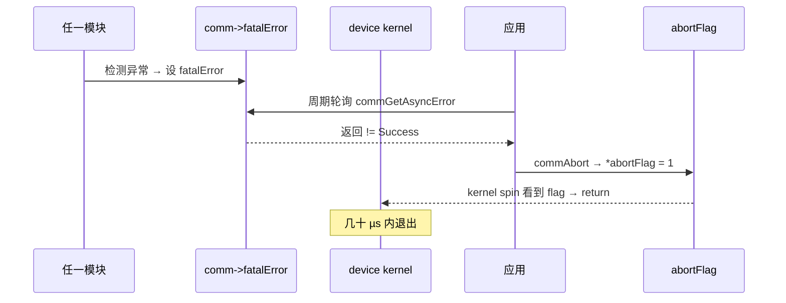

# 《单机多卡 AllReduce 集合通信库》概要设计文档

> 范围：单机多卡场景下的 AllReduce 集合通信。算法仅实现 Ring，协议仅实现 Simple。不做跨节点、不做 Tree/CollNet、不做 LL/LL128、不做 Send/Recv 与其它集合原语。
>
> 本文档为 **概要设计（HLD）**，停留在模块职责与关键技术选型层面；接口字段、数据结构、状态字段等细节留给详细设计阶段。参考依据：[`nccl-2.10.3-detailed-design.md`](nccl-2.10.3-detailed-design.md)。

---

## 1. 背景与目标

### 1.1 背景

深度学习训练中，DDP 梯度同步是 GPU 间通信的最大消耗，而 AllReduce 是其核心原语：所有 rank 输入相同形状的张量，输出是各 rank 对应位置求和（或其它归约）的结果。

本项目目标是给出一个**最小可用、行为完备**的 AllReduce 实现：聚焦单机多卡、采用 Ring 算法 + Simple 协议这一组成熟搭配，覆盖从 API 入口到 GPU 内核的完整链路。

### 1.2 设计目标

| 编号 | 目标 | 验证方式 |
|---|---|---|
| G1 | 单机 8×GPU AllReduce 大消息吞吐 ≥ 单链路理论带宽 80% | NVLink/PCIe 实测 |
| G2 | **TODO** 小消息（≤ 1 KB）延迟 ≤ 50 µs | 端到端基准测试 |
| G3 | C ABI 极简稳定，公开符号 ≤ 10 个 | 符号表审计 |
| G4 | 装配重 / 热路径轻：单次 AllReduce 调用 host 端开销 ≤ 5 µs | NVTX 时间线分析 |
| G5 | 失败可逃生：进程内任一 rank 异常 → 整 comm 可 abort 退出 | 故障注入测试 |

### 1.3 非目标（明确不做）

| 不做 | 原因 | 替代方案 |
|---|---|---|
| 跨节点通信（IB / Socket）| 引入 proxy 线程 / verbs / RDMA，复杂度过高 | 同节点端到端跑通后再扩展 |
| Tree / CollNet 算法 | Ring 已能覆盖带宽场景；Tree 仅在大规模延迟敏感时有意义 | 后续版本 |
| LL / LL128 协议 | Simple 已能满足正确性与基本带宽目标 | 后续版本 |
| Broadcast / Reduce / AllGather / ReduceScatter | 与 AllReduce 共享底层数据通路| 后续版本 |
| Send / Recv 点对点 | 复用底层通信能力，本期不暴露 | 后续版本 |
| 多种 reduction op | 先实现 Sum，其余（Prod/Max/Min/Avg）按模板扩展即可 | 后续版本 |
| 多 dtype | 先实现 float32；其余按模板扩展 | 后续版本 |
| CUDA Graph 捕获 | 与 host node 注册相关，超出最小可用范围 | 后续版本 |

### 1.4 Ring AllReduce 工作原理（概念）

设 N 个 rank 排成环 `0 → 1 → 2 → ... → N-1 → 0`，每 rank 持有大小为 `count` 的张量。算法分两阶段，共 `2(N-1)` 步：

| 阶段 | 步数 | 每步动作 |
|---|---|---|
| Reduce-Scatter | N-1 | rank `r` 把自己持有的某个 chunk 发给右邻；右邻收到后**累加**到本地对应 chunk |
| All-Gather | N-1 | rank `r` 把刚拿到的"全和 chunk"转发给右邻；右邻**覆盖**写入 |

**关键性质**：每 rank 总收发量为 `2(N-1)/N × count`，N 大时趋近 2 × count，**与 N 无关**——这是 Ring 带宽最优的原因。详细推导见参考文档 §1.4.2。

---

## 2. 术语对照

> 先约定后使用 — 全文反复出现的术语集中于此查阅。各使用章节会附"局部名词解释"以方便就地理解。

| 术语 | 含义 | 首次出现 |
|---|---|---|
| **rank** | 一个参与通信的 GPU 进程 / 线程 | §1.4 |
| **communicator** | 一组 rank 的通信上下文，不可变句柄 | §3.1 |
| **channel** | 一个 GPU thread block 承载的并行通道，多 channel 并发吃带宽 | §6.3.2 |
| **chunk** | Ring 算法中数据被切分的单位（共 N 份）| §1.4 |
| **ringbuf** | channel 上的环形缓冲（slot 数 = NCCL_STEPS = 8）| §6.3.2 |
| **ringbuf head / tail** | 环形缓冲的读 / 写游标，写者推 tail、读者推 head；无锁推进——运行期 GPU 与 GPU 之间的同步机制 | §5.4 |
| **Simple 协议** | 数据 + 独立 tail 计数器 + `__threadfence_system` 同步 | §1 范围 |
| **IPC** | CUDA Inter-Process Communication（跨进程显存映射）| §4 |
| **装配** / **装配期** | communicator 一次性初始化阶段：拓扑发现 + Ring 构造 + 建连 + ringbuf 分配；每 comm 仅一次，时间预算数十~数百 ms | §5.4 |
| **热路径** | 单次 `ncclAllReduce` 调用所经过的高频代码路径，对延迟敏感，时间预算 µs 级 | §5.4 |
| **装配重 / 热路径轻** | 设计原则 P1：可提前计算的工作放到装配阶段；运行期只查表 + launch kernel，避免运行期决策 | §5.2 / §5.4 |
| **rendezvous** | 进程间会合机制，用于在 `commInit` 时交换 `peerInfo`；本项目用文件 / UDS 实现 | §5.4 / §6.3.5 |
| **abortFlag / fatalError** | 异常退出两阶段：检测到异常 → 设 `fatalError`；用户调 `commAbort` → 置 `abortFlag` → kernel spin 看到后 return | §8.3 |

---

## 3. 需求范围

### 3.1 功能性需求

| ID | 需求 | 用户视角 |
|---|---|---|
| F1 | Communicator 生命周期 | `commInit(comm, nranks, rank, rendezvousPath)` / `commDestroy(comm)` / `commAbort(comm)` |
| F2 | AllReduce 原语 | `allReduce(sendbuf, recvbuf, count, dtype, op, comm, stream)` |
| F3 | 装配期拓扑发现 | 自动识别 GPU 间 NVLink / PCIe / IPC 可达性 |
| F4 | 异步错误轮询 | `commGetAsyncError(comm, &err)` |
| F5 | 入队即返回语义 | 完成由 CUDA stream 提供，API 不阻塞 |

### 3.2 非功能性需求

| 维度 | 目标 | 备注 |
|---|---|---|
| 吞吐 | 大消息 ≥ 80% 单链路理论带宽 | NVLink-3 节点目标 ≥ 200 GB/s |
| 延迟 | 8 B AllReduce ≤ 50 µs | Simple 协议，无 LL 优化 |
| 规模 | 单机 ≤ 16 GPU | 不做跨节点 |
| 可用性 | 任一 rank 异常 → 整 comm 失效 | 不支持单 rank 容错 |
| 一致性 | CUDA stream 顺序提供完成语义 | 与上游 NCCL 一致 |
| 可观测 | 分级 log + 拓扑 dump | `NCCL_DEBUG` |

---

## 4. 外部接口与运行环境

> 图 4-1：外部接口与运行环境（调用方 · CUDA Runtime · GPU 硬件互联 · host 共享内存备用）
>
> 完整 SVG 见 [`allreduce-context.svg`](allreduce-context.svg)。



### 4.1 调用方（上游）

库通过 9 个 C ABI 公开符号被外部链接调用，符号清单见 §12.1。常见调用方分两类：

| 类别 | 集成方式 | 典型场景 |
|---|---|---|
| **DL 训练 / 推理框架** | 链接动态库（`libnccl.so` / `nccl.dll`）+ `#include "nccl.h"` | PyTorch DDP 梯度同步 / DeepSpeed ZeRO 参数广播 / Megatron-LM 张量并行同步 |
| **测试驱动 / 基准程序** | 同上 | `nccl-tests` 性能基线、自定义微基准、CI 集成测试 |

**调用语义**：集合通信 API（即 `ncclAllReduce`）**入队即返回**；操作完成由 CUDA stream 顺序提供（即 `cudaStreamSynchronize` 之后 `recvbuff` 可读）。这与上游 NCCL 行为一致，框架侧无需改造。

### 4.2 进程 / 线程模型

| 部署形态 | 描述 | 通信通路 |
|---|---|---|
| **单进程多 GPU** | 一个进程持有 N 个 GPU、N 个 communicator；典型用法是主线程逐设备 `cudaSetDevice` + launch，或一线程一卡 | 直接 CUDA IPC + NVLink；同地址空间内 handle 可直接共享，**绕过文件 / UDS rendezvous** |
| **多进程多 GPU**（同节点）| 每进程一个 GPU、一个 communicator；典型 PyTorch DDP `torchrun --nproc-per-node=N` | 通过**文件 / UDS rendezvous** 交换 `peerInfo`（busId + pid + IPC handle），再走 CUDA IPC + NVLink |

要求所有 rank **几乎同时** 调用 `ncclCommInit`；某个 rank 迟到会让其他 rank 阻塞在 rendezvous 上（行为与上游 NCCL 一致）。

### 4.3 下游依赖（运行时）

| 依赖 | 作用 | 涉及 API / 接口 |
|---|---|---|
| **CUDA Runtime + Driver** | kernel 启动、显存管理、跨进程显存映射、流同步 | `cudaLaunchKernel` / `cudaMalloc` / `cudaIpcGetMemHandle` / `cudaIpcOpenMemHandle` / `cudaStreamSynchronize` / `cudaEventRecord` |
| **NVLink**（主路径）| GPU 间数据搬运 | 由 CUDA 透明使用；单链路 ~25 GB/s（NVLink-3） |
| **PCIe**（次选）| NVLink 不可用时退回 PCIe Peer | Gen4 x16 ~32 GB/s 单向 |
| **CUDA IPC** | 跨进程显存映射 | driver 提供，handle 不透明，经 UDS / 文件传递 |
| **host `/dev/shm`**（备用）| CUDA IPC 不可达时退化 | `shm_open` / `mmap` |

**显式不依赖**：libibverbs（IB）、libnvidia-ml、libgdrapi、网络 socket — 这些是跨节点 / 监控 / GPUDirect RDMA 才需要的库，单机场景用不到，简化了构建与部署。

### 4.4 构建期依赖

- **CUDA Toolkit ≥ 11.0**（含 `nvcc`、`cuda_runtime.h`、`cuda_driver.h`）
- **C++ 17 host 编译器**（gcc ≥ 9 / clang ≥ 10 / MSVC ≥ 19.20）；STL 仅用容器与字符串
- **CMake ≥ 3.18**（构建系统）

### 4.5 边界总结

- **上游**：DL 框架通过 C ABI 调用，库不感知框架细节；API 形态与上游 NCCL 兼容子集。
- **下游**：CUDA Runtime + Driver；不直接调用 verbs / sockets。
- **同进程多 GPU**：直接 CUDA IPC + NVLink，rendezvous 在内存中完成。
- **同节点跨进程**：CUDA IPC handle 经文件 / UDS 交换；IPC 不可达时退化到 `/dev/shm`。
- **数据流方向**：调用方 → C ABI → 库 → CUDA Runtime → GPU 硬件（NVLink / PCIe / IPC）；返回值仅表示"入队成功"，结果可见性由 stream 保证。

---

## 5. 总体架构

### 5.1 模块架构（总览）

> 图 5-1：分层架构与模块关系（按层 + 子模块 + 跨层服务展开）
>
> 完整 SVG 见 [`allreduce-arch-layered.svg`](allreduce-arch-layered.svg)。



**读图要点**：

| 视觉约定 | 含义 |
|---|---|
| **横向 5 层**（API → 调度 → GPU 内核 → 传输 → 装配）| 从上到下即装配 + 热路径的调用方向；应用层（DL 框架 / 测试程序）位于库外，见 §4 外部接口与运行环境 |
| **左侧色块** | 每层职责一句话 |
| **右侧色块矩阵** | 每层内部的子模块清单 |
| **GPU 内核层** | GPU 上运行的 kernel + 通信原语 + reduce 函数；命名上与传输层（硬件通路）区分 |
| **装配层** | 拓扑发现、Ring 构造、IPC 建连、rendezvous 等仅在 `commInit` 期活跃的模块统一归入此层 |
| **最右侧"跨层服务"列** | ringbuf 协议、stream 完成语义、异常逃生、日志 / NVTX、环境变量 — 伴随 communicator 全生命周期，与具体层解耦 |
| **层间虚分隔线** | 仅为视觉分组，不代表硬隔离 |

**整体特征（一行总结）**：API ≤ 10 个公开符号 · 单一 Ring + Simple 数据通路 · P2P 主路径 + SHM 备用 · **装配重、热路径轻**（拓扑搜索 / 建连 / 参数表一次性压到 init，每次调用仅查表 + launch kernel）。

### 5.2 关键设计原则

| # | 原则 | 含义 |
|---|---|---|
| P1 | **装配重 / 热路径轻** | 拓扑发现、Ring 构造、IPC 建连一次性在 `commInit` 完成；每次 `ncclAllReduce` 调用只查表 + launch kernel |
| P2 | **Communicator 不可变** | 创建即固定 rank 集合；失败即整体作废，不支持动态拆分 |

### 5.3 分层调用关系（精简视图）

> 图 5-2：层间数据流（与图 5-1 同源，省略子模块，仅突出层间调用方向与时机）



- **粗箭头**（`==>`）= 每次 AllReduce 调用都会走的同步链路：API → 调度 → GPU 内核。
- **细双向箭头**（`<-->`）= 运行期数据通路：GPU 内核与传输层通过 ringbuf 的 head/tail 计数器读写远端 buffer。
- **虚线**（`-.->`）= 仅在 `commInit` 时触发一次：装配层完成拓扑、Ring 构造、建连后，运行期不再活跃（P1）。

> 本概设文档与上游工业级 NCCL 的章节、模块对应关系，统一在 §11 "与上游 NCCL 详设的对应表" 中列出，便于已熟悉 NCCL 的读者查阅；初次阅读者可直接跳过。

---

## 6. 模块划分与职责

### 6.1 模块清单

> 层号与 §5.1 图 5-1 对应。

| 层 | 模块 | 一句话职责 |
|---|---|---|
| L1 | **public-api** | C ABI 入口 + 轻量参数校验（仅做基本合法性检查，不做语义解析）|
| L2 | **enqueue** | 单次 AllReduce 的统一调度入口（写工作描述符、launch kernel）|
| L3 | **device**（GPU 内核）| Ring AllReduce GPU kernel（含 Simple 协议搬运、Sum reduce）|
| L4 | **transport** | P2P (CUDA IPC + NVLink) 建连与 ringbuf 管理；SHM 作为不可达时的备用路径 |
| L5 | **graph** | 装配期拓扑发现 + Ring 构造（**仅 init 活跃**）|
| L5 | **bootstrap** | 进程间 rendezvous（交换 IPC handle、对齐参数）|
| L5 | **init / commLifecycle** | 装配编排 + 生命周期状态机 |

### 6.2 模块契约（接口边界）

> "调用方 → 被调方"指模块间的调用方向，与第 1 章"上游 NCCL"不同。

| 调用方 → 被调方 | 契约数据 | 含义 |
|---|---|---|
| graph → transport | Ring 序列（每 rank 的 prev/next）| `commInit` 末写入 communicator，运行期不再变动 |
| init → device | DevComm（含 ring 邻居、ringbuf 指针）| GPU kernel 启动后从 device global 读 |
| enqueue → device | WorkElem（count / dtype / op / chunkSize）| 单次 AllReduce 的工作描述符 |
| transport ↔ device | ringbuf buffs + head/tail | 模块间唯一的数据接触面 |
| bootstrap → transport | IPC handle 字节包 | 按字节包原样传递，传输层不解析其内容 |

### 6.3 各模块设计要点（职责级，不展开字段）

#### 6.3.1 graph 模块

- **职责**：装配期一次性完成"硬件拓扑发现 → Ring 序列构造"。
- **设计要点**：
  - 拓扑发现仅识别本机 GPU 间的 NVLink / PCIe / IPC 可达性，输出一张简洁的可达性矩阵。
  - Ring 构造采用**朴素策略**：按 GPU busId 排序成环。对典型单机拓扑（全连接 NVLink、PCIe 树）这已是带宽最优或近似最优解；DFS 退避搜索可作为后续版本优化。
  - 只输出一份 Ring 序列，不做多算法独立搜索、不做代价模型。
- **实现规模**：目标 ≤ 500 行（一次性装配代码，逻辑简单）。

#### 6.3.2 device 模块

- **职责**：GPU kernel 实现 Ring AllReduce 的两阶段流水。
- **模板维度**：`AllReduce × Ring × Simple × Sum × float32`（先一组）；后续按需扩展 dtype / op。
- **执行单元映射**：
  - 一个 GPU thread block = 一个 channel；多 channel 并发以吃满 NVLink 带宽
  - 每个 channel 处理 `1/nChannels` 的数据，channel 内部再按 Ring 切成 `nRanks` 个 chunk
  - block 内多 thread 协作搬运 chunk 并做 reduce
- **关键步骤结构**：Ring AllReduce 每轮共 **2N-1 次原语调用**，对应五种步骤类型——

| 阶段 | 步骤 | 原语 | 说明 |
|---|---|---|---|
| Reduce-Scatter | step 0 | `send` | 只发送本 rank 的初始 chunk，不接收 |
| Reduce-Scatter | step 1 ~ N-2 | `recvReduceSend` | 接收 + 累加到 ringbuf + 转发；**不写 output** |
| 转折 | step N-1 | `recvReduceCopySend` | 接收 + 最后一次累加 + 写 output + 转发 |
| All-Gather | step N ~ 2N-3 | `recvCopySend` | 接收 + 写 output + 转发 |
| All-Gather | step 2N-2 | `recv` | 只接收 + 写 output，**不再转发** |

- **kernel 概念性伪代码**：

```c
__global__ void ncclKernel_AllReduce_Ring_Simple_Sum_f32(ncclWorkElem* args) {
  int bid       = blockIdx.x;                  // channel id
  int nChannels = args->nChannels;
  int rank      = ncclShmem.comm.rank;
  int N         = ncclShmem.comm.nRanks;
  int ringIx    = rank;                        // 单 Ring 简化:ringIx == rank
  size_t size   = args->count;                 // 总元素数
  size_t chunkSize = args->chunkSize;          // 装配期查表确定
  size_t loopSize  = (size_t)nChannels * N * chunkSize;

  prims_simple<Sum, float> prims(
    /*prev=*/(rank + N - 1) % N,
    /*next=*/(rank + 1) % N,
    args->sendbuff, args->recvbuff);

  // 外层:大数据量分片处理,每轮处理 nChannels × N × chunkSize 元素
  for (size_t gridOffset = 0; gridOffset < size; gridOffset += loopSize) {
    auto offsetOf = [&](int chunk) -> size_t {
      return gridOffset + (size_t)bid * N * chunkSize + chunk * chunkSize;
    };
    auto nelemOf = [&](int chunk) -> int {
      return min(chunkSize, size - offsetOf(chunk));
    };

    // === Reduce-Scatter: N-1 步 ===
    // step 0: 只发送
    int chunk = (ringIx + N - 1) % N;
    prims.send(offsetOf(chunk), nelemOf(chunk));

    // step 1 ~ N-2: 累加并转发,数据停留在 ringbuf,不写 output
    for (int j = 2; j < N; ++j) {
      chunk = (ringIx + N - j) % N;
      prims.recvReduceSend(offsetOf(chunk), nelemOf(chunk));
    }

    // === 转折步: Reduce-Scatter 末步 + All-Gather 首步合并 ===
    // 接收最后一次 reduce → 此 chunk 已是全和 → 写入 output → 同时转发
    chunk = ringIx;
    prims.recvReduceCopySend(offsetOf(chunk), nelemOf(chunk));

    // === All-Gather: N-1 步 ===
    // step N ~ 2N-3: 转发已 reduce 完的 chunk,并写入 output
    for (int j = 1; j < N - 1; ++j) {
      chunk = (ringIx + N - j) % N;
      prims.recvCopySend(offsetOf(chunk), nelemOf(chunk));
    }

    // step 2N-2: 最后一步只接收+写 output,不再转发
    chunk = (ringIx + 1) % N;
    prims.recv(offsetOf(chunk), nelemOf(chunk));
  }
}
```

- **Simple 协议要点**（`prims_simple` 内部）：
  - 写入侧：写 `buffs[step % NCCL_STEPS]` → `__threadfence_system()` → 写 `tail`
  - 读出侧：spin 等 `tail > step`，读 data，写 `head` 推进
  - `NCCL_STEPS = 8` 作为流水深度
- **简化选择**：本期**只走间接路径**（数据全程通过 ringbuf 中转），不实现 Direct 路径（即不通过 `ptrExchange` 直写 peer output buffer）。Direct 路径可作为后续带宽优化版本的扩展。

#### 6.3.3 transport 模块

- **职责**：装配期建立 peer 间数据通路；运行期 GPU 内核直接通过 NVLink / IPC 读写远端 ringbuf。
- **设计要点**：
  - **后端优先级**：P2P (CUDA IPC + NVLink) 为主路径，SHM 为备用路径。两者都不可用则装配失败。
  - **后端选择时机**：装配期 `selectTransport` 对**每对 peer 独立决定**——若 `cudaDeviceCanAccessPeer` 返回真则用 P2P，否则降级 SHM。决策结果存在 `comm->channels[i].peers[j].transport` 字段中，运行期不再判断。
  - 后端选择用条件分支表达，两个分支足够直观，无需引入 vtable 多态。
  - 单机内 GPU 端 store / load 即完成数据搬运，host 侧不需要任何辅助线程。
- **ringbuf 布局**：每对相邻 rank、每方向、每 channel 一份；只服务 Simple 协议，故每个 channel 只需一份 buffer。两种后端用统一的 ringbuf ABI 暴露给 device kernel（buffer 指针 + head/tail 计数器地址），布局差异由 transport 层在装配期吸收：
  - **P2P**：buffer 是远端 GPU 显存，通过 `cudaIpcOpenMemHandle` 映射到本地虚拟地址空间
  - **SHM**：buffer 是 `/dev/shm` 共享内存，通过 `mmap` 双方共享；head/tail 计数器同样放在 SHM 中
- **本期不实现 Direct 路径**：不维护 peer output buffer 的指针交换（即 NCCL 的 `ptrExchange` 字段）。All-Gather 阶段也走 ringbuf 中转。该简化牺牲一定带宽（多一次 buffer 拷贝），换得 transport 接口最小化。

#### 6.3.4 enqueue 模块

- **职责**：参数校验 → 选定 chunkSize / nChannels → 写工作描述符 → `cudaLaunchKernel`。
- **设计要点**：
  - 算法 + 协议固定为 Ring + Simple，无需运行时选择。
  - 单次 AllReduce 走同步路径，本期不支持 Group 聚合（多个原语一次入队）。
- **chunkSize / nChannels 选择策略**：装配期生成一张以"消息大小"为档位的小表（典型 4~6 档：≤1KB / 1KB~64KB / 64KB~1MB / 1MB~16MB / >16MB），运行期按档位直接查表。表的填充考虑下列因子（均在装配期确定）：

| 因子 | 含义 | 影响 |
|---|---|---|
| `buffSize`（Simple 协议 ringbuf 大小）| `commInit` 中按显存预算固定（典型 4MB / channel） | chunkSize 上界 = `buffSize / NCCL_STEPS` |
| `nthreads` | 每 channel 的 thread 数（典型 256 或 512）| chunkSize 需对齐到 `(nthreads - WARP_SIZE) * sizeof(uint64_t)` |
| `nChannels` | 本节点 channel 数（典型 = ring 个数，本项目固定一个 ring 配 2~4 channel）| 总数据按 `nChannels × nRanks × chunkSize` 分片 |
| 消息字节数 `count × sizeof(dtype)` | 用户传入 | 小消息选小 chunk 减少最后一步浪费；大消息选大 chunk 减少 launch 开销 |

#### 6.3.5 bootstrap 模块

- **职责**：进程间 rendezvous，交换 IPC handle 与对齐 rank 序号。
- **设计要点**：
  - 单机多进程场景下，用**文件**或 **Unix Domain Socket** 作为 rendezvous 通道（路径由 `ncclCommInit` 的 `rendezvousPath` 参数指定）。
  - 单进程多线程场景：直接共享 host 内存即可，绕过 rendezvous。
- **同步机制**（UDS 方案，文件方案同理）：

```
rank 0 (协调者):
  1. listen(rendezvousPath)                   // 创建监听 socket
  2. for i in 1..N-1:                         // 接受 N-1 个连接
       conn[i] = accept()
  3. for i in 1..N-1: recv peerInfo[i]        // 收齐所有 rank 的 peerInfo
  4. peerInfo[0] = self                       // 加入自己
  5. for i in 1..N-1: send peerInfo[*]        // 广播完整的 peerInfo 数组

rank i (i ≥ 1):
  1. retry connect(rendezvousPath, 超时数秒)   // 等 rank 0 监听就绪
  2. send peerInfo[i]                         // 上报自己
  3. recv peerInfo[*]                         // 接收完整数组
```

- **关键性质**：
  - 步骤 3 是显式同步点——rank 0 必须收齐 N-1 份才进入广播；其它 rank 在 `recv` 处阻塞，保证看到的是**所有 rank 都已上报后的完整数组**。
  - 不需要构造逻辑 ring 形 AllGather（上游 bootstrap 的核心机制）：单机内 peerInfo 数据量小（每 rank 几十字节，含 busId + pid + IPC handle），star 拓扑足够。
  - 超时机制：连接 rank 0 失败时本地重试 + 退避（约 5s），所有 rank 都失败 → 返回 `ncclSystemError`。

#### 6.3.6 init / commLifecycle

- **职责**：装配编排 + 生命周期状态机。
- **状态机**：

```
Uninit → Bootstrapping → Discovering → Connecting → Active
                                                     ├→ Destroying → Freed
                                                     └→ Aborting   → Freed

任一装配阶段失败 → Failed → Freed
```

状态字段语义：`Bootstrapping` = rendezvous 中；`Discovering` = 拓扑发现 + Ring 构造；`Connecting` = 逐 peer 建连 + ringbuf 分配；`Active` = 可接收 AllReduce 调用；`Aborting` 由 `commAbort` 触发，与 `Destroying` 共享清理路径但允许中断进行中的 kernel。

---

## 7. 关键技术选型与权衡

| 决策点 | 选择 | 权衡 |
|---|---|---|
| **算法** | 仅 Ring | 放弃 Tree 的小消息延迟优势；换取实现复杂度大幅降低 |
| **协议** | 仅 Simple | 放弃 LL 的延迟优势（省一次 fence）；换取无 flag/data 交错的代码简洁 |
| **后端** | P2P (CUDA IPC) + SHM fallback | 放弃跨节点；换取 host 侧仅需主线程、构建仅依赖 CUDA |
| **拓扑搜索** | 朴素 busId 排序成环 | 放弃 DFS + 退避搜索的最优解；当典型拓扑能跑通即可 |
| **Channel 分配** | 简单 round-robin | 放弃 shortest-queue 策略；同尺寸 op 场景下差异可忽略 |
| **Group 聚合** | 不支持 | 放弃 launch 合并的性能收益；本期仅验证单次 AllReduce 的完整链路 |
| **多 dtype / op** | 先 float32 + Sum | 模板扩展成本低；后续按需补 |
| **CUDA Graph** | 不支持 | 与 host node 注册路径耦合；后续版本接入 |
| **错误处理** | abortFlag + fatalError 两阶段 | **保留**：这是 hang 逃生的关键设计，不能省 |

---

## 8. 关键流程（高层次概念）

### 8.1 流程一：Communicator 初始化

> 图 8-1：init 时序（概念级）



**关键决策**：rendezvous 是显式全局同步点；所有 rank 必须几乎同时调 `commInit`，否则会卡在 rendezvous。

### 8.2 流程二：AllReduce 热路径

> 图 8-2：单次 AllReduce 端到端



**关键决策**：
- 入队即返回：`ncclSuccess` 只表示"调度成功"，不代表运算已完成；完成由 CUDA stream 顺序提供。
- GPU 内核 launch 后即在 device 上自主运行，依靠 ringbuf 的 head/tail 计数器与 peer 同步；host 端只需 `cudaStreamSynchronize` 等结果。

### 8.3 流程三：异常退出

> 图 8-3：abortFlag / fatalError 两阶段（保留）



**保留这一机制的原因**：即便在单机场景下，kernel 仍可能因为对端 rank 异常而永久 spin（自旋等待）；abortFlag 是唯一可靠的退出路径。

---

## 9. 非功能性需求的实现方式

| 维度 | 设计落点 |
|---|---|
| **吞吐** | 多 channel 并发；chunkSize 与 NVLink 一次 store 颗粒匹配 |
| **延迟** | 拓扑 / 建连 / 参数表全部预计算到 init；运行期无任何决策开销；GPU 内核 launch 后通过 ringbuf head/tail 无锁推进 |
| **可用性** | abortFlag / fatalError 两阶段语义；任一 rank 异常整 comm 失效 |
| **一致性** | 完成语义由 CUDA stream 提供；不引入额外 Request 模型 |
| **可观测** | 分级 log（WARN / INFO / TRACE）；NVTX range 包裹 init 与 allReduce |
| **构建依赖** | CUDA ≥ 11.0；不依赖 libibverbs / libnvidia-ml / libgdrapi |

---

## 10. 风险与里程碑

### 10.1 风险

| 风险 | 影响 | 缓解 |
|---|---|---|
| 朴素 Ring 构造在 NVSwitch 全连接 / NVLink Bridge cubemesh 拓扑下不是最优 | 带宽未达理论上限 | 接受次优；后续版本接入 DFS 搜索 |
| Simple 协议 8B 小消息延迟显著高于 LL | 小消息场景吞吐受限 | 明确不在本期目标内（G2 = 50 µs 已留余量） |
| SHM fallback 路径未充分测试 | NVLink 不可用环境装配失败 | 集成测试覆盖 P2P_DISABLE 场景 |
| 跨进程 IPC handle 交换路径在容器 / cgroup 限制下可能失败 | 部分部署形态不可用 | 文档明确支持范围 |
| 内存可见性论证完整性 | 全平台可能错序 | 本期仅声明支持 x86 + Volta 及以上 NVIDIA GPU；x86 / Volta+ / Ampere / Hopper / ARM Grace 的 fence 语义与 IPC 跨进程映射可见性论证留待详设阶段补全（应专章覆盖） |
| 每次 AllReduce 都触发 `cudaLaunchKernel`（与 2.10.3 上游一致），launch overhead 在 µs 级 | 极小消息场景下 launch 开销可能成为延迟主项 | G4 中的"host 端开销 ≤ 5 µs"约束仅指参数校验 + 描述符填写 + 调用 launch API 的 host 侧栈耗时,**不含** driver 进入 GPU 的调度延迟；如后续 G2 进一步压缩,需评估引入持久化内核 + work FIFO（NCCL 2.12+ 方案） |
| 不实现 Direct 路径（仅走 ringbuf 中转） | All-Gather 阶段带宽较 Direct 路径有一定损失 | 接受；后续优化版本可加 `ptrExchange` 字段引入 Direct 路径 |

### 10.2 里程碑

| 阶段 | 交付物 | 验收 |
|---|---|---|
| M0 | 详设文档 + 项目骨架 | 评审通过 |
| M1 | 单进程多 GPU AllReduce float32 Sum 跑通 | 2 / 4 / 8 GPU 结果数值正确 |
| M2 | 多进程多 GPU（同节点）跑通 | rendezvous + IPC 路径覆盖 |
| M3 | 多 dtype + 全 reduce op 扩展 | 集成测试矩阵全绿 |
| M4 | 性能调优达 G1 / G2 | nccl-tests 基准对照 |
| M5 | abort / 故障注入测试通过 | hang 场景 100% 可逃生 |

---

## 11. 与上游 NCCL 详设的对应表

| 上游章节 | 本概设对应 | 差异 |
|---|---|---|
| §1.4 集合通信基础 | §1.4 Ring AllReduce 工作原理 | 仅保留 Ring + AllReduce |
| §3 整体架构 | §5 总体架构 | 5 原则 → 2 原则（去 vtable / 对称投递 / 三层正交组合）；层数从 7 → 5（合并 graph 与 misc 为装配层、不显式画应用层）|
| §4.4.1 graph 模块 | §6.3.1 | 简化为朴素 busId 排序 |
| §4.4.2 device 模块 | §6.3.2 | 模板维度从 5 维 ≈ 2000 个 kernel → 1 个 kernel |
| §4.4.3 transport 模块 | §6.3.3 | 4 后端 + vtable → 2 后端 + 条件分支 |
| §4.4.4 enqueue 模块 | §6.3.4 | 去 Group / Graph / 多调度路径 |
| §4.4.5 bootstrap 模块 | §6.3.5 | TCP ring AllGather → 文件 / UDS 线性交换 |
| §4.4.6 proxy 模块 | — | 单机不需要 |
| §4.4.7 ringbuf | §6.3.2 / §6.3.3 | 三协议 → 一协议 |
| §5.1 init 流程 | §8.1 | 简化时序 |
| §5.2 AllReduce 热路径 | §8.2 | 去 proxy 分支 |
| §5.3 Group 聚合 | — | 不做 |
| §5.4 状态机 | §6.3.6 | 简化状态 |
| §5.5 CUDA Graph | — | 不做 |
| §7.2 abortFlag / fatalError | §8.3 | **保留** |

---

## 12. 附录

### 12.1 公开 ABI（草案）

```c
// 生命周期 (3)
// rendezvousPath: 多进程场景所有 rank 必须传同一路径(文件 / UDS socket 路径,
//                 用于交换 peerInfo + IPC handle); 单进程多 GPU 场景可传 NULL。
ncclResult_t ncclCommInit(ncclComm_t* comm, int nranks, int rank,
                          const char* rendezvousPath);
ncclResult_t ncclCommDestroy(ncclComm_t comm);
ncclResult_t ncclCommAbort(ncclComm_t comm);

// 集合通信 (1)
ncclResult_t ncclAllReduce(const void* sendbuff, void* recvbuff,
                           size_t count, ncclDataType_t dtype,
                           ncclRedOp_t op, ncclComm_t comm,
                           cudaStream_t stream);

// 查询 (5)
ncclResult_t ncclCommCount(ncclComm_t comm, int* count);
ncclResult_t ncclCommUserRank(ncclComm_t comm, int* rank);
ncclResult_t ncclCommGetAsyncError(ncclComm_t comm, ncclResult_t* err);
const char*  ncclGetErrorString(ncclResult_t result);
ncclResult_t ncclGetVersion(int* version);
```

合计 9 个符号，满足 G3 ≤ 10 个的约束。

**与上游 NCCL 的 API 差异**：上游用 `ncclGetUniqueId` + `ncclCommInitRank(comm, nranks, ncclUniqueId, rank)` 两个调用，其中 `ncclUniqueId` 是 128 字节的不透明结构（含 TCP 监听地址 + token）。本项目用单个 `const char* rendezvousPath` 字符串替代，要求所有 rank 通过外部协调（MPI、文件系统约定、启动器命令行）拿到同一路径——这与底层用文件 / UDS 做 rendezvous 的实现匹配，避免引入 `ncclUniqueId` 的额外抽象。

### 12.2 参考资料

- [nccl-2.10.3-detailed-design.md](nccl-2.10.3-detailed-design.md) —— 完整版详设
- NVIDIA NCCL 2.10.3 源码
- 《Bandwidth Optimal All-Reduce Algorithms for Clusters of Workstations》(Patarasuk & Yuan, 2009)
