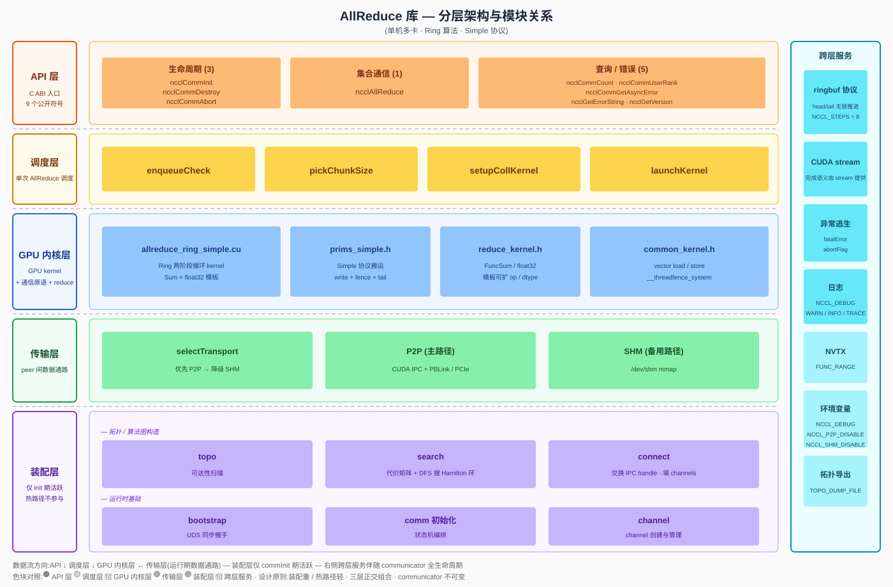
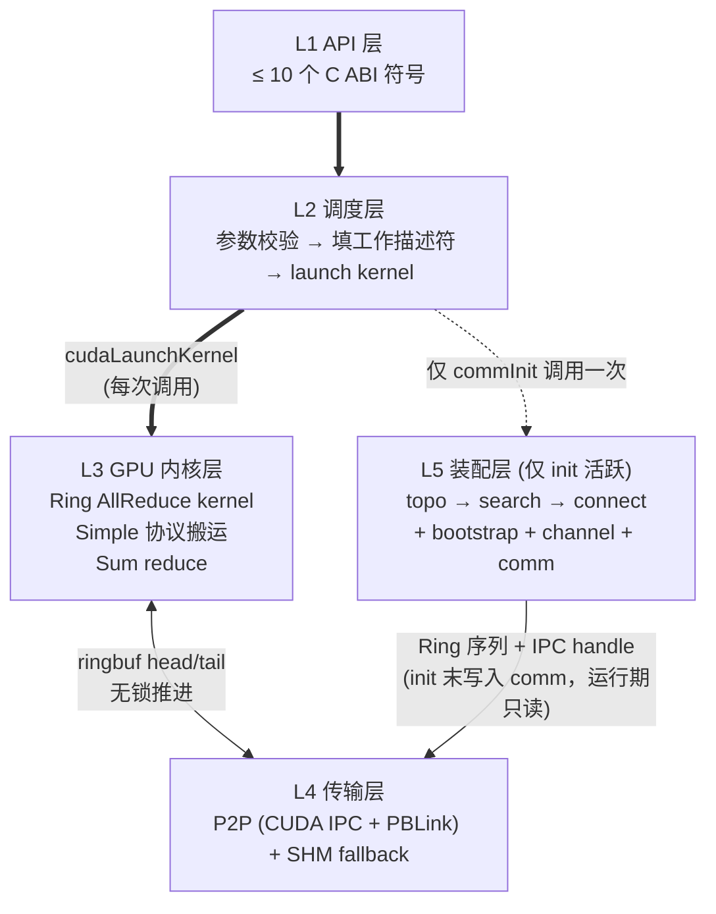
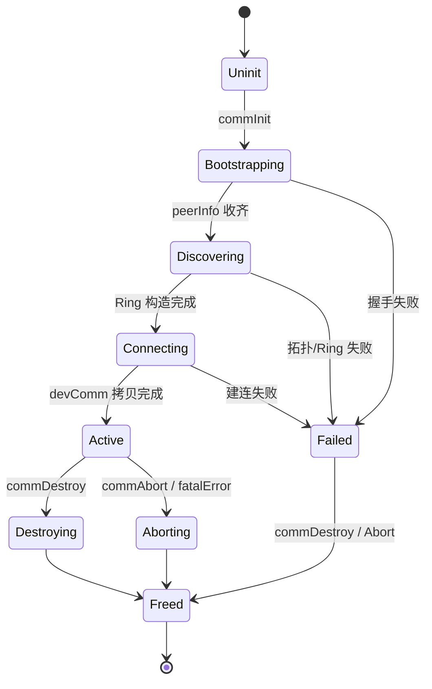
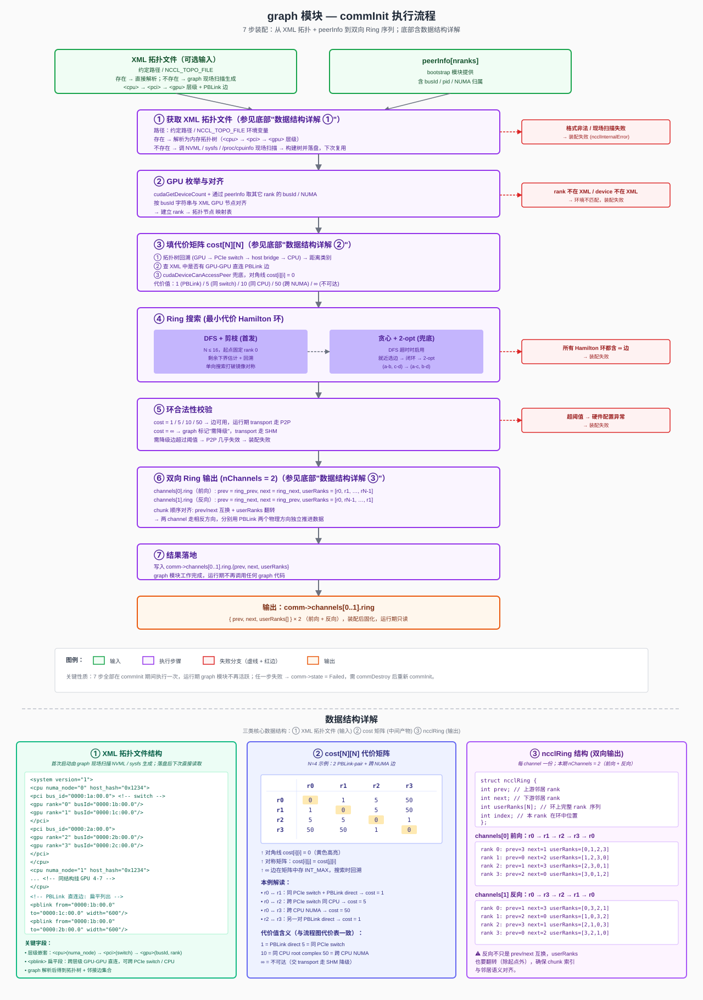
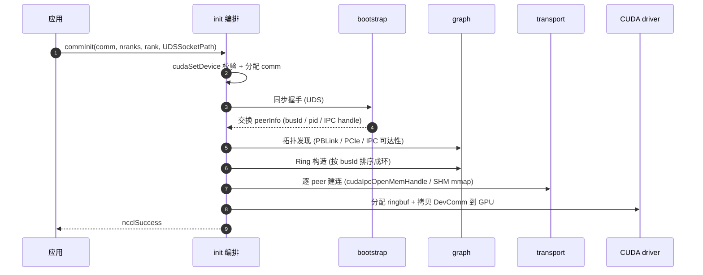
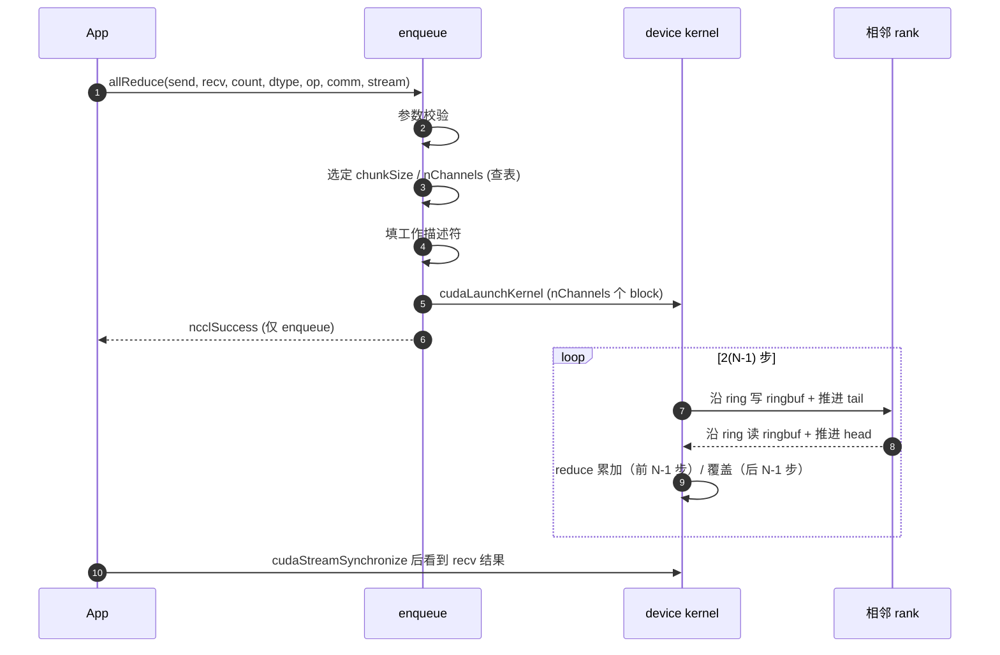
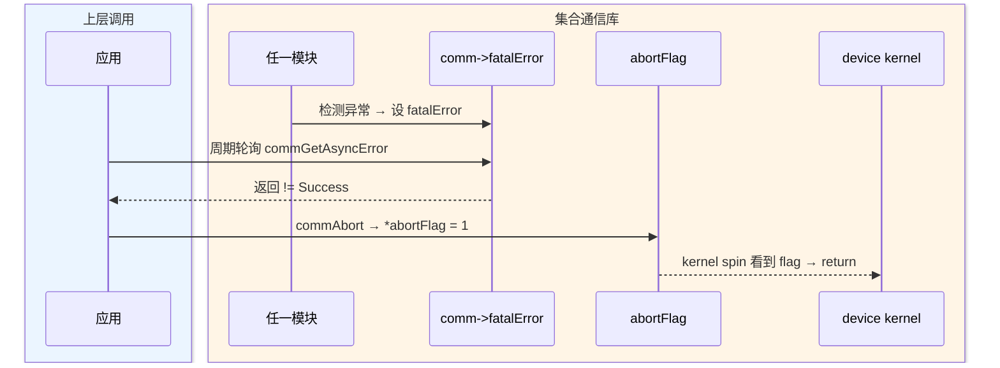

# 《单机多卡 AllReduce 集合通信库》概要设计文档

---

## 1. 背景与目标

### 1.1 背景

深度学习训练中，DDP 梯度同步是 GPU 间通信的最大消耗，而 AllReduce 是其核心原语：所有 rank 输入相同形状的张量，输出是各 rank 对应位置求和（或其它归约）的结果。

本项目目标是给出一个**最小可用、行为完备**的 AllReduce 实现：聚焦单机多卡、采用 Ring 算法 + Simple 协议这一组成熟搭配，覆盖从 API 入口到 GPU 内核的完整链路。

### 1.2 Ring AllReduce 工作原理（概念）

设 N 个 rank 排成环 `0 → 1 → 2 → ... → N-1 → 0`，每 rank 持有大小为 `count` 的张量。算法分两阶段，共 `2(N-1)` 步：

| 阶段 | 步数 | 每步动作 |
|---|---|---|
| Reduce-Scatter | N-1 | rank `r` 把自己持有的某个 chunk 发给右邻；右邻收到后**累加**到本地对应 chunk |
| All-Gather | N-1 | rank `r` 把刚拿到的"全和 chunk"转发给右邻；右邻**覆盖**写入 |

**关键性质**：每 rank 总收发量为 `2(N-1)/N × count`，N 大时趋近 2 × count，**与 N 无关**。详细推导见参考文档 §1.4.2。

---

## 2. 术语对照

| 术语 | 含义 |
|---|---|
| **rank** | 一个参与通信的 GPU 进程 / 线程 |
| **communicator** | 一组 rank 的通信上下文，不可变句柄 |
| **channel** | 一个 GPU thread block 承载的并行通道；一条单向 Ring 一份 channel，多 channel 并发执行 |
| **chunk** | Ring 算法中数据被切分的单位（共 N 份）|
| **ringbuf** | channel 上的环形缓冲（slot 数 = NCCL_STEPS = 8），用于接收数据 |
| **ringbuf head / tail** | 环形缓冲的读 / 写游标，写者推 tail、读者推 head；无锁推进——运行期 GPU 与 GPU 之间的同步机制 |
| **Simple 协议** | 数据 + 独立 tail 计数器 + `__threadfence_system` 同步 |
| **IPC** | CUDA Inter-Process Communication（跨进程显存映射）|
| **装配** / **装配期** | communicator 一次性初始化阶段：拓扑发现 + Ring 构造 + 建连 + ringbuf 分配；每 comm 仅一次 |
| **热路径** | 单次 `ncclAllReduce` 调用所经过的高频代码路径（参数校验 → 查表 → launch kernel）|
| **装配重 / 热路径轻** | 设计原则 P1：可提前计算的工作放到装配阶段；运行期只查表 + launch kernel，避免运行期决策 |
| **同步握手**（rendezvous） | 进程间同步屏障 + 信息交换：所有 rank 必须到齐才能继续；在 `commInit` 时用于交换 `peerInfo`，本项目用 UDS（Unix Domain Socket）实现 |
| **abortFlag / fatalError** | 异常退出两阶段：检测到异常 → 设 `fatalError`；用户调 `commAbort` → 置 `abortFlag` → kernel spin 看到后 return |

---

## 3. 需求范围

### 3.1 功能性需求

| ID | 需求 | 用户视角 |
|---|---|---|
| F1 | Communicator 生命周期 | `commInit(comm, nranks, rank, UDSSocketPath)` / `commDestroy(comm)` / `commAbort(comm)` |
| F2 | AllReduce 原语 | `allReduce(sendbuf, recvbuf, count, dtype, op, comm, stream)` |
| F3 | 装配期拓扑发现 | 自动识别 GPU 间 PBLink / PCIe / IPC 可达性 |
| F4 | 异步错误轮询 | `commGetAsyncError(comm, &err)` |

---

## 4. 外部接口与运行环境

> 图 4-1：外部接口与运行环境（调用方 · CUDA Runtime · GPU 硬件互联 · host 共享内存备用）
>
> 完整 SVG 见 [`allreduce-context.svg`](allreduce-context.svg)。


### 4.1 调用方

库通过 9 个 C ABI 公开符号被外部链接调用，符号清单见附录"公开 ABI"。常见调用方分两类：

| 类别 | 集成方式 | 典型场景 |
|---|---|---|
| **DL 训练 / 推理框架** | 链接动态库（`libnccl.so` / `nccl.dll`）+ `#include "nccl.h"` | PyTorch DDP 梯度同步 / DeepSpeed ZeRO 参数广播 / Megatron-LM 张量并行同步 |
| **测试驱动 / 基准程序** | 同上 | `nccl-tests` 数值正确性比对、自定义功能用例、CI 集成测试 |

### 4.2 进程 / 线程模型

| 部署形态 | 描述 | 通信通路 |
|---|---|---|
| **单进程多 GPU** | 一个进程持有 N 个 GPU、N 个 communicator | 直接 CUDA IPC + PBLink；同地址空间内 handle 可直接共享，**绕过 UDS 同步握手** |
| **多进程多 GPU**（同节点）| 每进程一个 GPU、一个 communicator | 通过 **UDS 同步握手** 交换 `peerInfo`（busId + pid + IPC handle），再走 CUDA IPC + PBLink |

要求所有 rank **几乎同时** 调用 `ncclCommInit`；某个 rank 迟到会让其他 rank 阻塞在同步握手上（行为与上游 NCCL 一致）。

### 4.3 下游依赖

| 依赖 | 作用 | 涉及 API / 接口 |
|---|---|---|
| **CUDA Runtime + Driver** | kernel 启动、显存管理、跨进程显存映射、流同步 | `cudaLaunchKernel` / `cudaMalloc` / `cudaIpcGetMemHandle` / `cudaIpcOpenMemHandle` / `cudaStreamSynchronize` / `cudaEventRecord` |
| **PBLink**（主路径）| GPU 间数据搬运 | 由 CUDA 透明使用 |
| **PCIe**（次选）| PBLink 不可用时退回 PCIe Peer | 由 CUDA 透明使用 |
| **host `/dev/shm`**（备用）| CUDA IPC 不可达时退化 | `shm_open` / `mmap` |

---

## 5. 总体架构

### 5.1 模块架构（总览）

> 图 5-1：分层架构与模块关系（按层 + 子模块 + 跨层服务展开）
>
> 完整 SVG 见 [`allreduce-arch-layered.svg`](allreduce-arch-layered.svg)。



### 5.2 分层调用关系（精简视图）

> 图 5-2：层间数据流



- **粗箭头**（`==>`）= 每次 AllReduce 调用都会走的同步链路：API → 调度 → GPU 内核。
- **细双向箭头**（`<-->`）= 运行期数据通路：GPU 内核与传输层通过 ringbuf 的 head/tail 计数器读写远端 buffer。
- **虚线**（`-.->`）= 仅在 `commInit` 时触发一次：装配层完成拓扑、Ring 构造、建连后，运行期不再活跃（P1）。

### 5.3 关键设计原则

装配重 / 热路径轻：

把所有"需要决策、需要 syscall、需要进程间交互"的工作集中到 `commInit` 一次性完成——包括：枚举 GPU、可达性探测、Ring 序列构造、后端选择（P2P / SHM）、IPC handle 交换、ringbuf 分配、`devComm` 结构装配并拷到 GPU。这些结果在 init 末统一写入 `comm` 结构，运行期不再变动。

每次 `ncclAllReduce` 调用的热路径只剩固定的几步：参数校验 → 按消息大小查 chunkSize / nChannels 档位表 → 填工作描述符 → `cudaLaunchKernel`，没有任何运行时决策、没有任何 host 侧通信。GPU kernel 启动后自主在 device 上推进，host 与其它 rank 之间只通过 ringbuf 的 head/tail 计数器同步。

---

## 6. 模块划分与职责

### 6.1 模块清单

| 层 | 模块 | 一句话职责 |
|---|---|---|
| L1 | **public-api** | C ABI 入口 + 轻量参数校验（仅做基本合法性检查，不做语义解析）|
| L2 | **enqueue** | 单次 AllReduce 的统一调度入口（写工作描述符、launch kernel）|
| L3 | **device**（GPU 内核）| Ring AllReduce GPU kernel（含 Simple 协议搬运、Sum reduce）|
| L4 | **transport** | P2P (CUDA IPC + PBLink) 建连与 ringbuf 管理；SHM 作为不可达时的备用路径 |
| L5 | **graph** | 装配期拓扑发现 + Ring 构造（**仅 init 活跃**）|
| L5 | **bootstrap** | 进程间同步握手（交换 IPC handle、对齐参数）|
| L5 | **comm** | 装配编排 + 生命周期状态机 |

### 6.2 接口的边界

| 调用方 → 被调方 | 传递数据含义 | 含义 |
|---|---|---|
| graph → transport | Ring 序列（每 rank 的 prev/next）| `commInit` 末写入 communicator，运行期不再变动 |
| init → device | DevComm（含 ring 邻居、ringbuf 指针）| GPU kernel 启动后从 device global 读 |
| enqueue → device | WorkElem（count / dtype / op / chunkSize）| 单次 AllReduce 的工作描述符 |
| transport ↔ device | ringbuf buffs + head/tail | 模块间唯一的数据接触面 |
| bootstrap → transport | IPC handle 字节包 | 按字节包原样传递，传输层不解析其内容 |

### 6.3 各模块实现思路

#### 6.3.1 bootstrap 模块

**模块定位**：bootstrap 在 `commInit` 阶段执行进程间同步握手。它通过一条预先约定的 UDS socket（从uniqueID解析而来） 让所有 N 个 rank 互相联系上，等所有 rank 都到达后再继续推进，并在此过程中交换每个 rank 的基本信息（`peerInfo`：busId pid等 ）。bootstrap 执行完后，每个 rank 都拿到完整的 `peerInfo[]`，后续 graph 模块据此分析 GPU 拓扑、transport 模块据此交换 IPC handle。

**要做的工作**：
- **建立 UDS socket 通路**：rank 0 监听、其它 rank 主动 connect，形成星形拓扑的字节包信道。
- **同步屏障 + 信息交换**：rank 0 收齐 N-1 份 `peerInfo` 后广播给所有 rank，效果等价于一次 N→1→N 的 AllGather。
- **一致性校验**：各 rank 宣称的 `nranks` 必须一致，否则提前失败。
- **为后续装配铺路**：graph 模块靠 `peerInfo[i].busId` 做拓扑分析；transport 模块在装配后期会再用一次同一信道做"二次握手"交换 IPC handle / SHM 路径。

**输入与输出**：

| 项 | 内容 |
|---|---|
| 输入 | `nranks`, `rank`, `UDSSocketPath`（UDS socket 路径） |
| 输出 | `peerInfo[nranks]`（每 rank 几十字节，含 busId + pid + 占位 IPC handle 槽） |
| 失败模式 | 路径不存在 / 权限不足 / 连接超时 / 各 rank `nranks` 不一致 → 返回 `ncclSystemError`，调用方释放 comm |

**通道选择**：本项目固定使用 **UDS（Unix Domain Socket）方案**——`UDSSocketPath` 是 `AF_UNIX` socket 地址；rank 0 监听、其它 rank 主动 connect。

**单进程多线程例外**：`commInit` 检测到所有 rank 在同一进程时跳过同步握手，直接走全局变量共享 `peerInfo`，连 socket 都不创建。

**UDS 方案同步流程**：

```
rank 0 (协调者):
  1. listen(UDSSocketPath)                   // 创建监听 socket
  2. for i in 1..N-1: conn[i] = accept()      // 接受 N-1 个连接
  3. for i in 1..N-1: recv peerInfo[i]        // 收齐所有 rank 的 peerInfo
  4. peerInfo[0] = self                       // 加入自己
  5. for i in 1..N-1: send peerInfo[*]        // 广播完整的 peerInfo 数组

rank i (i ≥ 1):
  1. retry connect(UDSSocketPath, 超时数秒)   // 等 rank 0 监听就绪
  2. send peerInfo[i]                         // 上报自己
  3. recv peerInfo[*]                         // 接收完整数组
```

**实现要点**：
- 步骤 3 是显式同步点——rank 0 必须收齐 N-1 份才进入广播；其它 rank 阻塞在 `recv` 上，保证看到的是所有 rank 都已上报后的完整数组。
- 一致性校验：rank 0 收到的 `peerInfo[i].nranks` 必须与自身一致，否则提前失败，避免后续 graph / transport 阶段才暴露不匹配，TODO：后续可在unique中加入其他一致性校验字段。
- **二次握手**：transport 层后续会基于同样的字节包通道再交换一次 IPC handle / SHM 路径（此时 `peerInfo` 不再变，只是按 (channel, peer) 二维交换 transport handle）；这两次握手都走 bootstrap 提供的同一条逻辑信道。

#### 6.3.2 comm初始化

**模块定位**：负责 communicator 的生命周期管理。它对外暴露 `commInit` / `commDestroy` / `commAbort` / `commGetAsyncError` 四个 API，对内按顺序调用 bootstrap、graph、transport 和 devComm 装配，并维护 `comm->state` 字段表示 communicator 当前所处的阶段。其它模块通过读 `comm->state` 判断当前 comm 是否可用。

**要做的工作**：
- **生命周期编排**：`commInit` 按 Bootstrapping → Discovering → Connecting → Active 顺序串调 bootstrap / graph / transport，并在最后把 `devComm` 拷到 GPU。
- **状态机维护**：每个阶段对应一个 `comm->state`，保证调用方在错误时机不能继续推进（如 `Failed` 状态下 enqueue 必须拒绝入队）。
- **错误收敛**：任一阶段失败 → `state = Failed` → 走清理路径返回错误码；提供 `commGetAsyncError` 让外部线程异步查询运行期错误。
- **异常逃生入口**：`commAbort` 置位 `abortFlag`，让 GPU kernel 主动跳出 spin；`commDestroy` 等待 kernel 自然结束后释放资源。

**输入与输出**：

| 项 | 内容 |
|---|---|
| 入口 | `ncclCommInit / Destroy / Abort / GetAsyncError` |
| 持有状态 | `comm->state`、`comm->fatalError`、`comm->abortFlag`、`comm->devComm` |
| 协作模块 | 串行调用 bootstrap → graph → transport → 装配 devComm |

**状态机**：



**`ncclCommInit` 实现流程**：

1. **预备**：分配 `comm` 结构，设 `state = Uninit`；`cudaGetDevice` 校验调用线程绑定的 device 与传入参数一致。
2. **Bootstrapping**：`state = Bootstrapping` → 调 bootstrap 模块（§6.3.1）完成同步握手 → 拿到 `peerInfo[]`。
3. **Discovering**：`state = Discovering` → 调 graph 模块（§6.3.3）做拓扑发现 + Ring 构造 → 结果写入 `comm->channels[*].ring`。
4. **Connecting**：`state = Connecting` → 调 transport 模块（§6.3.4）逐 (channel, peer) 建连 → `cudaMalloc` 分配本端 ringbuf → 写入 `comm->channels[*].peers[*]`。
5. **DevComm 装配**：把 `comm` 中需要在 GPU 端访问的字段（ring 邻居、ringbuf 指针、abortFlag 指针等）打包到 `ncclDevComm` 结构 → `cudaMemcpyAsync` 拷到 GPU global memory → `comm->devComm` 指向之。
6. **Active**：`state = Active` → 返回 `ncclSuccess`，从此可接收 `ncclAllReduce` 调用。

任一步骤失败 → `state = Failed` → 走清理路径（与 Destroy 共享），返回错误码。

**`ncclCommDestroy` 实现**：
1. `state = Destroying`，拒绝新的 AllReduce 入队。
2. 等当前 in-flight kernel 完成（`cudaStreamSynchronize` 或显式 event 等待）。
3. 反向释放：`cudaIpcCloseMemHandle` / SHM `munmap` → `cudaFree` ringbuf → 释放 `peerInfo[]` → 释放 `comm` 结构。

**`ncclCommAbort` 实现**（异常逃生路径，与 Destroy 共享清理代码）：
1. `state = Aborting`，拒绝新的入队。
2. 置 `*abortFlag = 1`（host 写，GPU 在 spin 中可见——依赖 kernel 侧的 `__threadfence_system` 形成可见性边界）。
3. 等 kernel 看到 flag 后 `return`。
4. 进入与 Destroy 相同的资源释放路径。

**`ncclCommGetAsyncError` 实现**：原子读 `comm->fatalError` 返回。这是少数允许从非驱动线程调用的查询接口，便于训练框架在另一个线程做健康检查；检测到错误后调用方应主动调 `commAbort` 完成清理。

**错误传播路径**：
- 装配期失败 → 当前调用线程同步返回错误码。
- 运行期 kernel hang / peer 失联 → 由检测者（kernel 内 spin 超时检查 / host 侧轮询）写 `comm->fatalError` → 调用方通过 `commGetAsyncError` 看到 → 主动调 `commAbort` 终结整 comm。

#### 6.3.3 graph 模块

**模块定位**：graph 在装配期完成两件事——获取全局拓扑描述（优先读取已有 XML 文件；不存在则现场调 NVML / sysfs 扫描生成并落盘），识别本节点 GPU 间的硬件连接（哪些 GPU 之间能直连、用什么介质、距离几跳）；并在此基础上构造一条让总通信代价最低的 Ring 序列（每 rank 在环中的 prev / next）。输入是 bootstrap 提供的 `peerInfo[]`（XML 文件若不存在会被自动生成），输出是 `comm->channels[c].ring`。Ring 序列在 `commInit` 末写入 communicator 后固化，运行期 GPU kernel 直接读取使用，不再做与路由相关的决策。

**输入与输出**：

| 项 | 内容 |
|---|---|
| 输入 | `peerInfo[nranks]`（含每 rank 的 busId、pid、NUMA 归属）+ **XML 拓扑文件**（约定路径或 `NCCL_TOPO_FILE`；存在则直接读，不存在则首次启动时由 graph 现场扫描生成并落盘） |
| 输出 | 每 channel 一份 `ncclRing { prev, next, userRanks[] }`，写入 `comm->channels[c].ring`；若是首次扫描生成，XML 文件同步保存供后续启动复用 |
| 失败模式 | XML 文件存在但格式非法 / 内容与 `peerInfo` 不一致；XML 不存在且现场扫描失败；GPU 数 < 2；或环上多条边不可达且 transport 层也无法降级 → 返回 `ncclInternalError` |

**链路分类与代价模型**：

| 类别 | 检测方式 | 代价 |
|---|---|---|
| PBLink direct | XML 中存在 GPU-GPU 直连 PBLink 边 + `cudaDeviceGetP2PAttribute(_PerformanceRank, _AccessSupported)` 校验 | 1 |
| PCIe Peer，同 PCIe switch | XML 中两 GPU 挂在同一 PCIe switch 下 | 5 |
| PCIe Peer，同 CPU root complex | XML 中两 GPU 同 host bridge 但跨 PCIe switch | 10 |
| PCIe Peer，跨 CPU NUMA | XML 中两 GPU 跨 CPU socket | 50 |
| 不可达 | XML 中无连接边 或 `cudaDeviceCanAccessPeer == false` | ∞（交给 transport 走 SHM 降级） |

代价数值仅是相对量级，用于在多条候选环中做比较；不直接对应任何时延 / 带宽指标。

**`commInit` 中按以下步骤执行**：

> 图 6.3.3-1：graph 模块在 `commInit` 期间的 7 步装配流程（含失败分支）
>
> 完整 SVG 见 [`allreduce-graph-flow.svg`](allreduce-graph-flow.svg)。



1. **获取 XML 拓扑文件**：先尝试从约定路径（或 `NCCL_TOPO_FILE` 环境变量指定路径）读取已有 XML 文件：
   - **文件存在**：按 `<cpu>` → `<pci>` → `<gpu>` 层级解析为内存中的拓扑树（快路径，无需调用 NVML / sysfs）。
   - **文件不存在**：现场调用 NVML / sysfs / `/proc/cpuinfo` 等接口扫描节点拓扑，构建拓扑树，并把结果序列化写到同一路径下保存——下次 `commInit` 启动时即走"文件存在"的快路径。这是一次性的兜底，保证首次部署或机器换硬件后仍能自举。
   - **文件存在但格式非法**：装配失败（不自动覆盖，避免误删可能是人工调整过的 XML）；扫描失败 → 装配失败。

2. **GPU 枚举与对齐**：调 `cudaGetDeviceCount` 取本节点 GPU 数；本 rank 自己的 device 在 init 入口已绑定（`cudaSetDevice`），其它 rank 的 busId 与 NUMA 归属通过 `peerInfo` 取得；然后把每个 rank 与 XML 中的 GPU 节点按 busId 字符串逐一对齐，建立 `rank → 拓扑节点` 映射表。任一 rank 在 XML 中找不到、或本地 device 不在 XML 中 → 装配失败（说明 XML 与运行环境不匹配）。

3. **填代价矩阵 `cost[N][N]`**：对每对 (i, j)：
   - 在拓扑树上沿 GPU i → PCIe switch → host bridge → CPU socket 向上回溯，再向下走到 GPU j，沿途记录是否经过同 PCIe switch / 同 host bridge / 跨 CPU socket，得到"拓扑距离类别"。
   - 同时检查 XML 中是否独立标注了 GPU i 与 GPU j 之间的 PBLink 直连边。
   - 按上表"链路分类与代价模型"填入对应代价；XML 中没有任何连接、或 `cudaDeviceCanAccessPeer(i, j) == false` → `cost[i][j] = ∞`。
   - 对角线 `cost[i][i] = 0`（自连接不参与搜索）。

4. **Ring 搜索**：在代价矩阵上找一条总代价最小的 Hamilton 环——
   - **首发实现（DFS + 剪枝）**：N ≤ 16，从 rank 0 出发递归选下一个未访问节点；维护当前路径累计代价 `acc`，若 `acc + 剩余下界估计 ≥ 已知最优解` 则回溯。剩余下界用"剩余未访问节点各自最小出边和"估算。固定起点 rank 0 打破环的 N 重旋转对称；只搜环的一个方向打破镜像对称。
   - **简化兜底（贪心 + 2-opt）**：DFS 超时（极端拓扑）退回贪心——从 rank 0 出发每步选剩余 GPU 中 `cost` 最小的邻居；环形闭合后做一次 2-opt：对每两条非相邻边 (a-b, c-d) 尝试换成 (a-c, b-d)，若总代价下降则接受，迭代直到无改进。
   - **退化情况**：所有 Hamilton 环都含 ∞ 边 → 装配失败。

5. **环合法性校验**：扫描搜出的环上 N 条边——
   - `cost = 1 / 5 / 10 / 50`：边可用，运行期由 transport 走 P2P（前两类通常落到 NVLink / PBLink，后两类落到 PCIe Peer）。
   - `cost = ∞`：边在 P2P 层不可达，graph 标记为"需降级"，交给 transport 走 SHM。
   - 若标记为"需降级"的边超过阈值（如几乎所有边都要 SHM），认为 P2P 几乎完全失效，可能是硬件配置异常 → 装配失败。

6. **双向 Ring 输出**：本期固定 `nChannels = 2`（与 transport / device 约定）：
   - `channels[0].ring = { prev = ring_prev[r], next = ring_next[r], userRanks = [r0, r1, ..., rN-1] }`（前向）
   - `channels[1].ring = { prev = ring_next[r], next = ring_prev[r], userRanks = [r0, rN-1, ..., r1] }`（反向：把前向的 prev / next 互换，并把 userRanks 数组翻转——确保两份 Ring 的"邻居语义"与"chunk 顺序"都对齐）
   - 两个 channel 走相反方向，分别从 PBLink 的两个物理方向独立推进数据，让 transport 层映射出来的两套 ringbuf 同时跑满。

7. **结果落地**：把两份 ring 序列写入 `comm->channels[0..1].ring.{prev, next, userRanks}`；graph 模块工作完成，运行期不再调用任何 graph 代码。

**典型拓扑下的搜索结果**（用于设计自检）：

| 拓扑形态 | 算法选出的环 |
|---|---|
| 8 GPU 全 PBLink 直连 | 任意顺序均可，所有边 `cost = 1`；DFS 第一个解即可 |
| HGX 8 GPU（4+4 over PBLink Bridge） | 优先走 PBLink Bridge 形成跨 4 卡环，剩余卡按 PBLink 直连相邻 |
| 2×CPU 各挂 4 GPU 全 PCIe | 同一 CPU 下的 4 卡先串联，再用一条跨 CPU 边闭环（最坏情形仅 1 条 `cost = 50` 边） |

代价模型仅在装配期使用，运行期 GPU kernel 看到的就是一份"prev / next 邻居"序列。本期采用"单条搜索结果 + 前向 / 反向双 channel"的形式占用 PBLink 双向带宽；不做 Tree 算法或多条独立 ring 的并行搜索，这些更精细的拓扑利用率优化（多 ring 并行 / sub-cluster 拆分等）留作后续版本。

#### 6.3.4 transport 模块

**模块定位**：transport 在装配期建立 peer 间的数据通路。具体做法是把对端 rank 的 GPU buffer（P2P 路径，通过 CUDA IPC）或 SHM 段（备用路径，通过 `/dev/shm` mmap）映射到本端的虚拟地址空间，使本端 GPU 可以通过普通指针直接 `store / load` 远端 buffer。装配完成后，运行期 device kernel 直接通过这些虚拟地址访问对端 ringbuf，transport 层不再参与。

**要做的工作**：
- **后端选择**：对每对 peer 决定走 P2P（CUDA IPC + PBLink，主路径）还是 SHM（`/dev/shm` mmap，备用路径）；决策结果写入 `channels[c].peers[p].transport`，运行期不再判断。
- **导出本端 buffer**：分配 ringbuf 显存（P2P）或 SHM 段（SHM 后端），并导出对应 handle / 路径。
- **交换 handle**：通过 bootstrap 提供的字节包通道与对端交换 handle / 路径。
- **映射对端 buffer**：把对端的 handle / 路径变成本端可访问的虚拟地址。
- **连接落地**：把"本端 buffer 指针 + 对端 buffer 指针 + head/tail 计数器地址"四要素写入 `channels[c].peers[p].{connSend, connRecv}`，运行期 kernel 直接读这些字段。

**输入与输出**：

| 项 | 内容 |
|---|---|
| 输入 | `comm->channels[c].ring`（决定要连哪些 peer）+ bootstrap 提供的字节包通道 |
| 输出 | `comm->channels[c].peers[p].{connSend, connRecv}`：buffer 指针 + head/tail 计数器地址 |
| 失败模式 | P2P 不通且 SHM 也创建失败、IPC handle 交换超时 → 返回 `ncclSystemError` |

**装配期实现步骤**（在 `commInit` 的 connect 阶段执行，对 channels × peers 二重循环）：

1. **后端选择**：对每对（本 rank, peer rank）调 `cudaDeviceCanAccessPeer`——
   - 返回真 → 走 P2P (CUDA IPC + PBLink)
   - 返回假 → 降级 SHM
   - 决策结果写入 `channels[c].peers[p].transport`，运行期 kernel 不再判断；后端选择用条件分支表达，两分支足够直观，不引入 vtable 多态。
2. **导出本端 buffer**：
   - **P2P 分支**：`cudaMalloc` 分配 `buffSize` 显存 → `cudaIpcGetMemHandle` 导出为 64 字节不透明 handle。
   - **SHM 分支**：在 `/dev/shm` 创建文件 → `ftruncate(buffSize)` → `mmap` 拿到 host VA；head/tail 计数器与 buffer 同段放置。
3. **handle 交换**：通过 bootstrap 提供的字节包通道把 IPC handle / SHM 路径发给对端，并收到对端的对应物。transport 层不解析包内容，仅按字节包传递。
4. **映射对端 buffer**：
   - **P2P 分支**：`cudaIpcOpenMemHandle(对端 handle)` → 得到本地虚拟地址。
   - **SHM 分支**：`open(对端发来的路径)` → `mmap` → 本地虚拟地址。
5. **连接落地**：把以下指针写入 `channels[c].peers[p]`：
   - `connSend.buffs`：本端 buffer 指针（对端从这里读）
   - `connSend.tail` / `connRecv.head`：Simple 协议同步计数器地址
   - `connRecv.buffs`：对端 buffer 指针（本端从这里读）

**ringbuf 布局**（每对相邻 rank、每方向、每 channel 一份）：

> 图 6.3.4-1：ringbuf 内部结构（slot 数 / head/tail 指针）、一对相邻 rank 的 4 份 ringbuf 配对、全节点 4N 总量、P2P 与 SHM 后端对比。
>
> 完整 SVG 见 [`allreduce-transport-ringbuf.svg`](allreduce-transport-ringbuf.svg)。


- **P2P**：`sendBuff` 在本端 GPU 显存，对端通过 `cudaIpcOpenMemHandle` 映射后直接 `load`，零拷贝。
- **SHM**：`sendBuff` 在 `/dev/shm`，双方 `mmap` 同物理页，通过 host memory coherence 协议同步。
- `head` / `tail` 计数器同样在 P2P / SHM 段中，分配方式与 buffer 一致。

只服务 Simple 协议，每 channel 一份 buffer 足够（LL/LL128 才需额外的 flag buffer）。两种后端通过同一 ABI（`buffs + head/tail` 指针对）暴露给 kernel，布局差异在装配期吸收；运行期 kernel 拿到的就是普通虚拟地址指针，store/load 直接走硬件路径，host 侧不需要任何辅助线程。

#### 6.3.5 enqueue 模块

**模块定位**：enqueue 是运行期 host 侧的实现入口。每次用户调 `ncclAllReduce`，都进入这个模块，按固定四步执行：参数校验 → 查 chunkSize / nChannels 档位表 → 填工作描述符 → 调 `cudaLaunchKernel`。本模块不做任何运行时决策、不做 host 侧通信、不做内存分配——这些工作都已在装配期完成。

**要做的工作**：
- **参数校验**：检查 `comm` 状态、`count` / `dtype` / `op`、`sendbuff` / `recvbuff` 等是否合法。
- **chunkSize / nChannels 查表**：按消息字节数落入装配期已建好的档位表，直接取数，不做现场计算。
- **填工作描述符**：把用户参数 + 查表结果写入 `ncclWorkElem` 结构。
- **launch kernel**：调 `cudaLaunchKernel` 把 kernel 推到用户传入的 `stream` 上。
- **立即返回 `ncclSuccess`**：API 返回 ≠ 操作完成；完成由 stream 提供（用户 `cudaStreamSynchronize` 后 `recvbuff` 才可见）。

**输入与输出**：

| 项 | 内容 |
|---|---|
| 输入 | 用户参数 `(sendbuff, recvbuff, count, dtype, op, comm, stream)` + 装配期已写好的 `comm->channels[*]` 与档位表 |
| 输出 | kernel 已提交到 `stream`；同步返回 `ncclSuccess` |
| 失败模式 | 参数非法 → `ncclInvalidArgument`；`comm->state ≠ Active` → `ncclInvalidUsage` |

**单次调用按顺序执行**：

1. **参数校验**：`comm` 非空、`comm->state == Active`、`count > 0`、`sendbuff/recvbuff` 非空、`dtype/op` 在支持集合内。失败立即返回 `ncclInvalidArgument`。
2. **chunkSize / nChannels 查表**：按 `count × sizeof(dtype)` 落入装配期已构建的档位表（典型 4~6 档：`≤1KB / 1KB~64KB / 64KB~1MB / 1MB~16MB / >16MB`），直接取出 `(chunkSize, nChannels)`。
3. **填工作描述符**：把 `(sendbuff, recvbuff, count, chunkSize, nChannels, ...)` 写入栈上的 `ncclWorkElem`，作为 kernel argument 传入（或经常驻 device buffer 中转）。
4. **launch kernel**：调 `cudaLaunchKernel(ncclKernel_AllReduce_Ring_Simple_Sum_f32)`，`grid.x = nChannels`，`block.x = nthreads`，绑定到用户传入的 `stream`。
5. **立即返回 `ncclSuccess`**：仅表示"入队成功"；完成语义由 stream 提供（`cudaStreamSynchronize` 后 `recvbuff` 可读）。

算法 + 协议固定为 Ring + Simple，无运行时选择；本期不支持 Group 聚合（多原语一次入队）、不支持 CUDA Graph capture。

**档位表的填充因子**（均在装配期确定）：

| 因子 | 含义 | 影响 |
|---|---|---|
| `buffSize`（Simple 协议 ringbuf 大小）| `commInit` 中按显存预算固定（典型 4MB / channel） | chunkSize 上界 = `buffSize / NCCL_STEPS` |
| `nthreads` | 每 channel 的 thread 数（典型 256 或 512）| chunkSize 需对齐到 `(nthreads - WARP_SIZE) * sizeof(uint64_t)` |
| `nChannels` | 本节点 channel 数（本期固定 2）| 总数据按 `nChannels × nRanks × chunkSize` 分片 |
| 消息字节数 `count × sizeof(dtype)` | 用户传入 | 决定落在哪一档；保证 chunk 划分能覆盖所有元素且最后一步不浪费 |

**档位表形态示例**（具体数值由详设阶段实测确定，此处仅说明结构）：

| 消息字节数 | chunkSize | nChannels |
|---|---|---|
| ≤ 1 KB | 1 KB | 1 |
| 1 KB ~ 64 KB | 16 KB | 2 |
| 64 KB ~ 1 MB | 64 KB | 2 |
| 1 MB ~ 16 MB | 256 KB | 2 |
| > 16 MB | 512 KB | 2 |

**异步性边界**：API 返回 ≠ 操作完成；完成可见性需要用户通过 stream 同步获得，与 CUDA stream 的标准语义对齐。

#### 6.3.6 device 模块

**模块定位**：device 是整个库唯一在 GPU 上运行的模块，其它模块都是 host C++ 代码。它实现 Ring AllReduce 的 GPU kernel，模板维度固定为 `<Ring, Simple, Sum, float32>`，整个模块只产出一个 kernel 符号 `ncclKernel_AllReduce_Ring_Simple_Sum_f32`。kernel 由 enqueue 模块 launch 之后，从 `ncclDevComm` 读取本 rank 的 ring 邻居、ringbuf 指针、`abortFlag` 指针，按 Ring 算法的 `2N-1` 步原语调用顺序推进，不需要 host 介入，直到处理完用户传入的整个张量。

**要做的工作**：
- **Grid / Block 映射**：每个 block 担当一个 channel，处理 `1/nChannels` 的数据；block 内多 thread 协作搬运 chunk 并做 reduce。
- **Reduce-Scatter 阶段（N-1 步）**：每 rank 把不同 chunk 沿环传递并累加，最终每 rank 持有"全和 chunk"中的某一份。
- **All-Gather 阶段（N-1 步）**：把"全和 chunk"沿环转一圈，让每 rank 都拿到完整的全和结果，写入用户的 `recvbuff`。
- **Simple 协议同步**：通过 ringbuf 的 head/tail 计数器与邻居 rank 做无锁推进；写完一片 → fence → 推 tail；读到 tail > step → 读数据 → 推 head 释放 slot。
- **abortFlag 检查**：每次 spin 等待 tail 推进时检查 `*abortFlag`，置位则立即 `return` 跳出（hang 逃生的关键挂钩点）。

**输入与输出**：

| 项 | 内容 |
|---|---|
| 输入 | `ncclWorkElem`（由 enqueue 填）+ `ncclDevComm`（由 init 拷到 GPU global memory，含 ring 邻居 / ringbuf 指针 / abortFlag 指针） |
| 输出 | 写入用户传入的 `recvbuff`；不向 host 返回任何值 |
| 完成语义 | kernel 退出 = 完成，通过 stream 顺序对调用方可见 |
| 中止条件 | `*abortFlag == 1` → 任何 spin 点立即 return（参见 §7.3） |

**Grid / Block 映射**：enqueue 端按 `grid.x = nChannels`、`block.x = nthreads`（典型 256 或 512）launch。每个 block 担当一个 channel，处理 `1/nChannels` 的数据；block 内多 thread 协作搬运 chunk 并做 reduce。

**单 channel 内执行流程**（对 `count` 元素的张量）：

1. 取本 channel 的数据起点 `gridOffset = 0`，每轮处理 `loopSize = nChannels × nRanks × chunkSize` 元素。
2. 在每轮内，按 Ring 切成 `nRanks` 个 chunk，依次发起 `2N-1` 次原语调用，对应五种步骤类型——

| 阶段 | 步骤 | 原语 | 说明 |
|---|---|---|---|
| Reduce-Scatter | step 0 | `send` | 只发送本 rank 的初始 chunk，不接收 |
| Reduce-Scatter | step 1 ~ N-2 | `recvReduceSend` | 接收 + 累加到 ringbuf + 转发；**不写 output** |
| 转折 | step N-1 | `recvReduceCopySend` | 接收 + 最后一次累加 + 写 output + 转发 |
| All-Gather | step N ~ 2N-3 | `recvCopySend` | 接收 + 写 output + 转发 |
| All-Gather | step 2N-2 | `recv` | 只接收 + 写 output，**不再转发** |

3. 推进 `gridOffset += loopSize`，回到步骤 2，直到处理完所有元素。

**kernel 概念性伪代码**：

```c
__global__ void ncclKernel_AllReduce_Ring_Simple_Sum_f32(ncclWorkElem* args) {
  int bid       = blockIdx.x;                  // channel id
  int nChannels = args->nChannels;
  int rank      = ncclShmem.comm.rank;
  int N         = ncclShmem.comm.nRanks;
  int ringIx    = rank;                        // 单 Ring 简化:ringIx == rank
  size_t size   = args->count;                 // 总元素数
  size_t chunkSize = args->chunkSize;          // 装配期查表确定
  size_t loopSize  = (size_t)nChannels * N * chunkSize;

  prims_simple<Sum, float> prims(
    /*prev=*/(rank + N - 1) % N,
    /*next=*/(rank + 1) % N,
    args->sendbuff, args->recvbuff);

  // 外层:大数据量分片处理,每轮处理 nChannels × N × chunkSize 元素
  for (size_t gridOffset = 0; gridOffset < size; gridOffset += loopSize) {
    auto offsetOf = [&](int chunk) -> size_t {
      return gridOffset + (size_t)bid * N * chunkSize + chunk * chunkSize;
    };
    auto nelemOf = [&](int chunk) -> int {
      return min(chunkSize, size - offsetOf(chunk));
    };

    // === Reduce-Scatter: N-1 步 ===
    // step 0: 只发送
    int chunk = (ringIx + N - 1) % N;
    prims.send(offsetOf(chunk), nelemOf(chunk));

    // step 1 ~ N-2: 累加并转发,数据停留在 ringbuf,不写 output
    for (int j = 2; j < N; ++j) {
      chunk = (ringIx + N - j) % N;
      prims.recvReduceSend(offsetOf(chunk), nelemOf(chunk));
    }

    // === 转折步: Reduce-Scatter 末步 + All-Gather 首步合并 ===
    // 接收最后一次 reduce → 此 chunk 已是全和 → 写入 output → 同时转发
    chunk = ringIx;
    prims.recvReduceCopySend(offsetOf(chunk), nelemOf(chunk));

    // === All-Gather: N-1 步 ===
    // step N ~ 2N-3: 转发已 reduce 完的 chunk,并写入 output
    for (int j = 1; j < N - 1; ++j) {
      chunk = (ringIx + N - j) % N;
      prims.recvCopySend(offsetOf(chunk), nelemOf(chunk));
    }

    // step 2N-2: 最后一步只接收+写 output,不再转发
    chunk = (ringIx + 1) % N;
    prims.recv(offsetOf(chunk), nelemOf(chunk));
  }
}
```

**Simple 协议原语内部实现**（`prims_simple`，每次原语调用展开为）：
- 写入侧：写数据到 `buffs[step % NCCL_STEPS]` → `__threadfence_system()` 保序 → 写 `tail` 计数器通知对端。
- 读出侧：在 `tail > step` 上 spin → 读 data → 写 `head` 计数器释放 slot。
- **abortFlag 检查点**：每次 spin 迭代检查 `*abortFlag`，置位则立即 return，跳过剩余 chunk / 剩余 step——这是 hang 逃生的关键挂钩点（参见 §7.3）。
- 流水深度固定 `NCCL_STEPS = 8`，装配期按此分配 `buffSize = NCCL_STEPS × chunkSize`。

**实现简化**：本期只走"间接路径"——数据始终经本端 ringbuf 中转。不实现 Direct 路径（不通过 `ptrExchange` 拿到 peer output buffer 指针后直写），换得 transport 接口最小化。

---

## 7. 关键流程

### 7.1 流程一：Communicator 初始化

> 图 8-1：init 时序（概念级）



**关键决策**：同步握手是显式全局屏障；所有 rank 必须几乎同时调 `commInit`，否则会卡在握手上。

### 7.2 流程二：AllReduce 热路径

> 图 8-2：单次 AllReduce 端到端



**关键决策**：
- 入队即返回：`ncclSuccess` 只表示"调度成功"，不代表运算已完成；完成由 CUDA stream 顺序提供。
- GPU 内核 launch 后即在 device 上自主运行，依靠 ringbuf 的 head/tail 计数器与 peer 同步；host 端只需 `cudaStreamSynchronize` 等结果。

### 7.3 流程三：异常退出

> 图 8-3：abortFlag / fatalError 两阶段（保留）



---

## 附录

### 公开 ABI

```c
// 生命周期 (3)
// UDSSocketPath: 多进程场景所有 rank 必须传同一路径(UDS socket 路径,
//                 用于交换 peerInfo + IPC handle); 单进程多 GPU 场景可传 NULL。
ncclResult_t ncclCommInit(ncclComm_t* comm, int nranks, int rank,
                          const char* UDSSocketPath);
ncclResult_t ncclCommDestroy(ncclComm_t comm);
ncclResult_t ncclCommAbort(ncclComm_t comm);

// 集合通信 (1)
ncclResult_t ncclAllReduce(const void* sendbuff, void* recvbuff,
                           size_t count, ncclDataType_t dtype,
                           ncclRedOp_t op, ncclComm_t comm,
                           cudaStream_t stream);

// 查询 (5)
ncclResult_t ncclCommCount(ncclComm_t comm, int* count);
ncclResult_t ncclCommUserRank(ncclComm_t comm, int* rank);
ncclResult_t ncclCommGetAsyncError(ncclComm_t comm, ncclResult_t* err);
const char*  ncclGetErrorString(ncclResult_t result);
ncclResult_t ncclGetVersion(int* version);
```
