# 《zeus-CCL 集合通信库》概要设计文档

- [《zeus-CCL 集合通信库》概要设计文档](#zeus-ccl-集合通信库概要设计文档)
  - [1. 背景与目标](#1-背景与目标)
    - [1.1 背景](#11-背景)
    - [1.2 Ring AllReduce 工作原理](#12-ring-allreduce-工作原理)
      - [1.2.1 直觉：N=4 的具体例子](#121-直觉n4-的具体例子)
    - [1.3 核心取舍：装配重 / 热路径轻](#13-核心取舍装配重--热路径轻)
  - [2. 术语对照](#2-术语对照)
    - [2.1 部署级](#21-部署级)
    - [2.2 算法级](#22-算法级)
    - [2.3 传输级](#23-传输级)
    - [2.4 运维级](#24-运维级)
  - [3. 需求范围](#3-需求范围)
    - [3.1 功能性需求](#31-功能性需求)
  - [4. 外部接口与运行环境](#4-外部接口与运行环境)
    - [4.1 调用方](#41-调用方)
    - [4.2 进程 / 线程模型](#42-进程--线程模型)
    - [4.3 下游依赖](#43-下游依赖)
  - [5. 总体架构](#5-总体架构)
    - [5.1 模块架构（总览）](#51-模块架构总览)
    - [5.2 分层调用关系（精简视图）](#52-分层调用关系精简视图)
  - [6. 模块划分与职责](#6-模块划分与职责)
    - [6.1 模块清单](#61-模块清单)
    - [6.2 各模块实现思路](#62-各模块实现思路)
      - [6.2.1 bootstrap 模块](#621-bootstrap-模块)
      - [6.2.2 comm初始化](#622-comm初始化)
      - [6.2.3 graph 模块](#623-graph-模块)
      - [6.2.4 transport 模块](#624-transport-模块)
      - [6.2.5 enqueue 模块](#625-enqueue-模块)
      - [6.2.6 device 模块](#626-device-模块)
  - [7. 关键流程](#7-关键流程)
    - [7.1 流程一：Communicator 初始化](#71-流程一communicator-初始化)
    - [7.2 流程二：AllReduce 热路径](#72-流程二allreduce-热路径)
    - [7.3 流程三：异常退出](#73-流程三异常退出)
  - [附录](#附录)
    - [公开 ABI](#公开-abi)

---

## 1. 背景与目标

### 1.1 背景

深度学习训练中，DDP 梯度同步是 GPU 间通信的最大消耗，而 AllReduce 是其核心原语：所有 rank 输入相同形状的张量，输出是各 rank 对应位置求和（或其它归约）的结果。

当前目标是给出一个最小可用、行为完备的 AllReduce 实现：聚焦**单机多卡、采用 Ring 算法 + Simple 协议**这一组成熟搭配，覆盖从 API 入口到 GPU 内核的完整链路。

### 1.2 Ring AllReduce 工作原理

> Reduce-Scatter = 边求和边分发（每 rank 最后只持有"全和"的一段）；All-Gather = 把分发出去的"全和段"拼回所有 rank。

#### 1.2.1 直觉：N=4 的具体例子

设 4 个 rank 排成环 `0 → 1 → 2 → 3 → 0`，每 rank 持有一个被切成 4 块的张量。

- **初始**：rank 0 持有 `[a0, b0, c0, d0]`，rank 1 持有 `[a1, b1, c1, d1]`，依此类推。
- **目标**：最终所有 rank 都持有 `[A, B, C, D]`，其中 `A = a0+a1+a2+a3`，B/C/D 同理。

> 图 1.2-1：4 rank Ring AllReduce 逐步演化示意——Reduce-Scatter（3 步）+ All-Gather（3 步）


算法分两阶段，共 `2(N-1) = 6` 步：

| 阶段 | 步数 | 每步动作 | 直觉 |
|---|---|---|---|
| Reduce-Scatter | N-1 = 3 | 每 rank 把"轮到自己负责的某一段"发给右邻；右邻收到后**累加**到本地对应段 | 数据沿环转一圈被逐步累加，最终每 rank 只持有"全和"中的某一段（rank 0 拿到 A、rank 1 拿到 B……） |
| All-Gather | N-1 = 3 | 每 rank 把自己手上的"全和段"转发给右邻；右邻**覆盖**写入 | 全和段再沿环转一圈，让每 rank 都拿到完整的 `[A, B, C, D]` |

### 1.3 核心取舍：装配重 / 热路径轻

本设计把所有"需要决策、需要 syscall、需要进程间交互"的工作集中到 `commInit` 一次性完成；每次 `ncclAllReduce` 调用只剩固定的几步：参数校验 → 查表 → 填描述符 → launch kernel，**无任何运行时决策、无 host 侧通信**。

| 阶段 | 何时发生 | 谁参与 | 耗时量级 | 干什么 |
|---|---|---|---|---|
| **装配期** | `commInit` 一次性 | host 多模块 + 跨进程握手 + CUDA 分配 | 毫秒～秒 | 枚举 GPU、可达性探测、Ring 序列构造、后端选择（P2P / SHM）、IPC handle 交换、ringbuf 分配、`devComm` 装配并拷到 GPU |
| **热路径** | 每次 `ncclAllReduce` | host 查表 + GPU kernel | μs 级 | 参数校验 → 查档位表得 `(nChannels, nThreads)` → 派生 chunkSize → 填工作描述符 → `cudaLaunchKernel` |

GPU kernel 启动后**自主在 device 上推进**，host 与其它 rank 之间只通过 ringbuf 的 head/tail 计数器同步。后续章节凡涉及"为什么这件事在装配期做"或"为什么运行期不做这件事"——都回到这个原则。

---

## 2. 术语对照

> 术语按"组织维度"分组：**部署级**（库与外界 / 进程模型）→ **算法级**（数据如何切分流转）→ **传输级**（字节如何在 GPU 之间搬运）→ **运维级**（异常如何处理）。

### 2.1 部署级

| 术语 | 含义 |
|---|---|
| **rank** | 一个参与通信的 GPU 进程 / 线程 |
| **communicator**（comm）| 一组 rank 的通信上下文，不可变句柄；所有集合操作都基于一个 comm |
| **装配** / **装配期** | communicator 一次性初始化阶段：拓扑发现 + Ring 构造 + 建连 + ringbuf 分配；每 comm 仅一次（详见 §1.3） |
| **热路径** | 单次 `ncclAllReduce` 调用所经过的高频代码路径（参数校验 → 查表 → launch kernel） |
| **同步握手**（rendezvous） | CPU 侧进程间同步屏障 + 信息交换：所有 rank 必须到齐才能继续；在 `commInit` 时用于交换 `peerInfo` |
| **UDS**（Unix Domain Socket）| 同一台机器上进程间通信的本地 socket，地址是文件系统路径；本项目用它实现 rank 间同步握手与 IPC handle 交换 |
| **IPC** | CUDA Inter-Process Communication——跨进程显存映射，让一个进程的 GPU buffer 在另一个进程里也能被 GPU 直接 `load / store` |

### 2.2 算法级

| 术语 | 含义 |
|---|---|
| **chunk** | Ring 算法中数据被切分的单位（每 rank 一份，共 N 份）|
| **channel** | GPU 上一组并行执行单元；本库一个 channel 对应一个 GPU thread block，一条单向 Ring 是一个 channel；多 channel 并发执行以提高带宽利用率 |
| **Reduce-Scatter / All-Gather** | Ring AllReduce 的两个阶段，参见 §1.2 |

### 2.3 传输级

| 术语 | 含义 |
|---|---|
| **PBLink** | 本项目用来代指 GPU 间高带宽直连（类似 NVLink 的位置）；transport 层 P2P 主路径优先走 PBLink，不可用时退回 PCIe Peer，再不可用则降级 SHM |
| **ringbuf** | channel 上的环形缓冲（slot 数 = NCCL_STEPS = 8），用于在相邻 rank 之间中转数据 |
| **ringbuf head / tail** | 环形缓冲的读 / 写游标，写者推 tail、读者推 head；无锁推进——运行期 GPU 与 GPU 之间的同步机制 |
| **Simple 协议** | 本库使用的传输协议：数据 + 独立的 tail 计数器 + `__threadfence_system` 内存屏障实现写者 / 读者同步 |

### 2.4 运维级

| 术语 | 含义 |
|---|---|
| **abortFlag / fatalError** | 异常退出两阶段：检测到异常 → 设 `fatalError`；用户调 `commAbort` → 置 `abortFlag` → kernel spin 看到后 return |
| **装配重 / 热路径轻** | 贯穿全文的设计原则：可提前计算的工作放到装配阶段；运行期只查表 + launch kernel，避免运行期决策。详见 §1.3 |

---

## 3. 需求范围

### 3.1 功能性需求

| ID | 需求 | 用户视角 |
|---|---|---|
| F1 | Communicator 生命周期 | `commInit(comm, nranks, rank, UDSSocketPath)` / `commDestroy(comm)` / `commAbort(comm)` |
| F2 | AllReduce 原语 | `allReduce(sendbuf, recvbuf, count, dtype, op, comm, stream)`；支持的 `(op, dtype)` 组合见 §6.2.6 |
| F3 | 装配期拓扑发现 | 自动识别 GPU 间 PBLink / PCIe / IPC 可达性 |
| F4 | 异步错误轮询 | `commGetAsyncError(comm, &err)` |

---

## 4. 外部接口与运行环境

> 图 4-1：外部接口与运行环境（调用方 · CUDA Runtime · GPU 硬件互联 · host 共享内存）
>
> 完整 SVG 见 [`allreduce-context.svg`](allreduce-context.svg)。

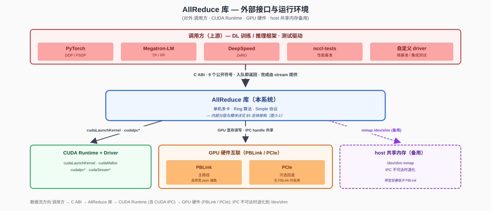

### 4.1 调用方

| 类别 | 集成方式 | 典型场景 |
|---|---|---|
| **DL 训练 / 推理框架** | 链接动态库（`libnccl.so` / `nccl.dll`）+ `#include "nccl.h"` | PyTorch DDP 梯度同步 / DeepSpeed ZeRO 参数广播 / Megatron-LM 张量并行同步 |
| **测试驱动 / 基准程序** | 同上 | `nccl-tests` 数值正确性比对、自定义功能用例、CI 集成测试 |

### 4.2 进程 / 线程模型

| 部署形态 | 描述 | 通信通路 |
|---|---|---|
| **单进程多 GPU** | 一个进程持有 N 个 GPU、N 个 communicator | 直接 CUDA IPC + PBLink；同地址空间内 handle 可直接共享，**绕过 UDS 同步握手** |
| **多进程多 GPU**（同节点）| 每进程一个 GPU、一个 communicator | 通过 **UDS 同步握手** 交换 `peerInfo`（busId + pid + IPC handle），再走 CUDA IPC + PBLink |

所有 rank **几乎同时** 调用 `ncclCommInit`；某个 rank 迟到会让其他 rank 阻塞在同步握手上。

### 4.3 下游依赖

| 依赖 | 作用 | 涉及 API / 接口 |
|---|---|---|
| **CUDA Runtime + Driver** | kernel 启动、显存管理、跨进程显存映射、流同步 | `cudaLaunchKernel` / `cudaMalloc` / `cudaIpcGetMemHandle` / `cudaIpcOpenMemHandle` / `cudaStreamSynchronize` / `cudaEventRecord` |
| **PBLink**（主路径）| GPU 间数据搬运 | 由 CUDA 透明使用 |
| **PCIe**（次选）| PBLink 不可用时退回 PCIe Peer | 由 CUDA 透明使用 |
| **host `/dev/shm`**（备用）| CUDA IPC 不可达时退化 | `shm_open` / `mmap` |

---

## 5. 总体架构

### 5.1 模块架构（总览）

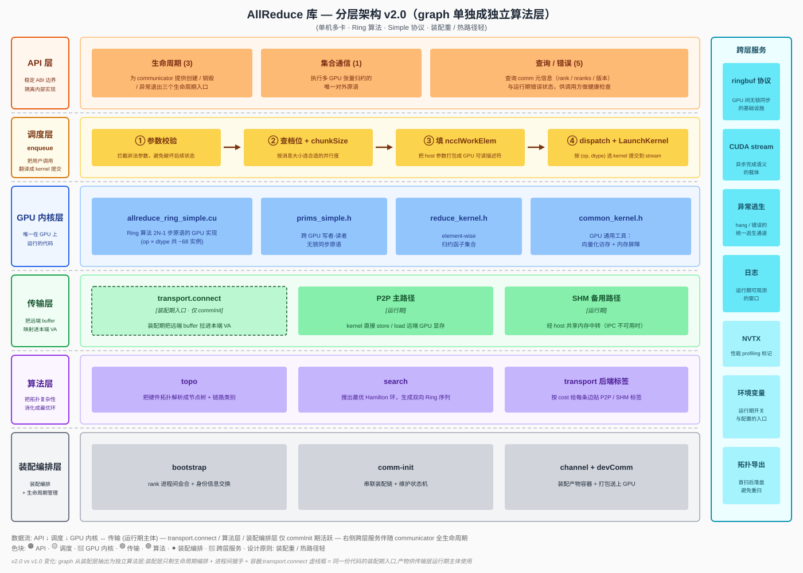

### 5.2 分层调用关系（精简视图）

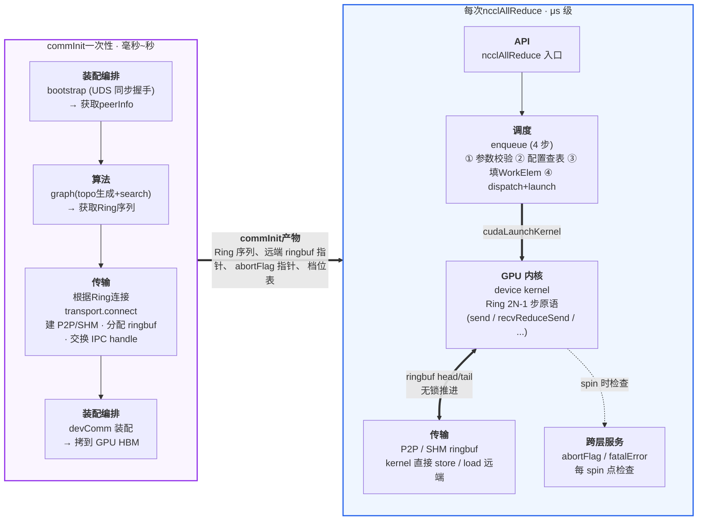

---

## 6. 模块划分与职责

### 6.1 模块清单

| 模块 | 职责描述 |
|---|---|
| **public-api** | 对外暴露 C ABI 公开符号，承接调用方的所有交互。本模块**只做轻量参数合法性检查**（指针非空、数值范围、`comm->state` 合法），不做任何语义解析（不展开 dtype/op 的具体含义、不做 GPU 选择、不做内存分配），随后**把请求转交内部对应模块**（`commInit` → comm；`ncclAllReduce` → enqueue；查询类直接读 comm 字段）。它是稳定 ABI 的物理边界，C++ 内部签名调整不会外溢。 |
| **bootstrap** | 装配链路的第一站。通过 UDS socket 把所有 N 个 rank 拉到同一会合点，做**同步屏障**（确保 N 个 rank 都到齐）；并让每个 rank 各自起一个常驻的 UDS 监听 socket，把自己的 listen 路径塞进 `peerInfo` 上报。完成后所有 rank 都拿到一份完整的 `peerInfo[]`（**含所有 rank 的 `udsListenPath`**），transport 后续按此直接 rank i ↔ rank j P2P 交换 IPC handle / SHM 路径，无需经 rank 0 中转。单进程多线程场景跳过，直接走全局变量。 |
| **comm**（init / commLifecycle）| `commInit / commDestroy / commAbort / commGetAsyncError` 四个 API 的总编排器。commInit对内按顺序调度 bootstrap → graph → transport → devComm 装配，维护 `comm->state` 字段表示当前阶段。本模块本身不做拓扑分析、不做建连、不做 GPU 数据搬运，只负责**调度顺序、状态推进、错误传播和异常逃生**（`abortFlag` / `fatalError`）。 |
| **graph** | 装配期完成"**获取硬件拓扑 + 构造 Ring 序列 + 给每条边贴 transport 后端标签**"三件事。XML 拓扑文件存在则直接解析，不存在则现场调 NVML / sysfs / `/proc/cpuinfo` 扫描并落盘复用；得到的拓扑树用于填充代价矩阵（PBLink direct / 同 switch / 同 CPU / 跨 NUMA / 不可达），再用贪心 + 2-opt 搜出总代价最低的 Hamilton 环，输出 prev/next 两份序列（前向 + 反向，对应 `nChannels = 2`）；同时按 cost 给每条边贴 P2P / SHM 后端标签。结果写入 `comm->channels[*].ring` 与 `comm->channels[*].peers[*].transport` 后固化，运行期不再活跃。 |
| **transport** | 装配期**建立每个 channel 中两节点间数据通路**。具体做法：**读 graph 模块写好的 `peers[p].transport` 标签**决定走 P2P (CUDA IPC + PBLink / PCIe) 主路径还是 SHM (`/dev/shm` mmap) 备用路径（**不重复调 `cudaDeviceCanAccessPeer`**）；分配本端 ringbuf、导出 IPC handle / SHM 路径、按 `peerInfo[peer].udsListenPath` 直连对端做 P2P 二次握手交换 handle、映射对端 buffer 到本端虚拟地址空间。装配完成后，运行期 device kernel 直接通过虚拟地址 `store / load` 远端 ringbuf，transport 层不再参与。 |
| **enqueue** | 运行期 host 侧的实现入口，是**热路径中唯一的 host 模块**。每次用户调 `ncclAllReduce` 都进入这里，按四步执行：参数校验 → 查档位表得到 `(nChannels, nThreads)` → 填 `ncclWorkElem` 工作描述符 → 调 `cudaLaunchKernel` 把 kernel 推到用户传入的 stream 上。约束严格：不做任何运行时决策、不做 host 侧通信、不做内存分配；返回 `ncclSuccess` 仅表示入队成功。 |
| **device**（GPU 内核）| 整个库**唯一在 GPU 上运行的模块**。模板维度 `<Ring, Simple, Op, Dtype>`——算法 / 协议固定为 `(Ring, Simple)`；按支持的 `(op, dtype)` 组合产出 kernel 符号矩阵 `ncclKernel_AllReduce_Ring_Simple_{Op}_{Dtype}`。kernel 由 enqueue launch 后从 `ncclDevComm` 读 ring 邻居 / ringbuf 指针 / abortFlag，按 Ring 算法的 `2N-1` 步原语（`send / recvReduceSend / recvReduceCopySend / recvCopySend / recv`）流水推进，自主完成 Reduce-Scatter + All-Gather 两阶段；通过 ringbuf 的 head/tail 与邻居无锁同步，每个 spin 点检查 abortFlag 以支持 hang 逃生。 |

> 备注 : **NVML** (NVIDIA Management Library)是 NVIDIA 提供的 GPU 管理与监控接口库(libnvidia-ml.so),nvidia-smi建立在它之上。它走控制平面旁路,不需要 CUDA Context、不占显存、不影响计算,通过 ioctl 直达内核驱动,即便 CUDA 崩了也能查 GPU 状态。

### 6.2 各模块实现思路

#### 6.2.1 bootstrap 模块

**模块定位**：bootstrap 在 `commInit` 阶段执行进程间同步握手。它通过一条预先约定的 UDS socket（从uniqueID解析而来）把所有 N 个 rank 拉到同一会合点，等所有 rank 都到达后再继续推进；并在此过程中**让每个 rank 各自起一个自己的 UDS 监听 socket**，把"自己的 listen 路径 + 基本信息"打包进 `peerInfo` 上报。bootstrap 执行完后，每个 rank 都拿到完整的 `peerInfo[]`（含**所有 rank 的 UDS 监听路径**），后续 graph 模块据此分析 GPU 拓扑，transport 模块据此直接 rank i ↔ rank j P2P 交换 IPC handle / SHM 路径，**无需经 rank 0 中转**。

**输入与输出**：

| 项 | 内容 |
|---|---|
| 输入 | `nranks`, `rank`, `UDSSocketPath`（会合用 UDS 路径——rank 0 在此监听，其它 rank 主动 connect 上报） |
| 输出 | `peerInfo[nranks]`，每项含 `{ busId, pid, nranks, udsListenPath }`（`udsListenPath` 是该 rank 自己监听的 UDS 路径，供 transport 二次握手时直连） |
| 副作用 | 本 rank 持有一个长期监听的 UDS socket（绑定在 `udsListenPath`），生命周期与 comm 同步——`commDestroy` 时才 close + unlink |
| 失败模式 | 路径不存在 / 权限不足 / 连接超时 / 各 rank `nranks` 不一致 / 本 rank `udsListenPath` 创建失败 → 返回 `ncclSystemError`，调用方释放 comm |

**单进程多线程例外**：`commInit` 检测到所有 rank 在同一进程时跳过同步握手，直接走全局变量共享 `peerInfo`，连 socket 都不创建。

**UDS 方案同步流程**：

> 图 6.2.1-1：UDS 同步握手时序——各 rank 先起自己的监听 → rank 0 在会合路径上等齐 N-1 份上报 → 一致性校验 → rank 0 广播完整 peerInfo[]

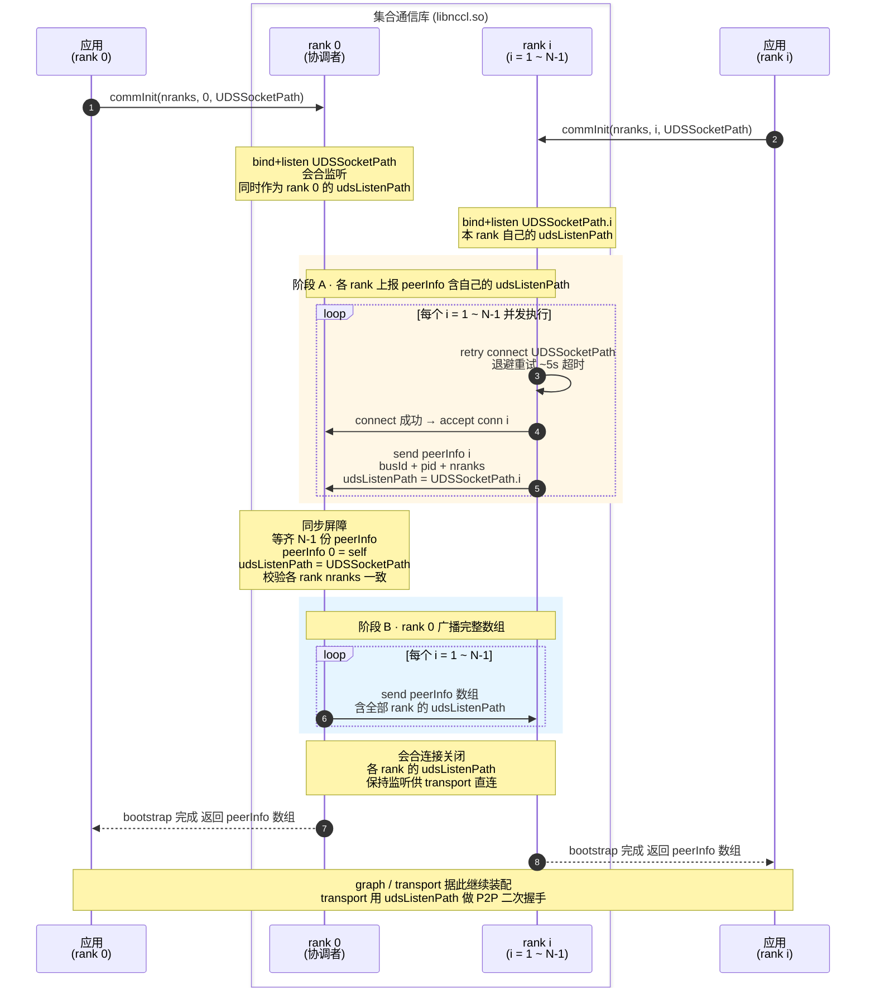

**伪代码对照**：

```
rank 0 (协调者):
  1. bind+listen(UDSSocketPath)               // 会合路径,同时作为自己的 udsListenPath
  2. for i in 1..N-1: conn[i] = accept()       // 接受 N-1 个会合连接
  3. for i in 1..N-1: recv peerInfo[i]         // 收齐 (含 udsListenPath = UDSSocketPath.i)
  4. peerInfo[0] = { self busId/pid/nranks,
                     udsListenPath = UDSSocketPath }
  5. 校验 peerInfo[i].nranks 全部一致
  6. for i in 1..N-1: send peerInfo[*]         // 广播完整数组
  7. 关闭会合用的 conn[i];保留 UDSSocketPath 上的 listen socket
     (后续 transport 二次握手时被其它 rank 直连)

rank i (i ≥ 1):
  1. bind+listen(UDSSocketPath.i)              // 先把自己的 udsListenPath 建好
  2. retry connect(UDSSocketPath, 超时数秒)    // 等 rank 0 监听就绪
  3. send peerInfo[i] = { busId, pid, nranks,
                          udsListenPath = UDSSocketPath.i }
  4. recv peerInfo[*]                          // 接收完整数组
  5. 关闭与 rank 0 的会合连接;保留 UDSSocketPath.i 上的 listen socket
```

**实现要点**：
- 监听先于上报：rank i 必须**先**完成 `bind + listen(udsListenPath)` 再向 rank 0 上报，否则 `peerInfo` 广播后其它 rank 立刻发起 transport 二次握手 connect 时会 ENOENT / ECONNREFUSED。
- 步骤 3（rank 0 视角）是显式同步点——rank 0 必须收齐 N-1 份才进入广播；其它 rank 阻塞在 `recv` 上，保证看到的是所有 rank 都已上报后的完整数组。
- 一致性校验：rank 0 收到的 `peerInfo[i].nranks` 必须与自身一致，否则提前失败，避免后续 graph / transport 阶段才暴露不匹配。TODO：后续可在 uniqueId 中加入其他一致性校验字段（版本号、参与者集合摘要等）。
- **二次握手**：transport 层后续按 (channel, peer) 二维直接交换 IPC handle / SHM 路径——rank i 用 `peerInfo[j].udsListenPath` connect rank j 的常驻监听 socket，**不再走 rank 0 中转**；rank 0 也不再是带宽瓶颈。
- 监听 socket 生命周期：所有 `udsListenPath` 上的 listen socket 由 bootstrap 创建后**长期保留**，直到 `commDestroy` 才统一 close + `unlink(udsListenPath)`，避免文件系统残留。

#### 6.2.2 comm初始化

**模块定位**：负责 communicator 的生命周期管理。它对外暴露 `commInit` / `commDestroy` / `commAbort` / `commGetAsyncError` 四个 API，对内按顺序调用 bootstrap、graph、transport 和 devComm 装配，并维护 `comm->state` 字段表示 communicator 当前所处的阶段。其它模块通过读 `comm->state` 判断当前 comm 是否可用。

**要做的工作**：
- **生命周期编排**：`commInit` 按 Bootstrapping → Discovering → Connecting → Active 顺序串调 bootstrap / graph / transport，并在最后把 `devComm` 拷到 GPU。
- **状态机维护**：每个阶段对应一个 `comm->state`，保证调用方在错误时机不能继续推进（如 `Failed` 状态下 enqueue 必须拒绝入队）。
- **错误收敛**：任一阶段失败 → `state = Failed` → 走清理路径返回错误码；提供 `commGetAsyncError` 让外部线程异步查询运行期错误。
- **异常逃生入口**：`commAbort` 置位 `abortFlag`，让 GPU kernel 主动跳出 spin；`commDestroy` 等待 kernel 自然结束后释放资源。

**输入与输出**：

| 项 | 内容 |
|---|---|
| 入口 | `ncclCommInit / Destroy / Abort / GetAsyncError` |
| 持有状态 | `comm->state`、`comm->fatalError`、`comm->abortFlag`、`comm->devComm` |
| 协作模块 | 串行调用 bootstrap → graph → transport → 装配 devComm |

**状态机**：

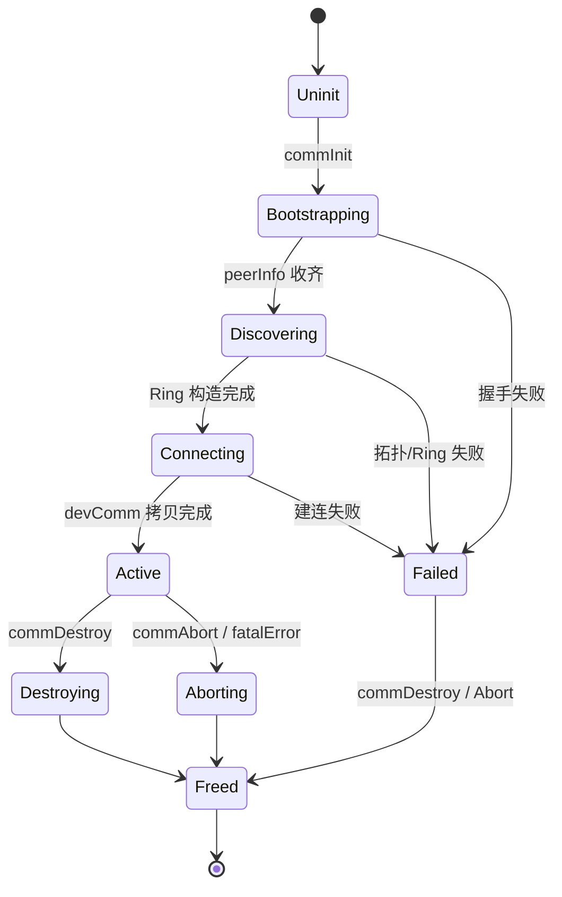

**`ncclCommInit` 实现流程**：

1. **预备**：分配 `comm` 结构，设 `state = Uninit`；`cudaGetDevice` 校验调用线程绑定的 device 与传入参数一致。
2. **Bootstrapping**：`state = Bootstrapping` → 调 bootstrap 模块（§6.2.1）完成同步握手 → 拿到 `peerInfo[]`。
3. **Discovering**：`state = Discovering` → 调 graph 模块（§6.2.3）做拓扑发现 + Ring 构造 → 结果写入 `comm->channels[*].ring`。
4. **Connecting**：`state = Connecting` → 调 transport 模块（§6.2.4）逐 (channel, peer) 建连 → `cudaMalloc` 分配本端 ringbuf → 写入 `comm->channels[*].peers[*]`。
5. **DevComm 装配**：把 `comm` 中需要在 GPU 端访问的字段（ring 邻居、ringbuf 指针、abortFlag 指针等）打包到 `ncclDevComm` 结构 → `cudaMemcpyAsync` 拷到 GPU global memory → `comm->devComm` 指向之。
6. **Active**：`state = Active` → 返回 `ncclSuccess`，从此可接收 `ncclAllReduce` 调用。

任一步骤失败 → `state = Failed` → 走清理路径（与 Destroy 共享），返回错误码。

**`ncclCommDestroy` 实现**：
1. `state = Destroying`，拒绝新的 AllReduce 入队。等当前执行kernel完成（`cudaStreamSynchronize` 或显式 event 等待）。
2. `cudaIpcCloseMemHandle` / SHM `munmap` → `cudaFree` ringbuf → 释放 `peerInfo[]` → 释放 `comm` 结构。

**`ncclCommAbort` 实现**（异常逃生路径，与 Destroy 共享清理代码）：
1. `state = Aborting`，拒绝新的入队。置 `*abortFlag = 1`（host写，GPU 读）。
2. 等 kernel 看到 flag 后 `return`。
3. 进入与 Destroy 相同的资源释放路径。

**`ncclCommGetAsyncError` 实现**：原子读 `comm->fatalError` 返回。这是少数允许上层应用查询接口，便于训练框架在另一个线程做健康检查；检测到错误后调用方应主动调 `commAbort` 完成清理。

**错误传播路径**：
- 装配期失败 → 当前调用线程同步返回错误码。
- 运行期 kernel hang / peer 失联 → 由检测者（kernel 内 spin 超时检查 / host 侧轮询 / **主要是RDMA proxy线程，当前版本暂未添加**）写 `comm->fatalError` → 调用方通过 `commGetAsyncError` 看到 → 主动调 `commAbort` 终结整 comm。

#### 6.2.3 graph 模块

**模块定位**：graph 在装配期完成两件事——**获取全局拓扑描述**（优先读取已有 XML 文件；不存在则现场调 NVML / sysfs 扫描生成并落盘），识别本节点 GPU 间的硬件连接（哪些 GPU 之间能直连、用什么介质、距离几跳）；并在此基础上**构造N条让总通信代价最低的 Ring 序列**（每 rank 在环中的 prev / next）。输入是 bootstrap 提供的 `peerInfo[]`、NVML、sysfs（XML 文件若不存在会被自动生成），输出是 `comm->channels[c].ring`。Ring 序列在 `commInit` 末写入 communicator 后固化，运行期 GPU kernel 直接读取使用，不再做与路由相关的决策。

**输入与输出**：

| 项 | 内容 |
|---|---|
| 输入 | `peerInfo[nranks]`（含每 rank 的 busId、pid、NUMA 归属）+ **XML 拓扑文件**（约定路径或 `NCCL_TOPO_FILE`；存在则直接读，不存在则首次启动时由 graph 现场扫描生成并落盘） |
| 输出 | 每 channel 一份 `ncclRing { prev, next, userRanks[] }`，写入 `comm->channels[c].ring`；若是首次扫描生成，XML 文件同步保存供后续启动复用 |
| 失败模式 | XML 文件存在但格式非法 / 内容与 `peerInfo` 不一致；XML 不存在且现场扫描失败；GPU 数 < 2；或环上多条边不可达且 transport 层也无法降级 → 返回 `ncclInternalError` |

**链路分类与代价模型**：

| 类别 | 检测方式 | 链路代价 |
|---|---|---|
| PBLink direct | XML 中存在 GPU-GPU 直连 PBLink 边 + `cudaDeviceCanAccessPeer` 校验 | 1 |
| PCIe Peer，同 PCIe switch | XML 中两 GPU 挂在同一 PCIe switch 下 | 5 |
| PCIe Peer，同 CPU root complex | XML 中两 GPU 同 host bridge 但跨 PCIe switch | 10 |
| PCIe Peer，跨 CPU NUMA | XML 中两 GPU 跨 CPU socket | 50 |
| 不可达 | XML 中无连接边 或 `cudaDeviceCanAccessPeer == false` | ∞ / INIT_MAX（交给 transport 走 SHM 降级） |

> **代价数值仅是相对量级，用于在多条候选环中做比较；不直接对应任何时延 / 带宽指标。**

**整体流程概览**：

> 图 6.2.3-1：graph 模块在 `commInit` 中的整体执行流程——XML 读取（不存在则现场扫描）→ GPU 与拓扑节点对齐 → 填代价矩阵 → 贪心 + 2-opt 搜环 → 环合法性校验 → 写入 `comm->channels[*].ring`
>
> 完整 SVG 见 [`allreduce-graph-flow-v2.svg`](allreduce-graph-flow-v2.svg)。

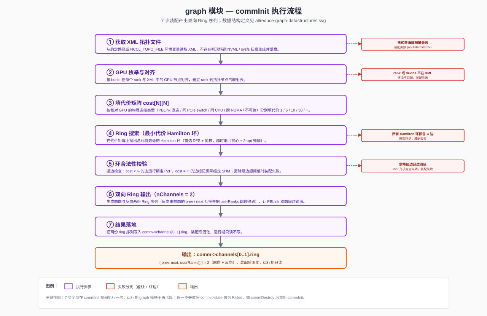

**`commInit` 中按以下步骤执行**：

1. **获取 XML 拓扑文件**：先尝试从约定路径（或 `NCCL_TOPO_FILE` 环境变量指定路径）读取已有 XML 文件：
   - **文件存在**：按 `<cpu>` → `<pci>` → `<gpu>` 层级解析为内存中的拓扑树。
   - **文件不存在**：现场调用 NVML / sysfs / `/proc/cpuinfo` 等接口扫描节点拓扑，构建拓扑树，并把结果序列化写到同一路径下保存——下次 `commInit` 启动时即走"文件存在"的快路径。这是一次性的兜底，保证首次部署或机器换硬件后仍能自举。
   - **文件存在但格式非法**：装配失败（不自动覆盖，避免误删可能是人工调整过的 XML）；扫描失败 → 装配失败。

   > 图 6.2.3-2：XML 拓扑文件结构（graph 模块输入）。完整 SVG 见 [`allreduce-graph-xml-v2.svg`](allreduce-graph-xml-v2.svg)。

   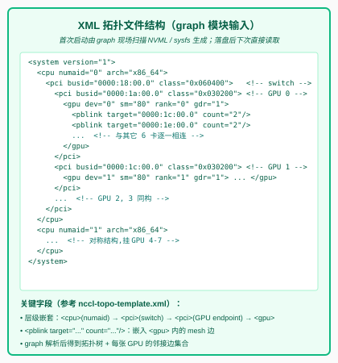

2. **GPU 枚举与对齐**：把每个 rank 与 XML 中的 GPU 节点按 busId 字符串逐一对齐，建立 `rank → 拓扑节点` 映射表。任一 rank 在 XML 中找不到、或本地 device 不在 XML 中 → 装配失败（说明 XML 与运行环境不匹配）。

3. **填代价矩阵 `cost[N][N]`**：对每对 (i, j)：
   - 在拓扑树上沿 GPU i → PCIe switch → host bridge → CPU socket 向上回溯，再向下走到 GPU j，沿途记录是否经过同 PCIe switch / 同 host bridge / 跨 CPU socket，得到"拓扑距离类别"。
   - 同时检查 XML 中是否独立标注了 GPU i 与 GPU j 之间的 PBLink 直连边。
   - 按上表"链路分类与代价模型"填入对应代价；XML 中没有任何连接、或 `cudaDeviceCanAccessPeer(i, j) == false` → `cost[i][j] = ∞`。
   - 对角线 `cost[i][i] = 0`（自连接不参与搜索）。

   > 图 6.2.3-3：cost[N][N] 代价矩阵示例（N=4），含贪心 + 2-opt 搜索 + 链路带宽消耗演示。完整 SVG 见 [`allreduce-graph-cost-matrix-v2.svg`](allreduce-graph-cost-matrix-v2.svg)。

   

4. **Ring 搜索（贪心 + 2-opt + 链路带宽消耗）**：在代价矩阵上找一条总代价最小的 Hamilton 环。
   - **基本框架（贪心 + 2-opt）**：从 rank 0 出发，每步选剩余 GPU 中当前 `cost` 最小的邻居（同代价时按 rank id 取较小者保证确定性）；环形闭合后做一次 2-opt 局部优化——对每两条非相邻边 `(a-b, c-d)` 尝试换成 `(a-c, b-d)`，若总代价下降则接受（交换时同步恢复换出边的带宽、消耗换入边的带宽），迭代直到无改进。固定起点 rank 0 打破环的 N 重旋转对称；只搜环的一个方向打破镜像对称。
   - **链路带宽消耗（核心设计）**：每条物理链路（PBLink wire / PCIe switch port）维护一个 `remaining[i][j]` 剩余带宽（初始 100%），cost 表中的 `cost[i][j]` 与 `remaining[i][j]` 反比关联——剩余越少 cost 越高。每个 channel / block 选边时声明自己消耗多少带宽（例如一个 channel 只占 PBLink 20%，或保守按 50% 计），选边后按"已用比例"提升该边 cost：物理链路并未"被独占"，可以继续被后续选择复用，但每次复用 cost 都会再次抬升；剩余带宽消耗到 0 时 cost 升至 `∞`，贪心自动跳过。这样既适配"单 channel 打不满整条链路"的常见情况，又在多 channel / 多 ring 共享物理链路时让搜索自动倾向于带宽未被占满的边，避免局部超额分配。
   - **示例（N = 4，环 0→1→2→3→0，每 channel 占 50% 带宽）**：贪心依次选 (r0→r1, base=1) → cost 升为 2；(r1→r2, base=5) → cost 升为 10；(r2→r3, base=1) → cost 升为 2；闭环 (r3→r0, base=50) → cost 升为 100；累计 `acc = 1 + 5 + 1 + 50 = 57`（acc 使用选边时的当前 cost，而非更新后的）。后续若 ch1 反向 Ring 在同一矩阵继续搜索，已被消耗 50% 的 PBLink 边代价已经翻倍，搜索倾向于选剩余 100% 的其它边；若两 channel 都选同一条 PBLink → 该边剩余 = 0 → 后续任何 channel 都无法再用。
   - **退化情况**：贪心走到某节点时所有剩余可达边都到 `∞`（剩余带宽耗尽，无法闭合环）→ 装配失败。

    > **备注：1. 当前Ring搜索检出的nchannel由手动配置指定，NCCL采用其他算法确定最合适的channel数； 2. 未考虑复杂PCIe switch场景：例如GPU 0与GPU 1、GPU 0与GPU 2占用了相同的某段PCIe链路**

5. **确定边上使用的 transport 后端**：扫描搜出的环上 N 条边，按 cost 给每条边贴 transport 后端标签，并把结果**写入 `comm->channels[c].peers[p].transport`**，供后续 §6.2.4 transport 模块直接读取（不再重复调 `cudaDeviceCanAccessPeer`——可达性信息在 step 3 填代价矩阵时已固化进 cost）：
   - `cost = 1 / 5 / 10 / 50`：边可用，标记为 **P2P** 后端（前两类通常落到 NVLink / PBLink，后两类落到 PCIe Peer）。
   - `cost = ∞`：边在 P2P 层不可达，标记为 **SHM** 后端（运行期降级，走 `/dev/shm` mmap）。

6. **双向 Ring 输出**：本期固定 `nChannels = 2`（与 transport / device 约定）：
   - `channels[0].ring = { prev = ring_prev[r], next = ring_next[r], userRanks = [r0, r1, ..., rN-1] }`（前向）
   - `channels[1].ring = { prev = ring_next[r], next = ring_prev[r], userRanks = [r0, rN-1, ..., r1] }`（反向：把前向的 prev / next 互换，并把 userRanks 数组翻转——确保两份 Ring 的"邻居语义"与"chunk 顺序"都对齐）
   - 两个 channel 走相反方向，分别从 PBLink 的两个物理方向独立推进数据，让 transport 层映射出来的两套 ringbuf 同时跑满。

   > 图 6.2.3-4：ncclRing 结构与双向输出示例（N=4，nChannels=2）。完整 SVG 见 [`allreduce-graph-ring-v2.svg`](allreduce-graph-ring-v2.svg)。

   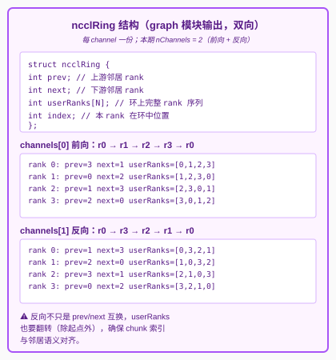

7. **结果落地**：把两份 ring 序列写入 `comm->channels[0..1].ring.{prev, next, userRanks}`；graph 模块工作完成，运行期不再调用任何 graph 代码。

> **代价模型仅在装配期使用，运行期 GPU kernel 看到的就是一份"prev / next 邻居"序列**。

#### 6.2.4 transport 模块

**模块定位**：transport 在装配期建立 peer 间的数据通路。具体做法是把对端 rank 的 GPU buffer（P2P 路径，通过 CUDA IPC）或 SHM 段（备用路径，通过 `/dev/shm` mmap）映射到本端的虚拟地址空间，使本端 GPU 可以通过普通指针直接 `store / load` 远端 buffer。装配完成后，运行期 device kernel 直接通过这些虚拟地址访问对端 ringbuf，transport 层不再参与。

**输入与输出**：

| 项 | 内容 |
|---|---|
| 输入 | `comm->channels[c].ring`（决定要连哪些 peer）+ `comm->channels[c].peers[p].transport`（**graph 模块在 §6.2.3 step 5 已贴好的后端标签**，P2P 或 SHM）+ `peerInfo[*].udsListenPath`（用于直连对端做二次握手） |
| 输出 | `comm->channels[c].peers[p].{connSend, connRecv}`：buffer 指针 + head/tail 计数器地址 |
| 失败模式 | P2P 不通且 SHM 也创建失败、IPC handle 交换超时 → 返回 `ncclSystemError` |

**装配期实现步骤**（在 `commInit` 的 connect 阶段执行，对 channels × peers 二重循环）：

1. **按 graph 标签分发后端**：直接读 `channels[c].peers[p].transport` 标签——P2P 走 CUDA IPC + PBLink/PCIe 分支；SHM 走 `/dev/shm` mmap 分支。**不再调 `cudaDeviceCanAccessPeer`**，可达性判断在 §6.2.3 step 5 已完成。运行期 kernel 也不再判断；后端选择用条件分支表达，两分支足够直观，不引入 vtable 多态。
2. **导出本端 buffer**：
   - **P2P 分支**：`cudaMalloc` 分配 `buffSize` 显存 → `cudaIpcGetMemHandle` 导出为 64 字节不透明 handle。
   - **SHM 分支**：在 `/dev/shm` 创建文件 → `ftruncate(buffSize)` → `mmap` 拿到 host VA；head/tail 计数器与 buffer 同段放置。
3. **handle 交换**：`connect(peerInfo[peer].udsListenPath)` 直连对端常驻 UDS 监听 socket，把 IPC handle / SHM 路径发过去，并收到对端的对应物。每对 (channel, peer) 一次往返；transport 层不解析包内容，仅按字节包传递。
4. **映射对端 buffer**：
   - **P2P 分支**：`cudaIpcOpenMemHandle(对端 handle)` → 得到本地虚拟地址。
   - **SHM 分支**：`open(对端发来的路径)` → `mmap` → 本地虚拟地址。
5. **连接落地（host 端）**：把以下指针写入 host 端 `comm->channels[c].peers[p]`：
   - `connSend.buffs`：写入侧使用的远端 buffer 地址——CUDA IPC 映射到本地 VA 的 receiver HBM 地址（P2P）或 mmap 到本地 VA 的 SHM 地址；本端 GPU 通过它远程写入 receiver。
   - `connRecv.buffs`：读出侧使用的本地 buffer 地址——本端作为 receiver 时，就是自己 `cudaMalloc` 出来的 HBM 地址；本端 GPU 从这里本地读取。
   - `connSend.tail`：Simple 协议中"写者推进、读者 spin"的 tail 计数器虚拟地址（位于 receiver HBM）。
   - `connRecv.head`：Simple 协议中"读者推进、写者 spin"的 head 计数器虚拟地址（位于 writer HBM）。
   - **本步只写 host 内存，GPU kernel 此时还看不到这些指针**。

6. **指针下发到 HBM（与 §6.2.2 Step 5 协同）**：transport 完成 host 端写入后，init / commLifecycle 接管：
   - 把 `channels[*].peers[*]` 中 kernel 运行期会用到的字段（ringbuf 指针、tail / head 地址、ring 邻居 prev/next、abortFlag 指针）打包到 `ncclDevComm` 结构。
   - `cudaMalloc` 在 GPU HBM 分配 `ncclDevComm` 空间 → `cudaMemcpyAsync` 把 host 打包好的结构拷到 GPU 端 → `comm->devComm` 记下 GPU 端地址。
   - enqueue 在 launch kernel 时把 `comm->devComm` 作为 kernel 参数传入；kernel 启动后通过 `ncclShmem.comm` 引用 `ncclDevComm`，从 HBM 读出这些指针，再 dereference 访问真正的 ringbuf / 计数器。
   - **关键约束**：所有"GPU 端取指针"的动作必须落在 HBM 上才能成立。HBM 上存放的是**指针值（虚拟地址）**；指针指向的实际 ringbuf 数据 / 计数器，按后端落在 receiver HBM（P2P）或 host pinned / SHM（SHM 后端通过 `cudaHostRegister` 注册后也能从 device 访问）。

**ringbuf 布局**（每对相邻 rank、每方向、每 channel 一份）：

> 图 6.2.4-1：ringbuf 内部结构（slot 数 / head/tail 指针）、一对相邻 rank 的 4 份 ringbuf 配对、全节点 4N 总量、P2P 与 SHM 后端对比。
>
> 完整 SVG 见 [`allreduce-transport-ringbuf.svg`](allreduce-transport-ringbuf.svg)。

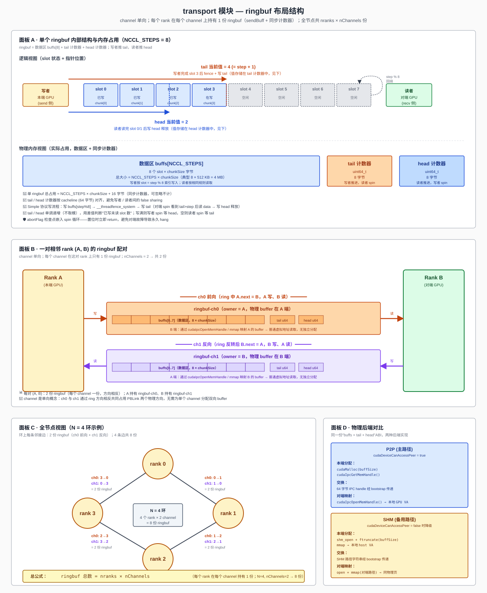

- **P2P**：`sendBuff` 在本端 GPU 显存，对端通过 `cudaIpcOpenMemHandle` 映射后直接 `load`，零拷贝。
- **SHM**：`sendBuff` 在 `/dev/shm`，双方 `mmap` 同物理页，通过 host memory coherence 协议同步。
- `head` / `tail` 计数器同样在 P2P / SHM 段中，分配方式与 buffer 一致。

只服务 Simple 协议，每 channel 一份 buffer 足够（LL/LL128 才需额外的 flag buffer）。两种后端通过同一 ABI（`buffs + head/tail` 指针对）暴露给 kernel，布局差异在装配期吸收；运行期 kernel 拿到的就是普通虚拟地址指针，store/load 直接走硬件路径，host 侧不需要任何辅助线程。

#### 6.2.5 enqueue 模块

**模块定位**：enqueue 是运行期 host 侧的实现入口。每次用户调 `ncclAllReduce`，都进入这个模块，按固定四步执行：参数校验 → 查档位表得到 `(nChannels, nThreads)` 并派生 chunkSize → 填工作描述符 → 调 `cudaLaunchKernel`。本模块不做任何运行时决策、不做 host 侧通信、不做内存分配——这些工作都已在装配期完成。

**输入与输出**：

| 项 | 内容 |
|---|---|
| 输入 | 用户参数 `(sendbuff, recvbuff, count, dtype, op, comm, stream)` + 装配期已写好的 `comm->channels[*]` 与档位表 |
| 输出 | kernel 已提交到 `stream`；同步返回 `ncclSuccess` |
| 失败模式 | 参数非法 → `ncclInvalidArgument`；`comm->state ≠ Active` → `ncclInvalidUsage` |

**单次调用按顺序执行**：

1. **参数校验**：`comm` 非空、`comm->state == Active`、`count > 0`、`sendbuff/recvbuff` 非空、`dtype/op` 在支持集合内、且 `(op, dtype)` 是合法组合（见 §6.2.6 支持矩阵——例如 `BitwiseAnd × f32` 非法）。失败立即返回 `ncclInvalidArgument`。
2. **`(nChannels, nThreads)` 查表**：装配期填好 `comm->maxThreads[algorithm][protocol]` 二维表与每档 nChannels 上限；运行期按 `count × sizeof(dtype)` 落档直接取出 `(nChannels, nThreads)`——本期 algorithm/protocol 固定为 `(Ring, Simple)`，等价于按消息字节数索引一维档位表（典型 4~6 档：`≤1KB / 1KB~64KB / 64KB~1MB / 1MB~16MB / >16MB`）。
3. **chunkSize 派生**：由公式 `chunkSize = buffSize / NCCL_STEPS × chunkSteps` 计算（`buffSize` 与 `chunkSteps` 均在装配期由协议 / 显存预算固定），再按 `nBytes / (nChannels × chunkSize) < 阈值` 做最多 3 轮 halve 微调；保证最后一个 chunk 不浪费且对齐到 `(nThreads − WARP_SIZE) × sizeof(uint64_t)`。
4. **填工作描述符**：把 `(sendbuff, recvbuff, count, chunkSize, nChannels, nThreads, ...)` 写入栈上的 `ncclWorkElem`，作为 kernel argument 传入（或经常驻 device buffer 中转）。
5. **launch kernel**：按 `(op, dtype)` 查 host 端静态 dispatch 表 `kernelTable[NUM_OPS][NUM_DTYPES]` 取得对应 kernel 符号 `ncclKernel_AllReduce_Ring_Simple_{Op}_{Dtype}`（dispatch 表由 device 模块的代码生成脚本在编译期一次性填好；非法组合处填 `nullptr`，正常情况下已在 step 1 被拒）。调 `cudaLaunchKernel(kern, grid={nChannels,1,1}, block={nThreads,1,1}, args, sharedMem, stream)`，绑定到用户传入的 `stream`。
6. **立即返回 `ncclSuccess`**：仅表示"入队成功"；完成语义由 stream 提供（`cudaStreamSynchronize` 后 `recvbuff` 可读）。

算法 + 协议固定为 Ring + Simple，无运行时选择；`(op, dtype)` 通过 dispatch 表选择对应 kernel 实例，本质仍是查表（无分支决策）。本期不支持 Group 聚合（多原语一次入队）、不支持 CUDA Graph capture。

**档位表形态示例**（仅说明结构，具体数值由详设阶段实测确定）：

| 消息字节数 | nChannels | nThreads |
|---|---|---|
| ≤ 1 KB | 1 | 256 |
| 1 KB ~ 64 KB | 1 | 256 |
| 64 KB ~ 1 MB | 2 | 256 |
| 1 MB ~ 16 MB | 2 | 512 |
| > 16 MB | 2 | 512 |

**异步性边界**：API 返回 ≠ 操作完成；完成可见性需要用户通过 stream 同步获得，与 CUDA stream 的标准语义对齐。

#### 6.2.6 device 模块

**模块定位**：device 是整个库唯一在 GPU 上运行的模块，其它模块都是 host C++ 代码。它实现 Ring AllReduce 的 GPU kernel，模板维度 `<Ring, Simple, Op, Dtype>`——算法 / 协议固定为 `(Ring, Simple)`，op 与 dtype 按下文支持矩阵分别产出独立 kernel 符号 `ncclKernel_AllReduce_Ring_Simple_{Op}_{Dtype}`（共约 68 个实例）。kernel 由 enqueue 模块 launch 之后，从 `ncclDevComm` 读取本 rank 的 ring 邻居、ringbuf 指针、`abortFlag` 指针，按 Ring 算法的 `2N-1` 步原语调用顺序推进，不需要 host 介入，直到处理完用户传入的整个张量。

**要做的工作**：
- **Grid / Block 映射**：每个 block 担当一个 channel，处理 `1/nChannels` 的数据；block 内多 thread 协作搬运 chunk 并做 reduce。
- **Reduce-Scatter 阶段（N-1 步）**：每 rank 把不同 chunk 沿环传递并累加，最终每 rank 持有"全和 chunk"中的某一份。
- **All-Gather 阶段（N-1 步）**：把"全和 chunk"沿环转一圈，让每 rank 都拿到完整的全和结果，写入用户的 `recvbuff`。
- **Simple 协议同步**：通过 ringbuf 的 head/tail 计数器与邻居 rank 做无锁推进；写完一片 → fence → 推 tail；读到 tail > step → 读数据 → 推 head 释放 slot。
- **abortFlag 检查**：每次 spin 等待 tail 推进时检查 `*abortFlag`，置位则立即 `return` 跳出（hang 逃生的关键挂钩点）。

**输入与输出**：

| 项 | 内容 |
|---|---|
| 输入 | `ncclWorkElem`（由 enqueue 填）+ `ncclDevComm`（由 init 拷到 GPU global memory，含 ring 邻居 / ringbuf 指针 / abortFlag 指针） |
| 输出 | 写入用户传入的 `recvbuff`；不向 host 返回任何值 |
| 完成语义 | kernel 退出 = 完成，通过 stream 顺序对调用方可见 |
| 中止条件 | `*abortFlag == 1` → 任何 spin 点立即 return（参见 §7.3） |

**Grid / Block 映射**：enqueue 端按 `grid.x = nChannels`、`block.x = nthreads`（典型 256 或 512）launch。每个 block 担当一个 channel，处理 `1/nChannels` 的数据；block 内多 thread 协作搬运 chunk 并做 reduce。

**单 channel 内执行流程**（对 `count` 元素的张量）：

> 图 6.2.6-1：Ring AllReduce 单 channel 内 `2N-1` 步原语流水示意——Reduce-Scatter（N-1 步）→ 转折步（写 output + 转发）→ All-Gather（N-1 步）


1. 取本 channel 的数据起点 `gridOffset = 0`，每轮处理 `loopSize = nChannels × nRanks × chunkSize` 元素。
2. 在每轮内，按 Ring 切成 `nRanks` 个 chunk，依次发起 `2N-1` 次原语调用，对应五种步骤类型——

| 阶段 | 步骤 | 原语 | 说明 |
|---|---|---|---|
| Reduce-Scatter | step 0 | `send` | 只发送本 rank 的初始 chunk，不接收 |
| Reduce-Scatter | step 1 ~ N-2 | `recvReduceSend` | 接收 + 累加到 ringbuf + 转发；**不写 output** |
| 转折 | step N-1 | `recvReduceCopySend` | 接收 + 最后一次累加 + 写 output + 转发 |
| All-Gather | step N ~ 2N-3 | `recvCopySend` | 接收 + 写 output + 转发 |
| All-Gather | step 2N-2 | `recv` | 只接收 + 写 output，**不再转发** |

3. 推进 `gridOffset += loopSize`，回到步骤 2，直到处理完所有元素。

**kernel 概念性步骤**（语言无关伪代码；每个 block 在一个 channel 上独立执行，省略偏移与 nelem 的细节计算）：

```
输入: rank, N (= nRanks), size, chunkSize, nChannels
派生: loopSize = nChannels × N × chunkSize

# 外层: 大张量分片处理
for gridOffset in 0, loopSize, 2*loopSize, ... while gridOffset < size:

    # === Reduce-Scatter: N-1 步 ===
    chunk = (rank - 1) mod N
    send(chunk)                          # step 0:    只发送本 rank 初始 chunk,不接收

    for j in 2 .. N-1:                   # step 1 ~ N-2
        chunk = (rank - j) mod N
        recvReduceSend(chunk)            #            收 + 累加 + 转发;数据停留在 ringbuf,不写 output

    # === 转折步: Reduce-Scatter 末步 + All-Gather 首步合并 ===
    chunk = rank                         # step N-1:  收 + 最后一次累加 → 此 chunk 已是全和 → 写 output + 同时转发
    recvReduceCopySend(chunk)

    # === All-Gather: N-1 步 ===
    for j in 1 .. N-2:                   # step N ~ 2N-3
        chunk = (rank - j) mod N
        recvCopySend(chunk)              #            收 + 写 output + 转发

    chunk = (rank + 1) mod N             # step 2N-2: 只收 + 写 output,不再转发
    recv(chunk)
```

> 完整 C++ 实现（含 `prims_simple` 模板展开、`ncclShmem` 共享内存布局、warp 级搬运优化、偏移与 nelem 的精确计算等）见详设。

**支持的 op × dtype 矩阵**：

device 模块对每个合法的 `(Op, Dtype)` 组合产出一个独立 kernel 实例。上面的"kernel 概念性步骤"伪代码**与 op / dtype 完全无关**——唯一差异是 `recvReduceSend / recvReduceCopySend` 原语内部 element-wise reduce 那一行的函子与累加器类型选择。

**归约操作**（reducer 函子，element-wise）：

| Op | 语义 | 适用 dtype | 备注 |
|---|---|---|---|
| `Sum` | `a + b` | 全部 | 默认 op |
| `Max` | `max(a, b)` | 整数 + 浮点 | |
| `Min` | `min(a, b)` | 整数 + 浮点 | |
| `Prod` | `a * b` | 整数 + 浮点 | 整数按 dtype 截断溢出，由用户负责语义 |
| `Avg` | Sum + 转折步后整体除以 `nranks` | 整数 + 浮点 | 实现 = Sum + `recvReduceCopySend` 末步前除法；`nranks` 从 `ncclDevComm` 读取；整数走整数除法（截断） |

**数据类型**（element 类型与累加器类型）：

| Dtype（API 暴露） | sizeof | element 类型（kernel 里的 C++ 类型） | 累加器类型 | 备注 |
|---|---|---|---|---|
| `int8` / `uint8` | 1 | `int8_t` / `uint8_t` | 同元素类型 | |
| `int32` / `uint32` | 4 | `int32_t` / `uint32_t` | 同元素类型 | |
| `int64` / `uint64` | 8 | `int64_t` / `uint64_t` | 同元素类型 | |
| `float16` | 2 | `__half` | **`float`（fp32）** | 精度较低，累加损失精度 |
| `bfloat16` | 2 | `__nv_bfloat16` | **`float`（fp32）** | 同上 |
| `float32` | 4 | `float` | `float` | |
| `float64` | 8 | `double` | `double` | |

> **fp16 / bf16 累加策略**：reduce 时将元素 promote 到 `float` 累加，写回 ringbuf 前再 cast 回原 dtype——若直接用 fp16 / bf16 累加，N=8、count=1M 的典型场景下精度会明显劣化。本期硬编码该策略，不向用户暴露选项。仅适用于浮点归约（Sum / Max / Min / Prod / Avg）；Bitwise* 操作不存在精度问题，按原 dtype 直接计算。

**合法组合矩阵**（✓ = 支持；— = 非法，`kernelTable` 对应位置为 `nullptr`）：

| Op \ Dtype | i8 | u8 | i32 | u32 | i64 | u64 | f16 | bf16 | f32 | f64 |
|---|---|---|---|---|---|---|---|---|---|---|
| `Sum` | ✓ | ✓ | ✓ | ✓ | ✓ | ✓ | ✓ | ✓ | ✓ | ✓ |
| `Max` | ✓ | ✓ | ✓ | ✓ | ✓ | ✓ | ✓ | ✓ | ✓ | ✓ |
| `Min` | ✓ | ✓ | ✓ | ✓ | ✓ | ✓ | ✓ | ✓ | ✓ | ✓ |
| `Prod` | ✓ | ✓ | ✓ | ✓ | ✓ | ✓ | ✓ | ✓ | ✓ | ✓ |
| `Avg` | ✓ | ✓ | ✓ | ✓ | ✓ | ✓ | ✓ | ✓ | ✓ | ✓ |

合法实例数 = `5 op × 10 dtype + 3 op × 6 dtype = 68` 个 kernel 符号。

**Simple 协议原语内部实现**：每次原语调用都展开为写者 / 读者通过 ringbuf 的 tail / head 计数器配对推进——写者推 tail 通知"数据已就绪"，读者推 head 释放 slot 供写者复用。

> 图 6.2.6-2：Simple 协议时序——写者写数据 → 内存屏障 → 推 tail；读者 spin 等 tail > step → 读数据 → 推 head 释放 slot；任何 spin 点都检查 abortFlag 以支持 hang 逃生

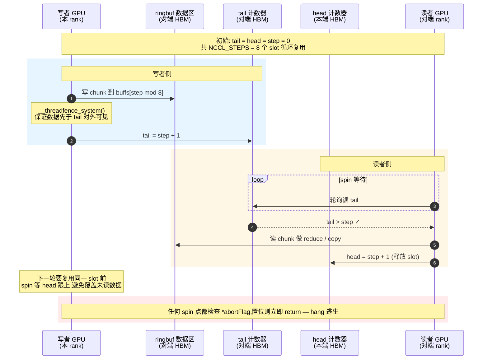

要点（与图对应）：
- **写入侧**：写数据到 `buffs[step % NCCL_STEPS]` → `__threadfence_system()` 保序 → 推 `tail` 通知对端。
- **读出侧**：在 `tail > step` 上 spin → 读 data → 推 `head` 释放 slot。
- **abortFlag 检查点**：每次 spin 迭代检查 `*abortFlag`，置位则立即 return，跳过剩余 chunk / 剩余 step——这是 hang 逃生的关键挂钩点（参见 §7.3）。

> 备注：本期只走"间接路径"——数据始终经本端 ringbuf 中转。不实现 Direct 路径（不通过 `ptrExchange` 拿到 peer output buffer 指针后直写），换得 transport 接口最小化。

---

## 7. 关键流程

### 7.1 流程一：Communicator 初始化

> 图 7-1：init 时序（概念级）

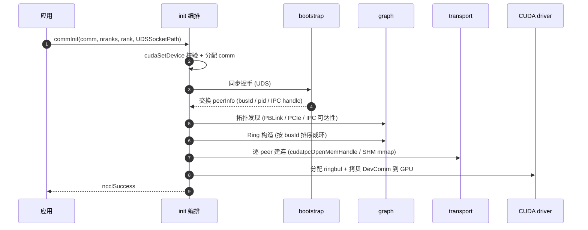

**关键决策**：同步握手是显式全局屏障；所有 rank 必须几乎同时调 `commInit`，否则会卡在握手上。

### 7.2 流程二：AllReduce 热路径

> 图 7-2：单次 AllReduce 端到端

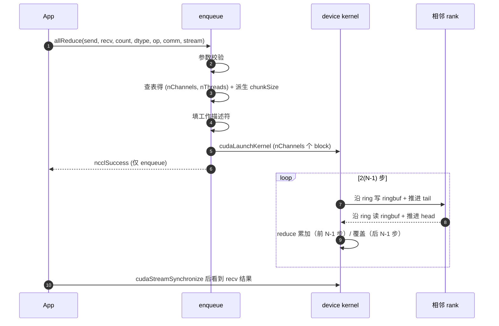

**关键决策**：
- 入队即返回：`ncclSuccess` 只表示"调度成功"，不代表运算已完成；完成由 CUDA stream 顺序提供。
- GPU 内核 launch 后即在 device 上自主运行，依靠 ringbuf 的 head/tail 计数器与 peer 同步；host 端只需 `cudaStreamSynchronize` 等结果。

### 7.3 流程三：异常退出

> 图 7-3：abortFlag / fatalError 两阶段（保留）

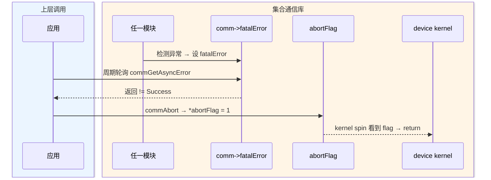

---

## 附录

### 公开 ABI

```c
// 生命周期 (3)
// UDSSocketPath: 多进程场景所有 rank 必须传同一路径(UDS socket 路径,
//                 用于交换 peerInfo + IPC handle); 单进程多 GPU 场景可传 NULL。
ncclResult_t ncclCommInit(ncclComm_t* comm, int nranks, int rank,
                          const char* UDSSocketPath);
ncclResult_t ncclCommDestroy(ncclComm_t comm);
ncclResult_t ncclCommAbort(ncclComm_t comm);

// 集合通信 (1)
// 支持的 op:    Sum / Max / Min / Prod / Avg / BitwiseAnd / BitwiseOr / BitwiseXor
// 支持的 dtype: int8 / uint8 / int32 / uint32 / int64 / uint64 /
//               float16 / bfloat16 / float32 / float64
// 合法 (op, dtype) 组合矩阵见 §6.2.6;非法组合(如 BitwiseAnd × f32)返回 ncclInvalidArgument。
// fp16 / bf16 浮点归约默认采用 fp32 累加策略,不向用户暴露选项。
ncclResult_t ncclAllReduce(const void* sendbuff, void* recvbuff,
                           size_t count, ncclDataType_t dtype,
                           ncclRedOp_t op, ncclComm_t comm,
                           cudaStream_t stream);

// 查询 (5)
ncclResult_t ncclCommCount(ncclComm_t comm, int* count);
ncclResult_t ncclCommUserRank(ncclComm_t comm, int* rank);
ncclResult_t ncclCommGetAsyncError(ncclComm_t comm, ncclResult_t* err);
const char*  ncclGetErrorString(ncclResult_t result);
ncclResult_t ncclGetVersion(int* version);
```
