# 《zeus-CCL 集合通信库》概要设计文档

- [《zeus-CCL 集合通信库》概要设计文档](#zeus-ccl-集合通信库概要设计文档)
  - [1. 背景与目标](#1-背景与目标)
    - [1.1 背景](#11-背景)
    - [1.2 Ring AllReduce 工作原理](#12-ring-allreduce-工作原理)
      - [1.2.1 直觉：N=4 的具体例子](#121-直觉n4-的具体例子)
    - [1.3 核心取舍：装配重 / 热路径轻](#13-核心取舍装配重--热路径轻)
  - [2. 术语对照](#2-术语对照)
    - [2.1 部署级](#21-部署级)
    - [2.2 算法级](#22-算法级)
    - [2.3 传输级](#23-传输级)
    - [2.4 运维级](#24-运维级)
  - [3. 需求范围](#3-需求范围)
    - [3.1 功能性需求](#31-功能性需求)
  - [4. 外部接口与运行环境](#4-外部接口与运行环境)
    - [4.1 调用方](#41-调用方)
    - [4.2 进程 / 线程模型](#42-进程--线程模型)
    - [4.3 下游依赖](#43-下游依赖)
  - [5. 总体架构](#5-总体架构)
    - [5.1 模块架构](#51-模块架构)
    - [5.2 分层调用关系](#52-分层调用关系)
  - [6. 模块划分与职责](#6-模块划分与职责)
    - [6.1 模块清单](#61-模块清单)
    - [6.2 各模块实现思路](#62-各模块实现思路)
      - [6.2.1 comm初始化](#621-comm初始化)
      - [6.2.2 bootstrap 模块](#622-bootstrap-模块)
      - [6.2.3 graph 模块](#623-graph-模块)
      - [6.2.4 transport 模块](#624-transport-模块)
      - [6.2.5 enqueue 模块](#625-enqueue-模块)
      - [6.2.6 device 模块](#626-device-模块)
      - [6.2.7 NET 后端运行期：proxy 线程](#627-net-后端运行期proxy-线程)
  - [7. 关键流程](#7-关键流程)
    - [7.1 流程一：Communicator 初始化](#71-流程一communicator-初始化)
    - [7.2 流程二：AllReduce 热路径](#72-流程二allreduce-热路径)
    - [7.3 流程三：异常退出](#73-流程三异常退出)
  - [8. 后续 TODO](#8-后续-todo)
    - [8.1 单节点](#81-单节点)
    - [8.2 跨节点 + 完整集合通信](#82-跨节点--完整集合通信)
  - [附录](#附录)
    - [公开 ABI](#公开-abi)

---

## 1. 背景与目标

### 1.1 背景

深度学习训练中，数据/大模型参数同步是 GPU 间通信的最大消耗，而 AllReduce 是其核心原语：所有 rank 输入相同形状的张量，输出是各 rank 对应位置求和（或其它归约）的结果。

本文给出一个最小可用、行为完备的 AllReduce 实现：聚焦 **Ring 算法 + Simple 协议**这一组成熟搭配，覆盖**单机多卡 + 跨节点多机**两种部署形态，从 API 入口到 GPU 内核 + NIC 网络栈的完整链路。同节点 GPU 间通过 P2P (CUDA IPC) 或 SHM (`/dev/shm`) 直连；跨节点 GPU 间通过 NET 后端（RDMA / InfiniBand 或 RoCE）互联。三种 transport 后端在装配期由 graph 模块按链路代价自动分发，对上层 API 完全透明。

> 图 1.1-1：典型硬件拓扑——同节点 GPU 经 PBLink / PCIe 互联，跨节点 GPU 经 RDMA NIC + 交换机互联；本设计三种 transport 后端正是对应这张图上不同链路类别的抽象。


### 1.2 Ring AllReduce 工作原理

> Reduce-Scatter = 边求和边分发（每 rank 最后只持有"全和"的一段）；All-Gather = 把分发出去的"全和段"拼回所有 rank。

#### 1.2.1 直觉：N=4 的具体例子

设 4 个 rank 排成环 `0 → 1 → 2 → 3 → 0`，每 rank 持有一个被切成 4 块的张量。

- **初始**：rank 0 持有 `[a0, b0, c0, d0]`，rank 1 持有 `[a1, b1, c1, d1]`，依此类推。
- **目标**：最终所有 rank 都持有 `[A, B, C, D]`，其中 `A = a0+a1+a2+a3`，B/C/D 同理。

> 图 1.2-1：4 rank Ring AllReduce 逐步演化示意——Reduce-Scatter（3 步）+ All-Gather（3 步）

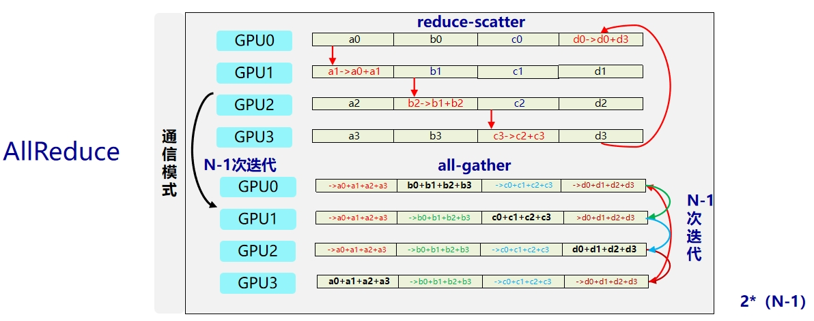

算法分两阶段，共 `2(N-1) = 6` 步：

| 阶段 | 步数 | 每步动作 | 直觉 |
|---|---|---|---|
| Reduce-Scatter | N-1 = 3 | 每 rank 把"轮到自己负责的某一段"发给右邻；右邻收到后**累加**到本地对应段 | 数据沿环转一圈被逐步累加，最终每 rank 只持有"全和"中的某一段（rank 0 拿到 A、rank 1 拿到 B……） |
| All-Gather | N-1 = 3 | 每 rank 把自己手上的"全和段"转发给右邻；右邻**覆盖**写入 | 全和段再沿环转一圈，让每 rank 都拿到完整的 `[A, B, C, D]` |

### 1.3 核心取舍：装配重 / 热路径轻

本设计把所有"需要决策、需要 syscall、需要进程间交互"的工作集中到 `commInit` 一次性完成；每次 `ncclAllReduce` 调用只剩固定的几步：参数校验 → 查表 → 填描述符 → launch kernel，**无任何运行时决策、无 host 侧通信**。

| 阶段 | 何时发生 | 谁参与 | 耗时量级 | 干什么 |
|---|---|---|---|---|
| **装配期** | `commInit` 一次性 | host 多模块 + 跨进程握手 + CUDA 分配 | 毫秒～秒 | 枚举 GPU、可达性探测、Ring 序列构造、后端选择（P2P / SHM）、IPC handle 交换、ringbuf 分配、`devComm` 装配并拷到 GPU |
| **热路径** | 每次 `ncclAllReduce` | host 查表 + GPU kernel | μs 级 | 参数校验 → 查档位表得 `(nChannels, nThreads)` → 派生 chunkSize → 填工作描述符 → `cudaLaunchKernel` |

GPU kernel 启动后**自主在 device 上推进**，host 与其它 rank 之间只通过 ringbuf 的 head/tail 计数器同步。后续章节凡涉及"为什么这件事在装配期做"或"为什么运行期不做这件事"——都回到这个原则。

> **NET 后端的例外**：跨节点路径上 GPU kernel 无法直接把数据放到对端 GPU HBM（RDMA verbs 接口只在 host 可调用），因此 NET 路径**额外引入 host 侧 proxy 线程**：kernel 仍只与本端 ringbuf 交互，proxy 线程在装配期启动、运行期负责把本端 ringbuf 的内容 post 成 RDMA 写请求送达对端 ringbuf，再把对端 head/tail 更新搬回本端。这一例外被局部化在 NET 后端内部，对 device 层与 enqueue 层保持透明——kernel 看到的依旧是"普通虚拟地址 + head/tail 计数器"。

---

## 2. 术语对照

> 术语按"组织维度"分组：**部署级**（库与外界 / 进程模型）→ **算法级**（数据如何切分流转）→ **传输级**（字节如何在 GPU 之间搬运）→ **运维级**（异常如何处理）。

### 2.1 部署级

| 术语 | 含义 |
|---|---|
| **rank** | 一个参与通信的 GPU 进程 / 线程 |
| **communicator**（comm）| 一组 rank 的通信上下文，不可变句柄；所有集合操作都基于一个 comm |
| **装配** / **装配期** | communicator 一次性初始化阶段：拓扑发现 + Ring 构造 + 建连 + ringbuf 分配；每 comm 仅一次（详见 §1.3） |
| **热路径** | 单次 `ncclAllReduce` 调用所经过的高频代码路径（参数校验 → 查表 → launch kernel） |
| **同步握手**（rendezvous） | CPU 侧进程间同步屏障 + 信息交换：所有 rank 必须到齐才能继续；在 `commInit` 时用于交换 `peerInfo` |
| **UDS**（Unix Domain Socket）| 同一台机器上进程间通信的本地 socket，地址是文件系统路径；本项目用它实现 rank 间同步握手与 IPC handle 交换 |
| **TCP OOB** | 跨主机进程间的带外通道，IP + port 形式；跨节点 rank 用它替代 UDS 做同步握手与 RDMA QP 信息交换（GID / QPN / PSN / rkey / 远端 buffer VA） |
| **IPC** | CUDA Inter-Process Communication——跨进程显存映射，让一个进程的 GPU buffer 在另一个进程里也能被 GPU 直接 `load / store` |
| **节点**（node / host）| 一台物理或虚拟机；同节点内 rank 通过 P2P/SHM 通信，跨节点 rank 通过 NET (RDMA) 通信 |

### 2.2 算法级

| 术语 | 含义 |
|---|---|
| **chunk** | Ring 算法中数据被切分的单位（每 rank 一份，共 N 份）|
| **channel** | GPU 上一组并行执行单元；本库一个 channel 对应一个 GPU thread block，一条单向 Ring 是一个 channel；多 channel 并发执行以提高带宽利用率 |
| **Reduce-Scatter / All-Gather** | Ring AllReduce 的两个阶段，参见 §1.2 |

### 2.3 传输级

| 术语 | 含义 |
|---|---|
| **PBLink** | 本项目用来代指 GPU 间高带宽直连（类似 NVLink 的位置）；transport 层 P2P 主路径优先走 PBLink，不可用时退回 PCIe Peer，再不可用则降级 SHM；同节点不可达且对端是远节点时改走 NET |
| **NET 后端** | 基于 RDMA verbs 的跨节点数据通路；运行期由 proxy 线程把本端 ringbuf 的字节通过 RDMA WRITE / SEND post 到对端 ringbuf |
| **RDMA** | Remote Direct Memory Access；NIC 在 host CPU 不介入数据搬运的前提下，直接读写本机内存或对端注册内存。本项目支持 InfiniBand 与 RoCEv2，统一通过 libibverbs 接口 |
| **QP / CQ / WR** | RDMA Queue Pair（发送 + 接收队列）/ Completion Queue（完成事件队列）/ Work Request（一次 post 提交）——RDMA 的最基本三件套 |
| **MR / rkey / GID** | Memory Region（注册到 NIC 的内存段）/ Remote Key（对端 MR 的访问凭据）/ Global Identifier（端口 IP 类标识）；装配期跨节点二次握手交换 |
| **GDR**（GPUDirect RDMA）| NIC 直接 DMA 进出 GPU HBM 的能力；可用则 ringbuf 直接落 GPU HBM 注册 MR，不可用则降级为 ringbuf 落 host pinned memory，由 kernel 与 NIC 共享访问 |
| **ringbuf** | channel 上的环形缓冲（slot 数 = NCCL_STEPS = 8），用于在相邻 rank 之间中转数据。NET 路径的"对端 ringbuf 地址"是 NIC 视角的虚拟地址 + rkey，仅 proxy 线程使用 |
| **ringbuf head / tail** | 环形缓冲的读 / 写游标，写者推 tail、读者推 head；无锁推进——运行期 GPU 与 GPU 之间（或 GPU ↔ proxy 线程 ↔ 远端 GPU）的同步机制 |
| **Simple 协议** | 本库使用的传输协议：数据 + 独立的 tail 计数器 + `__threadfence_system` 内存屏障实现写者 / 读者同步 |
| **proxy 线程** | 每个 comm 一个 host 侧常驻线程；只在 NET 后端激活；轮询本端 ringbuf 的"待发"状态 → post RDMA WR → 拉取 CQE → 同步对端 tail / 本端 head；同时承担 NET 路径的 hang 检测 |

### 2.4 运维级

| 术语 | 含义 |
|---|---|
| **abortFlag / fatalError** | 异常退出两阶段：检测到异常 → 设 `fatalError`；用户调 `commAbort` → 置 `abortFlag` → kernel spin 看到后 return；proxy 线程也以同样方式检查 `*abortFlag` 立即跳出 |
| **装配重 / 热路径轻** | 贯穿全文的设计原则：可提前计算的工作放到装配阶段；运行期只查表 + launch kernel，避免运行期决策。详见 §1.3 |

---

## 3. 需求范围

### 3.1 功能性需求

| ID | 需求 | 用户视角 |
|---|---|---|
| F1 | Communicator 生命周期 | `ncclGetUniqueId(&uid)`（rank 0 调，应用层带外分发）/ `commInit(comm, nranks, rank, BootstrapAddr)` / `commDestroy(comm)` / `commAbort(comm)`（`BootstrapAddr` 兼容 UDS 路径与 `host:port` 字符串，跨节点场景使用后者） |
| F2 | AllReduce 原语 | `allReduce(sendbuf, recvbuf, count, dtype, op, comm, stream)`；支持的 `(op, dtype)` 组合见 §6.2.6 |
| F3 | 装配期拓扑发现 | 自动识别 GPU 间 PBLink / PCIe / IPC 可达性；额外识别每 rank 所在节点与可用 RDMA HCA（含 GDR 支持能力），自动给跨节点边贴 NET 后端标签 |
| F4 | 异步错误轮询 | `commGetAsyncError(comm, &err)`；proxy 线程在 NET 路径上检测到 RDMA 错误 / 远端失联 → 写 `comm->fatalError` 被该接口读到 |
| F5 | 跨节点 AllReduce | 同一 comm 跨多台 host，自动按 graph 分发后端：同节点边走 P2P / SHM，跨节点边走 NET (RDMA) |

---

## 4. 外部接口与运行环境

> 图 4-1：外部接口与运行环境（调用方 · CUDA Runtime · GPU 硬件互联 · host 共享内存）
>
> 完整 SVG 见 [`allreduce-context.svg`](allreduce-context.svg)。

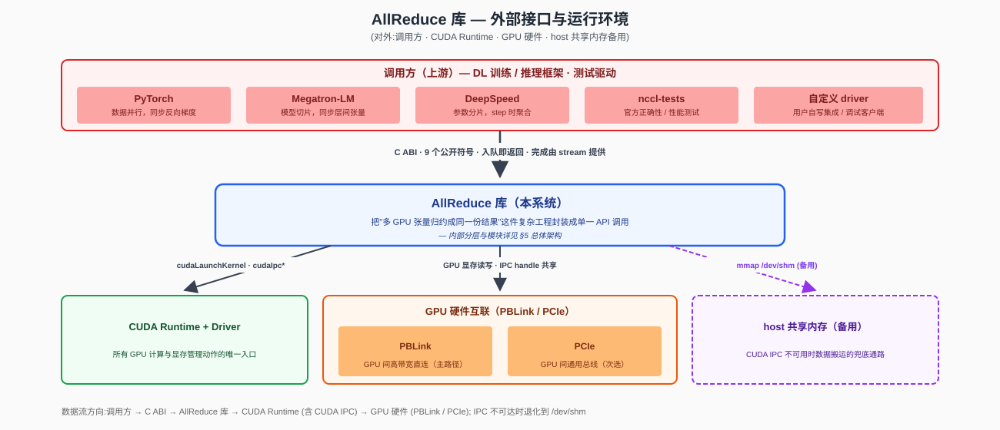

### 4.1 调用方

| 类别 | 集成方式 | 典型场景 |
|---|---|---|
| **DL 训练 / 推理框架** | 链接动态库（`libnccl.so` / `nccl.dll`）+ `#include "nccl.h"` | PyTorch DDP 梯度同步 / DeepSpeed ZeRO 参数广播 / Megatron-LM 张量并行同步 |
| **测试驱动 / 基准程序** | 同上 | `nccl-tests` 数值正确性比对、自定义功能用例、CI 集成测试 |

### 4.2 进程 / 线程模型

| 部署形态 | 描述 | 通信通路 |
|---|---|---|
| **单进程多 GPU** | 一个进程持有 N 个 GPU、N 个 communicator | 直接 CUDA IPC + PBLink；同地址空间内 handle 可直接共享，**绕过 UDS 同步握手** |
| **多进程多 GPU**（同节点）| 每进程一个 GPU、一个 communicator | 通过 **UDS 同步握手** 交换 `peerInfo`（busId + pid + IPC handle），再走 CUDA IPC + PBLink |
| **多节点多 GPU** | N 个节点 × M 个进程，每进程一 GPU；同一 comm 跨多 host | 通过 **TCP 同步握手** 交换 `peerInfo`（节点 hostHash + busId + pid + RDMA GID / QPN / rkey / 远端 ringbuf VA）；同节点边继续走 P2P / SHM，跨节点边走 **NET (RDMA verbs)**，proxy 线程负责数据搬运 |

所有 rank **几乎同时** 调用 `ncclCommInit`；某个 rank 迟到会让其他 rank 阻塞在同步握手上。跨节点场景下，bootstrap 自动按 uniqueId 中的地址类型（UDS 路径 vs `host:port`）选择 UDS 或 TCP 通道。

### 4.3 下游依赖

| 依赖 | 作用 | 涉及 API / 接口 |
|---|---|---|
| **CUDA Runtime + Driver** | kernel 启动、显存管理、跨进程显存映射、流同步 | `cudaLaunchKernel` / `cudaMalloc` / `cudaIpcGetMemHandle` / `cudaIpcOpenMemHandle` / `cudaStreamSynchronize` / `cudaEventRecord` |
| **PBLink**（主路径）| GPU 间数据搬运 | 由 CUDA 透明使用 |
| **PCIe**（次选）| PBLink 不可用时退回 PCIe Peer | 由 CUDA 透明使用 |
| **host `/dev/shm`**（备用）| CUDA IPC 不可达时退化 | `shm_open` / `mmap` |
| **libibverbs / librdmacm**（NET 后端依赖）| RDMA verbs 编程接口；NET 后端通过它建立 QP、注册 MR、post WR、轮询 CQE | `ibv_open_device` / `ibv_alloc_pd` / `ibv_reg_mr` / `ibv_create_qp` / `ibv_modify_qp` / `ibv_post_send` / `ibv_poll_cq` |
| **RDMA NIC（HCA）**| 跨节点 GPU 间数据搬运（InfiniBand / RoCEv2） | 由 libibverbs 透明使用；可选 GPUDirect RDMA 直读 GPU HBM |
| **TCP socket**（跨节点 bootstrap）| bootstrap 跨节点 OOB 通道，交换 peerInfo + QP 参数 | POSIX `socket / bind / listen / connect / send / recv` |
| **`nv_peer_mem` / `nvidia-peermem` 驱动**（可选，GDR 路径）| 让 NIC 与 CUDA 共享 BAR1 区域，注册 MR 到 GPU HBM | 加载即可，无需库内显式调用 |

---

## 5. 总体架构

### 5.1 模块架构

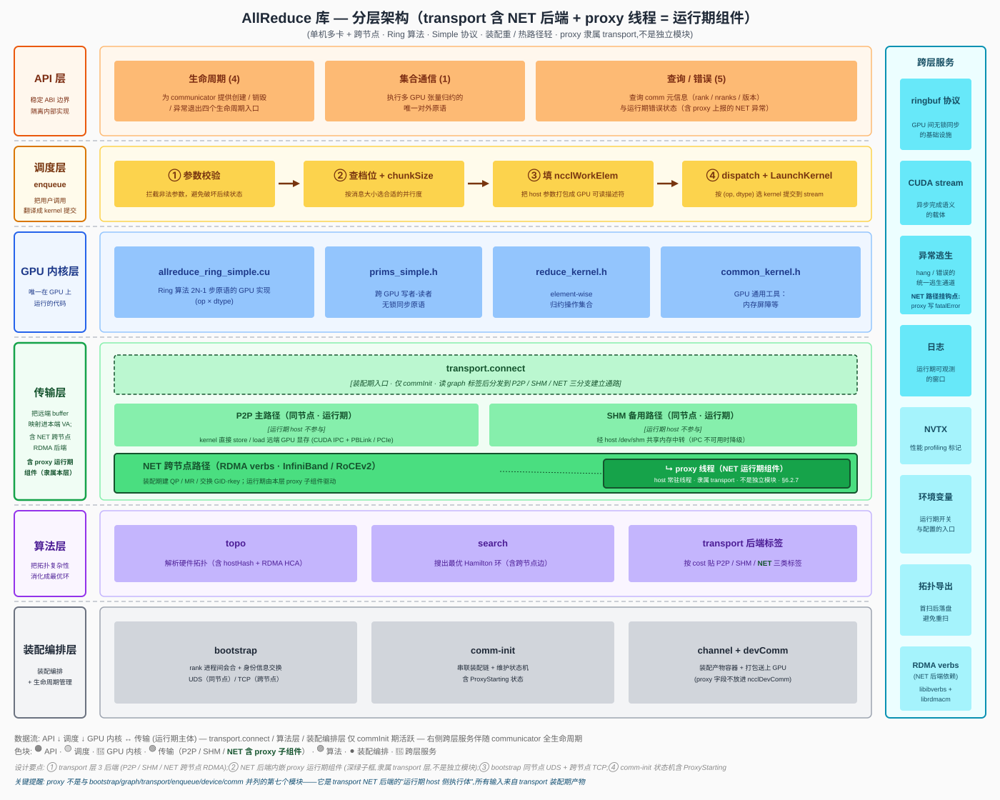

### 5.2 分层调用关系

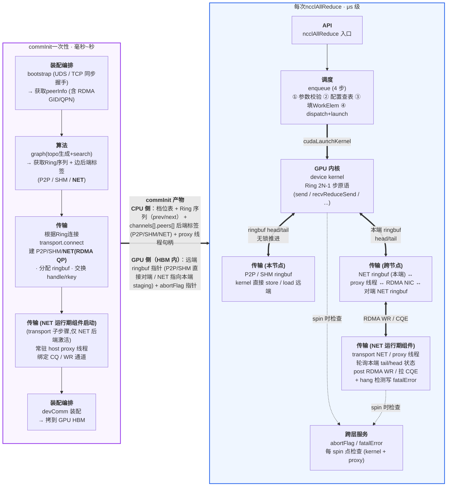

---

## 6. 模块划分与职责

### 6.1 模块清单

| 模块 | 职责描述 |
|---|---|
| **public-api** | 对外暴露 C ABI 公开符号，承接调用方的所有交互。本模块**只做轻量参数合法性检查**（指针非空、数值范围、`comm->state` 合法），不做任何语义解析（不展开 dtype/op 的具体含义、不做 GPU 选择、不做内存分配），随后**把请求转交内部对应模块**（`commInit` → comm；`ncclAllReduce` → enqueue；查询类直接读 comm 字段）。它是稳定 ABI 的物理边界，C++ 内部签名调整不会外溢。 |
| **comm**（init / commLifecycle）| `commInit / commDestroy / commAbort / commGetAsyncError` 四个 API 的总编排器。commInit对内按顺序调度 bootstrap → graph → transport → **proxy 启动**（仅 NET 后端激活）→ devComm 装配，维护 `comm->state` 字段表示当前阶段。本模块本身不做拓扑分析、不做建连、不做 GPU 数据搬运，只负责**调度顺序、状态推进、错误传播和异常逃生**（`abortFlag` / `fatalError`）。 |
| **bootstrap** | 装配链路的第一站。通过 socket（同节点 UDS / 跨节点 TCP，由 uniqueId 中的地址类型自动选择）把所有 N 个 rank 拉到同一会合点，做**同步屏障**（确保 N 个 rank 都到齐）；并让每个 rank 各自起一个常驻的监听 socket，把自己的 listen 地址（UDS 路径或 `host:port`）塞进 `peerInfo` 上报。完成后所有 rank 都拿到一份完整的 `peerInfo[]`（**含所有 rank 的 `listenAddr` + `hostHash`**），transport 后续按此直接 rank i ↔ rank j 二次握手——同节点边交换 IPC handle / SHM 路径，跨节点边交换 **RDMA GID / QPN / PSN / rkey / 远端 ringbuf VA**——无需经 rank 0 中转。单进程多线程场景跳过，直接走全局变量。 |
| **graph** | 装配期完成"**获取硬件拓扑 + 构造 Ring 序列 + 给每条边贴 transport 后端标签**"三件事。XML 拓扑文件存在则直接解析，不存在则现场调 NVML / sysfs / `/proc/cpuinfo` 扫描并落盘复用；得到的拓扑树用于填充代价矩阵（PBLink direct / 同 switch / 同 CPU / 跨 NUMA / **跨节点 NET** / 不可达），再用贪心 + 2-opt 搜出总代价最低的 Hamilton 环，输出 prev/next 两份序列（前向 + 反向，对应 `nChannels = 2`）；同时按 cost 给每条边贴 **P2P / SHM / NET** 后端标签。结果写入 `comm->channels[*].ring` 与 `comm->channels[*].peers[*].transport` 后固化，运行期不再活跃。 |
| **transport** | 装配期**建立每个 channel 中两节点间数据通路**。具体做法：**读 graph 模块写好的 `peers[p].transport` 标签**决定走 P2P (CUDA IPC + PBLink / PCIe) 主路径、SHM (`/dev/shm` mmap) 备用路径，还是 **NET (RDMA verbs) 跨节点路径**（**不重复调 `cudaDeviceCanAccessPeer`**）；分配本端 ringbuf、导出 IPC handle / SHM 路径 / RDMA MR + rkey、按 `peerInfo[peer].listenAddr` 直连对端做二次握手交换 handle / QP 参数、映射对端 buffer（P2P / SHM 时映射到本端 VA；NET 时记录远端 VA + rkey 留给 proxy 使用）。装配完成后，**P2P / SHM 后端运行期 device kernel 直接 store / load 对端 ringbuf**，transport 层不再参与；**NET 后端则由 proxy 线程承担 RDMA WR post / CQE 拉取**，kernel 仍只与本端 ringbuf 交互。 |
| **enqueue** | 运行期 host 侧的实现入口，是**热路径中负责 launch kernel 的 host 模块**（NET 后端另由 proxy 线程并行推进 RDMA 进程）。每次用户调 `ncclAllReduce` 都进入这里，按四步执行：参数校验 → 查档位表得到 `(nChannels, nThreads)` → 填 `ncclWorkElem` 工作描述符 → 调 `cudaLaunchKernel` 把 kernel 推到用户传入的 stream 上。约束严格：不做任何运行时决策、不做 host 侧通信、不做内存分配；返回 `ncclSuccess` 仅表示入队成功。 |
| **device**（GPU 内核）| 整个库**唯一在 GPU 上运行的模块**。模板维度 `<Ring, Simple, Op, Dtype>`——算法 / 协议固定为 `(Ring, Simple)`；按支持的 `(op, dtype)` 组合产出 kernel 符号矩阵 `ncclKernel_AllReduce_Ring_Simple_{Op}_{Dtype}`。kernel 由 enqueue launch 后从 `ncclDevComm` 读 ring 邻居 / ringbuf 指针 / abortFlag，按 Ring 算法的 `2N-1` 步原语（`send / recvReduceSend / recvReduceCopySend / recvCopySend / recv`）流水推进，自主完成 Reduce-Scatter + All-Gather 两阶段；通过 ringbuf 的 head/tail 与邻居无锁同步——**P2P / SHM 后端直接对端 HBM；NET 后端则与本端 staging ringbuf 同步，由 proxy 线程在 host 侧把数据中转到对端**。每个 spin 点检查 abortFlag 以支持 hang 逃生。 |
| **transport.proxy**（**隶属 transport 层 NET 后端**，不是与其它六个模块并列的第七个模块——表中独立列出仅为定位其常驻线程生命周期）| 仅在存在 NET 后端时启动；每个 comm 一个 host 侧常驻线程，是 transport NET 后端的"运行期延伸"。负责跨节点路径的"GPU ↔ NIC"中转：**轮询本端 NET ringbuf 的 tail（kernel 推进）→ post RDMA WRITE / SEND WR 到对端 ringbuf → 轮询 CQ 收 CQE → 写回对端 tail 通知（或推本端 head 释放 slot）**。同时承担 NET 路径的 hang 检测：连续 N 秒 CQE 无进展 → 写 `comm->fatalError`，由 `commGetAsyncError` 暴露给上层。proxy 线程在 kernel 退出 / `commDestroy` / `commAbort` 时被显式 join，避免 use-after-free。详见 §6.2.7。 |

> 备注 : **NVML** (NVIDIA Management Library)是 NVIDIA 提供的 GPU 管理与监控接口库(libnvidia-ml.so),nvidia-smi建立在它之上。它走控制平面旁路,不需要 CUDA Context、不占显存、不影响计算,通过 ioctl 直达内核驱动,即便 CUDA 崩了也能查 GPU 状态。

### 6.2 各模块实现思路

#### 6.2.1 comm初始化

**模块作用**：装配期涉及多个模块按特定顺序协作（bootstrap → graph → transport → **proxy 启动** → devComm），任一步失败都必须能干净清理、不让残留资源拖死后续——所以必须有一个**总编排器 + 状态机**来串这条链。

**模块定位**：负责 communicator 的生命周期管理。它对外暴露 `commInit` / `commDestroy` / `commAbort` / `commGetAsyncError` 四个 API，对内按顺序调用 bootstrap、graph、transport、proxy 启动和 devComm 装配，并维护 `comm->state` 字段表示 communicator 当前所处的阶段。其它模块通过读 `comm->state` 判断当前 comm 是否可用。

**要做的工作**：
- **生命周期编排**：`commInit` 按 Bootstrapping → Discovering → Connecting → **ProxyStarting**（仅当任一 channel 有 NET peer）→ Active 顺序串调 bootstrap / graph / transport / proxy，并在最后把 `devComm` 拷到 GPU。
- **状态机维护**：每个阶段对应一个 `comm->state`，保证调用方在错误时机不能继续推进（如 `Failed` 状态下 enqueue 必须拒绝入队）。
- **错误收敛**：任一阶段失败 → `state = Failed` → 走清理路径返回错误码；提供 `commGetAsyncError` 让外部线程异步查询运行期错误（包含 proxy 线程写入的 NET 错误）。
- **异常逃生入口**：`commAbort` 置位 `abortFlag`，让 GPU kernel 与 proxy 线程同时跳出 spin；`commDestroy` 等待 kernel 自然结束并 join proxy 线程后释放资源。

**输入与输出**：

| 项 | 内容 |
|---|---|
| 入口 | `ncclCommInit / Destroy / Abort / GetAsyncError` |
| 持有状态 | `comm->state`、`comm->fatalError`、`comm->abortFlag`、`comm->devComm` |
| 协作模块 | 串行调用 bootstrap → graph → transport → 装配 devComm |

**状态机**：

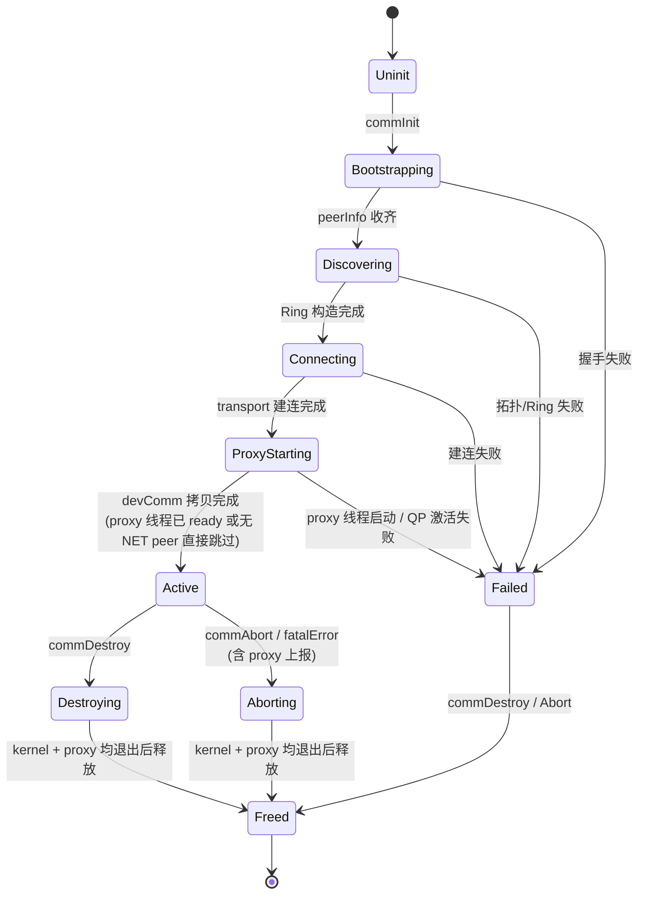

**`ncclCommInit` 实现流程**：

1. **预备**：分配 `comm` 结构，设 `state = Uninit`；`cudaGetDevice` 校验调用线程绑定的 device 与传入参数一致。
2. **Bootstrapping**：`state = Bootstrapping` → 调 bootstrap 模块（§6.2.2）完成同步握手 → 拿到 `peerInfo[]`（含 `hostHash` + RDMA 端口信息，以便 graph / transport 判定节点归属）。
3. **Discovering**：`state = Discovering` → 调 graph 模块（§6.2.3）做拓扑发现 + Ring 构造 → 结果写入 `comm->channels[*].ring`，并给跨节点边贴 NET 标签。
4. **Connecting**：`state = Connecting` → 调 transport 模块（§6.2.4）逐 (channel, peer) 建连 → `cudaMalloc` 分配本端 ringbuf → P2P / SHM / **NET** 三分支各自完成 handle 或 QP 交换 → 写入 `comm->channels[*].peers[*]`。
5. **ProxyStarting**：`state = ProxyStarting` → 若 `comm->channels[*].peers[*]` 中存在 NET 类型 peer → 调 proxy 模块（§6.2.7）启动 host 侧常驻线程、激活每个 NET QP（RTR → RTS）；若全是 P2P / SHM 则跳过。
6. **DevComm 装配**：把 `comm` 中需要在 GPU 端访问的字段（ring 邻居、ringbuf 指针、abortFlag 指针等）打包到 `ncclDevComm` 结构 → `cudaMemcpyAsync` 拷到 GPU global memory → `comm->devComm` 指向之。
7. **Active**：`state = Active` → 返回 `ncclSuccess`，从此可接收 `ncclAllReduce` 调用。

任一步骤失败 → `state = Failed` → 走清理路径（与 Destroy 共享），返回错误码；若 proxy 线程已起则先 join。

**`ncclCommDestroy` 实现**：
1. `state = Destroying`，拒绝新的 AllReduce 入队。等当前执行kernel完成（`cudaStreamSynchronize` 或显式 event 等待）。
2. **若存在 proxy 线程**：置 proxy `stopFlag` → join → 销毁 QP / CQ / PD / dereg MR / close RDMA device。
3. `cudaIpcCloseMemHandle` / SHM `munmap` → `cudaFree` ringbuf → 释放 `peerInfo[]` → 释放 `comm` 结构。

**`ncclCommAbort` 实现**（异常逃生路径，与 Destroy 共享清理代码）：
1. `state = Aborting`，拒绝新的入队。置 `*abortFlag = 1`（host 写，GPU **与 proxy 线程**读）。
2. 等 kernel 看到 flag 后 `return`；proxy 线程 spin 处亦观察 flag 立即跳出。
3. 进入与 Destroy 相同的资源释放路径（含 proxy / RDMA 资源销毁）。

**`ncclCommGetAsyncError` 实现**：原子读 `comm->fatalError` 返回。这是少数允许上层应用查询接口，便于训练框架在另一个线程做健康检查；检测到错误后调用方应主动调 `commAbort` 完成清理。**proxy 线程是该字段的主要写者之一**——RDMA verbs 返回错误码或长时间无 CQE 时由 proxy 设置。

**错误传播路径**：
- 装配期失败 → 当前调用线程同步返回错误码。
- 运行期 kernel hang / peer 失联 → 由检测者（kernel 内 spin 超时检查 / host 侧轮询 / **跨节点主要是 NET proxy 线程**）写 `comm->fatalError` → 调用方通过 `commGetAsyncError` 看到 → 主动调 `commAbort` 终结整 comm。

#### 6.2.2 bootstrap 模块

**模块作用**：N 个独立 rank 进程之间没有任何公共上下文，必须先有一个"会合点"让它们互相发现并交换"我是谁"。

**模块定位**：bootstrap 在 `commInit` 阶段执行进程间同步握手。它通过一条预先约定的会合 socket（同节点用 UDS、跨节点用 TCP——由 uniqueId 中的地址类型自动选择，以下统称"会合 socket"）由 rank 0 创建、应用层带外分发到其他 rank，**把所有 N 个 rank 拉到同一会合点**，等所有 rank 都到达后再继续推进；并在此过程中**让每个 rank 各自起一个自己的监听 socket**（同节点 UDS / 跨节点 TCP），把"自己的 listen 地址 + 基本信息"打包进 `peerInfo` 上报。bootstrap 执行完后，每个 rank 都拿到完整的 `peerInfo[]`（含**所有 rank 的监听地址 + `hostHash`**），后续 graph 模块据此分析 GPU 拓扑与节点归属，transport 模块据此直接 rank i ↔ rank j 二次握手——同节点边交换 IPC handle / SHM 路径，**跨节点边交换 RDMA QP 参数**，**无需经 rank 0 中转**。

**输入与输出**：

| 项 | 内容 |
|---|---|
| 输入 | `nranks`, `rank`, `BootstrapAddr`（会合地址：UDS 路径 `/tmp/...` 或跨节点 `host:port`；**由 rank 0 调 `ncclGetUniqueId` 生成后由应用层带外分发**——rank 0 在此监听，其它 rank 主动 connect 上报） |
| 输出 | `peerInfo[nranks]`，每项含 `{ busId, pid, nranks, hostHash, listenAddr, ibDevName/ibPort/ibLid/ibGid }`（`listenAddr` 是该 rank 自己监听的地址，供 transport 二次握手时直连；后四项是该 rank 上 RDMA HCA 的端口信息，graph 用于挑选可达 NET 路径，transport 用于初始化 QP） |
| 副作用 | 本 rank 持有一个长期监听的 socket（UDS 文件或 TCP 端口），生命周期与 comm 同步——`commDestroy` 时才 close（UDS 同时 unlink） |
| 失败模式 | 地址不可达 / 权限不足 / 连接超时 / 各 rank `nranks` 不一致 / 本 rank 监听 socket 创建失败 → 返回 `ncclSystemError`，调用方释放 comm |

**单进程多线程例外**：`commInit` 检测到所有 rank 在同一进程时跳过同步握手，直接走全局变量共享 `peerInfo`，连 socket 都不创建。

**跨节点握手细节**：跨节点握手的伪代码与同节点形式一致——区别仅在底层 `listen / connect / accept` 函数的 socket 族（`AF_UNIX` vs `AF_INET`）。bootstrap 模块内部封装一个 thin wrapper，把这层差异吸收掉，调用方逻辑零修改。`hostHash` 用 `gethostname() + 启动随机盐` 取 64-bit 哈希——同节点的不同进程必须算出相同值（盐为 0），graph 模块据此判定"是否同节点"。

**UDS 方案同步流程**：

> 图 6.2.2-1：UDS 同步握手时序——uniqueID 生成与带外分发 → 各 rank 调 commInit → rank i 上报 peerInfo → rank 0 同步屏障 → rank 0 广播完整 peerInfo[]

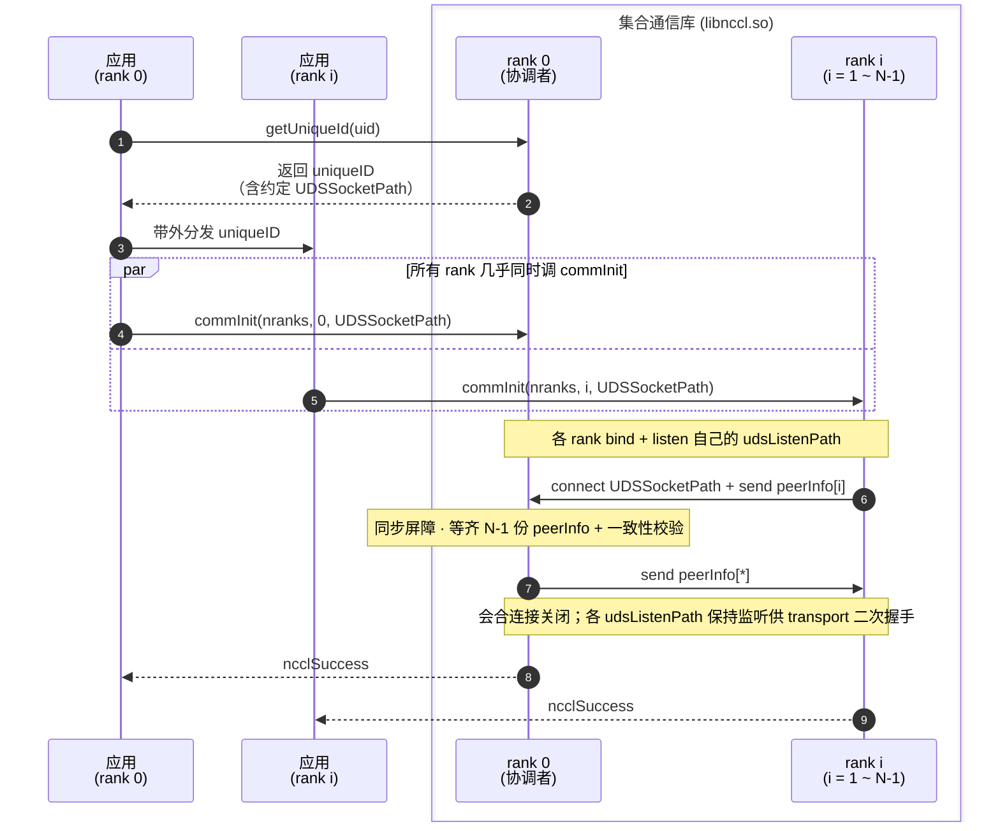

**伪代码对照**：

```
// 前置条件 (由应用层完成,不在库内):
//   ① rank 0 调 ncclGetUniqueId 生成 uniqueID (含约定 UDSSocketPath)
//   ② 应用层通过 MPI / 文件 / 环境变量带外分发 uniqueID 给所有 rank
//   ③ 各 rank 从 uniqueID 解析出 UDSSocketPath 作为 commInit 参数

rank 0 (协调者):
  1. bind+listen(UDSSocketPath)               // 会合路径,同时作为自己的 udsListenPath
  2. for i in 1..N-1: conn[i] = accept()       // 接受 N-1 个会合连接
  3. for i in 1..N-1: recv peerInfo[i]         // 收齐 (含 udsListenPath = UDSSocketPath.i)
  4. peerInfo[0] = { self busId/pid/nranks,
                     udsListenPath = UDSSocketPath }
  5. 校验 peerInfo[i].nranks 全部一致
  6. for i in 1..N-1: send peerInfo[*]         // 广播完整数组
  7. 关闭会合用的 conn[i];保留 UDSSocketPath 上的 listen socket
     (后续 transport 二次握手时被其它 rank 直连)

rank i (i ≥ 1):
  1. bind+listen(UDSSocketPath.i)              // 先把自己的 udsListenPath 建好
  2. retry connect(UDSSocketPath, 超时数秒)    // 等 rank 0 监听就绪
  3. send peerInfo[i] = { busId, pid, nranks,
                          udsListenPath = UDSSocketPath.i }
  4. recv peerInfo[*]                          // 接收完整数组
  5. 关闭与 rank 0 的会合连接;保留 UDSSocketPath.i 上的 listen socket
```

#### 6.2.3 graph 模块

**模块作用**：GPU 间物理连接代价差异巨大（PBLink 与跨 NUMA、再到跨节点 RDMA 链路，带宽/时延数量级差距），Ring 走错路径性能塌方——必须在装配期**一次性把拓扑复杂性消化成"边代价 + 后端标签"**，让运行期只面对最优环。代价模型与后端标签覆盖同节点 P2P / SHM 与跨节点 NET 三类路径。

**模块定位**：graph 在装配期完成两件事——**获取全局拓扑描述**（优先读取已有 XML 文件；不存在则现场调 NVML / sysfs 扫描生成并落盘），识别本节点 GPU 间的硬件连接（哪些 GPU 之间能直连、用什么介质、距离几跳）；并在此基础上**构造N条让总通信代价最低的 Ring 序列**（每 rank 在环中的 prev / next）。输入是 bootstrap 提供的 `peerInfo[]`、NVML、sysfs（XML 文件若不存在会被自动生成），输出是 `comm->channels[c].ring`。Ring 序列在 `commInit` 末写入 communicator 后固化，运行期 GPU kernel 直接读取使用，不再做与路由相关的决策。

**输入与输出**：

| 项 | 内容 |
|---|---|
| 输入 | `peerInfo[nranks]`（含每 rank 的 busId、pid、NUMA 归属）+ **XML 拓扑文件**（约定路径或 `NCCL_TOPO_FILE`；存在则直接读，不存在则首次启动时由 graph 现场扫描生成并落盘） |
| 输出 | 每 channel 一份 `ncclRing { prev, next, userRanks[] }`，写入 `comm->channels[c].ring`；若是首次扫描生成，XML 文件同步保存供后续启动复用 |
| 失败模式 | XML 文件存在但格式非法 / 内容与 `peerInfo` 不一致；XML 不存在且现场扫描失败；GPU 数 < 2；或环上多条边不可达且 transport 层也无法降级 → 返回 `ncclInternalError` |

**链路分类与代价模型**：

| 类别 | 检测方式 | 链路代价 | 装配后端 |
|---|---|---|---|
| PBLink direct | 同节点 + XML 中存在 GPU-GPU 直连 PBLink 边 + `cudaDeviceCanAccessPeer` 校验 | 1 | P2P |
| PCIe Peer，同 PCIe switch | 同节点 + XML 中两 GPU 挂在同一 PCIe switch 下 | 5 | P2P |
| PCIe Peer，同 CPU root complex | 同节点 + XML 中两 GPU 同 host bridge 但跨 PCIe switch | 10 | P2P |
| PCIe Peer，跨 CPU NUMA | 同节点 + XML 中两 GPU 跨 CPU socket | 50 | P2P |
| **跨节点 NET（GDR 直读）** | 两 rank `hostHash` 不同 + 两端 HCA 同子网可达 + 两端 GPU↔NIC 同 PCIe switch 或同 root complex + GDR 驱动加载 | 200 | NET（GDR） |
| **跨节点 NET（GDR 退化为 bounce buffer）** | 同上但 GPU↔NIC 跨 NUMA 或缺 GDR；数据需先 stage 到 host pinned memory 再 post WR | 500 | NET（host staged） |
| 同节点不可达（P2P 不通）| XML 中无连接边 或 `cudaDeviceCanAccessPeer == false`，且两 rank 同 hostHash | INIT_MAX_SHM | SHM（`/dev/shm` 降级） |
| 完全不可达 | 跨节点但无任何可达 NET 路径 | ∞ | 装配失败 |

> **代价数值仅是相对量级，用于在多条候选环中做比较；不直接对应任何时延 / 带宽指标。**

**整体流程概览**：

> 图 6.2.3-1：graph 模块在 `commInit` 中的整体执行流程——XML 读取（不存在则现场扫描）→ GPU 与拓扑节点对齐 → 填代价矩阵 → 贪心 + 2-opt 搜环 → 环合法性校验 → 写入 `comm->channels[*].ring`
>
> 完整 SVG 见 [`allreduce-graph-flow-v2.svg`](allreduce-graph-flow-v2.svg)。

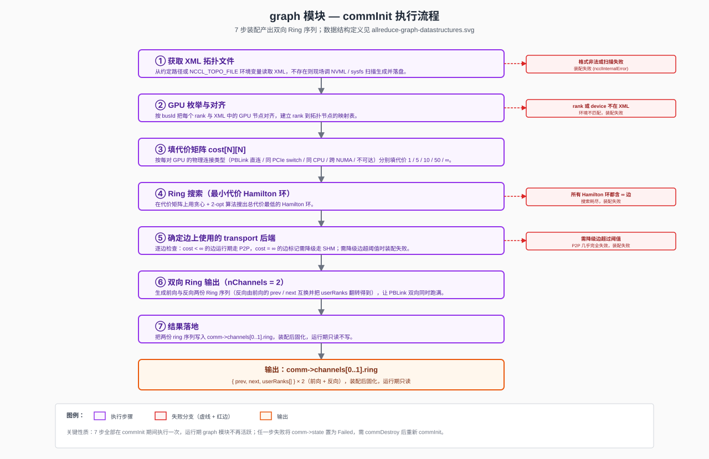

**`commInit` 中按以下步骤执行**：

1. **获取 XML 拓扑文件**：先尝试从约定路径（或 `NCCL_TOPO_FILE` 环境变量指定路径）读取已有 XML 文件：
   - **文件存在**：按 `<cpu>` → `<pci>` → `<gpu>` 层级解析为内存中的拓扑树。
   - **文件不存在**：现场调用 NVML / sysfs / `/proc/cpuinfo` 等接口扫描节点拓扑，构建拓扑树，并把结果序列化写到同一路径下保存——下次 `commInit` 启动时即走"文件存在"的快路径。这是一次性的兜底，保证首次部署或机器换硬件后仍能自举。
   - **文件存在但格式非法**：装配失败（不自动覆盖，避免误删可能是人工调整过的 XML）；扫描失败 → 装配失败。

   > 图 6.2.3-2：XML 拓扑文件结构（graph 模块输入）。完整 SVG 见 [`allreduce-graph-xml-v2.svg`](allreduce-graph-xml-v2.svg)。

   

2. **GPU 枚举与对齐**：把每个 rank 与 XML 中的 GPU 节点按 busId 字符串逐一对齐，建立 `rank → 拓扑节点` 映射表。任一 rank 在 XML 中找不到、或本地 device 不在 XML 中 → 装配失败（说明 XML 与运行环境不匹配）。

3. **填代价矩阵 `cost[N][N]`**：对每对 (i, j)：
   - 在拓扑树上沿 GPU i → PCIe switch → host bridge → CPU socket 向上回溯，再向下走到 GPU j，沿途记录是否经过同 PCIe switch / 同 host bridge / 跨 CPU socket，得到"拓扑距离类别"。
   - 同时检查 XML 中是否独立标注了 GPU i 与 GPU j 之间的 PBLink 直连边。
   - 按上表"链路分类与代价模型"填入对应代价；XML 中没有任何连接、或 `cudaDeviceCanAccessPeer(i, j) == false` → `cost[i][j] = ∞`。
   - 对角线 `cost[i][i] = 0`（自连接不参与搜索）。

   > 图 6.2.3-3：cost[N][N] 代价矩阵示例（N=4），含贪心 + 2-opt 搜索 + 链路带宽消耗演示。完整 SVG 见 [`allreduce-graph-cost-matrix-v2.svg`](allreduce-graph-cost-matrix-v2.svg)。

   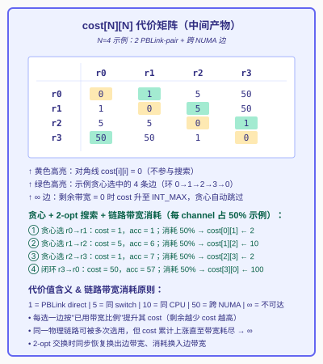

4. **Ring 搜索（贪心 + 2-opt + 链路带宽消耗）**：在代价矩阵上找一条总代价最小的 Hamilton 环。
   - **基本框架（贪心 + 2-opt）**：从 rank 0 出发，每步选剩余 GPU 中当前 `cost` 最小的邻居（同代价时按 rank id 取较小者保证确定性）；环形闭合后做一次 2-opt 局部优化——对每两条非相邻边 `(a-b, c-d)` 尝试换成 `(a-c, b-d)`，若总代价下降则接受（交换时同步恢复换出边的带宽、消耗换入边的带宽），迭代直到无改进。固定起点 rank 0 打破环的 N 重旋转对称；只搜环的一个方向打破镜像对称。
   - **链路带宽消耗（核心设计）**：每条物理链路（PBLink wire / PCIe switch port）维护一个 `remaining[i][j]` 剩余带宽（初始 100%），cost 表中的 `cost[i][j]` 与 `remaining[i][j]` 反比关联——剩余越少 cost 越高。每个 channel / block 选边时声明自己消耗多少带宽（例如一个 channel 只占 PBLink 20%，或保守按 50% 计），选边后按"已用比例"提升该边 cost：物理链路并未"被独占"，可以继续被后续选择复用，但每次复用 cost 都会再次抬升；剩余带宽消耗到 0 时 cost 升至 `∞`，贪心自动跳过。这样既适配"单 channel 打不满整条链路"的常见情况，又在多 channel / 多 ring 共享物理链路时让搜索自动倾向于带宽未被占满的边，避免局部超额分配。
   - **示例（N = 4，环 0→1→2→3→0，每 channel 占 50% 带宽）**：贪心依次选 (r0→r1, base=1) → cost 升为 2；(r1→r2, base=5) → cost 升为 10；(r2→r3, base=1) → cost 升为 2；闭环 (r3→r0, base=50) → cost 升为 100；累计 `acc = 1 + 5 + 1 + 50 = 57`（acc 使用选边时的当前 cost，而非更新后的）。后续若 ch1 反向 Ring 在同一矩阵继续搜索，已被消耗 50% 的 PBLink 边代价已经翻倍，搜索倾向于选剩余 100% 的其它边；若两 channel 都选同一条 PBLink → 该边剩余 = 0 → 后续任何 channel 都无法再用。
   - **退化情况**：贪心走到某节点时所有剩余可达边都到 `∞`（剩余带宽耗尽，无法闭合环）→ 装配失败。

    > **备注：1. 当前Ring搜索检出的nchannel由手动配置指定，NCCL采用其他算法确定最合适的channel数； 2. 未考虑复杂PCIe switch场景：例如GPU 0与GPU 1、GPU 0与GPU 2占用了相同的某段PCIe链路**

5. **确定边上使用的 transport 后端**：扫描搜出的环上 N 条边，按 cost 与节点归属给每条边贴 transport 后端标签，并把结果**写入 `comm->channels[c].peers[p].transport`**，供后续 §6.2.4 transport 模块直接读取（不再重复调 `cudaDeviceCanAccessPeer`——可达性信息在 step 3 填代价矩阵时已固化进 cost）：
   - `cost ∈ {1, 5, 10, 50}` 且两端 `hostHash` 相同：边可用，标记为 **P2P** 后端（前两类通常落到 NVLink / PBLink，后两类落到 PCIe Peer）。
   - `cost ∈ {200, 500}`：两端 `hostHash` 不同，标记为 **NET** 后端；同时把 GDR 可用性（直读 GPU HBM vs host staging）作为子标签 `transportNetMode ∈ {GDR, HOST_STAGED}` 一并写下，transport 装配时按此选择 MR 注册位置。
   - `cost = INIT_MAX_SHM`：边同节点但 P2P 不通，标记为 **SHM** 后端（运行期降级，走 `/dev/shm` mmap）。
   - `cost = ∞`：边跨节点且无任何可用 NET 路径 → 装配失败（不再向下降级）。

6. **双向 Ring 输出**：本期固定 `nChannels = 2`（与 transport / device 约定）：
   - `channels[0].ring = { prev = ring_prev[r], next = ring_next[r], userRanks = [r0, r1, ..., rN-1] }`（前向）
   - `channels[1].ring = { prev = ring_next[r], next = ring_prev[r], userRanks = [r0, rN-1, ..., r1] }`（反向：把前向的 prev / next 互换，并把 userRanks 数组翻转——确保两份 Ring 的"邻居语义"与"chunk 顺序"都对齐）
   - 两个 channel 走相反方向，分别从 PBLink 的两个物理方向独立推进数据，让 transport 层映射出来的两套 ringbuf 同时跑满。

   > 图 6.2.3-4：ncclRing 结构与双向输出示例（N=4，nChannels=2）。完整 SVG 见 [`allreduce-graph-ring-v2.svg`](allreduce-graph-ring-v2.svg)。

   

7. **结果落地**：把两份 ring 序列写入 `comm->channels[0..1].ring.{prev, next, userRanks}`；graph 模块工作完成，运行期不再调用任何 graph 代码。

> **代价模型仅在装配期使用，运行期 GPU kernel 看到的就是一份"prev / next 邻居"序列**。

#### 6.2.4 transport 模块

**模块作用**：GPU kernel 要像访问本地内存一样访问远端 GPU 显存，但远端 buffer 默认在另一个进程（甚至另一台主机）的地址空间里 GPU 指令访问不到——transport 在装配期**把远端 buffer 映射进本端虚拟地址空间（同节点）**或**通过 RDMA QP 建立到远端的 verbs 通路（跨节点）**，并准备好运行期对应的搬运机制。

**模块定位**：transport 在装配期建立 peer 间的数据通路，按 graph 写好的后端标签分三类——
- **P2P**（同节点 / CUDA IPC + PBLink / PCIe）：把对端 GPU buffer 映射到本端 VA，运行期 kernel 直接 `store / load`，host 不参与。
- **SHM**（同节点 / `/dev/shm` mmap）：双方 mmap 同物理页，运行期 kernel 直接访问，host 不参与。
- **NET**（跨节点 RDMA verbs）：本端分配 NET ringbuf（按 GDR 可用性落在 GPU HBM 或 host pinned），注册为 MR、建立 QP 并与对端 QP 配对；运行期由 **proxy 线程（§6.2.7）** 把数据 post 成 RDMA WR 发到对端 ringbuf——kernel 仍只与本端 ringbuf 交互。

装配完成后，**P2P / SHM 后端运行期 host 不参与**；**NET 后端运行期由 proxy 线程承担 host ↔ NIC 桥接**，对 device kernel 透明。

**输入与输出**：

| 项 | 内容 |
|---|---|
| 输入 | `comm->channels[c].ring`（决定要连哪些 peer）+ `comm->channels[c].peers[p].transport`（**graph 模块在 §6.2.3 step 5 已贴好的后端标签**，P2P / SHM / **NET**）+ `comm->channels[c].peers[p].transportNetMode`（GDR / HOST_STAGED，仅 NET 时有效）+ `peerInfo[*].listenAddr`（用于直连对端做二次握手）+ `peerInfo[*].{ibDevName, ibPort, ibGid, ...}`（NET 时初始化 QP 用） |
| 输出 | `comm->channels[c].peers[p].{connSend, connRecv}`：buffer 指针 + head/tail 计数器地址 +（NET 专属）`{qpHandle, remoteAddr, remoteRkey, mr}` |
| 失败模式 | P2P 不通且 SHM 也创建失败、IPC handle 交换超时、**NET 路径打开 IB device 失败 / 注册 MR 失败 / QP modify RTR/RTS 失败 / GID 不可达** → 返回 `ncclSystemError` |

**装配期实现步骤**（在 `commInit` 的 connect 阶段执行，对 channels × peers 二重循环）：

1. **按 graph 标签分发后端**：直接读 `channels[c].peers[p].transport` 标签——P2P 走 CUDA IPC + PBLink/PCIe 分支；SHM 走 `/dev/shm` mmap 分支；**NET 走 RDMA verbs 分支**。**不再调 `cudaDeviceCanAccessPeer`**，可达性判断在 §6.2.3 step 5 已完成。三个分支用条件 switch 表达，不引入 vtable 多态。
2. **导出本端 buffer**：
   - **P2P 分支**：`cudaMalloc` 分配 `buffSize` 显存 → `cudaIpcGetMemHandle` 导出为 64 字节不透明 handle。
   - **SHM 分支**：在 `/dev/shm` 创建文件 → `ftruncate(buffSize)` → `mmap` 拿到 host VA；head/tail 计数器与 buffer 同段放置。
   - **NET 分支**：
     - 按 `transportNetMode` 选择 buffer 位置——**GDR 模式**：`cudaMalloc(buffSize)` 落在 GPU HBM；**HOST_STAGED 模式**：`cudaHostAlloc(buffSize, cudaHostAllocMapped)` 落在 host pinned 内存（GPU 与 NIC 都可访问）。
     - `ibv_open_device / ibv_alloc_pd / ibv_create_cq / ibv_create_qp` 初始化 NIC 资源（每 (channel, peer) 一个 QP，类型 RC）。
     - `ibv_reg_mr` 把 ringbuf 注册为 RDMA Memory Region，记录 `lkey / rkey`。
     - head/tail 计数器同样放在已注册 MR 段内（GDR 时位于 HBM、HOST_STAGED 时位于 host pinned），让 NIC 也能直接 RDMA WRITE 推进。
3. **handle / QP 参数交换**：`connect(peerInfo[peer].listenAddr)` 直连对端常驻监听 socket，发送本端的 connect info、收对端的同型——
   - **P2P / SHM**：IPC handle / SHM 路径。
   - **NET**：发 `{ qpn, psn, gid, ibPort, mtu, rkey, remoteBufferVA }`，收对端的同型。每对 (channel, peer) 一次往返；transport 层不解析包内容，仅按字节包传递。
4. **映射对端 buffer / 激活 QP**：
   - **P2P 分支**：`cudaIpcOpenMemHandle(对端 handle)` → 得到本地虚拟地址。
   - **SHM 分支**：`open(对端发来的路径)` → `mmap` → 本地虚拟地址。
   - **NET 分支**：`ibv_modify_qp(INIT → RTR → RTS)`——把对端 `qpn / psn / gid` 配进 QP 状态机；预 post 若干 receive WR 以便对端 RDMA WRITE WITH IMM 立即可被收到。**不映射对端 buffer**：对端 buffer 只以"远端 VA + rkey"形式记录，由 proxy 线程在 post WR 时填进 `wr.wr.rdma.remote_addr` / `wr.wr.rdma.rkey`。
5. **连接落地（host 端）**：把以下指针写入 host 端 `comm->channels[c].peers[p]`：
   - **P2P / SHM**：
     - `connSend.buffs`：写入侧使用的**远端** buffer 地址（本端 VA 中映射到的对端段），本端 GPU 通过它直接远程写入 receiver。
     - `connRecv.buffs`：读出侧使用的**本地** buffer 地址，本端 GPU 从这里本地读取。
     - `connSend.tail` / `connRecv.head`：Simple 协议的对端 / 本端计数器虚拟地址。
   - **NET**（kernel 视角与 P2P 完全一致，但语义是与"本端 staging ringbuf"同步）：
     - `connSend.buffs`：**本端**已注册 MR 段——kernel 把数据写进这里，proxy 线程将其 post 给 NIC。
     - `connRecv.buffs`：**本端**已注册 MR 段——proxy 线程从 NIC CQE 取回的对端写入落在此处，kernel 从这里 reduce / copy。
     - `connSend.tail` / `connRecv.head`：本端计数器；kernel 推 tail 通知 proxy"有新 chunk 可发"，proxy post 完成后再以 RDMA 写入对端等价计数器，最终触发对端 kernel 看到 tail 推进。
     - 额外字段（**proxy 用，kernel 不读**）：`netConn.qp, netConn.remoteAddr, netConn.remoteRkey, netConn.mr`。
   - **本步只写 host 内存，GPU kernel 此时还看不到这些指针**。

6. **指针下发到 HBM（与 §6.2.1 Step 6 协同）**：transport 完成 host 端写入后，init / commLifecycle 接管：
   - 把 `channels[*].peers[*]` 中 kernel 运行期会用到的字段（ringbuf 指针、tail / head 地址、ring 邻居 prev/next、abortFlag 指针）打包到 `ncclDevComm` 结构。
   - `cudaMalloc` 在 GPU HBM 分配 `ncclDevComm` 空间 → `cudaMemcpyAsync` 把 host 打包好的结构拷到 GPU 端 → `comm->devComm` 记下 GPU 端地址。
   - enqueue 在 launch kernel 时把 `comm->devComm` 作为 kernel 参数传入；kernel 启动后通过 `ncclShmem.comm` 引用 `ncclDevComm`，从 HBM 读出这些指针，再 dereference 访问真正的 ringbuf / 计数器。
   - **关键约束**：所有"GPU 端取指针"的动作必须落在 HBM 上才能成立。HBM 上存放的是**指针值（虚拟地址）**；指针指向的实际 ringbuf 数据 / 计数器，按后端落在：
     - **P2P**：receiver HBM
     - **SHM**：host pinned / SHM 段（`cudaHostRegister` 后 device 可访问）
     - **NET（GDR）**：本端 HBM 中的 staging ringbuf（NIC 直 DMA）
     - **NET（HOST_STAGED）**：本端 host pinned 中的 staging ringbuf（CUDA mapped；NIC 普通 DMA）
   - NET 后端**额外的 proxy 字段**（`qp / remoteAddr / remoteRkey / mr`）只在 host 端的 `peers[]` 内保留，**不打包进 `ncclDevComm`**——GPU kernel 看不到也不需要看到。

**ringbuf 布局**（每对相邻 rank、每方向、每 channel 一份）：

> 图 6.2.4-1：ringbuf 内部结构（slot 数 / head/tail 指针）、一对相邻 rank 的 4 份 ringbuf 配对、全节点 4N 总量、**P2P / SHM / NET 三种 transport 后端对比**（NET 面板含 proxy 线程作为 transport NET 运行期组件）。
>
> 完整 SVG 见 [`allreduce-transport-ringbuf-v3.0.svg`](allreduce-transport-ringbuf-v3.0.svg)。

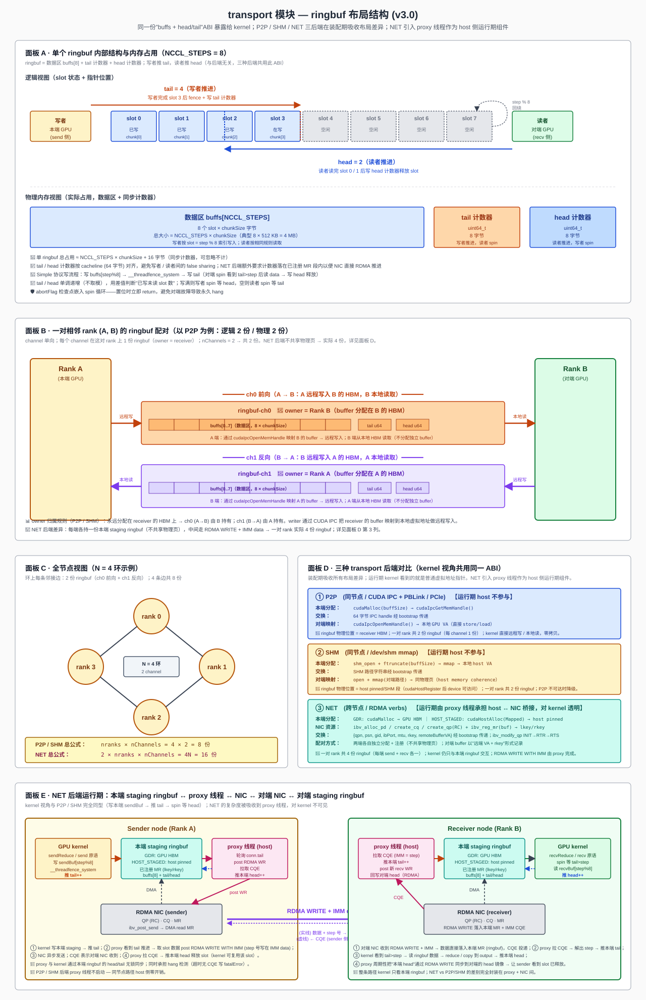

- **P2P**：`sendBuff` 在本端 GPU 显存，对端通过 `cudaIpcOpenMemHandle` 映射后直接 `load`，零拷贝。
- **SHM**：`sendBuff` 在 `/dev/shm`，双方 `mmap` 同物理页，通过 host memory coherence 协议同步。
- **NET**：每端各持一份本端 staging ringbuf（**不再共享物理页**，两端各自独立分配 + 注册）；中间通过 RDMA WRITE 把"本端 ringbuf 中 step%8 的 slot"复制到对端对应 slot 的 VA，并以 IMM data 携带 step 号让对端 proxy 更新 tail。GDR 模式下两端 ringbuf 均落 GPU HBM；HOST_STAGED 模式下落 host pinned，运行期 GPU↔NIC 经由本端 host pinned 中转，多一次 PCIe DMA。
- `head` / `tail` 计数器同样在 P2P / SHM / NET 注册 MR 段中，分配方式与 buffer 一致。

只服务 Simple 协议，每 channel 一份 buffer 足够（LL/LL128 才需额外的 flag buffer）。**三种**后端通过同一 ABI（`buffs + head/tail` 指针对）暴露给 kernel，布局差异在装配期吸收；运行期 kernel 拿到的就是普通虚拟地址指针，store/load 直接走硬件路径。**P2P / SHM 不需要 host 辅助线程；NET 后端需要 proxy 线程把"本端 ringbuf 字节"翻译成"RDMA WR"**，这部分逻辑封装在 §6.2.7，对 kernel 不可见。

#### 6.2.5 enqueue 模块

**模块作用**：用户视角的"一次 API 调用"必须翻译成 GPU 视角的"一次 kernel 提交"——enqueue 是这个翻译器：填好工作描述符并 `cudaLaunchKernel`，**入队即返回**，完成由 stream 异步保证。

**模块定位**：enqueue 是运行期 host 侧的实现入口。每次用户调 `ncclAllReduce`，都进入这个模块，按固定四步执行：参数校验 → 查档位表得到 `(nChannels, nThreads)` 并派生 chunkSize → 填工作描述符 → 调 `cudaLaunchKernel`。本模块不做任何运行时决策、不做 host 侧通信、不做内存分配——这些工作都已在装配期完成。

**输入与输出**：

| 项 | 内容 |
|---|---|
| 输入 | 用户参数 `(sendbuff, recvbuff, count, dtype, op, comm, stream)` + 装配期已写好的 `comm->channels[*]` 与档位表 |
| 输出 | kernel 已提交到 `stream`；同步返回 `ncclSuccess` |
| 失败模式 | 参数非法 → `ncclInvalidArgument`；`comm->state ≠ Active` → `ncclInvalidUsage` |

**单次调用按顺序执行**：

1. **参数校验**：`comm` 非空、`comm->state == Active`、`count > 0`、`sendbuff/recvbuff` 非空、`dtype/op` 在支持集合内、且 `(op, dtype)` 是合法组合（见 §6.2.6 支持矩阵——例如 `BitwiseAnd × f32` 非法）。失败立即返回 `ncclInvalidArgument`。
2. **`(nChannels, nThreads)` 查表**：装配期填好 `comm->maxThreads[algorithm][protocol]` 二维表与每档 nChannels 上限；运行期按 `count × sizeof(dtype)` 落档直接取出 `(nChannels, nThreads)`——本期 algorithm/protocol 固定为 `(Ring, Simple)`，等价于按消息字节数索引一维档位表（典型 4~6 档：`≤1KB / 1KB~64KB / 64KB~1MB / 1MB~16MB / >16MB`）。
3. **chunkSize 派生**：由公式 `chunkSize = buffSize / NCCL_STEPS × chunkSteps` 计算（`buffSize` 与 `chunkSteps` 均在装配期由协议 / 显存预算固定），再按 `nBytes / (nChannels × chunkSize) < 阈值` 做最多 3 轮 halve 微调；保证最后一个 chunk 不浪费且对齐到 `(nThreads − WARP_SIZE) × sizeof(uint64_t)`。
4. **填工作描述符**：把 `(sendbuff, recvbuff, count, chunkSize, nChannels, nThreads, ...)` 写入栈上的 `ncclWorkElem`，作为 kernel argument 传入（或经常驻 device buffer 中转）。
5. **launch kernel**：按 `(op, dtype)` 查 host 端静态 dispatch 表 `kernelTable[NUM_OPS][NUM_DTYPES]` 取得对应 kernel 符号 `ncclKernel_AllReduce_Ring_Simple_{Op}_{Dtype}`（dispatch 表由 device 模块的代码生成脚本在编译期一次性填好；非法组合处填 `nullptr`，正常情况下已在 step 1 被拒）。调 `cudaLaunchKernel(kern, grid={nChannels,1,1}, block={nThreads,1,1}, args, sharedMem, stream)`，绑定到用户传入的 `stream`。
6. **立即返回 `ncclSuccess`**：仅表示"入队成功"；完成语义由 stream 提供（`cudaStreamSynchronize` 后 `recvbuff` 可读）。

算法 + 协议固定为 Ring + Simple，无运行时选择；`(op, dtype)` 通过 dispatch 表选择对应 kernel 实例，本质仍是查表（无分支决策）。本期不支持 Group 聚合（多原语一次入队）、不支持 CUDA Graph capture。

**档位表形态示例**（仅说明结构，具体数值由详设阶段实测确定）：

| 消息字节数 | nChannels | nThreads |
|---|---|---|
| ≤ 1 KB | 1 | 256 |
| 1 KB ~ 64 KB | 1 | 256 |
| 64 KB ~ 1 MB | 2 | 256 |
| 1 MB ~ 16 MB | 2 | 512 |
| > 16 MB | 2 | 512 |

**异步性边界**：API 返回 ≠ 操作完成；完成可见性需要用户通过 stream 同步获得，与 CUDA stream 的标准语义对齐。

#### 6.2.6 device 模块

**模块作用**：算法的实际执行（GPU 间搬数据 + 元素累加 + 邻居同步）只能在 GPU 上完成——device 是整个库**唯一在 GPU 上跑的代码**，其它 5 个模块全部为它服务（提供资源 / 数据 / 参数）。

**模块定位**：device 是整个库唯一在 GPU 上运行的模块，其它模块都是 host C++ 代码。它实现 Ring AllReduce 的 GPU kernel，模板维度 `<Ring, Simple, Op, Dtype>`——算法 / 协议固定为 `(Ring, Simple)`，op 与 dtype 按下文支持矩阵分别产出独立 kernel 符号 `ncclKernel_AllReduce_Ring_Simple_{Op}_{Dtype}`（共约 68 个实例）。kernel 由 enqueue 模块 launch 之后，从 `ncclDevComm` 读取本 rank 的 ring 邻居、ringbuf 指针、`abortFlag` 指针，按 Ring 算法的 `2N-1` 步原语调用顺序推进，不需要 host 介入，直到处理完用户传入的整个张量。

**要做的工作**：
- **Grid / Block 映射**：每个 block 担当一个 channel，处理 `1/nChannels` 的数据；block 内多 thread 协作搬运 chunk 并做 reduce。
- **Reduce-Scatter 阶段（N-1 步）**：每 rank 把不同 chunk 沿环传递并累加，最终每 rank 持有"全和 chunk"中的某一份。
- **All-Gather 阶段（N-1 步）**：把"全和 chunk"沿环转一圈，让每 rank 都拿到完整的全和结果，写入用户的 `recvbuff`。
- **Simple 协议同步**：通过 ringbuf 的 head/tail 计数器与邻居 rank 做无锁推进；写完一片 → fence → 推 tail；读到 tail > step → 读数据 → 推 head 释放 slot。
- **abortFlag 检查**：每次 spin 等待 tail 推进时检查 `*abortFlag`，置位则立即 `return` 跳出（hang 逃生的关键挂钩点）。

**输入与输出**：

| 项 | 内容 |
|---|---|
| 输入 | `ncclWorkElem`（由 enqueue 填）+ `ncclDevComm`（由 init 拷到 GPU global memory，含 ring 邻居 / ringbuf 指针 / abortFlag 指针） |
| 输出 | 写入用户传入的 `recvbuff`；不向 host 返回任何值 |
| 完成语义 | kernel 退出 = 完成，通过 stream 顺序对调用方可见 |
| 中止条件 | `*abortFlag == 1` → 任何 spin 点立即 return（参见 §7.3） |

**Grid / Block 映射**：enqueue 端按 `grid.x = nChannels`、`block.x = nthreads`（典型 256 或 512）launch。每个 block 担当一个 channel，处理 `1/nChannels` 的数据；block 内多 thread 协作搬运 chunk 并做 reduce。

**单 channel 内执行流程**（对 `count` 元素的张量）：

> 图 6.2.6-1：Ring AllReduce 单 channel 内 `2N-1` 步原语流水示意——Reduce-Scatter（N-1 步）→ 转折步（写 output + 转发）→ All-Gather（N-1 步）


1. 取本 channel 的数据起点 `gridOffset = 0`，每轮处理 `loopSize = nChannels × nRanks × chunkSize` 元素。
2. 在每轮内，按 Ring 切成 `nRanks` 个 chunk，依次发起 `2N-1` 次原语调用，对应五种步骤类型——

| 阶段 | 步骤 | 原语 | 说明 |
|---|---|---|---|
| Reduce-Scatter | step 0 | `send` | 只发送本 rank 的初始 chunk，不接收 |
| Reduce-Scatter | step 1 ~ N-2 | `recvReduceSend` | 接收 + 累加到 ringbuf + 转发；**不写 output** |
| 转折 | step N-1 | `recvReduceCopySend` | 接收 + 最后一次累加 + 写 output + 转发 |
| All-Gather | step N ~ 2N-3 | `recvCopySend` | 接收 + 写 output + 转发 |
| All-Gather | step 2N-2 | `recv` | 只接收 + 写 output，**不再转发** |

3. 推进 `gridOffset += loopSize`，回到步骤 2，直到处理完所有元素。

**kernel 概念性步骤**（语言无关伪代码；每个 block 在一个 channel 上独立执行，省略偏移与 nelem 的细节计算）：

```
输入: rank, N (= nRanks), size, chunkSize, nChannels
派生: loopSize = nChannels × N × chunkSize

# 外层: 大张量分片处理
for gridOffset in 0, loopSize, 2*loopSize, ... while gridOffset < size:

    # === Reduce-Scatter: N-1 步 ===
    chunk = (rank - 1) mod N
    send(chunk)                          # step 0:    只发送本 rank 初始 chunk,不接收

    for j in 2 .. N-1:                   # step 1 ~ N-2
        chunk = (rank - j) mod N
        recvReduceSend(chunk)            #            收 + 累加 + 转发;数据停留在 ringbuf,不写 output

    # === 转折步: Reduce-Scatter 末步 + All-Gather 首步合并 ===
    chunk = rank                         # step N-1:  收 + 最后一次累加 → 此 chunk 已是全和 → 写 output + 同时转发
    recvReduceCopySend(chunk)

    # === All-Gather: N-1 步 ===
    for j in 1 .. N-2:                   # step N ~ 2N-3
        chunk = (rank - j) mod N
        recvCopySend(chunk)              #            收 + 写 output + 转发

    chunk = (rank + 1) mod N             # step 2N-2: 只收 + 写 output,不再转发
    recv(chunk)
```

> 完整 C++ 实现（含 `prims_simple` 模板展开、`ncclShmem` 共享内存布局、warp 级搬运优化、偏移与 nelem 的精确计算等）见详设。

**支持的 op × dtype 矩阵**：

device 模块对每个合法的 `(Op, Dtype)` 组合产出一个独立 kernel 实例。上面的"kernel 概念性步骤"伪代码**与 op / dtype 完全无关**——唯一差异是 `recvReduceSend / recvReduceCopySend` 原语内部 element-wise reduce 那一行的函子与累加器类型选择。

**归约操作**（reducer 函子，element-wise）：

| Op | 语义 | 适用 dtype | 备注 |
|---|---|---|---|
| `Sum` | `a + b` | 全部 | 默认 op |
| `Max` | `max(a, b)` | 整数 + 浮点 | |
| `Min` | `min(a, b)` | 整数 + 浮点 | |
| `Prod` | `a * b` | 整数 + 浮点 | 整数按 dtype 截断溢出，由用户负责语义 |
| `Avg` | Sum + 转折步后整体除以 `nranks` | 整数 + 浮点 | 实现 = Sum + `recvReduceCopySend` 末步前除法；`nranks` 从 `ncclDevComm` 读取；整数走整数除法（截断） |

**数据类型**（element 类型与累加器类型）：

| Dtype（API 暴露） | sizeof | element 类型（kernel 里的 C++ 类型） | 累加器类型 | 备注 |
|---|---|---|---|---|
| `int8` / `uint8` | 1 | `int8_t` / `uint8_t` | 同元素类型 | |
| `int32` / `uint32` | 4 | `int32_t` / `uint32_t` | 同元素类型 | |
| `int64` / `uint64` | 8 | `int64_t` / `uint64_t` | 同元素类型 | |
| `float16` | 2 | `__half` | **`float`（fp32）** | 精度较低，累加损失精度 |
| `bfloat16` | 2 | `__nv_bfloat16` | **`float`（fp32）** | 同上 |
| `float32` | 4 | `float` | `float` | |
| `float64` | 8 | `double` | `double` | |

> **fp16 / bf16 累加策略**：reduce 时将元素 promote 到 `float` 累加，写回 ringbuf 前再 cast 回原 dtype——若直接用 fp16 / bf16 累加，N=8、count=1M 的典型场景下精度会明显劣化。本期硬编码该策略，不向用户暴露选项。仅适用于浮点归约（Sum / Max / Min / Prod / Avg）；Bitwise* 操作不存在精度问题，按原 dtype 直接计算。

**合法组合矩阵**（✓ = 支持；— = 非法，`kernelTable` 对应位置为 `nullptr`）：

| Op \ Dtype | i8 | u8 | i32 | u32 | i64 | u64 | f16 | bf16 | f32 | f64 |
|---|---|---|---|---|---|---|---|---|---|---|
| `Sum` | ✓ | ✓ | ✓ | ✓ | ✓ | ✓ | ✓ | ✓ | ✓ | ✓ |
| `Max` | ✓ | ✓ | ✓ | ✓ | ✓ | ✓ | ✓ | ✓ | ✓ | ✓ |
| `Min` | ✓ | ✓ | ✓ | ✓ | ✓ | ✓ | ✓ | ✓ | ✓ | ✓ |
| `Prod` | ✓ | ✓ | ✓ | ✓ | ✓ | ✓ | ✓ | ✓ | ✓ | ✓ |
| `Avg` | ✓ | ✓ | ✓ | ✓ | ✓ | ✓ | ✓ | ✓ | ✓ | ✓ |

合法实例数 = `5 op × 10 dtype + 3 op × 6 dtype = 68` 个 kernel 符号。

**Simple 协议原语内部实现**：每次原语调用都展开为写者 / 读者通过 ringbuf 的 tail / head 计数器配对推进——写者推 tail 通知"数据已就绪"，读者推 head 释放 slot 供写者复用。

> 图 6.2.6-2：Simple 协议时序——写者写数据 → 内存屏障 → 推 tail；读者 spin 等 tail > step → 读数据 → 推 head 释放 slot；任何 spin 点都检查 abortFlag 以支持 hang 逃生

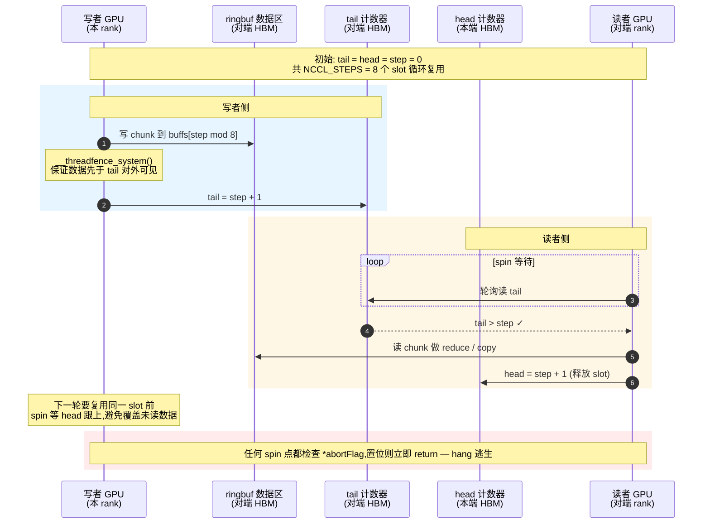

要点（与图对应）：
- **写入侧**：写数据到 `buffs[step % NCCL_STEPS]` → `__threadfence_system()` 保序 → 推 `tail` 通知对端。
- **读出侧**：在 `tail > step` 上 spin → 读 data → 推 `head` 释放 slot。
- **abortFlag 检查点**：每次 spin 迭代检查 `*abortFlag`，置位则立即 return，跳过剩余 chunk / 剩余 step——这是 hang 逃生的关键挂钩点（参见 §7.3）。

> 备注：本期只走"间接路径"——数据始终经本端 ringbuf 中转。不实现 Direct 路径（不通过 `ptrExchange` 拿到 peer output buffer 指针后直写），换得 transport 接口最小化。

#### 6.2.7 NET 后端运行期：proxy 线程

> **本节定位**：本节是 §6.2.4 transport 模块 NET 后端的"运行期延伸"——proxy 线程在架构上**隶属 transport 层**，独立成节仅为叙述方便（常驻线程语义、跨层挂钩 `abortFlag` / `fatalError`、伪代码篇幅）。**它不是与其它六个模块并列的第七个模块**：所有输入来自 transport 装配期产物，对外只服务 NET 后端的运行期数据搬运。可以类比：P2P 后端的"运行期那一半"是 GPU kernel 直接 `store/load` 远端 VA（由硬件隐式完成，无显式代码）；NET 后端因为 RDMA verbs 只能 host 调用，"运行期那一半"必须以 host 线程显式存在，这就是 proxy 线程。

**组件作用**：RDMA verbs 接口只能从 host 进程调用（`ibv_post_send` 等需 CPU 介入 + 用户态 → NIC doorbell），GPU kernel 无法直接生成 RDMA WR；同时跨节点链路上对端 GPU 显存映射不到本端 VA 空间——必须有一个 host 侧常驻线程把"GPU kernel 写进本端 staging ringbuf 的字节"翻译成"对对端的 RDMA WRITE"。这就是 proxy 线程的全部职责。

**组件定位**：proxy 是 transport 层 NET 后端的"运行期 host 侧执行体"，与 device kernel **逻辑并行**：kernel 在 GPU 上推进 Ring 算法步骤，proxy 在 host 上推进 RDMA 步骤；二者通过本端 ringbuf 的 `tail` / `head` 计数器无锁握手。其它 transport 后端（P2P / SHM）下 proxy 线程**根本不启动**——单机部署中 host 侧零开销。

**职责边界（明确不做的事）**：
- 不参与算法决策：算法 / 协议 / 档位仍由 graph + enqueue 在装配期 / 入队时定好。
- 不接触 device kernel 的算术（reduce 由 kernel 完成）；只搬运字节。
- 不替代 enqueue：enqueue 仍负责 launch kernel；proxy 与 enqueue 不互相调用。
- 不修改 `ncclDevComm`：装配期由 transport 写好后 proxy 只读其中与 NET ringbuf 相关的字段（实际通过 host 端 `peers[].netConn` 直接访问，HBM 镜像里也无 proxy 私有字段）。
- 不暴露独立 API：调用方只通过 transport / comm 间接驱动它，不存在 "proxy.xxx()" 形式的对外接口。

**输入与输出**：

| 项 | 内容 |
|---|---|
| 输入（来自 transport 装配期）| 每个 NET peer 的 `netConn = { qp, cq, mr, lkey, sendBuf, recvBuf, tail, head, remoteAddr, remoteRkey }` + `comm->abortFlag` + `comm->fatalError` |
| 输出 | RDMA WRITE / SEND WR；对端 ringbuf 数据 + tail；本端 head 推进；hang 时写 `comm->fatalError` |
| 失败模式 | CQE 报错（`IBV_WC_*_ERR`）/ 长时间无 CQE → 设 `fatalError = ncclRemoteError` / `ncclSystemError` 后退出循环 |

**线程模型与启动时机**：
- 在 §6.2.1 `commInit` 的 `ProxyStarting` 阶段启动；启动前会扫描 `comm->channels[*].peers[*]`，若不存在 NET 类型 peer 则**直接跳过整个 proxy 模块**。
- 每个 comm 一个线程即可（不按 channel × peer 拆线程，避免 N×M 个线程的调度开销）；线程内对所有 NET peer 用单 epoll 风格轮询：先扫所有本端 `tail` 看有无 chunk 可发，再 `ibv_poll_cq` 批量收 CQE。
- 线程使用 `pthread_create`；优先级与 nice 值保持默认（避免抢占用户训练线程）。
- `commDestroy` / `commAbort` 通过设 `stopFlag` 让线程退出，主线程 `pthread_join` 等其结束后才释放 QP / MR / PD。

**运行期主循环（伪代码）**：

```
proxyThreadMain(comm):
  while not comm.abortFlag and not stopFlag:
    progressMade = false

    # 1. send 方向: 扫所有本端 NET sendBuf, 把已 ready 的 chunk post 出去
    for each channel c, for each NET peer p in c:
      conn = comm.channels[c].peers[p].netConn
      while conn.localTail > conn.lastPostedTail:
        step = conn.lastPostedTail
        slotOffset = (step mod NCCL_STEPS) * chunkSize
        wr = ibv_send_wr{
          opcode  = IBV_WR_RDMA_WRITE_WITH_IMM,
          sg_list = { addr=conn.sendBuf + slotOffset, length=chunkSize, lkey=conn.lkey },
          imm_data = step,                                # 让对端推 tail
          wr.rdma.remote_addr = conn.remoteAddr + slotOffset,
          wr.rdma.rkey        = conn.remoteRkey,
          send_flags = IBV_SEND_SIGNALED if (step % SIGNAL_INTERVAL == 0) else 0
        }
        ibv_post_send(conn.qp, wr)
        conn.lastPostedTail += 1
        progressMade = true

    # 2. recv 方向: 拉 CQE -> 推 receiver tail / 释放 sender slot
    while (wc = ibv_poll_cq(conn.cq)) > 0:
      if wc.status != IBV_WC_SUCCESS:
        comm.fatalError = ncclRemoteError
        return
      if wc.opcode == IBV_WC_RECV_RDMA_WITH_IMM:
        # 对端写到了我们的 recvBuf, 推 tail 让本端 kernel 看到
        atomic_store(conn.tail, wc.imm_data + 1)
        ibv_post_recv(conn.qp, prebuiltRecvWr)            # 续上接收 WR
      else if wc.opcode == IBV_WC_RDMA_WRITE:
        # 自己发出去的 WR 完成, 推 sender head 释放 slot
        atomic_add(conn.head, 1)
      progressMade = true

    # 3. hang 检测
    if not progressMade:
      idleStart = idleStart or now()
      if now() - idleStart > HANG_TIMEOUT and comm.fatalError == ncclSuccess:
        comm.fatalError = ncclRemoteError                 # 长时间无进展, 设错让上层看到
        return
    else:
      idleStart = null

    # 4. 让出 CPU (短让步即可, 不睡死, 不与 GPU spin 形成长尾)
    sched_yield()
```

要点：
- **Signal 抑制**：`IBV_SEND_SIGNALED` 只在每 `SIGNAL_INTERVAL` 步打一次，减少 CQE 数量；最后一个 chunk 总打 signaled 保证 head 推进。
- **预 post receive**：装配期预先 post `NCCL_STEPS` 个 recv WR；每收到一个 CQE 立刻 `ibv_post_recv` 续上，保证对端 WRITE 永远有 receive slot 可用。
- **零拷贝**：sendBuf / recvBuf 都已注册 MR；NIC 直接 DMA 读 / 写，proxy 线程只 post + poll，**不做 memcpy**。
- **abortFlag 检查点**：每次主循环开头检查 `*abortFlag` 与 `stopFlag`，置位则立即 break。与 kernel 共用同一 flag——`commAbort` 一次置位，两者同时退出。
- **错误传播**：proxy 是 §6.2.1 错误传播链路在 NET 路径上的"检测者"——CQE 报错或连续 `HANG_TIMEOUT`（默认 10s，可由环境变量覆盖）无进展即写 `comm->fatalError`，上层通过 `commGetAsyncError` 看到后调 `commAbort` 终结整个 comm。

**生命周期**：

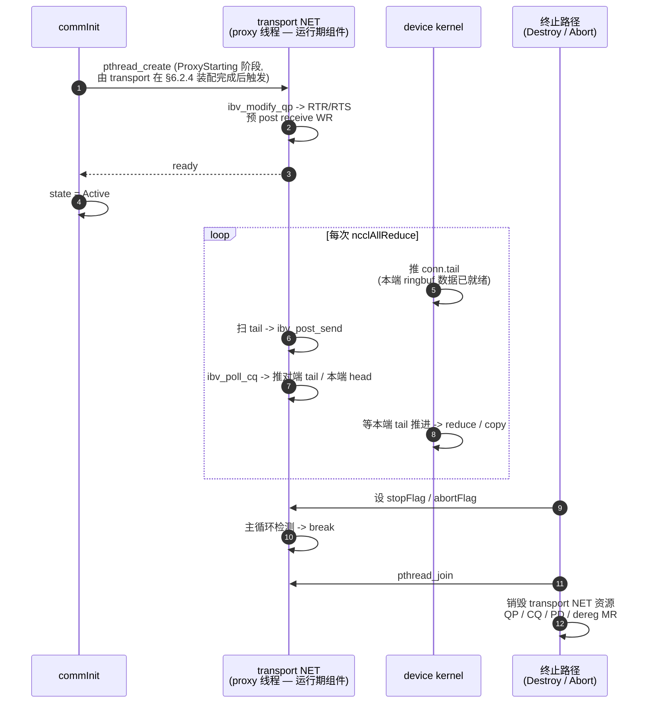

**与 §6.2.4 transport / §6.2.6 device 的协同**：proxy 完全在 transport NET 后端的资源域内运行——所用的 QP / CQ / MR / ringbuf 都由 §6.2.4 装配期分配，proxy 只是把这些资源"驱动起来"。kernel 与 proxy 通过本端 ringbuf 的 `head / tail` 形成两组单向写 / 单向读关系——
- send 方向：**kernel 是写者**（写 sendBuf 数据、推 tail）；**proxy 是读者**（读 sendBuf 字节、post WR、CQE 完成后推 head 释放 slot）。
- recv 方向：**proxy 是写者**（CQE 收到对端 IMM 后推 tail，标记 recvBuf 已就绪）；**kernel 是读者**（从 recvBuf reduce / copy 后推 head 通知 proxy 槽位可复用，proxy 据此续 post recv WR）。
- 上述 `head / tail` 计数器由 transport 装配期统一分配到已注册 MR 段，让 kernel 与 proxy 都能用普通 load / store 访问；NIC 也能直接 RDMA 推进对端 tail。**Simple 协议规则不变**，仅"对端"在 NET 路径下变成了"本端 proxy + RDMA 链路"的组合体——这一抽象在 device kernel 视角完全透明（kernel 不知道也不关心对端是 GPU 还是 NIC）。

---

## 7. 关键流程

### 7.1 流程一：Communicator 初始化

> 图 7-1：init 时序（概念级）

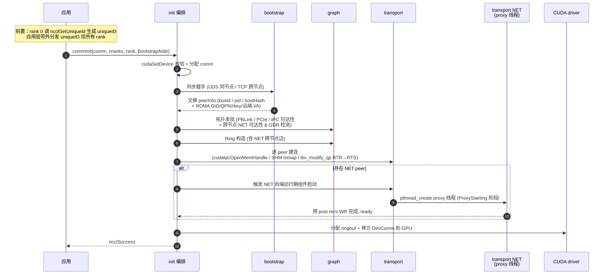

**关键决策**：同步握手是显式全局屏障；所有 rank 必须几乎同时调 `commInit`，否则会卡在握手上。NET 后端的 proxy 线程在装配末尾启动，避免装配中途线程提前看到不完整状态。

### 7.2 流程二：AllReduce 热路径

> 图 7-2：单次 AllReduce 端到端

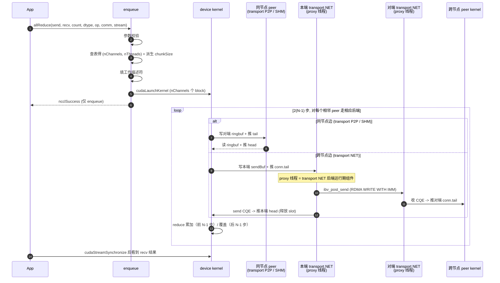

**关键决策**：
- 入队即返回：`ncclSuccess` 只表示"调度成功"，不代表运算已完成；完成由 CUDA stream 顺序提供。
- GPU 内核 launch 后即在 device 上自主运行，依靠 ringbuf 的 head/tail 计数器与 peer 同步；**同节点路径 host 端不参与**，只需 `cudaStreamSynchronize` 等结果。
- NET 路径：kernel 仍只与本端 ringbuf 交互；**transport NET 后端的 proxy 线程在 host 侧并行推进 RDMA 步骤**，两端 proxy 之间通过 NIC 把数据 + IMM-tail 推送过去。kernel 视角依然是"写本端 sendBuf → 推 tail → spin 等 head 推进释放 slot"，与 P2P / SHM 完全同型——NET 的复杂度被吸收到 transport NET 后端的运行期组件里，没有向上层泄漏。

### 7.3 流程三：异常退出

> 图 7-3：abortFlag / fatalError 两阶段（保留）

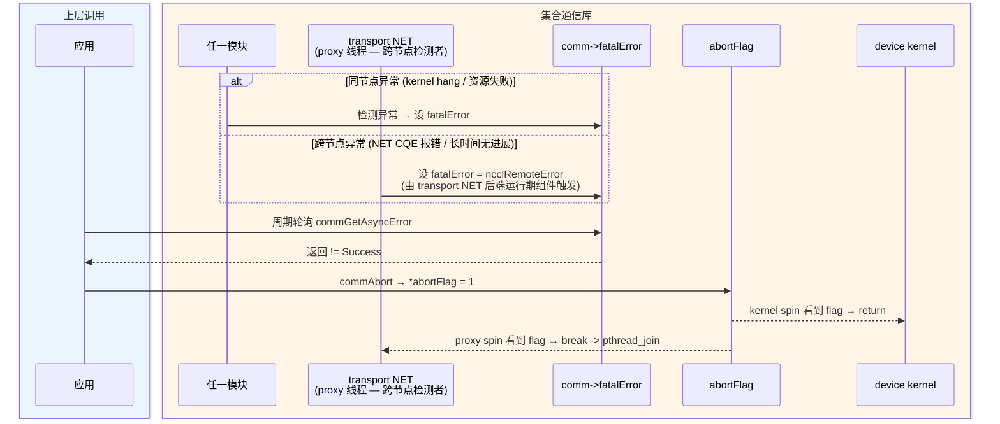

---

## 8. 后续 TODO

### 8.1 单节点

| 项 | 描述 | 主要触及模块 | 优先级 |
|---|---|---|---|
| **核函数内同步屏障** | 支持不同rank执行的核函数内同步会和 | device | P0 |
| **group 语义操作** | 支持 `ncclGroupStart` / `ncclGroupEnd` 把多个集合通信原语聚合为一次入队、一次 kernel launch，减少调度开销，也避免多 comm 之间的死锁 | enqueue / device | P0 |
| **stream 支持增强** | CUDA Graph capture（让整个 AllReduce 可被 capture 进图）、multi-stream 并发、stream priority 透传 | enqueue | P0 |
| **tree 算法** | 实现 Tree AllReduce 用于**小消息低延迟**场景；enqueue 按消息大小档位在 Ring / Tree 间切换；落地在 graph 层（新增 tree builder）与 device 层（新增 kernel 模板） | graph（新增 tree builder）/ device / enqueue | P1 |
| **LL / LL128 协议** | 低延迟传输协议，针对小消息优化（数据 + flag 同一 cache line）；与 Simple 协议并列，按消息大小切换 | transport / device | P2 |
| **自动 nChannels 计算** | 装配期按拓扑 / 算法 / 消息特征自动选 nChannels，去掉当前的手动配置（见 §6.2.3 step 4 备注 1） | graph / enqueue | P2 |

### 8.2 跨节点 + 完整集合通信

| 项 | 描述 | 主要触及模块 | 优先级 |
|---|---|---|---|
| **多 RDMA HCA / 多端口聚合** | 单节点存在多张 NIC / 多端口时，按 channel 维度做 round-robin 分发，提升跨节点带宽利用率；graph 代价模型扩展 (HCA, port) → 边代价 | graph / transport / proxy | P0 |
| **RoCE / IB 兼容性增强** | MTU 自适应、Path MTU Discovery、PFC / DCQCN 不同链路层配置容错；GID 索引自动选择（IPv4 vs IPv6 RoCE） | transport | P1 |
| **LL / LL128 协议** | 低延迟传输协议，针对小消息优化（数据 + flag 同一 cache line）；与 Simple 协议并列，按消息大小切换；NET 路径上配合 inline send 进一步降低延迟 | transport / device / proxy | P1 |
| **Tree 算法（含跨节点 Tree）** | 实现 Tree AllReduce 用于**小消息低延迟**与跨节点 fan-in / fan-out；graph 新增 tree builder，可在节点内 / 节点间分层 | graph / device / enqueue | P1 |
| **其他集合通信** | broadcast / reduce / all-gather / reduce-scatter / all-to-all / gather / scatter；其中 reduce-scatter / all-gather 是 AllReduce 的两半，复用率最高 | device / enqueue / public-api | P2 |
| **点对点通信** | `ncclSend` / `ncclRecv` 原语；不走 Ring 算法，直接走 transport 链路（同节点 P2P / 跨节点 NET）；用于流水并行 (pipeline parallelism) 等场景 | device / enqueue / proxy / public-api | P2 |
| **NET 后端的 zero-copy direct 路径** | kernel 通过 `ptrExchange` 拿到对端 buffer 的 GPU VA（仅 GDR + 同 PCIe switch 场景）直接写，让 chunk 不再绕本端 staging ringbuf；适用于超低延迟小消息 | transport / device | P3 |

---

## 附录

### 公开 ABI

```c
// 生命周期 (4)
// 启动流程:
//   ① rank 0 调 ncclGetUniqueId 生成 uniqueID
//      (含约定 BootstrapAddr: 同节点为 UDS 路径如 "/tmp/nccl-uid.sock";
//                              跨节点为 "host:port")
//   ② 应用层通过 MPI / 文件 / 环境变量带外分发 uniqueID 给所有 rank
//   ③ 各 rank 从 uniqueID 解析出 BootstrapAddr,传给 ncclCommInit
// BootstrapAddr: 多进程场景所有 rank 必须传同一地址 (UDS 路径或 host:port,
//                 用于交换 peerInfo + IPC handle / RDMA QP 参数);
//                 单进程多 GPU 场景可传 NULL。
// NET 后端对用户透明: ABI 与同节点完全一致, 库内根据 hostHash 与 graph 代价
//                    自动给跨节点边贴 NET 标签,proxy 线程自动启动。
ncclResult_t ncclGetUniqueId(ncclUniqueId *out);
ncclResult_t ncclCommInit(ncclComm_t* comm, int nranks, int rank,
                          const char* BootstrapAddr);
ncclResult_t ncclCommDestroy(ncclComm_t comm);
ncclResult_t ncclCommAbort(ncclComm_t comm);

// 集合通信 (1)
// 支持的 op:    Sum / Max / Min / Prod / Avg / BitwiseAnd / BitwiseOr / BitwiseXor
// 支持的 dtype: int8 / uint8 / int32 / uint32 / int64 / uint64 /
//               float16 / bfloat16 / float32 / float64
// 合法 (op, dtype) 组合矩阵见 §6.2.6;非法组合(如 BitwiseAnd × f32)返回 ncclInvalidArgument。
// fp16 / bf16 浮点归约默认采用 fp32 累加策略,不向用户暴露选项。
ncclResult_t ncclAllReduce(const void* sendbuff, void* recvbuff,
                           size_t count, ncclDataType_t dtype,
                           ncclRedOp_t op, ncclComm_t comm,
                           cudaStream_t stream);

// 查询 (5)
// 注: ncclCommGetAsyncError 也会返回 proxy 线程检测到的 NET 异常
//     (ncclRemoteError / ncclSystemError), 上层应用据此调 ncclCommAbort。
ncclResult_t ncclCommCount(ncclComm_t comm, int* count);
ncclResult_t ncclCommUserRank(ncclComm_t comm, int* rank);
ncclResult_t ncclCommGetAsyncError(ncclComm_t comm, ncclResult_t* err);
const char*  ncclGetErrorString(ncclResult_t result);
ncclResult_t ncclGetVersion(int* version);
```
