# 《NCCL 2.10.3-1》详细设计文档

> 作者：<待填>　|　评审版本：v0.1　|　最后更新：2026-05-09
> 代码基线：commit `7e515921295a`（branch `2.10.3-1`，2021-07-08）
> 仓库根：`C:\workspace\nccl\.claude\worktrees\condescending-sinoussi-4e1b2b`

---

## 1. 背景与目标

### 1.1 背景

**NCCL（NVIDIA Collective Communications Library）** 是 NVIDIA 提供的多 GPU、多节点集合通信库，为深度学习训练与推理框架（PyTorch DDP、Megatron-LM、DeepSpeed、TensorFlow Horovod、MXNet 等）提供高性能的集合通信原语：

- **集合通信**：`AllReduce` / `AllGather` / `ReduceScatter` / `Broadcast` / `Reduce`
- **点对点**：`Send` / `Recv`
- **聚合语义**：`GroupStart` / `GroupEnd`

NCCL 在单机内利用 **NVLink / NVSwitch / PCIe / CUDA IPC / 共享内存** 等本地互连,跨机利用 **InfiniBand verbs / RoCE / TCP socket / CollNet(SHARP)** 等网络后端,**屏蔽硬件差异**对上层暴露统一的 C ABI。深度学习训练对 NCCL 的关键诉求是:

1. **充分利用硬件带宽**:NVLink-3 单链 ~25 GB/s、IB HDR 单端口 ~25 GB/s,要求软件层能做到 ≥ 95% 理论带宽。
2. **小消息低延迟**:tensor parallel / pipeline parallel 中有大量 < 1 MB 的同步,延迟敏感(目标 P99 < 10 µs intra-node)。
3. **拓扑感知**:同样 8 GPU,DGX-A100 cubemesh 与 PCIe-only 节点最优算法/路径完全不同,需要运行时自适应。
4. **多框架可移植**:同一份 `.so` 同时被 PyTorch/TensorFlow/Horovod 调用,ABI 必须极简且稳定。

NCCL 的核心设计回应这四点诉求,形成几个贯穿全代码的关键抽象:

- **Communicator(`ncclComm`)**:把通信调度全部前置到装配阶段(拓扑发现、tree/ring 搜索、algo×proto 代价建模、传输连接),稳态运行时只做"翻译参数 + 投递",GPU 热路径无 host 决策开销。
- **三层执行单元(Channel × Algorithm × Protocol)**:`MAXCHANNELS=32` 个并行通道 × Tree/Ring/CollNet 三种算法 × Simple/LL/LL128 三种协议,共 9 种 (algo,proto) 组合外加多 channel,由代价模型选最优。
- **vtable 多态的 transport 层**:P2P / SHM / NET / CollNet 用统一的 `ncclTransportComm` 接口,新增网络后端走 `ext-net/*.so` 插件,不动 core。
- **设备-代理对称的 ringbuf 协议**:GPU kernel 与 host proxy 线程通过共享的 `head/tail` 计数器自治推进,调度器一次性投递后退出,稳态无中央协调点。
- **C ABI 极简表面**:21 个公开符号(详见 §6.2),全部通过 `__attribute__((visibility("default")))` 显式导出,其余符号默认 hidden。

本文档以 `2.10.3-1` 代码基线(commit `7e515921295a`)为读图,**完整描述 NCCL 项目的设计**;§10.3 附录列出该版本相对前序的增量,但**主体内容不局限于该版本的新增特性**。

### 1.2 设计目标

NCCL 作为一个长期演进的开源项目,核心设计目标可归纳为:

| 编号 | 目标 | 落地方式 |
|---|---|---|
| **G1** | **高带宽**:达到接近硬件理论上限的吞吐 | tree/ring 算法搜索 + LL/LL128/Simple 三协议自适应 + NVLink/IB GDR 零拷贝路径 |
| **G2** | **低延迟**:小消息延迟达到硬件 RTT 量级 | LL 协议(4B 数据 + 4B flag 交错,免一次 fence)+ NCCL_STEPS=8 流水掩盖 RTT |
| **G3** | **拓扑感知**:对同构 / 异构 / 容器 / 跨节点拓扑自适应 | 从 `/sys` + nvml + ibv 扫描成 `ncclTopoSystem`,XML 中间表示支持手动注入 `NCCL_TOPO_FILE` |
| **G4** | **算法自动选择**:运行时按消息大小、拓扑、硬件代特性挑最优 (algo × proto) | `ncclTopoTuneModel` 在装配期生成代价表,enqueue 时 O(9) 查找 |
| **G5** | **多后端可扩展**:同一上层代码支持 NVLink/IPC/SHM/Socket/IB/CollNet/插件 | `ncclTransport` vtable + `ncclTransports[3]` 注册表 + `ext-net/*` 插件 ABI |
| **G6** | **C ABI 极简**:对所有 DL 框架暴露同一稳定接口 | `NCCL_API` 宏 + symbol visibility + PMPI 风格弱别名 |
| **G7** | **零热路径决策**:稳态调用 µs 级开销,带宽不被软件吃掉 | 所有重决策前置到 `ncclCommInitRank`;运行时只查表 + 投递 |
| **G8** | **失败可逃生**:不可恢复但可放弃 | `abortFlag` + `ncclCommAbort` + `GetAsyncError` 轮询 |
| **G9** | **可观测**:有结构化日志、tracing、拓扑/算法图导出 | `NCCL_DEBUG=WARN/INFO/TRACE` + `NCCL_TOPO/GRAPH_DUMP_FILE` + NVTX range |

### 1.3 非目标（out-of-scope / non-goals）

NCCL 在设计上**显式不做**以下事情,这些是理解其架构边界的关键:

- **不做 GPU 错误的细粒度可恢复语义**:发生 fatal error 后整个 communicator 失效,只能 `ncclCommAbort` 整体放弃,不支持单 rank 容错。
- **不支持 communicator 动态拆分(2.10.3 时代)**:rank 集合在创建时确定,生命周期内不变。`ncclCommSplit` 是 2.18+ 的后续工作。
- **不做跨进程动态拓扑**:不支持运行时加入/退出 rank。
- **不暴露非阻塞集合通信变体**(如 `ncclIallReduce`):完成语义统一由 CUDA stream 提供,不复用 MPI 的 Request 模型。
- **不内建鉴权 / 加密**:假设所有 rank 在受控网络平面内;TLS / IPSec 由部署侧负责。
- **不做 collective ↔ p2p 的统一调度**:collective 与 send/recv 走两套独立的 channel(`nChannels` / `p2pnChannels`),互不干扰。
- **不实现高级集合原语**:`AllToAll`、`Scatter`、`Gather` 由上层框架用 `Send/Recv` × Group 组合,2.10.3 不提供原生原语。
- **不暴露 GPU 内部计算 kernel**:`reduce_kernel.h` 等只对通信路径开放,不作为通用 reduction 库。

---

## 2. 需求分析

### 2.1 功能性需求

| ID | 需求 | 说明 / 用例 |
|---|---|---|
| F1 | 通信器（communicator）创建 | `ncclCommInitRank` / `ncclCommInitAll`；多进程多线程下用 `ncclUniqueId` 互联；`ncclCommDestroy` 优雅释放、`ncclCommAbort` 强制放弃 |
| F2 | 集合通信原语 | `ncclAllReduce` / `ncclAllGather` / `ncclReduceScatter` / `ncclBroadcast`（含 deprecated `ncclBcast`）/ `ncclReduce` |
| F3 | 点对点原语 | `ncclSend` / `ncclRecv`（必须包在 `ncclGroupStart/End` 中以避免阻塞死锁） |
| F4 | Group 语义 | `ncclGroupStart/End` 聚合多个集合通信调用以减少 launch 与同步开销，同时支持非阻塞 send/recv 进度推进 |
| F5 | Reduction op | `ncclSum` / `ncclProd` / `ncclMax` / `ncclMin` / `ncclAvg` |
| F6 | 数据类型 | `int8/uint8/int32/uint32/int64/uint64/float16/float32/float64` / `bfloat16`(CUDART≥11000) |
| F7 | 算法 | `Tree` / `Ring` / `CollNet`，由 `tuning.cc` 在 `ncclTopoTuneModel` 自动选择，环境变量 `NCCL_ALGO` 覆盖 |
| F8 | 协议 | `Simple` / `LL`（low-latency 8B flag）/ `LL128`（128B 行 + 8B flag），由 chunk 大小与硬件能力选择，`NCCL_PROTO` 覆盖 |
| F9 | 网络后端 | InfiniBand verbs、CPU socket、CollNet 插件、SHM、P2P（NVLink/PCI）、网络插件加载 |
| F10 | 网络后端选择 | `NCCL_NET=ib\|socket\|<plugin>` 强制选择，否则按可用性打分排序 |
| F11 | IB 多 QP | 单 NCCL 连接可拆分到 N 个 QP（`NCCL_IB_QPS_PER_CONNECTION=N`，默认 1） |
| F12 | 异步错误 | `ncclCommGetAsyncError` 让上层框架轮询 communicator fatal/abort 状态 |
| F13 | CUDA Graph 捕获 | 通过 `ncclQueueInfo` 记录捕获时的 enqueue 计划，回放时重建 work fifo |
| F14 | 拓扑导入/导出 | `NCCL_TOPO_FILE` 注入，`NCCL_TOPO_DUMP_FILE` / `NCCL_GRAPH_DUMP_FILE` 导出（用于 WSL/容器环境调试） |

### 2.2 非功能性需求

| 维度 | 目标 | 说明 |
|---|---|---|
| **吞吐**：ring AllReduce 大消息 | ≥ 95% 单链路理论带宽 | A100 NVLink-3 单环 ~250 GB/s 实测 ≥ 240 GB/s（厂商指标） |
| **延迟**：8 B AllReduce intra-node | < 10 µs (LL 协议) | LL kernel + 单次 NVLink store/load |
| **延迟**：8 B AllReduce inter-node | < 30 µs (LL 协议) | 带 IB 单跳 |
| **规模** | 单 communicator 最多 ≥ 10k ranks *(待确认上限)* | `MAXCHANNELS=32`、IB QP 数限制下需评估 |
| **可用性** | 进程内任一 rank 异常 → 整个 comm 失效 | 通过 `abortFlag` 与 `fatalError` 传播；不支持单 rank 容错 |
| **一致性** | 集合通信 happens-before 保证 | `ncclGroupEnd` 仅保证已 enqueue 到 stream，操作完成由 `cudaStreamSynchronize` 保证 |
| **安全/合规** | 无网络鉴权层（信任进程内网络） | 部署上要求所有 rank 在受控网络平面内 |
| **可观测** | 环境变量 `NCCL_DEBUG=VERSION/WARN/INFO/TRACE`；NVTX range；`NCCL_TOPO_DUMP_FILE`、`NCCL_GRAPH_DUMP_FILE` | `src/debug.cc` + NVTX 入口 |
| **可扩展** | 网络后端通过 `ext-net/<plugin>` 动态加载 | 见 `dummy/plugin.c` SDK |
| **构建依赖** | CUDA ≥ 10.2；可选 `libibverbs`、`libnvidia-ml`、`libgdrapi`（dlopen） | `src/misc/{ibvwrap,nvmlwrap,gdrwrap}.cc` |

---

## 3. 整体架构

> 图 3-1：NCCL 2.10.3 整体架构

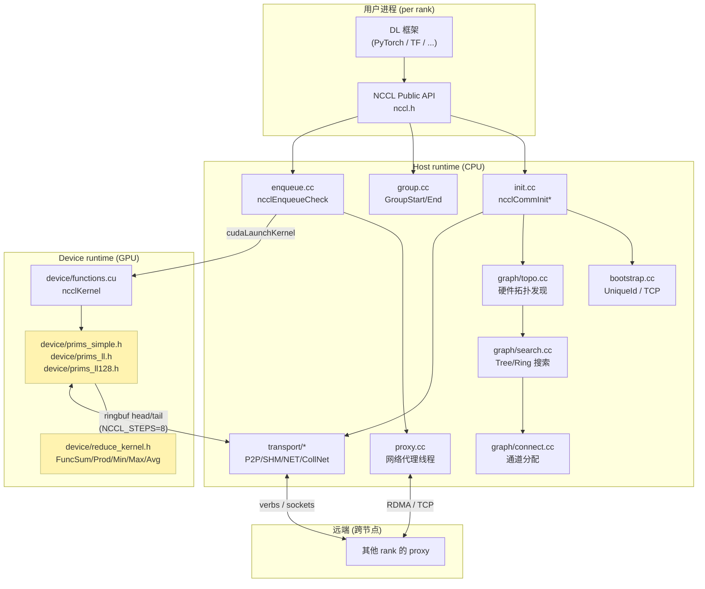

### 3.1 关键设计点

- **Host / Device 分层**：Host 端做 communicator 装配（拓扑发现、ring/tree 搜索、连接建立），Device 端做实际通信。所有跨 rank 调度信息固化在 `ncclDevComm` 中由 GPU kernel 直接读取。
- **装配前置、热路径精简**：所有"重决策"（拓扑发现、tree/ring 搜索、algo×proto 代价建模、传输连接、CPU 亲和性）都在 `ncclCommInitRank` 一次性完成；稳态运行时的 enqueue 只做"翻译参数 + 投递",不做任何 host 决策（见 §4.6）。**推论**：装配几十 ms~几秒，但创建后单次调用 ~µs 级开销；因此 communicator 必须长生命周期复用，禁止每次 iteration 重建。
- **调度器对称投递双下游、不参与稳态同步**：`ncclEnqueueCheck` 同时把同一份 work 投给两路下游 —— GPU 端通过 `cudaLaunchKernel` 写 `channel->workFifo`，host 端通过 `ncclProxyStart` 把 `ncclProxyArgs` 链接到 proxy 线程队列。两路之间**没有锁、没有事件**，全靠 `ncclConnInfo.head/tail` 上的环形缓冲协议自治推进（见 §4.5.7 + §4.6.8）。**这是 NCCL 性能与简洁性同时成立的关键**：device 与 proxy 是对等的生产者/消费者，调度器一次性"分发完任务就退出"，热路径没有任何中央协调点。
- **三层执行单元**：
  - **Channel**（`MAXCHANNELS=32`）：一个并行的逻辑通信带，每个 channel 在 GPU 上对应一个 thread block。`nChannels` 是集合通信带数，`p2pnChannels` 单独服务 send/recv，互不干扰（[devcomm.h:188](src/include/devcomm.h)）。
  - **Algorithm × Protocol** 矩阵：Tree/Ring/CollNet × Simple/LL/LL128，9 种组合，由 `tuning.cc` 的 `latencies/bandwidths` 表加 chunk size 决策（[tuning.cc:55](src/graph/tuning.cc)）。
  - **NCCL_STEPS=8**：每个 channel 上的环形缓冲区分 8 个 step，head/tail 计数器跨越 host/device 同步。
- **Proxy 线程**：每个 communicator 有一个 `pthread proxyThread`，负责在 host 侧驱动网络发送/接收（IB CQ poll、socket epoll），以避免 GPU kernel 阻塞在网络上。proxy 与 device kernel 通过 ringbuf head/tail 自治协调，互为生产者/消费者。
- **零拷贝路径优先**：NVLink → P2P 直接拷贝；同节点跨 numa → SHM；跨节点 → IB GPUDirect RDMA（需要 `gdrcopy` + nvidia-peermem）；其余 → host bounce buffer + socket。
- **vtable 多态贯穿 transport 与 proxy**：`ncclTransportComm` 是 setup/connect/free/proxy 四回调的 vtable；`ncclConnector` 持 vtable 指针实现 "运行时选后端"。proxy 线程通过 `op->progress = vtable->proxy` 在 `ncclProxyArgs` 上**再做一次多态**，让单一线程同时驱动 NET / CollNet 多后端而代码无分支（见 §4.5）。

> 图 3-2：分层视图（按目录社区）

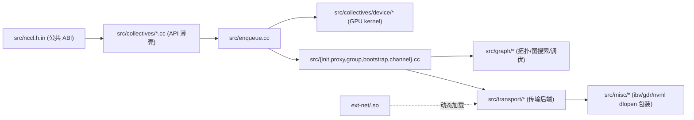

### 3.2 通信器（Communicator）设计哲学、生命周期与 API 使用模式

`ncclComm` 是 NCCL 对外暴露的核心抽象，几乎所有 API（21 个 `NCCL_API` 导出函数中的 19 个）都以它为第一公民。理解 communicator 的设计哲学是理解整个库的关键。

#### 3.2.1 设计哲学

> **核心定位**：`ncclComm` 是一个 (a) 重资源、(b) GPU-绑定、(c) 创建即不可变、(d) 失败即整体作废 的句柄。它把通信调度全部前置到装配阶段，让 GPU 的稳态执行路径上没有 host 决策开销；代价是 rank 集合不能动态变化，异常只能整体 abort + 重建。

与 MPI 通信器的对照：

| | NCCL `ncclComm` | MPI `MPI_Comm` |
|---|---|---|
| 抽象层级 | **GPU 集合通信句柄** | 进程组抽象 |
| 绑定资源 | **一 rank ↔ 一 GPU**（`cudaDev`）+ channel + ringbuf + proxy 线程 | 一 rank ↔ 一进程 |
| 完成语义 | **CUDA stream 排序**（enqueue 即返回） | MPI Request / 阻塞调用 |
| rank 不变性 | 创建后固定 | 同 |
| 拆分（split） | **2.10.3 不支持**（2.18+ 才有 `ncclCommSplit`） | `MPI_Comm_split` |
| 容错 | **整体失效**（任一 rank 死则整 comm 报废） | 同（MPI 标准也无可恢复语义） |

五条核心准则：

1. **一次性装配、长期使用**：创建涉及拓扑发现、Tree/Ring 搜索、传输连接、device channel 物化，单节点 8 GPU 典型耗时 10²ms 量级；跨机更慢。一旦完成，所有调度信息固化进 `ncclDevComm`，**GPU 热路径无 host 决策开销**。**推论：不要每个 iteration 重建 comm**。
2. **一 rank 一 GPU，绑定于线程的 CUDA 上下文**：`ncclCommInitRank` 内部 `cudaGetDevice(&cudaDev)` 抓当前线程的设备（[init.cc:951](src/init.cc)）。**推论：必须在 `InitRank` 之前 `cudaSetDevice(local_rank)`**，否则所有 rank 都绑到 device 0。
3. **入队即返回，完成靠 CUDA stream**：所有 collective/send/recv API 只写 `workFifo` + launch kernel 后立刻返回。`ncclSuccess` ≠ 操作完成；异步错误靠 `ncclCommGetAsyncError` 轮询。
4. **Bootstrap 临时用 TCP 起步**：IB 需要先有 PeerInfo 才能起，因此装配阶段不能用 IB。一个 root rank 监听 TCP，`ncclUniqueId`（128B）把它的地址散给所有 rank 即可。**推论：`ncclUniqueId` 是一次性凭证，带外分发（MPI_Bcast/Redis/file）即可**。
5. **失败用 Abort 不用 Destroy**：`Destroy` 会先 `cudaStreamSynchronize`，hang 时跟着 hang；`Abort` 立即设 `abortFlag=1`，GPU kernel 与 proxy 线程下一次 spin check 时退出。**推论：生产代码必须周期轮询 `GetAsyncError`，非 Success 立刻 `Abort`**。

#### 3.2.2 资源占用直观感受

一个 8-rank、跨 2 节点的 comm 在**每个 rank** 上典型持有：

- `ncclComm` host 结构（KB 级）
- `nChannels` × ringbuf：每个 channel 默认 ~4 MB × 3 协议 ≈ 12 MB；`nChannels` 通常 2-8 → 数十至上百 MB device 内存
- `peerInfo[nRanks]`（host，KB 级）
- 一条 `proxyThread`（pthread）
- 若干 IB QP / TCP socket
- bootstrap TCP socket（init 完成后仍保留，用于 abort 广播）

**所以 comm 是有成本的**：大规模训练中"按需创建子 comm"必须谨慎。

#### 3.2.3 生命周期五个阶段(概览)

> 图 3-3：communicator 生命周期总览（详细状态机见 §5.5,装配子阶段展开见 §5.4）

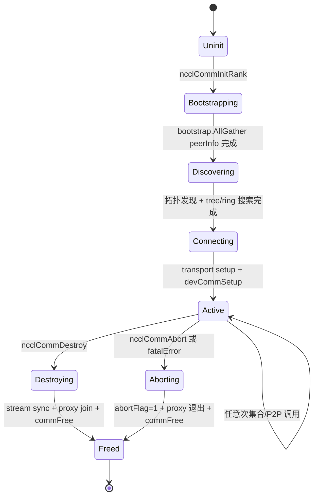

装配阶段一行式概览(详细的 7 阶段子状态、关键 API 调用、AllGather 时机见 **§5.4** 流程四):

`cudaGetDevice → commAlloc → initTransportsRank`(bootstrap → 拓扑 → 搜索 → 调优 → 通道 → 传输连接 → proxy 启动) `→ devCommSetup`(GPU 端镜像)

释放阶段的 `commPoison` 防误用机制详见 §5.5.4。

> 本节是 §3.2 设计哲学的最简概览;**生命周期的代码级展开请直接看 §5.1 / §5.4 / §5.5**,本节不再重复字段表与代码片段。

#### 3.2.4 主要 API 在生命周期上的位置

> 图 3-4：API ↔ 生命周期阶段映射

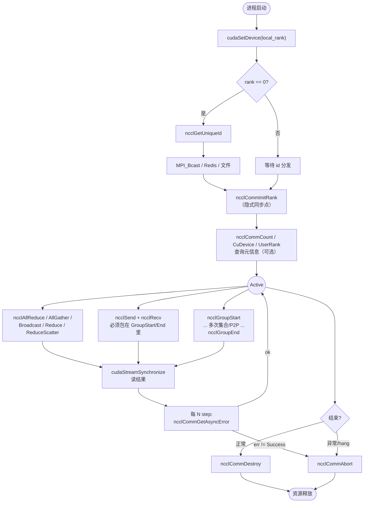

#### 3.2.5 五种典型使用模式

##### 模式 A：多进程多 GPU（MPI / torchrun，最常见）

```c
int rank       = atoi(getenv("RANK"));
int nranks     = atoi(getenv("WORLD_SIZE"));
int local_rank = atoi(getenv("LOCAL_RANK"));

cudaSetDevice(local_rank);              // ① 必须在 InitRank 之前

ncclUniqueId id;
if (rank == 0) ncclGetUniqueId(&id);     // ② 只有 rank 0 生成
MPI_Bcast(&id, sizeof(id), MPI_BYTE, 0, MPI_COMM_WORLD);  // ③ 带外分发

ncclComm_t comm;
ncclCommInitRank(&comm, nranks, id, rank);   // ④ 所有 rank 几乎同时调用

cudaStream_t stream; cudaStreamCreate(&stream);
for (int step = 0; step < num_steps; step++) {
    // ... forward / backward ...
    ncclAllReduce(grads, grads, count, ncclFloat, ncclSum, comm, stream);
    cudaStreamSynchronize(stream);

    if (step % 100 == 0) {                   // ⑤ 周期轮询异步错误
        ncclResult_t err;
        ncclCommGetAsyncError(comm, &err);
        if (err != ncclSuccess) {
            fprintf(stderr, "NCCL: %s\n", ncclGetErrorString(err));
            ncclCommAbort(comm); exit(1);     // ⑥ 错误用 Abort，不用 Destroy
        }
    }
}
ncclCommDestroy(comm);                       // ⑦ 正常退出
```

##### 模式 B：单进程多 GPU（测试代码 / 单机推理）

```c
int ndev = 4; int devs[4] = {0,1,2,3};
ncclComm_t comms[4];
ncclCommInitAll(comms, ndev, devs);          // 内部 = GetUniqueId + GroupStart + InitRank×N + GroupEnd

ncclGroupStart();                            // 单线程多 GPU 集合通信必须包 Group
for (int i = 0; i < ndev; i++) {
    cudaSetDevice(devs[i]);
    ncclAllReduce(send[i], recv[i], count, ncclFloat, ncclSum, comms[i], streams[i]);
}
ncclGroupEnd();

for (int i = 0; i < ndev; i++) ncclCommDestroy(comms[i]);
```

`ncclCommInitAll` 实现见 [init.cc:958-975](src/init.cc)：本质上是 `GetUniqueId + GroupStart + for(InitRankDev) + GroupEnd`。

##### 模式 C：点对点（Pipeline Parallel / MoE）

```c
// Pipeline parallel: rank i → rank i+1 传 activation
ncclGroupStart();
if (rank < nranks - 1) ncclSend(act,       count, ncclFloat, rank + 1, comm, stream);
if (rank > 0)          ncclRecv(prev_grad, count, ncclFloat, rank - 1, comm, stream);
ncclGroupEnd();

// MoE: 一次性与多个对端交换
ncclGroupStart();
for (int peer = 0; peer < nranks; peer++) {
    if (peer == rank) continue;
    if (need_send[peer]) ncclSend(sbuf[peer], scnt[peer], dt, peer, comm, stream);
    if (need_recv[peer]) ncclRecv(rbuf[peer], rcnt[peer], dt, peer, comm, stream);
}
ncclGroupEnd();
```

**核心约束**：`ncclSend` 单独调用会让 GPU kernel 占住 SM 等对端 `ncclRecv`，**必须 Group 包配对**否则死锁。

##### 模式 D：Group 聚合多个集合通信（性能优化）

```c
ncclGroupStart();
for (int i = 0; i < 16; i++) {
    ncclAllReduce(buf[i], buf[i], count, ncclFloat, ncclSum, comm, stream);
}
ncclGroupEnd();          // 16 个 op 合并为 1 次 cudaLaunchKernel
```

DDP 的 gradient bucketing 就是这套：把多个小梯度合成一次 launch，减少 CPU↔GPU 控制路径开销。注意：**16 个 op 仍按各自 funcIndex 走各自 kernel 路径，Group 不是 fusion**。

##### 模式 E：异步错误处理（生产必备）

```c
static int check_interval = 100;
if (step % check_interval == 0) {
    ncclResult_t err;
    ncclCommGetAsyncError(comm, &err);
    if (err != ncclSuccess) {
        LOG_ERROR("NCCL %p rank %d: %s", comm, rank, ncclGetErrorString(err));
        ncclCommAbort(comm);   // 不是 Destroy！
        recover_or_crash();
    }
}
```

不能用 `Destroy`：它会先 `cudaStreamSynchronize`，挂死场景下永远 sync 不完。

#### 3.2.6 常见反模式

| 反模式 | 后果 | 正确做法 |
|---|---|---|
| `InitRank` 前不 `cudaSetDevice` | 所有 rank 都绑到 device 0 | 必须先 `cudaSetDevice(local_rank)` |
| 单线程多 GPU 不用 Group | `AllReduce(comm[0])` 等 comm[1] 进来，自己等自己死锁 | 包 `GroupStart/End` |
| 单 `Send` 不配 `Recv` 在同 Group | GPU SM 阻塞，kernel 永不退出 | 配对 + Group |
| 调完 NCCL 就读 recv buffer | 结果还没算完（仅 enqueue） | 必须 `cudaStreamSynchronize` |
| hang 时调 `Destroy` | Destroy 自己 hang | 用 `Abort` |
| 一个 `ncclUniqueId` 复用给多个 comm | bootstrap 端口/状态冲突 | 每个 comm 都 `GetUniqueId` 一次 |
| 每次 iteration 重建 comm | 装配开销吞吐被吃光 | comm 全程复用 |
| 不调 `GetAsyncError`，只信返回值 | 网络错误后下次 NCCL 调用永久 hang | 周期轮询 + Abort |
| 不同 rank 以不同顺序调集合通信 | 跨 op 死锁（rank 0 在 A，rank 1 在 B） | 所有 rank 必须**字节级相同**的调用序列 |
| `Send(stream1) + Recv(stream2)` | 跨 stream 协调出问题 | 同一对配对用同一 stream，或显式 event 同步 |

#### 3.2.7 多 comm 隔离（典型大模型训练）

大规模训练通常需要**多个独立的 comm**承担不同维度：

```c
// DDP 全集 comm
ncclCommInitRank(&dp_comm,  dp_size,  dp_id,  dp_rank);
// Tensor parallel comm（仅本 TP 组）
ncclCommInitRank(&tp_comm,  tp_size,  tp_id,  tp_rank);
// Pipeline parallel comm（仅本 PP stream）
ncclCommInitRank(&pp_comm,  pp_size,  pp_id,  pp_rank);
```

每个 comm 各自有自己的 `ncclUniqueId`、ring/tree、channel、proxy 线程。**2.10.3 不支持 split**，要拿子集只能从头再 `InitRank`。这是后续版本（2.18+）`ncclCommSplit` 的动机。

---

## 4. 模块划分与职责

### 4.1 顶层模块表

| 社区 (community) | 目录 | 职责一句话 | 关键文件 | 关键设计点 |
|---|---|---|---|---|
| **public-api** | `src/`（头）+ `src/collectives/*.cc` | C ABI 入口与参数校验薄壳 | `nccl.h.in`、`all_reduce.cc`、`all_gather.cc`、`broadcast.cc`、`reduce.cc`、`reduce_scatter.cc`、`sendrecv.cc` | 入口仅做参数封装与转发到 `ncclEnqueueCheck` |
| **runtime-core** (community 12) | `src/` | communicator 生命周期、enqueue、proxy、group | `init.cc`、`enqueue.cc`、`proxy.cc`、`group.cc`、`bootstrap.cc`、`channel.cc` | 见下方 4.2 |
| **graph** (community 15) | `src/graph/` | PCIe/NVLink/网卡拓扑发现、tree/ring 路径搜索、调优 | `topo.cc`、`xml.cc`、`search.cc`、`paths.cc`、`connect.cc`、`tuning.cc` | XML 模型 + 启发式搜索；hub 节点 `ncclTopoGetSystem` |
| **transport** (community 20) | `src/transport/` | P2P / SHM / NET / CollNet 传输后端 | `p2p.cc`、`shm.cc`、`net.cc`、`net_ib.cc`、`net_socket.cc`、`coll_net.cc` | 同一 `ncclTransport` 接口，每个后端实现 `setup/connect/send/recv` |
| **device** (community 14) | `src/collectives/device/` | GPU 设备端 kernel & 通信原语 | `prims_simple.h`、`prims_ll.h`、`prims_ll128.h`、`primitives.h`、`reduce_kernel.h`、`common_kernel.h`、`functions.cu` | 模板爆开 5 funcs × 3 algos × 3 protos × 5 redops × 10 dtypes |
| **misc** (community 19) | `src/misc/` | 可选库的 dlopen 包装 | `ibvwrap.cc`、`gdrwrap.cc`、`nvmlwrap.cc`、`utils.cc`、`argcheck.cc` | 运行时弱依赖 |
| **public-headers** (community 16) | `src/include/` | 内部头文件层 | `comm.h`、`devcomm.h`、`transport.h`、`proxy.h`、`net.h`、`socket.h`、`ibvwrap.h`、`graph.h`、`info.h` | hub 体积大，主要因 `ibvwrap.h` 用宏批量包装 verbs API |
| **dummy-plugin** (community 11) | `ext-net/dummy/` | 网络插件 SDK 示例 | `plugin.c` | 对照实现网络后端 .so |

#### 4.1.1 模块关系架构图

§3 的图 3-1 / 3-2 从"系统 + 目录"角度给出整体架构。本节进一步,基于 §4 各子节展开的内部细节,给出**模块依赖与数据流**视角的架构图。三张图分别从不同维度刻画同一套模块:

- **图 4-1(分层架构总览,SVG)**:**自顶向下七层 + 右侧跨层服务**,展示模块的静态分层和职责边界;
- **图 4-2(装配期模块依赖)**:动态视角,展示 `ncclCommInitRank` 一次性把哪些模块串起来;
- **图 4-3(运行时热路径模块依赖)**:动态视角,展示 `ncclAllReduce` 等调用时模块的协作关系。

后两张刻意分开,因为 NCCL 模块的**依赖在装配期和热路径上截然不同**,这正是 §3.1 "装配前置、热路径精简"准则的可视化体现。

##### 图 4-1:NCCL 分层架构总览

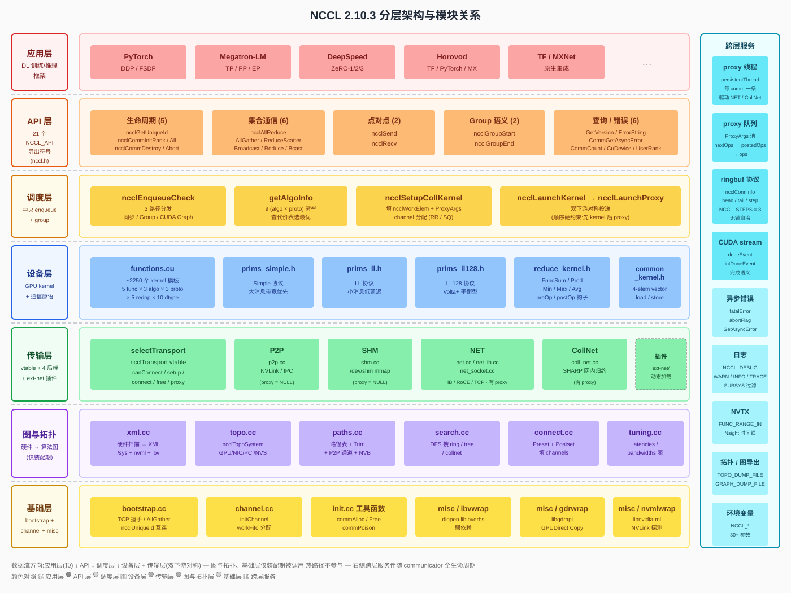

> 完整 SVG 见 [nccl-arch-layered.svg](nccl-arch-layered.svg);若 markdown 渲染器不支持内联 SVG,可在浏览器中直接打开该文件。

**七个主层(自顶向下)**:

| 层 | 主要职责 | 关键模块/文件 |
|---|---|---|
| **应用层** | DL 训练 / 推理框架 | PyTorch DDP/FSDP、Megatron-LM、DeepSpeed、Horovod、TF / MXNet |
| **API 层**(21 个 `NCCL_API` 导出符号) | C ABI 表面 | 生命周期(5)/ 集合通信(6)/ 点对点(2)/ Group(2)/ 查询(6) |
| **调度层** | 中央 enqueue + group | `ncclEnqueueCheck` / `getAlgoInfo` / `ncclSetupCollKernel` / `ncclLaunchKernel → Proxy` |
| **设备层** | GPU kernel + 通信原语 | `functions.cu`(~2250 kernel)/ `prims_simple/ll/ll128.h` / `reduce_kernel.h` |
| **传输层** | vtable + 4 后端 + 插件 | `selectTransport` + `p2p/shm/net/coll_net` + `ext-net/*` |
| **图与拓扑层**(仅装配期) | 硬件 → 算法图 | `xml.cc` / `topo.cc` / `paths.cc` / `search.cc` / `connect.cc` / `tuning.cc` |
| **基础层** | rendezvous + 弱依赖 | `bootstrap.cc` / `channel.cc` / `init.cc` 工具 / `misc/{ibvwrap,gdrwrap,nvmlwrap}` |

**右侧跨层服务**(伴随 communicator 全生命周期):

| 服务 | 作用范围 | 关键设计 |
|---|---|---|
| proxy 线程 | host 端唯一持久线程 | 每 comm 一条 `persistentThread`,仅驱动 NET/CollNet |
| proxy 队列 | 主线程 ↔ proxy 线程的工作交接 | `nextOps → postedOps → ops` 三段链表 + `opsMutex` 保护 |
| ringbuf 协议 | device ↔ proxy 自治推进 | `ncclConnInfo.head/tail/step` + `NCCL_STEPS=8` 流水深度 |
| CUDA stream | 完成语义提供方 | `doneEvent` / `intDoneEvent` 把"已 enqueue"翻译成"已完成" |
| 异步错误 | hang 检测与逃生 | `fatalError` + `abortFlag` + `GetAsyncError` 轮询 |
| 日志 / NVTX | 可观测性 | `NCCL_DEBUG=WARN/INFO/TRACE` + `NCCL_DEBUG_SUBSYS` + NVTX range |
| 拓扑/图导出 | 离线分析 | `NCCL_TOPO_DUMP_FILE` / `NCCL_GRAPH_DUMP_FILE` |
| 环境变量 | 运行时配置接口 | 30+ 个 `NCCL_*` 参数(详见 §6.2.5) |

**层与层之间的数据流**:严格自顶向下,**调度层是分叉点** —— 它对下产生两路对称投递:GPU device 路径(走 ① 设备层 ② 传输层在装配时建好的 ringbuf)和 host proxy 路径(走 ② 传输层的 vtable->proxy 回调)。**图与拓扑层、基础层属于"装配期专用",热路径完全不参与**,这是它们在图中放在底部的原因。

##### 图 4-2:装配期模块依赖与数据流(`ncclCommInitRank` 阶段)

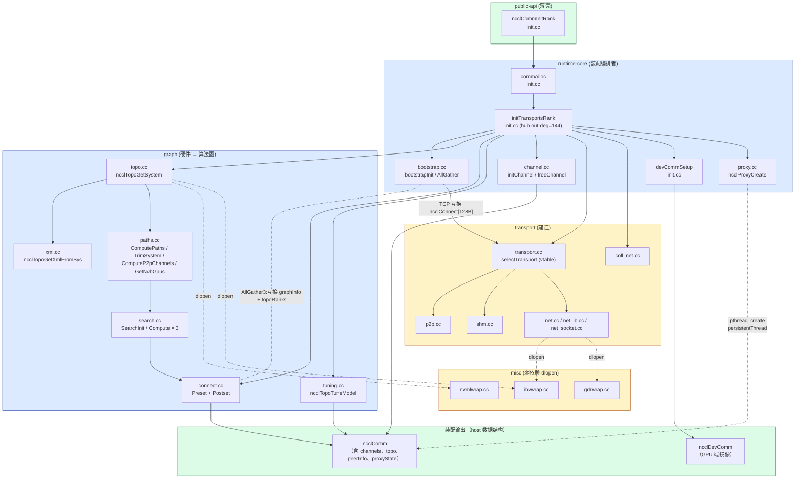

**装配期的依赖特征**:

- **`init.cc` 是编排者**:整个装配只有它一处串行调度,把 graph / transport / channel / proxy 各模块按固定顺序"穿"起来(详见 §5.4)。
- **graph 模块是上游 / transport 是下游**:graph 输出 `comm->channels[].ring/tree/collTree`,transport 看着这份编排建连接。两者**不直接互调**,以 `ncclTopoGraph + topoRanks` 为数据契约耦合。
- **bootstrap 跨边界**:既给 graph 阶段做 AllGather3(互换 graphInfo + topoRanks),又给 transport 阶段做 `bootstrapSend/Recv`(互换 `ncclConnect`)。它是装配期唯一的跨节点同步入口。
- **misc 是弱依赖**:`dlopen` 失败该后端自动剔除,不影响其它路径。这是 NCCL 能在 "有 IB / 没 IB"、"有 GDR / 没 GDR" 等异构环境共用一份 `.so` 的原因。
- **proxy 线程在最后才创建**:`ncclProxyCreate` 在 `initTransportsRank` 末尾(`if (comm->nNodes) ...`),装配完成后即刻进入工作状态等 enqueue。

##### 图 4-3:运行时热路径模块依赖与数据流(`ncclAllReduce` 等调用)

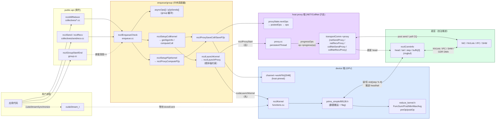

**热路径的依赖特征**:

- **graph / transport 模块**(图 4-2 中的核心装配模块)**完全消失** —— 它们的产物已经固化到 `comm->channels[]`、`comm->latencies[]`、`connector->conn` 等结构中,运行时**只读不再调用**这些模块的函数。
- **`enqueue/group` 是唯一的调度入口**:把上游 21 个 API 统一翻译成 `ncclWorkElem` + `ncclProxyArgs`,然后**对称分发到双下游**(图中 `DevPath` / `PxPath` 两个子图)。
- **device 路径与 proxy 路径无直接调用关系**:它们通过 `ncclConnInfo`(ringbuf 协议,详见 §4.5.4 与"NCCL 中的 ringbuf")**自治推进**。`Prim` 在 GPU 上 spin `tail`,`ProxyT` 在 host 上 spin `head`,互为生产者/消费者。
- **`misc` 在热路径不出现**:`ibvwrap.cc` / `gdrwrap.cc` 的函数指针在装配期就已经被解析,热路径直接调指针。
- **顺序硬约束**:`ncclLaunchKernel` 必须在 `ncclLaunchProxy` 之前(`enqueue.cc:307-311` 注释明确说"否则 `cudaFree` 可能 deadlock");图中通过"先/后"标签明示。
- **P2P/SHM 的热路径 `PxPath` 子图整体不参与**:仅 NET / CollNet 后端有 `vtable->proxy` 实现,P2P/SHM 的 `proxy` 字段是 `NULL`,device kernel 直接通过 NVLink/IPC/SHM 与对端 GPU 交换数据。

##### 两张图的对照

| 维度 | 图 4-2(装配期) | 图 4-3(热路径) |
|---|---|---|
| 触发频率 | 一次 / communicator 生命周期 | 每次 NCCL API 调用 |
| 编排者 | `init.cc::initTransportsRank` | `enqueue.cc::ncclEnqueueCheck` |
| graph 模块 | 高度活跃(拓扑、搜索、调优) | **完全消失**,只读已固化结果 |
| transport 模块 | `selectTransport` + `setup` + `connect` 全调一遍 | 只剩 `vtable->proxy`(且仅 NET/CollNet) |
| misc 模块 | 频繁 dlopen + 调函数指针 | 不出现 |
| 主同步原语 | bootstrap TCP(AllGather × 2) | ringbuf head/tail(无锁) |
| 同步开销 | 几十 ms – 几秒 | µs 级 |
| 失败处理 | 装配返回错误码 → 用户重试 | `fatalError` → `GetAsyncError` → `Abort` |

这种**装配重、热路径轻**的二分,正是 §3.1 "装配前置、热路径精简"准则的可视化体现 —— 把 NCCL 模块依赖图刻意拆成两张,**也是设计哲学本身的视觉表达**:你看到的 "热路径上 graph/misc 模块消失了" 不是简化的呈现,是真实代码组织的结果。

### 4.2 `runtime-core` 内部分工

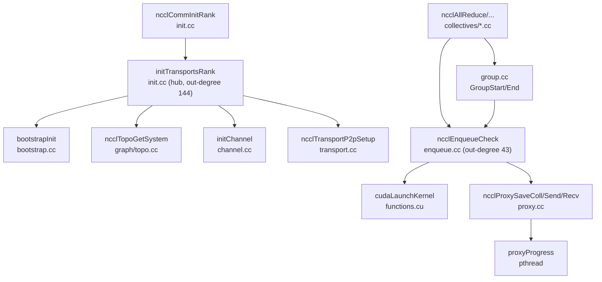

| 子模块 | 关键函数 | 职责 |
|---|---|---|
| `init.cc` | `ncclCommInitRank`、`initTransportsRank`、`commAlloc`、`commDestroy` | 通信器分配、CUDA 设备绑定、拓扑→通道→传输的串行装配；hub `initTransportsRank` out-degree=144 |
| `bootstrap.cc` | `bootstrapInit`、`bootstrapAllGather`、`bootstrapBarrier` | 基于 `ncclUniqueId`（128B socket addr）做 root 协调，AllGather 出每个 rank 的 `ncclPeerInfo` |
| `enqueue.cc` | `ncclEnqueueCheck`、`computeColl`、`ncclSetupP2pKernel` | 选 algo/proto，填 `ncclWorkElem`，写到 `channel->workFifo`，准备 launchParams；hub out-degree=43 |
| `group.cc` | `ncclGroupStart`、`ncclGroupEnd` | 聚合 `asyncOps[]`，按 channel round-robin / shortest-queue 分配，统一 launch；hub out-degree=53 |
| `proxy.cc` | `ncclProxySaveColl/Send/Recv`、`persistentThread`/`progressOps` | 单线程驱动所有需要 host 介入的传输（NET、CollNet）；按 channel 链表轮询 |
| `channel.cc` | `initChannel`、`freeChannel` | 分配 ring/tree/collTree 的 `ncclPeer[]`、`workFifo` |

### 4.3 `graph` 模块内部分工

#### 4.3.1 文件层职责

| 文件 | 职责 |
|---|---|
| `topo.cc` | 用 `/sys` + nvml + ibv 构建 `ncclTopoSystem`；XML ↔ 图反序列化；`ncclTopoPrint`、`ncclTopoGetCpuAffinity`、`ncclTopoGetSystem`、`ncclTopoGetSystemFromXml` |
| `xml.cc` | XML 中间表示与硬件扫描；`ncclTopoGetXmlFromSys`(hub out-degree=77)、`ncclTopoTrimXml`、`ncclTopoFillGpu/Net`、文件读写 |
| `paths.cc` | **不只是路径计算**：路径表(`ncclTopoComputePaths`)、**拓扑修剪(`ncclTopoTrimSystem`)**、**P2P 通道分配(`ncclTopoComputeP2pChannels`)**、**NVB 对端列表(`ncclTopoGetNvbGpus`)** |
| `search.cc` | DFS 搜索 ring/tree/collNet；`ncclTopoSearchInit` / `ncclTopoCompute` / `ncclTopoPrintGraph` / `ncclTopoDumpGraphs` |
| `connect.cc` | 把搜索结果落实到 channel：`ncclTopoPreset`、`ncclTopoPostset` |
| `tuning.cc` | 时间代价模型：`ncclTopoTuneModel` 写 `latencies/bandwidths/maxThreads/threadThresholds`；`ncclTopoGetAlgoTime` |
| `trees.cc` | 平衡 tree（balanced/split）的 rank 编排 |
| `rings.cc` | ring 的 rank 编排（含跨节点拼接） |

#### 4.3.2 `ncclTopo*` 对外 API 一览

这些 API 全部被 [`initTransportsRank`](src/init.cc:492) 在装配阶段串行调用，按调用顺序排列：

| # | API | 文件 | 输入 | 输出 / 副作用 | 作用 |
|---|---|---|---|---|---|
| 1 | `ncclTopoGetSystem` | `topo.cc` | `comm`（含 cudaDev/busId） | `comm->topo` = `ncclTopoSystem*` | 解析本节点的硬件图：扫描 `/sys` + 调 nvml + 调 ibv → 中间产物 XML → 反序列化成 `ncclTopoSystem`。可被 `NCCL_TOPO_FILE` 注入覆盖 |
| 2 | `ncclTopoComputePaths` | `paths.cc` | `topo`, `peerInfo[]` | 节点对之间填 `paths[type][n]` | 对每对 (GPU↔GPU, GPU↔NIC, GPU↔CPU) 跑最短路（按 path-type 优先级 + 带宽阈值），结果是 `ncclTopoLinkList` |
| 3 | `ncclTopoTrimSystem` | **`paths.cc:421`** | `topo`, `comm` | 修剪后的 `topo` | 删除**通信器用不到**的资源（远端 GPU、未参与的 NIC 等），减小 search 空间。**trim 后 `comm->topo` 仅保留本节点 + 跨节点 NIC 抽象,不再是完整集群拓扑** |
| 4 | `ncclTopoComputePaths` (再次) | `paths.cc` | 同上 | 重算 paths | trim 改了拓扑，必须重算路径表 |
| 5 | `ncclTopoSearchInit` | `search.cc:34` | `topo` | 写 `topo->maxWidth`、`topo->totalWidth` | **仅计算两个全局带宽统计量**(`maxWidth = max(单 GPU 到 NET 或 GPU 的最大可达带宽)`、`totalWidth = max(单 GPU 总出带宽)`)，作为后续 search 剪枝阈值的全局参考。**不缓存 NIC 列表、不分桶** |
| 6 | `ncclTopoPrint` | `topo.cc` | `topo` | stderr（INFO 级） | `NCCL_DEBUG=INFO` 时打印整张拓扑表 |
| 7 | `ncclTopoCompute` ×3 | `search.cc:715` | `topo`, `ncclTopoGraph*`（含 pattern） | 填 `graph` 输出字段 | **核心搜索**：DFS 找出满足 `minChannels/maxChannels` 数量、`speedIntra/Inter` 不低于阈值的 N 条不重叠路径。**Ring/Tree/CollNet 各跑一次**（见 §5.4） |
| 8 | `ncclTopoPrintGraph` | `search.cc` | `topo`, `graph` | stderr | 打印某次搜索结果（每个 channel 的 GPU 序列、跨节点 NIC） |
| 9 | `ncclTopoDumpGraphs` | `search.cc` | `topo`, 3×`graph` | 文件 | 仅 `NCCL_GRAPH_DUMP_FILE_RANK==rank` 的进程会落盘，用于离线分析 |
| 10 | `ncclTopoPreset` | `connect.cc` | `comm`, treeGraph, ringGraph | `topoRanks`（本 rank 视角） | 把搜索得到的 graph 翻译成"本 rank 在每个 channel 上的 ring.prev/next、tree.up/down 雏形"；同时把 channels **复制一份**用于 AllGather 校准 |
| 11 | `ncclTopoPostset` | `connect.cc` | `comm`, allTopoRanks, rings, collNetGraph | 写 `comm->channels[].ring/tree/collTree` | 收到所有 rank 的 `topoRanks` 后，**全局拼接**：跨节点的 ring 串联、tree 跨节点连接、collTree 头节点选举 |
| 12 | `ncclTopoTuneModel` | `tuning.cc:77` | `comm`, minCompCap, maxCompCap, 3×graph | 写 `comm->latencies / bandwidths / maxThreads / threadThresholds` | 用 `baseLat/hwLat/ll128MaxBw/perChMaxTreeBws` 等硬编码模型 + graph 的速度参数生成 9 组 (algo×proto) 的代价表，runtime 选择算法用 |
| 13 | `ncclTopoComputeP2pChannels` | **`paths.cc:505`** | `comm` | `comm->p2pnChannels`, `p2pChannels[]` | send/recv 走独立通道集合，按本 rank ↔ peer 的距离哈希分配（独立于 collective channels） |
| 14 | `ncclTopoGetNvbGpus` | **`paths.cc:537`** | `topo`, rank | `nvbPeers[]` | cubemesh 拓扑下找出需要通过 NVB（NVLink Bridge）绕路的对端，触发 P2P 预连接（`NVB_PRECONNECT=1`） |
| 15 | `ncclTopoGetCpuAffinity` | `topo.cc:697` | `topo`, rank | `cpu_set_t` | 找到与本 rank GPU 同 NUMA 的 CPU 集合，临时绑定线程亲和性，保证 `commAlloc` 阶段的 host 内存分配在本地 NUMA |

> **修正**:本表早期版本把 `ncclTopoTrimSystem`、`ncclTopoComputeP2pChannels`、`ncclTopoGetNvbGpus` 三个函数错标到了 `topo.cc`,实际它们都在 `paths.cc`(因为都需要操作路径表,自然与路径计算放一起)。

#### 4.3.3 `ncclTopoSystem` 节点类型与路径类型

```c
// 节点类型 (topo.h:31-37)
GPU=0, PCI=1, NVS=2, CPU=3 /*NUMA*/, NIC=4, NET=5

// 路径类型（按距离从近到远，越小越快）
PATH_LOC=0  // 同一 GPU
PATH_NVL=1  // 直接 NVLink
PATH_NVB=2  // NVLink Bridge（cubemesh 中跨 GPU 桥接）
PATH_PIX=3  // 同一 PCI switch
PATH_PXB=4  // 跨 PCI switch，同 CPU
PATH_PHB=5  // 跨 PCI host bridge
PATH_SYS=6  // 跨 NUMA / 跨节点
```

这套类型决定了路径选择优先级：在搜索时，`typeIntra ≤ typeInter` 的要求保证一个 channel 内部走更近的路径，跨节点的边只在边界使用。

#### 4.3.4 `ncclTopoGraph` 数据结构（搜索的输入/输出契约）

定义见 [graph.h:61-79](src/include/graph.h)：

| 字段 | 输入/输出 | 说明 |
|---|---|---|
| `id` | 输入 | 0=ring, 1=tree, 2=collnet |
| `pattern` | 输入 | `NCCL_TOPO_PATTERN_RING` / `BALANCED_TREE` / `SPLIT_TREE` / `TREE` |
| `crossNic` | 输入 | 是否允许一个 channel 跨多个 NIC（`NCCL_CROSS_NIC`） |
| `collNet` | 输入 | 是否启用 CollNet 路径 |
| `minChannels` / `maxChannels` | 输入 | 期望的 channel 数区间，搜索按从多到少尝试 |
| `nChannels` | 输出 | 实际找到的 channel 数 |
| `speedIntra` / `speedInter` | 输出 | 节点内/节点间每 channel 带宽（GB/s） |
| `typeIntra` / `typeInter` | 输出 | 节点内/节点间使用的最差路径类型（PATH_NVL/PXB/...） |
| `sameChannels` | 输出 | 多个 channel 是否拓扑相同（用于优化 work fifo） |
| `nHops` | 输出 | 平均跳数 |
| `intra[MAXCHANNELS × NCCL_TOPO_MAX_NODES]` | 输出 | 每个 channel 的节点内 GPU 序列 |
| `inter[MAXCHANNELS × 2]` | 输出 | 每个 channel 跨节点的 (sendNet, recvNet) 对 |

#### 4.3.5 四种 `pattern` 适用场景

| Pattern | 值 | 含义 | 典型用途 |
|---|---|---|---|
| `RING` | 4 | 环：每节点入口出口都同一 GPU，节点间首尾相连 | ring AllReduce/AllGather/ReduceScatter |
| `BALANCED_TREE` | 1 | 平衡 tree：父子分布在两个 GPU 上，**NIC 流量在两 GPU 间平摊** | tree AllReduce 的默认形态 |
| `SPLIT_TREE` | 2 | 分裂 tree：父节点 GPU0，两子在 GPU1（"上 1 下 2" 结构） | 某些 SM 架构上更省带宽 |
| `TREE` | 3 | 单 GPU tree：所有 NIC 流量经同一 GPU | CollNet 模式（NIC 入口必须是 head GPU） |

#### 4.3.6 核心数据结构详解

graph 模块自底向上有 **4 层数据结构**，对应"硬件中间表示 → 硬件图 → 算法图 → 本 rank 视角"四个抽象层级。每一层都比上一层更"逻辑"，最终落到 device 端只剩 `ncclChannel.ring/tree/collTree` 三个小结构 —— 这是 §3.1 提到 "Host 把所有决策前置，Device 热路径无 host 决策开销" 的具体落地。

##### 4.3.6.1 四层结构总览

> 图 4-4：四层结构与演化关系

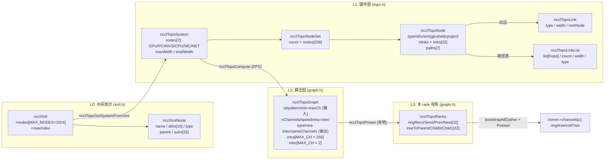

每个箭头都对应 §5.4 时序图里一个具体调用，流水方向不变。下面逐层展开。

##### 4.3.6.2 L0：`ncclXml` / `ncclXmlNode`（中间表示）

定义见 [xml.h:21-37](src/graph/xml.h)：

```c
#define MAX_STR_LEN    255
#define MAX_ATTR_COUNT  16
#define MAX_SUBS        32
#define MAX_NODES     1024

struct ncclXmlNode {
  char name[256];                                      // "system" / "cpu" / "pci" / "gpu" / "nic" / "net" / "nvlink"
  struct { char key[256]; char value[256]; }
       attrs[17];                                      // KV 属性表
  int  nAttrs;
  int  type;                                           // NONE/OPEN/CLOSE/SINGLE
  struct ncclXmlNode* parent;
  struct ncclXmlNode* subs[32];                        // 子节点指针(指回池)
  int  nSubs;
};

struct ncclXml {
  struct ncclXmlNode nodes[1024];                      // 节点池，全部预分配
  int maxIndex;                                        // 已用槽数
};
```

**关键设计**

- **节点池 + 指针** 而非 `malloc/free`：整张 XML 一次性 1024 槽；`subs[s]` 指向同一 `nodes[]` 数组的另一个槽，无堆碎片。
- 属性、子节点上限定长（16 / 32）：NCCL 拓扑节点最多 256 个，子节点和属性都不会超。
- **同一份 `ncclXml` 同时承载两种文件**（由 `version` 区分）：
  - `NCCL_TOPO_XML_VERSION=1` → 硬件拓扑（`<system>` 根）
  - `NCCL_GRAPH_XML_VERSION=1` → search 结果（`<graphs>` 根）
- 操作函数全部 `static inline` 在 `xml.h`：只在 graph 模块内部使用，不对外暴露。
- XML 结构示例与字段表见 [nccl-topo-template.xml](nccl-topo-template.xml) 模板文件。

##### 4.3.6.3 L1：硬件图（`ncclTopoSystem` 及其下层）

L1 是 NCCL 真正用来推理的图模型。一张机器拓扑由这一组结构完整描述。

**`ncclTopoSystem`** — 整张图（[topo.h:123-127](src/graph/topo.h)）：

```c
struct ncclTopoSystem {
  struct ncclTopoNodeSet nodes[NCCL_TOPO_NODE_TYPES];   // 7 类节点，各自一桶
  float maxWidth;                                       // 单链路最高带宽 (GB/s)
  float totalWidth;                                     // 所有链路带宽和
};
```

按节点类型分桶：`system->nodes[GPU].nodes[i]` 是第 i 个 GPU；节点类型常量见 §4.3.3。

**`ncclTopoNodeSet`** — 同类型节点集合：

```c
struct ncclTopoNodeSet {
  int count;
  struct ncclTopoNode nodes[NCCL_TOPO_MAX_NODES];       // 256
};
```

`NCCL_TOPO_MAX_NODES=256` 远超任何实际配置（DGX-H200 才 8 GPU），永远不会触顶。

**`ncclTopoNode`** — 一个硬件节点（[topo.h:81-116](src/graph/topo.h)）：

```c
struct ncclTopoNode {
  int     type;                                          // GPU/PCI/NVS/CPU/NIC/NET
  int64_t id;                                            // 全图唯一 id
  union {
    struct { int dev, rank, cudaCompCap, gdrSupport; }                gpu;
    struct { uint64_t asic; int port; float width;
             int gdrSupport, collSupport, maxChannels; }              net;
    struct { int arch, vendor, model; cpu_set_t affinity; }           cpu;
    struct { uint64_t device; }                                       pci;
  };
  int                  nlinks;
  struct ncclTopoLink  links[NCCL_TOPO_MAX_LINKS];       // 32：出边数组
  struct ncclTopoLinkList* paths[NCCL_TOPO_NODE_TYPES];  // 7：到每类节点的预计算最短路径
  uint64_t             used;                             // DFS 期间作 visited 位图
};
```

**关键设计**

- **统一节点 + union**：让 7 类硬件用一种结构表达，简化邻接表与 DFS；`type` 字段区分。
- **`id` 类型混用**：GPU/NIC 用 PCI busId（转 int64）；CPU 用 numaid；NET 用插件 dev 号。`ncclTopoIdToIndex` 做反查（O(N) 扫描，节点数小可接受）。
- **`links[32]` 出边数组（非链表）**：节点 ≤ 256、每节点出度 ≤ 32，数组比链表更友好（cache、无指针追逐）。
- **`paths[7]` 预计算路径表**：`ncclTopoComputePaths` 跑完后，每节点都有一份"到每类节点的最短路径"；后续 search 只查表，**热路径零计算**。
- **`used` 嵌入节点本身**：DFS 期间动态置位/复位，省掉旁路 visited 数组。

union 内每类字段的语义：

| `type` | 字段 | 含义 |
|---|---|---|
| **GPU** | `dev` / `rank` / `cudaCompCap` / `gdrSupport` | CUDA 设备号；comm 内 rank；SM 版本 ×10；GDR 能力 |
| **NET** | `asic` / `port` / `width` / `gdrSupport` / `collSupport` / `maxChannels` | NIC ASIC GUID 高位；IB port；端口带宽 GB/s；GDR/CollNet/连接数能力 |
| **CPU** | `arch` / `vendor` / `model` / `affinity` | x86/ppc/arm；Intel/AMD/Zhaoxin；BDW/SKL 等；本 NUMA 的 CPU mask |
| **PCI** | `device` | PCI device id（`0x10de20b0` 等） |
| **NVS** | （无） | NVSwitch；链路信息全在 `links[]` |
| **NIC** | （无） | 仅作 PCI ↔ NET 的中间层 |

**`ncclTopoLink`** — 一条边：

```c
struct ncclTopoLink {
  int   type;                                            // LINK_LOC/NVL/PCI/SYS/NET
  float width;                                           // 链路带宽 GB/s
  struct ncclTopoNode* remNode;                          // 对端节点指针
};
```

链路类型常量与含义见 [topo.h:41-49](src/graph/topo.h)；`type` 数值递增对应带宽递减、延迟递增。注意 `LINK_*` 数值 2/4/5 被**保留**给路径类型 `PATH_*` 对齐使用，链路上不会出现这些值。

**`ncclTopoLinkList`** — 一条多跳路径：

```c
struct ncclTopoLinkList {
  struct ncclTopoLink* list[NCCL_TOPO_MAX_HOPS];        // 256*7 = 1792：边指针序列
  int   count;                                          // 跳数
  float width;                                          // 整条路径瓶颈带宽 = min(每跳 width)
  int   type;                                           // 整条路径类型 = max(每跳 type)
};
```

**关键设计：链路类型 vs 路径类型** —— 两者编码刻意错开（链路 `LINK_*` 与路径 `PATH_*` 数值不同）：

| 概念 | 描述 | 编码 |
|---|---|---|
| `LINK_*`（链路） | 单段物理连接 | `LOC=0, NVL=1, PCI=3, SYS=6, NET=7` |
| `PATH_*`（路径） | 多跳路径整体类型 | `LOC=0, NVL=1, NVB=2, PIX=3, PXB=4, PHB=5, SYS=6` |

路径多出 `NVB`(NVLink Bridge 经第三方 GPU)、`PIX/PXB/PHB`(同/跨 switch、跨 host bridge)三个"经过多段后归一化"的类型，是搜索剪枝与调优表选行的关键依据。

> 图 4-5：从 GPU0 到对端 NIC 的一条 `ncclTopoLinkList` 示意

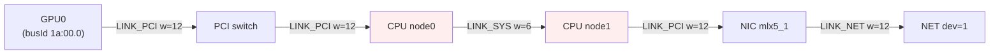

整条路径 `width = min(12,12,6,12,12) = 6 GB/s`，`type = max = PATH_SYS = 6`。

##### 4.3.6.4 L2：`ncclTopoGraph`（搜索的输入/输出契约）

完整字段表见 §4.3.4。补充设计要点：

- **同一结构在 `ncclTopoCompute` 前后扮演两个角色**：调用者填输入字段（`id/pattern/crossNic/collNet/min-maxChannels`），被调者填输出字段（其余全部）。代码注释明确写了 "Input / output / Output"。
- **`intra[32 × 256] = 8192 个 int = 32 KB`**：占用不小但换来索引方式简洁（`intra[c*nNodes + i]`），比每 channel 一个动态数组好维护。
- **`speedIntra/Inter` 与 `typeIntra/Inter` 是 DFS 副产品**：搜索过程顺手记 `min(width)` 与 `max(type)`，免去事后再扫一遍。
- **`sameChannels`**：NVSwitch 拓扑下多个 channel 是同构的，标记后 work fifo 可以省一部分元信息。
- 三种 graph 输入差异详见 §5.4.3 三次图搜索表。

##### 4.3.6.5 L3：`ncclTopoRanks`（本 rank 在 channel 内的位置）

定义见 [graph.h:85-93](src/include/graph.h)：

```c
struct ncclTopoRanks {
  // Ring
  int ringRecv [MAXCHANNELS];     // 环内"入口"rank(跨节点串联用)
  int ringSend [MAXCHANNELS];     // 环内"出口"rank
  int ringPrev [MAXCHANNELS];     // 本 rank 的前驱
  int ringNext [MAXCHANNELS];     // 本 rank 的后继

  // Tree (最大 3 叉)
  int treeToParent [MAXCHANNELS];
  int treeToChild0 [MAXCHANNELS];
  int treeToChild1 [MAXCHANNELS];
};
```

**关键设计**

- **只描述本 rank 视角**：由 `ncclTopoPreset` 根据本地 `ncclTopoGraph` 填，AllGather3 让所有 rank 互相看到对方的 `topoRanks`。
- **`ringRecv[0]` 兼作 "节点起点 rank"**：`Postset` 用它的 distinct 值数推断全局 `nNodes`（见 §5.4.4）。
- **MAXCHANNELS=32** 与 `ncclChannel[]` 对齐；tree 仅 child0/child1（2.10.3 时代尚无 4+ 叉 tree）。
- **不存 collTree**：CollNet 的全局关系由 `collNetGraph` 直接给出，无需每 rank 上报。

##### 4.3.6.6 关联结构：`ncclPeerInfo`

定义见 [comm.h](src/include/comm.h)（不在 graph 模块但贯穿 topo 全程）：

```c
struct ncclPeerInfo {
  int      rank;
  int      cudaDev;
  int      gdrSupport;                                 // 本 GPU 的 GDR 能力
  uint64_t hostHash;                                   // hash(uname.nodename) → 同节点判定
  uint64_t pidHash;                                    // hash(pid) → 同进程判定
  dev_t    shmDev;                                     // SHM 后端用
  int64_t  busId;                                      // 本 GPU 的 PCI busId
};
```

- **AllGather1**（bootstrap，[init.cc:515](src/init.cc)）就是收齐它成 `comm->peerInfo[nRanks]`，**早于** `ncclTopoGetSystem`。
- `ncclTopoComputePaths(topo, peerInfo)` 用它把远端 GPU 的 busId 映射到 NET 路径上 —— 这是 §5.4.2 "为什么路径要算两次" 的根因：第一次算路径需要 peerInfo 提供 trim 判定依据；trim 后必须重算。
- `hostHash` 唯一确定"本节点 vs 其它节点"，用于 `intraNodeRanks` 计算（[init.cc:532-547](src/init.cc)）。

##### 4.3.6.7 容量与内存占用速查

| 结构 | 单实例占用 | 备注 |
|---|---|---|
| `ncclXml` | 1024 × ≈ 8.5 KB ≈ **8.6 MB** | 池预分配；装配完成后可立即 free |
| `ncclTopoNode` | ~14 KB（含 `links[32]`、`paths[7]` 指针、union） | 节点本身大头是出边数组 |
| `ncclTopoNodeSet` | 256 × 14 KB = ~3.5 MB（理论上限） | 实际按真实节点数计 |
| `ncclTopoSystem` | 7 × NodeSet；典型 8 GPU 单节点 **数百 KB** | 长期存活于 `comm->topo` 至 destroy |
| `ncclTopoGraph` | ~6.2 KB（主要是 `intra[]`） | 装配中临时；三个 graph 共 < 20 KB |
| `ncclTopoRanks` | 7 × 32 × 4 = **896 B** | 每 rank 一份；AllGather 后台占 `nranks × 896 B` |

`ncclXml` 是装配阶段一次性最大的内存占用，**完成解析后立即释放**；`ncclTopoSystem` 是长期持有的对象，destroy 时由 `ncclTopoFree` 回收。

##### 4.3.6.8 端到端数据流回顾

> 图 4-6：四层结构在 `initTransportsRank` 中的流转

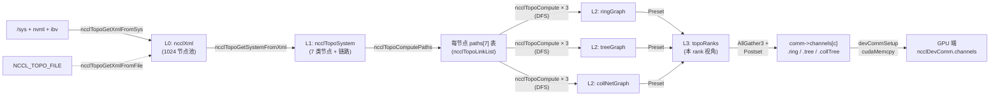

四个抽象层级对应四个阶段：
- **L0 XML** 屏蔽硬件扫描细节，让 sysfs 残缺、容器、WSL2 都能用 `NCCL_TOPO_FILE` 兜底。
- **L1 ncclTopoSystem** 是稳定的硬件模型，承担路径预计算、GDR 检查、CPU 亲和性查询等所有"问拓扑"的需求。
- **L2 ncclTopoGraph** 是算法图：把硬件图压缩成"每 channel 走哪条路径"的紧凑表示，是 search → tune → connect 的中介。
- **L3 ncclTopoRanks** 是 rank-local 视角：让 AllGather 只搬必要的 KB 级数据而不是整张图。

最终落到 device 端只剩 `ncclChannel.ring/tree/collTree`，热路径**完全不需要访问 L0~L2 的任何结构**。

### 4.4 `device` 模块

#### 4.4.1 模块组织

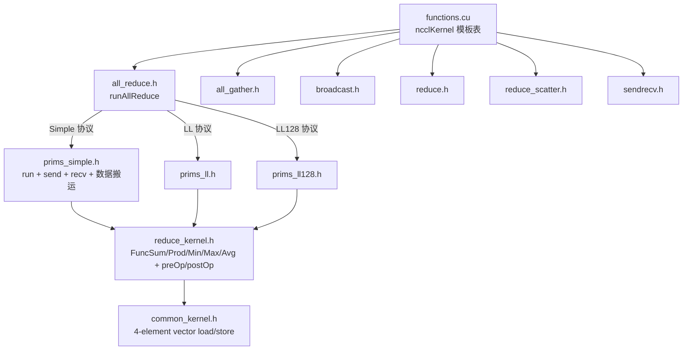

device 模块的核心是 "**算法层 × 协议层**" 的 2D 矩阵:每种集合通信(5 种)对每种算法(Tree/Ring/CollNet)有一份 `run*` 函数(如 `runAllReduce<algo, proto>`),内部根据 `proto` 选择 `prims_simple.h` / `prims_ll.h` / `prims_ll128.h` 三个原语类之一。**算法层负责"怎么把数据在 rank 之间循环",协议层负责"每步数据怎么落地到 ringbuf"**。

#### 4.4.2 三协议详解(Simple / LL / LL128)

三种协议在**数据格式、就绪检测机制、有效载荷率、典型适用区间**上有显著差异,选哪个由 `tuning.cc` 的代价模型在 enqueue 时按消息大小决定(见 §4.6.4)。

##### 4.4.2.1 数据格式与就绪检测对比

| 维度 | Simple | LL | LL128 |
|---|---|---|---|
| **slot 内布局** | 纯数据 | `[data1:4B][flag1:4B][data2:4B][flag2:4B]` 单元(`ncclLLFifoLine`,16B)交错 | 128B 行内 15×8B 数据 + 1×8B flag 行尾 |
| **就绪检测** | 通过 `connInfo->tail`(8B 计数器)显式同步;消费者 spin 等 `tail > step` | flag 嵌入数据流;消费者读 8B,**flag != 期望值则 spin 重读**;无需独立 tail | 同 LL,但每 128B 行只有 1 个 flag(粒度更粗) |
| **fence/threadfence** | 写 data → `__threadfence_system()` → 写 tail | 数据与 flag 同次原子写入(8B),**省一次 fence** | 同 LL,但每行省更多 |
| **有效载荷率** | 100%(纯数据) | **50%**(每 8B 含 4B 数据) | **120/128 ≈ 93.75%**(每 128B 含 120B 数据) |
| **典型消息大小** | 大消息(≥ 数百 KB) | 小消息(≤ 几 KB,延迟优先) | 中消息(几 KB ~ 数百 KB,带宽与延迟平衡) |
| **典型 latency**(NVLink 8B AllReduce) | ~28 µs(`hwLat`) | **~0.5 µs** | ~1.2 µs |
| **典型 BW per channel** | 满 | ~19-39 GB/s | ~20 GB/s |
| **关键宏** | `NCCL_STEPS=8` | `NCCL_LL_FIFOLINE`、`NCCL_LL_CLEAN_MASK` | `NCCL_LL128_LINESIZE=128`、`NCCL_LL128_LINEELEMS=16` |
| **kernel 文件** | `prims_simple.h`(本版从 `primitives.h` 独立出来) | `prims_ll.h` | `prims_ll128.h` |
| **硬件要求** | 任意 GPU | 任意 GPU | **Volta+ 推荐**(依赖 wide load 性能) |

##### 4.4.2.2 LL 协议的 4B+4B flag 设计

LL 是 NCCL 把"小消息延迟"压到极致的核心机制。定义见 [devcomm.h:33-46](src/include/devcomm.h):

```c
union ncclLLFifoLine {
  struct {
    uint32_t data1;
    uint32_t flag1;      // flag 在 data 之后,保证不完整接收时
    uint32_t data2;      // 不会读到 flag-without-data
    uint32_t flag2;
  };
  uint64_t v[2];         // 整体 16B 读写
  int4     i4;           // SIMD 加载
};
```

**关键设计点**

- **flag 必须在 data 之后**:网络上不完整接收(socket)或非原子写入(host) 可能让 flag 先于 data 到达,**flag 后置保证读到 flag 时数据一定在**。
- **flag 值取自 `step` 计数**:每个 step 用不同 flag(`NCCL_LL_FLAG(step)`),消费者期望 `flag == 当前 step` 才认为就绪;旧数据的 flag 不会误伤。
- **`NCCL_LL_CLEAN_MASK = 0x7ffffff8`**:flag 不能取 0(否则与零初始化的 buffer 混淆),mask 末尾 3 bit 保证 cleanmask % NCCL_STEPS == 0 的 static_assert。
- **`__threadfence_system` 仅在跨 host 边界用,intra-GPU 不需要**,这是 LL 比 Simple 省的真正成本。

##### 4.4.2.3 LL128 协议的 128B 行设计

LL 的 50% 浪费在 NVLink 上仍可接受(延迟主导),但跨节点 IB 上浪费一半带宽不行。LL128 把"flag 粒度"放大到 128B 行,**每行只浪费 8B**:

```
LL128 line (128B):
+-----+-----+-----+-----+-----+-----+-----+-----+-----+-----+-----+-----+-----+-----+-----+-----+
| d0  | d1  | d2  | d3  | d4  | d5  | d6  | d7  | d8  | d9  | d10 | d11 | d12 | d13 | d14 |flag |
+-----+-----+-----+-----+-----+-----+-----+-----+-----+-----+-----+-----+-----+-----+-----+-----+
  8B    8B    8B    8B    8B    8B    8B    8B    8B    8B    8B    8B    8B    8B    8B    8B
```

`NCCL_LL128_LINEELEMS=16`,`NCCL_LL128_DATAELEMS=15`,即 15/16 = 93.75% 载荷率。**关键约束**:wide load(128B 一次性 cache line load)对硬件有要求,在 Volta(SM 70+)前性能不稳定,所以 NCCL 在 `tuning.cc` 里对老硬件直接禁用 LL128 路径。

##### 4.4.2.4 协议选择决策(运行时)

`tuning.cc` 在装配阶段填好 `comm->latencies[func][algo][proto]` 与 `comm->bandwidths[func][algo][proto]`,enqueue 时用以下简化模型估算:

```
estimated_time ≈ latencies[F][A][P] + nBytes / bandwidths[F][A][P]
```

对 9 (algo, proto) 组合穷举,**取最小者**(详见 §4.6.4)。直观上:

- 消息 < 几 KB:LL 取胜(延迟项主导)
- 消息 > 数百 KB:Simple 取胜(带宽项主导)
- 中间区间:LL128 取胜(同时占两边便宜)

用户可通过 `NCCL_PROTO=Simple` / `LL` / `LL128` **强制覆盖**,常用于复现性能问题。

#### 4.4.3 `reduce_kernel.h` 的 reduce hooks 与 `ncclAvg`

`reduce_kernel.h` 用模板特化定义五个 reduce 函数对象:`FuncSum / FuncProd / FuncMin / FuncMax / FuncAvg`,每个含三个成员:

- `operator()(T a, T b)` — 真正的归约动作
- `preOp(T x)` — 进入累加前的预处理钩子
- `postOp(T x)` — 累加完成后的后处理钩子

绝大多数 op 的 `pre/postOp` 是恒等(`x → x`),只有 **`FuncAvg`** 用它做"先 scale 还是后除":

| 数据类型 | preOp | postOp | 设计意图 |
|---|---|---|---|
| 整型(int8/int32/int64/uint*) | 恒等 | `x / n` | 整数 `x*1/n` 会丢精度,只能 sum 完后除 |
| float / double | `x * rcp` (`rcp = __frcp_rn(n)` 或 `__drcp_rn(n)`) | 恒等 | **每个 rank 先 scale**,避免大数累加破坏浮点有效位 |
| half / bf16 | 同 float(用 fp32 reciprocal 后转回 half) | 恒等 | 浮点路径必走 preOp,fp16/bf16 累加误差扩大尤其严重 |

**关键澄清**:这是浮点累加精度问题的标准处理。如果 N 个 fp16 值都在 ~10⁴ 量级,直接 sum 后再除会出现 ~10⁵ 量级的中间值,fp16 的 11-bit mantissa 无法精确表达。**先 scale 再 sum** 让每个 rank 的输入回到 ~10³ 量级,sum 后仍在 ~10⁴ 量级,fp16 可准确表示。

#### 4.4.4 `ncclKerns` 入口表与模板爆开

device 模块用 C++ 模板把 `<func, algo, proto, redop, dtype>` 5 个维度展开成 ~2250 个 kernel 函数,然后通过一个 `void*` 数组让 host 端按 `funcIndex` 索引选定 kernel。

##### 4.4.4.1 `ncclKerns` 表结构

```c
// enqueue.cc:86
static void* const ncclKerns[
  1 + NCCL_NUM_FUNCTIONS * ncclNumOps * ncclNumTypes
    * NCCL_NUM_ALGORITHMS * NCCL_NUM_PROTOCOLS
] = {
  (void*)NCCL_KERN_NAME(SendRecv, RING, SIMPLE, Sum, int8_t),   // 索引 0:SendRecv
  NCCL_FUNCS2B(Broadcast),       // Broadcast(仅需 Sum,所有 dtype 复用 int8 kernel)
  NCCL_FUNCS2A(Reduce),           // Reduce(全 redop × 全 dtype)
  NCCL_FUNCS2B(AllGather),        // AllGather(同 Broadcast,数据搬运无 reduce)
  NCCL_FUNCS2A(ReduceScatter),    // ReduceScatter
  NCCL_FUNCS2A(AllReduce),        // AllReduce
};
```

表大小 = `1 + 5 × 5 × 10 × 3 × 3 = 2251` 个函数指针,**其中 1 是 SendRecv 单 kernel,其余 2250 是 5 集合通信 × 5 redop × 10 dtype × 3 algo × 3 proto**。

##### 4.4.4.2 `NCCL_FUNC2A` / `2B` / `3A` / `3B` / `4` / `5` 宏组装

宏层级自外向内展开,每层把一个维度的 size 展开成对应数量的条目:

```c
NCCL_FUNCS2A(func)  // 5 redops × NCCL_FUNCS3A(func, redop)
NCCL_FUNCS2B(func)  // 5 redops × NCCL_FUNCS3B(func, Sum)         // 复用 Sum kernel
NCCL_FUNCS3A(...)   // 10 dtypes × NCCL_FUNC4(func, redop, dtype) // 全 dtype
NCCL_FUNCS3B(...)   // 10 dtypes × NCCL_FUNC4(func, redop, int8_t)// 全部用 int8 kernel
NCCL_FUNC4(...)     // 3 algos  × NCCL_FUNC5(func, algo, redop, dtype) // (TREE, RING, COLLNET)
NCCL_FUNC5(...)     // 3 protos × NCCL_KERN_NAME(...)
```

**`2A` vs `2B` 的区别**:
- `2A`(Reduce/ReduceScatter/AllReduce):需要 reduce 计算,5 个 redop 各自展开
- `2B`(Broadcast/AllGather):**纯数据搬运,reduce 维度退化**,5 个 redop 槽位都填 Sum kernel(浪费空间但代码统一)

**`3A` vs `3B` 的区别**:
- `3A`:每个 dtype 各自展开
- `3B`(用于 Broadcast/AllGather):**dtype 维度退化**,10 个 dtype 槽位都填 int8 kernel(因为搬运对 dtype 无关,按字节算就够)

**`FUNC5` 的微妙之处**([enqueue.cc:13-16](src/enqueue.cc) 注释 `// Only generate inline kernels for LL`):

```c
#define NCCL_FUNC5(func, algo, redop, dtype) \
  (void*)NCCL_KERN_NAME(func, algo, LL, redop, dtype), \
  (void*)NCCL_KERN_NAME(func, algo, LL, redop, dtype), \
  (void*)NCCL_KERN_NAME(func, algo, LL, redop, dtype)
```

`ncclKerns` 表中三个 proto 槽位**都指向 LL kernel** —— 这是个 inline 优化路径,host 端在选 algo/proto 后用 `funcIndex` 查表得到的指针**仅在 proto=LL 时是正确的**。LL128 / Simple 的 kernel 由 device 端从 `comm->args` 内联触发(见 §4.6 调度器对"inline 优化"的处理)。这一设计反映出 NCCL 对 LL 小消息路径的极致 latency 优化倾向。

##### 4.4.4.3 `funcIndex` 编码

enqueue 时通过 `FUNC_INDEX(coll, op, dtype, algo, proto)` 宏把 5 维参数编成单一整数:

```
funcIndex = ((((coll * nOps + op) * nTypes + dtype) * nAlgos + algo) * nProtos + proto) + 1
            // (+1 因为索引 0 给了 SendRecv)
```

host 端 enqueue 后填进 `ncclWorkElem.funcIndex`,GPU kernel 启动后**从 `comm->args` 读 funcIndex 用作 jump table 跳转到 `run*` 函数**(详见 `functions.cu` 的 `NCCL_KERN_NAME` 宏展开)。

##### 4.4.4.4 编译期成本

`5 funcs × 5 redops × 10 dtypes × 3 algos × 3 protos ≈ 2250` 个 kernel,加 SendRecv 共 2251 个。每个 kernel 都是独立的 `__global__` 函数 → `libnccl.so` 体积主要由 device kernel 主导(典型 ~ 几十 MB)。这是 NCCL 编译耗时长(~5-10 分钟)的根因。`make -j` 并行也只能加速到一定程度,因为 nvcc 单 TU 编译时间长。

### 4.5 `transport` 模块

#### 4.5.1 后端速查表

| 后端 | 文件 | 适用场景 | 关键参数 |
|---|---|---|---|
| P2P (NVLink/PCI/CUDA IPC) | `p2p.cc` | 同节点 GPU↔GPU 直接 cudaMemcpy 或 IPC handle | `NCCL_P2P_DISABLE`、`NCCL_P2P_LEVEL` |
| SHM | `shm.cc` | 同节点跨 socket（无 P2P 时） | `NCCL_SHM_DISABLE`（默认开） |
| Socket | `net_socket.cc` | TCP（cluster 无 IB 或调试） | `NCCL_SOCKET_IFNAME`、`NSOCKS_PERTHREAD`、`SOCKET_NTHREADS` |
| InfiniBand verbs | `net_ib.cc` | RDMA over IB / RoCE | `NCCL_IB_HCA`、`NCCL_IB_GID_INDEX`、`NCCL_IB_TIMEOUT`、`NCCL_IB_QPS_PER_CONNECTION` |
| CollNet | `coll_net.cc` | NVIDIA SHARP 等具备网内 reduction 能力的 fabric | `NCCL_COLLNET_ENABLE` |
| 插件 | `ext-net/<*>` 目录 | 第三方网络栈（EFA、自研网卡） | 通过 `NCCL_NET_PLUGIN`、`LD_LIBRARY_PATH` 加载 |

`NCCL_NET=ib|socket|<plugin name>` 让用户在多个可用后端中强制选择；在没有该参数时 `net.cc` 按可用性 + 优先级排序。

#### 4.5.2 整体架构：vtable 多态 + 全局注册表

transport 模块用经典的 **C 风格虚函数表** 把"哪个后端、send 还是 recv"两个维度组织起来：

> 图 4-7：transport 模块对象关系

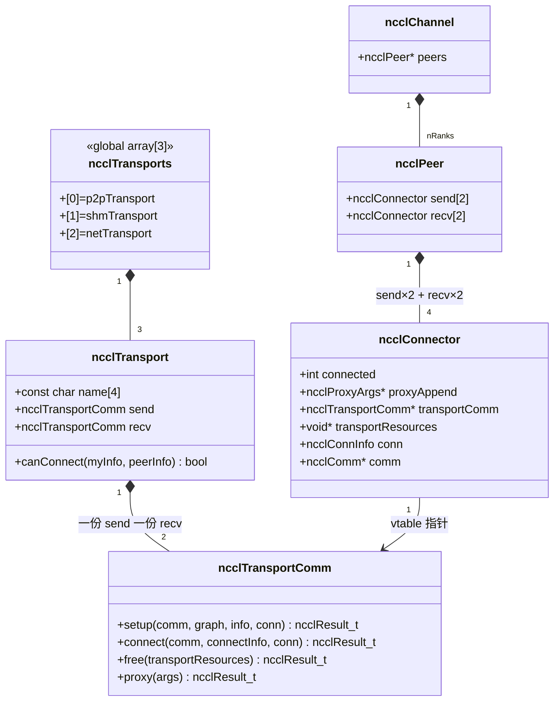

**全局注册表**（[src/transport.cc:15-19](src/transport.cc)）：

```c
struct ncclTransport ncclTransports[NTRANSPORTS] = {
  p2pTransport,    // TRANSPORT_P2P = 0
  shmTransport,    // TRANSPORT_SHM = 1
  netTransport,    // TRANSPORT_NET = 2
};
```

CollNet 是 **第四类传输**，但**不在这张全局表里**，由 `ncclTransportCollNetSetup` 单独走专路（[transport.h:60-63](src/include/transport.h)）。原因：CollNet 不是 peer-to-peer，而是 "把 N 个 rank 经 NIC 接到网内 reduction 树"，与 P2P/SHM/NET 的两端配对模型不兼容。

#### 4.5.3 `ncclTransport` 与 `ncclTransportComm` vtable

定义见 [transport.h:43-55](src/include/transport.h)：

```c
struct ncclTransportComm {
  ncclResult_t (*setup)  (struct ncclComm*, struct ncclTopoGraph*,
                          struct ncclPeerInfo* myInfo, struct ncclPeerInfo* peerInfo,
                          struct ncclConnect*, struct ncclConnector*,
                          int channelId, int connIndex);
  ncclResult_t (*connect)(struct ncclComm*, struct ncclConnect*,
                          int nranks, int rank, struct ncclConnector*);
  ncclResult_t (*free)   (void* transportResources);
  ncclResult_t (*proxy)  (struct ncclProxyArgs*);             // 仅网络后端实现
};

struct ncclTransport {
  const char name[4];                                          // "P2P" / "SHM" / "NET"
  ncclResult_t (*canConnect)(int*, struct ncclTopoSystem*,
                             struct ncclTopoGraph*,
                             struct ncclPeerInfo*, struct ncclPeerInfo*);
  struct ncclTransportComm send;                               // 各自一份
  struct ncclTransportComm recv;
};
```

**四个回调的职责**

| 回调 | 何时调 | 做什么 | 谁实现 |
|---|---|---|---|
| `canConnect` | `selectTransport`（[transport.cc:31](src/transport.cc)）逐个尝试 | 判定本对 (myInfo, peerInfo) 能否用这种 transport（如 P2P 需同 host + cuda P2P 通过；NET 需跨节点） | 一份/transport |
| `setup` | 选中 transport 后立即调 | 分配 host/device buffer、写 `ncclConnect`（128B 出口信息：busId、IPC handle、IB QP 号、socket 地址等） | 一份/方向（send/recv） |
| `connect` | bootstrap 互换 `ncclConnect` 之后 | 用对端发来的 connectInfo 完成 RDMA QP modify、SHM mmap、CUDA IPC OpenMemHandle 等收尾 | 一份/方向 |
| `free` | `commFree` 时 | 释放 `transportResources` | 一份/方向 |
| `proxy` | proxy 线程 progress 时 | 推进网络收发(IB poll CQ、socket epoll、CollNet request) | **仅 NET / CollNet 实现**;P2P/SHM 留空 `NULL` |

**为什么 send 和 recv 分两份 vtable**

发送和接收的资源完全不同(发要 reg 远端的 buffer 做 RDMA write,收要 reg 本地 buffer 等;IB 还要 QP 单向)。各自一份 vtable 让两个方向的实现逻辑完全解耦,代码更平铺直叙。

**四种后端的 vtable 实例**:

| 文件 | 实例 | proxy 字段 |
|---|---|---|
| `p2p.cc:306` | `p2pTransport` | `{p2pSendSetup, p2pSendConnect, p2pSendFree, NULL}` × 2 — **无 proxy**(纯 device-side cudaMemcpy/IPC) |
| `shm.cc:171` | `shmTransport` | 同样 `NULL` — 数据通过 host shared memory mmap,**device kernel 直接读写**,无需 host 介入 |
| `net.cc:528` | `netTransport` | `{netSendSetup, netSendConnect, netSendFree, netSendProxy}` — **有 proxy**,网络 IO 必须 CPU 驱动 |
| `coll_net.cc:552` | `collNetTransport` | 同样有 proxy(SHARP 也需 CPU 驱动 reduction 请求) |

#### 4.5.4 `ncclConnector` — 单向连接的状态容器

定义见 [devcomm.h:95-103](src/include/devcomm.h)：

```c
struct ncclConnector {
  int connected;                                       // 0/1, debounce
  struct ncclProxyArgs* proxyAppend;                   // proxy 队列尾,后述
  struct ncclProxyArgs** proxyAppendPtr;
  struct ncclTransportComm* transportComm;             // vtable 指针(本 connector 选中的后端)
  void* transportResources;                            // 后端私有数据(IB QP/CQ、SHM ptr、IPC handle...)
  struct ncclConnInfo conn;                            // device 可见的运行时句柄
  struct ncclComm* comm;
};
```

**关键设计**

- **一个 connector = 一个方向**:NCCL 把双向通信拆成两个 connector(send / recv),分别选 transport、分别建连。
- **`transportComm` 是 vtable 指针**:同一个 `ncclConnector` 类型,通过赋不同的 `transportComm` 实现"运行时选后端"。这是 C 模仿虚函数的标准做法。
- **`transportResources` 是 `void*`**:后端私有(`net_ib.cc` 里它指向 `ncclIbSendResources`,`shm.cc` 指向 `shmSendResources`,`p2p.cc` 指向 `p2pSendResources`)。**对外完全不透明**,只能通过 vtable 回调操作。
- **`conn` (`ncclConnInfo`)**:device 端能直接访问的部分,包含 `buffs[]`(3 个协议各自的 ringbuf 指针)、`head/tail` 计数器、`step` 进度。GPU kernel 通过这个结构与 host(或对端 GPU)同步,见 §4.3.6 ringbuf 模型。

**`ncclPeer` 把 send/recv connector 打包**(每对 peer × 2 个 connIndex)([devcomm.h:138-142](src/include/devcomm.h)):

```c
#define NCCL_MAX_CONNS 2
struct ncclPeer {
  struct ncclConnector send[NCCL_MAX_CONNS];           // 双 connIndex 服务 ring 双向 / tree+collTree 不同链路
  struct ncclConnector recv[NCCL_MAX_CONNS];
};
```

`NCCL_MAX_CONNS=2` 是因为一个 channel 同时承载 ring 与 tree,两套链路可能需要不同的连接(connIndex=0 给 ring/tree;collTree 复用)。

#### 4.5.5 后端选择:`selectTransport` 的优先级

在 [transport.cc:21-40](src/transport.cc) 中:

```c
template <int type>  // 0=recv, 1=send
static ncclResult_t selectTransport(comm, graph, connect, channelId, peer, connIndex) {
  ...
  for (int t = 0; t < NTRANSPORTS; t++) {
    struct ncclTransport* transport = ncclTransports + t;
    int ret = 0;
    NCCLCHECK(transport->canConnect(&ret, comm->topo, graph, myInfo, peerInfo));
    if (ret) {                                          // 第一个能连的就用
      connector->transportComm = (type == 1) ? &transport->send : &transport->recv;
      NCCLCHECK(transportComm->setup(...));
      return ncclSuccess;
    }
  }
  WARN("No transport found !");
  return ncclInternalError;
}
```

**优先级 = 全局数组顺序 = P2P > SHM > NET**:
- P2P 最快(NVLink/PCI 直接 memcpy / IPC),先试。
- 不可达则试 SHM(同节点跨 NUMA 没 P2P)。
- 还不行才走 NET(跨节点)。
- 三个都不行就报 "No transport found"。

`canConnect` 的判定逻辑各后端不同(见各文件的 `p2pCanConnect/shmCanConnect/netCanConnect`),主要看 `hostHash` 是否相同、是否经 CUDA P2P 测试通过、对端是否有 NIC 等。

#### 4.5.6 P2P setup 流程:bootstrapSend/Recv 交换 `ncclConnect`

`ncclTransportP2pSetup`([transport.cc:67](src/transport.cc))是搭建一个 graph(ring 或 tree 或 collNet)所有 channel 连接的入口。结构上分三阶段:

> 图 4-8:`ncclTransportP2pSetup` 三阶段时序

```mermaid
sequenceDiagram
  autonumber
  participant Me as 本 rank
  participant TM as selectTransport+vtable
  participant Boot as bootstrap (TCP)
  participant Peer as 对端 rank
  participant TC as transportComm.connect

  Note over Me,TM: 阶段 1:本地 setup
  loop 对每个 (peer, channel) ∈ connectRecv/Send 位图
    Me->>TM: selectTransport(recv|send, ...)
    TM->>TM: 遍历 ncclTransports,第一个 canConnect→true 的胜出
    TM->>TM: connector->transportComm = &transport->send|recv
    TM->>TM: transportComm->setup() 分配资源、填 ncclConnect(128B)
  end

  Note over Me,Peer: 阶段 2:bootstrap 交换 ncclConnect 信息
  Me->>Boot: bootstrapSend(peer, tag, recvData+sendData)
  Boot->>Peer: TCP 转发
  Peer-->>Boot: bootstrapSend 自己的 connect
  Boot-->>Me: bootstrapRecv(...)

  Note over Me,TC: 阶段 3:用对端信息完成 connect
  loop 每个 connector
    Me->>TC: transportComm->connect(comm, peerConnectInfo, ...)
    TC->>TC: IB: modify QP RTR/RTS; SHM: mmap; P2P: cudaIpcOpenMemHandle
    TC-->>Me: connector->connected = 1
  end
```

**关键点**

- **`ncclConnect` 是 128 字节的不透明出口信息**(`CONNECT_SIZE=128`,[transport.h:38-41](src/include/transport.h)):每个后端按自己的格式塞进 PCI busId、CUDA IPC handle、IB GID + QP 号 + 内存 key 等。bootstrap 只负责按字节透传。
- **bootstrap 用 `tag = (peerIdx<<8) + graph_id+1`**:同一对 peer 可能在 ring/tree/collNet 各 setup 一次,tag 用来区分,避免消息错乱。
- **`connectRecv[peer]` 与 `connectSend[peer]` 是 bitmap**(每 bit 一个 channel),由 §5.4 的 `ncclTransportP2pConnect` 在搜索结果落实到 channel 时填写。

#### 4.5.7 Proxy 线程:host 端的网络驱动器

P2P/SHM 的 setup 后**完全不需要 host 介入**(device kernel 直接读写远端 buffer);但 NET / CollNet 后端的传输离不开 host CPU(投递 IB WR、poll CQ、socket epoll),所以每个 communicator 有一条 proxy pthread 专职这件事。

##### 三层数据结构

```c
struct ncclProxyState {                                // 每 comm 一份,在 comm->proxyState
  pthread_cond_t  cond;
  pthread_mutex_t opsMutex;
  pthread_mutex_t poolMutex;
  bool            stop;
  struct ncclProxySharedBuffers sharedBuffs;

  struct ncclProxyArgs* ops;                           // 当前正在跑的 op 链表(proxy 线程独占)
  struct ncclProxyArgs* postedOps;                     // 主线程已 post 等待 proxy 拾起(opsMutex 保护)
  struct ncclProxyArgs* postedOpsEnd;
  struct ncclProxyArgs* nextOps;                       // 主线程攒批中(主线程独占)
  struct ncclProxyArgs* nextOpsEnd;

  struct ncclProxyArgs* pool;                          // 空闲 ProxyArgs 池(主线程独占)
  struct ncclProxyArgs* poolFreed;                     // proxy 释放、待归还
  struct ncclProxyArgs* poolReturned;                  // 已归还给主线程(poolMutex)
};

struct ncclProxyArgs {                                 // 一次集合通信或 P2P 在一个 connector 上的"任务"
  proxyProgressFunc_t progress;                        // = connector->transportComm->proxy
  struct ncclProxySubArgs subs[MAXCHANNELS];           // 多个子任务(每 sub = 一个 channel)
  int nsubs;
  int sliceSteps, chunkSteps, chunkSize;
  uint64_t opCount, commOpCount;
  int protocol; ncclDataType_t dtype; ncclRedOp_t redOp; ncclPattern_t pattern;
  int root, state;                                     // state: None/Ready/Progress

  struct ncclProxyArgs* next;                          // 单链表
  struct ncclProxyArgs* nextPeer;
  struct ncclProxyArgs** proxyAppendPtr;
};

struct ncclProxySubArgs {                              // 一个子任务的运行时进度
  struct ncclChannel*   channel;
  struct ncclConnector* connector;                     // ← 回指那个连接器
  int nsteps;
  ssize_t sendbytes, recvbytes;
  int sendChunkSize, recvChunkSize;
  int delta;

  uint64_t base, posted, received, flushed, transmitted, done, end;
  void* requests[NCCL_STEPS];                          // 在飞 IB request
};
```

##### connector ↔ proxy 是怎么关联起来的

> 图 4-9:enqueue 提交 → proxy 推进的链路

```mermaid
flowchart LR
  EQ["enqueue.cc\nncclEnqueueCheck"]
  -- "ncclProxySaveColl\nor SaveP2p" --> SP["proxy.cc\nSaveProxy → allocateArgs"]
  SP -- "op->progress = connector->transportComm->proxy\nop->subs[0].connector = connector" --> NextOps["state->nextOps 链尾"]
  NextOps -- "ncclProxyStart 时 splice 到 postedOps" --> Posted["state->postedOps\n(opsMutex)"]
  Posted -- "proxy 线程 cond_wait 唤醒\nProxyAppend → state->ops" --> Ops["state->ops"]
  Ops -- "progressOps 循环\n调 op->progress(op)" --> Proxy["transportComm->proxy\n= netSendProxy / netRecvProxy / collNet*Proxy"]
  Proxy -- "推进 sub->posted/received/transmitted/done\n按 NCCL_STEPS 流水" --> Conn["connector->conn (ncclConnInfo)\nhead/tail 推进 → GPU 看到"]
  Proxy -- "op->state = None\n时 removeOp → poolFreed" --> SP
```

核心绑定发生在 [proxy.cc:206](src/proxy.cc):

```c
op->progress              = connector->transportComm->proxy;   // 关键!
op->subs[0].connector     = connector;
op->state                 = ncclProxyOpReady;
op->proxyAppendPtr        = connector->proxyAppendPtr;
```

**等价于**:每个 ProxyArgs 都是"一段 work + 一个 vtable 指针 + 一个 connector"。proxy 线程不需要知道是哪种后端,只管 `op->progress(op)` 就行 —— **多态在 ProxyArgs 这一层重新发生一次**。

##### proxy 线程主循环([proxy.cc:423](src/proxy.cc))

```c
void* persistentThread(void *comm_) {
  ...
  while (1) {
    if (*comm->abortFlag) return NULL;                 // ① 检查 abortFlag

    while (*opsPtr == NULL) {
      if (state->stop) return NULL;                    // ② 优雅退出
      ret = ncclProxyAppendPosted(state);              // ③ 拉取主线程 post 的新 op
      ...
    }
    progressOps(state, opsPtr, &idle, comm);           // ④ 推进所有 op 一轮
    if (idle) sched_yield();                           // ⑤ 全 idle 让 CPU
  }
}
```

```c
// progressOps 核心:
while (op) {
  NCCLCHECK(op->progress(op));                         // 调到 netSendProxy/netRecvProxy/collNet*Proxy
  if (op->state == ncclProxyOpNone) removeOp(...);     // 完成,归还到 poolFreed
  else op = op->next;
}
```

##### 一个 `netSendProxy` 的内部行为(简化)

```text
for each sub in op->subs:
  while sub->done < sub->nsteps:
    if sub->posted - sub->done < NCCL_STEPS:         # 流水未满
      等 GPU 写入 buffer (轮询 sub->channel 的 head 推进)
      ib_post_send( buffer @ slot[sub->posted % NCCL_STEPS] )
      sub->posted++
    poll IB CQ → 完成的 WR 对应 sub->done++
    更新 connector->conn.tail (让 GPU 知道可以复用 slot)
  sub 全部完成 → op->state = None
```

##### `ncclProxySharedBuffers` 与 proxy 内存亲和性

[proxy.h:69-77](src/include/proxy.h):

```c
struct ncclProxySharedBuffers {
  int   size;
  char* cudaBuff;                                      // device 端共享 bounce buffer
  char* hostBuff;                                      // host 端共享 bounce buffer
  struct ncclProxyArgs* proxyAppend[2*MAXCHANNELS];    // send/recv × MAXCHANNELS 的 op 链尾
  struct ncclProxyArgs* proxyAppendCollNet[2*MAXCHANNELS];
  void* collNetResources;
};
```

**NUMA 亲和性设计**:`allocateArgs` 在分配新 ProxyArgs pool 之前会**切到 GPU 同 NUMA 的 CPU 亲和性**([proxy.cc:46-55](src/proxy.cc)):

```c
if (CPU_COUNT(&comm->cpuAffinity)) {
  sched_getaffinity(0, ..., &affinitySave);
  sched_setaffinity(0, ..., &comm->cpuAffinity);
}
NCCLCHECK(ncclCalloc(&newPool, 1));                    // 此时分配的内存落在本地 NUMA
if (CPU_COUNT(&comm->cpuAffinity)) {
  sched_setaffinity(0, ..., &affinitySave);            // 立刻恢复
}
```

如果 ProxyArgs 落到与 GPU 不同的 NUMA,proxy 线程 poll 时跨 socket 访问延迟会显著放大,在 alltoall 等小消息密集场景上尤为明显。这套显式切换/恢复亲和性的模式是 NCCL 在 host 侧"贴近 GPU 跑"设计的具体落地。

#### 4.5.8 P2P/SHM vs NET 路径对比

| 维度 | P2P / SHM | NET / CollNet |
|---|---|---|
| 数据通路 | device ↔ device(NVLink)/ device ↔ host shared mem | device ↔ host bounce(可选 GDR 跳过) ↔ NIC ↔ NIC ↔ host ↔ device |
| host 是否介入热路径 | **否** — kernel 直接读写远端 buffer | **是** — 必须有 proxy 线程 poll/post |
| `transportComm.proxy` | `NULL` | 必填 |
| 完成同步 | ringbuf head/tail(volatile + threadfence) | 同左 + IB CQ 完成事件 |
| 失败检测 | CUDA 错误(可见) | 需主动 poll CQ → 写 `fatalError`(见 §5.5.2) |
| 启动开销 | 低(IPC handle 共享) | 高(QP 建立、内存注册) |

这种分裂直接来自 vtable 的 `proxy` 字段:**`NULL` 意味着完全 device-driven,非 `NULL` 意味着 host 必须参与**。是整个 transport 模块设计上最重要的二分。

#### 4.5.9 关键设计回顾

- **vtable + 全局数组注册**:`ncclTransports[3]` 加上 CollNet 旁路,4 种 transport 用同一套上层代码(`selectTransport` / `ncclTransportP2pSetup`)。新增网络后端(EFA、自研 NIC)走 `ext-net/*` 插件路径,不动 core 代码。
- **send / recv 分两份 vtable**:让两个方向的资源管理彻底解耦;ring 双向 channel、tree 上下行天然适配。
- **`ncclConnect = char[128]` 不透明出口**:bootstrap 不需理解任何后端协议,仅按字节透传;扩展性极佳。
- **`ncclConnInfo` 是 device 与 transport 的唯一契约**:GPU kernel 只看 `buffs/head/tail`,不知道下面是 IPC 还是 IB;transport 任意切换不影响 device kernel。
- **proxy 通过 `op->progress = vtable->proxy` 二次多态**:让单一 proxy 线程同时驱动 NET + CollNet 多种后端的多个 op,而代码本身不需要分支。
- **proxy 内存的 NUMA 亲和性**:proxy 池分配前显式切换到 GPU 同 NUMA 的 CPU,分配完再恢复用户亲和性;体现了 host 端代码在跨节点高带宽场景下也要"贴近 GPU 跑"的设计哲学。

### 4.6 `enqueue` / `group` 模块：API ↔ device kernel ↔ transport 的中央调度

§4.3 讲了 graph 怎么把硬件拓扑变成"通信图"，§4.5 讲了 transport 怎么把"通信图"落实成连接和 proxy。但两端之间还差一层：**用户每次调 `ncclAllReduce` 等 API 时，到底是怎么把"用户参数"变成 GPU kernel 启动 + proxy 任务投递的？** 这一层就是 `enqueue` + `group` 模块。

可以把它理解为 NCCL 的"调度器"：
- 上游接收 21 个 API 入口的调用 → 翻译成 work elem；
- 横向决定 algo × proto × nChannels × nThreads；
- 下游分两路投递：device 端 `cudaLaunchKernel` 与 host 端 `ncclProxyStart`。

#### 4.6.1 调度器的输入与输出

> 图 4-10：enqueue/group 在数据流中的位置

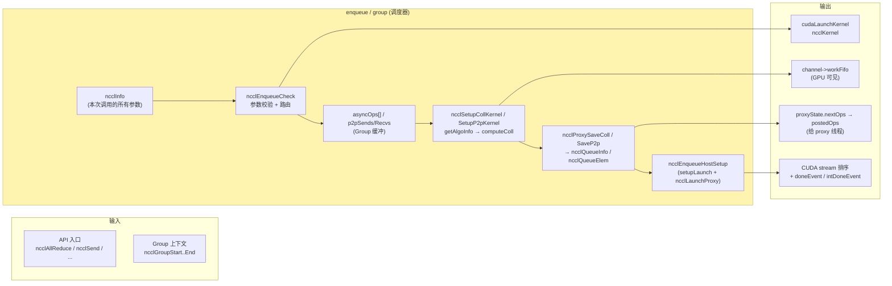

调度器**对上游**消费 `ncclInfo`(一次调用的全部参数封装)；**对下游**输出三件东西：
1. GPU 端 `ncclWork[]` 写到 `channel->workFifo`，device kernel 读它执行；
2. host 端 `ncclProxyArgs` 链表，proxy 线程消费它驱动网络 IO；
3. CUDA stream 上的 `cudaLaunchKernel` + `doneEvent`，把"已 enqueue"的状态交还给应用。

#### 4.6.2 核心数据结构

##### `ncclInfo`：一次 API 调用的参数封装

定义见 [include/info.h](src/include/info.h)。集成了：

```c
struct ncclInfo {
  ncclFunc_t coll;                                     // AllReduce / Broadcast / ... / SendRecv
  const char* opName;
  const void* sendbuff;
  void*       recvbuff;
  size_t      count;
  ncclDataType_t datatype;
  ncclRedOp_t op;
  int  root;                                           // 对 P2P 是 peer
  ncclComm_t comm;
  cudaStream_t stream;
  int  chunkSteps, sliceSteps;                         // 算法粒度提示(由集合通信类型决定)

  // 由 enqueue 阶段填充
  int algorithm, protocol;                             // 由 getAlgoInfo 决定
  int nChannels, nThreads;                             // 由 computeColl 决定
  ncclPattern_t pattern;                               // Ring / TreeUp / TreeUpDown / CollTreeUpDown
  size_t nBytes;
  int    channelId;                                    // P2P 用
  ssize_t sendbytes, recvbytes;                        // P2P 用
  int delta;                                           // P2P 用,rank 距离
  int sendChunkSize, recvChunkSize;
};
```

**关键设计**

- `ncclInfo` 是一个**胖参数包**：API 入口先填一半(sendbuff/count/datatype 等用户输入)，enqueue 阶段后续函数再填另一半(algo/proto/nChannels)。
- 集合通信、Send/Recv **共用同一个结构**，由 `coll == ncclFuncSendRecv` 区分走哪条路径。
- 在 group 模式下整个 `ncclInfo` 会被 `memcpy` 到 `comm->asyncOps[]` 数组缓冲，所以**结构必须 self-contained**(指针所指的 user buffer 由 stream 保证不被释放)。

##### `ncclQueueInfo` / `ncclQueueElem`：调度器内部的工作清单

每个 comm 持一份 `ncclQueueInfo`(在 `comm->enqueueInfo`)，由 `ncclSetupCollKernel` 阶段往里 `getNewElem` 追加 `ncclQueueElem`。每个 `ncclQueueElem` 大致是：

```c
struct ncclQueueElem {
  struct ncclWorkElem  work;                           // 给 device kernel 的工作描述符
  struct ncclProxyArgs proxyArgs;                      // 给 proxy 线程的任务模板
};
```

**关键设计**:这是**调度器最关键的设计** — `ncclQueueElem` 把"device 工作描述"和"host proxy 任务"打包成同一份记录，**保证两侧任务严格对应**。后续 `ncclEnqueueCollKernel` 复制 `work` 进 channel workFifo，同时 `ncclProxySaveColl` 把 `proxyArgs` 发给 proxy 线程；GPU 与 host 网络驱动看到的是**字节级一致**的工作。

##### `ncclWorkElem` / `ncclWork`：device 端的工作描述符

回顾 §6.1.2 的字段定义：`ncclWorkElem` 64B、power-of-two；`ncclWork` 是 8 个 `ncclWorkElem` 的合集；`channel->workFifo[NCCL_MAX_OPS=2048]` 是这两者的环形队列。

调度器的工作就是**填好它**，然后让 GPU kernel 读它执行 —— 因此 `ncclWorkElem` 是 NCCL 整个系统里**调度器与 device kernel 之间的唯一契约**。

#### 4.6.3 三种调度路径

`ncclEnqueueCheck`([enqueue.cc:989](src/enqueue.cc)) 是所有 API 的总入口，按当前模式分发到三条不同的调度路径：

| 模式 | 触发条件 | 行为 |
|---|---|---|
| **同步直接模式** | `ncclAsyncMode() == 0`(默认) | 当前调用立即 `ncclSetupCollKernel` + `ncclEnqueueHostSetup<0>` + launch；阻塞返回 |
| **Async / Group 模式** | 在 `ncclGroupStart..End` 之间(或多线程 init) | 仅 `ncclSaveAsyncColl` / `ncclSaveP2p` 把 info 存到 `asyncOps[]` / `p2pSends/Recvs[]`，**不做任何 setup**；真正的 setup + launch 推迟到 `ncclGroupEnd` 统一处理 |
| **CUDA Graph 捕获模式** | `cudaStreamIsCapturing(...)==Active`(`ncclGetCudaGraph` 检测到) | `ncclSetupCollKernel` 仍跑，但 `ncclEnqueueHostSetup` 改成 `cudaGraphAddHostNode` 把它注册成 graph 的 host node；下次 `cudaGraphLaunch` 时由 driver 调起，自动重建 work fifo |

> 图 4-11：三种调度路径

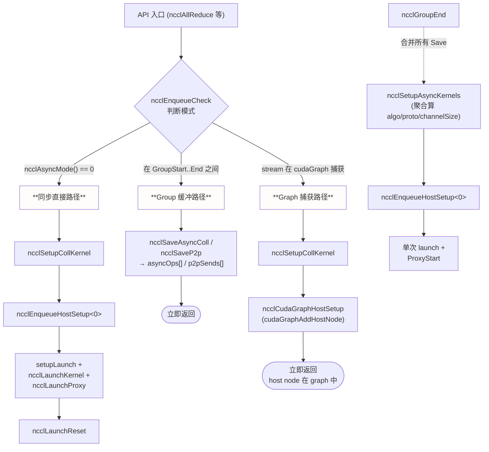

#### 4.6.4 算法/协议选择:`getAlgoInfo` 时间模型

不在 group 中且非单调用走 `ncclSetupCollKernel` → `getAlgoInfo`([enqueue.cc:381](src/enqueue.cc)):

```c
float minTime = 3600000000.0;                          // 1 小时(占位最大值)
info->algorithm = -1; info->protocol = -1;
if (comm->nRanks == 1) return ncclSuccess;             // 单 rank 退化

for (int a = 0; a < NCCL_NUM_ALGORITHMS; a++) {        // Tree / Ring / CollNet
  if (a == NCCL_ALGO_COLLNET && !collNetSupport) continue;
  for (int p = 0; p < NCCL_NUM_PROTOCOLS; p++) {       // LL / LL128 / Simple
    float time;
    NCCLCHECK(ncclTopoGetAlgoTime(info, a, p, numPipeOps, &time));
    if (time >= 0 && time < minTime) {
      info->algorithm = a; info->protocol = p; minTime = time;
    }
  }
}
```

**关键设计**

- **9 个 (algo, proto) 组合穷举**:`ncclTopoGetAlgoTime` 用 §4.3 的 `comm->latencies[][][]` 与 `bandwidths[][][]` 表算预计时间，**O(9) 常数次表查找**，开销可忽略。
- **`time < 0` 表示禁用**:某些组合不可用(如 `LL128_NTHREADS=-1` 或硬件不支持)直接跳过。
- **`numPipeOps`**:在 group 模式聚合时传入"该 channel 上有几个 op 排队"，让模型把流水深度算进去。
- **环境变量覆盖**:`NCCL_ALGO=Ring` / `NCCL_PROTO=Simple` 会让 `latencies` 表里非选定项变成 `-1`，间接强制选择。

#### 4.6.5 Channel 分配:Round-robin vs Shortest Queue

调度器把每个 op 分散到多个 channel 上并行,`getNextChannel`([enqueue.cc:626](src/enqueue.cc)) 有两种策略:

```c
if (comm->asyncAllocMode == ncclComm::SHORTEST_QUEUE) {
  *nextChannel = findShortestChannel(comm);            // 选当前 totalSize 最小的 channel
} else {
  *nextChannel = comm->lastChannel % comm->nChannels;  // 顺序轮询
  comm->lastChannel++;
}
```

| 模式 | 行为 | 适用 |
|---|---|---|
| `ROUND_ROBIN`(默认) | 均衡占用所有 channel | 同尺寸 op 占主导的典型 DDP |
| `SHORTEST_QUEUE` | 尽量打满已用 channel | 异构尺寸 op 混合,如 DP+TP+PP 多 comm 混跑 |

**关键设计:为什么需要"分散到多 channel"** —— 一个 channel = GPU 一个 thread block。`nChannels` 越大,SM 并行度越高;但每 channel 上 work 越多则启动开销越大。`getAlgoInfo` 决定 `nChannels`,`getNextChannel` 决定 work 落到具体哪一条 —— **两者解耦**:算法选择关心"用多少",通道分配关心"用哪些"。

#### 4.6.6 Group 聚合:`ncclSetupAsyncKernels` 的核心逻辑

`ncclGroupEnd` 收到一组 `asyncOps[]` 时,调 `ncclSetupAsyncKernels`([enqueue.cc:663](src/enqueue.cc))合并它们:

```c
if (asyncOpCount == 1) {                               // 单调用,走快速路径
  info->nChannels = 0;
  ncclSetupCollKernel(info);
} else {                                               // 真正聚合
  // 1) 计算 channelSize:每条 channel 大致承载多少字节
  size_t channelSize = comm->channelSize > 0 ? comm->channelSize
                     : (allReduce + collNet) ? 256 KiB
                     : NCCL_AGG_CHANNEL_SIZE × min(16, nRanks);
  while (asyncTotalSize < channelSize * nChannels && channelSize > MIN) channelSize /= 2;

  // 2) 每个 op 按字节数分到的 nChannels
  for each info in asyncOps:
    info->nChannels = clamp(DIVUP(info->nBytes, channelSize), 1, comm->nChannels);
    channelUsed += info->nChannels;

  // 3) Fast path:若所有 op 是同种 collective,只算一次 algo/proto
  if (allSameColl) {
    struct ncclInfo total = { coll=common, nBytes=asyncTotalSize,
                              nChannels=min(channelUsed, comm->nChannels) };
    getAlgoInfo(&total, ..., perChannelOps);
    propagate total.algorithm/protocol/nThreads to every op;
  }

  // 4) 每个 op 单独 setup,但共享 algo/proto
  for each info in asyncOps: ncclSetupCollKernel(info);
  comm->args.active = 0;  // 关闭 inline 优化,因为有多 op
}
```

**关键设计**

- **`channelSize` 决定 "切多细"**:粒度太大 → channel 利用率低；粒度太小 → 启动开销大。默认 `NCCL_AGG_CHANNEL_SIZE × min(16, nRanks)` 是经验值,可以用 `NCCL_AGG_CHANNEL_SIZE` 环境变量调。
- **Fast path 共享 algo/proto**:相同 collective 的多个 op 共享算法选择,**省 N-1 次 `getAlgoInfo`**;且单个 kernel 内 work elem 共享 `funcIndex`,inline 一次即可。
- **多种 collective 混合时 fast path 失效**:每个 op 独立算 algo/proto;但仍共享一次 launch。
- **CollNet 阈值**:第一个 op 是 `ncclFuncAllReduce` 且 CollNet 支持时,把 `channelSize` 缩到 256 KiB,因为 SHARP 对小消息更高效。

P2P 走另一条路径:`ncclSaveP2p` 已经按 channel hash 分配好(见 §4.5),`ncclGroupEnd` 后期遍历 `p2pSends[peer]`/`p2pRecvs[peer]` 调 `scheduleSendRecv → ncclSetupP2pKernel`,逐个落入 channel 的 P2P 段。

#### 4.6.7 Launch 三步与 launchMode

`ncclEnqueueHostSetup<0>` 跑完后,触发**三步发射**:

```c
ncclLaunchBarrier(comm);    // 多线程同进程时的 intra-process barrier
ncclLaunchKernel(comm);     // cudaLaunchKernel
ncclLaunchProxy(eqInfo);    // ncclProxyStart → 唤醒 proxy 线程
ncclRecordEvents(comm);     // 记录 doneEvent / intDoneEvent
ncclLaunchReset(comm);      // 准备下次
```

`launchMode` 决定 launch 协议([init.cc:441-455](src/init.cc) 与 [enqueue.cc:249-303](src/enqueue.cc)):

| `launchMode` | 协议 | 触发条件 |
|---|---|---|
| `PARALLEL`**(默认)** | 直接 `cudaLaunchKernel`,各 rank 独立 | **没有显式设置 `NCCL_LAUNCH_MODE` 时一律走这条路径**(包括单进程多 GPU) |
| `GROUP` | 用 `cudaLaunchCooperativeKernelMultiDevice` 一次 launch 多 rank | **必须显式设置 `NCCL_LAUNCH_MODE=GROUP`** 才会启用(`init.cc:442-445`),且要求所有 rank 同一 SM 架构、支持 Cooperative Multi-Device launch |
| `GROUP_GRAPH` | 同 GROUP 但通过 cuda graph 捕获 | `launchMode==GROUP` 期间,若 `cudaStreamIsCapturing` 检测到 capture,临时切到这一态([enqueue.cc:958](src/enqueue.cc));capture 结束 `ncclLaunchReset` 切回 GROUP |

**关键澄清**:本文档早期版本错把 GROUP 描述为"单进程多 GPU 自动启用",**这是错的**。NCCL 默认对所有部署形态都走 `PARALLEL`;单进程多 GPU 场景能跑,靠的是 §3.2.5 模式 B 中**用户在主线程里 `ncclGroupStart..End` 包裹 + 用 PARALLEL launch N 次**,而**不是** Cooperative Multi-Device launch。GROUP 模式更激进(`ncclLaunchCooperativeKernelMultiDevice` 在所有 device 上原子启动 N 个 kernel),适合需要更紧的多 device 同步语义的场景,但需用户显式开启。

PARALLEL 路径下,`ncclLaunchKernel` 直接调 `cudaLaunchKernel(params->func, gridDim, blockDim, args, sharedMem, stream)`([enqueue.cc:300](src/enqueue.cc));GROUP 路径才走 `ncclCpuBarrierIn → isLast 调 ncclLaunchCooperativeKernelMultiDevice → ncclCpuBarrierLast → ncclCpuBarrierOut` 的同步协议。

#### 4.6.8 调度器与 transport / device kernel 的接口契约

> 图 4-12:调度器同时驱动 device 和 proxy 两路下游

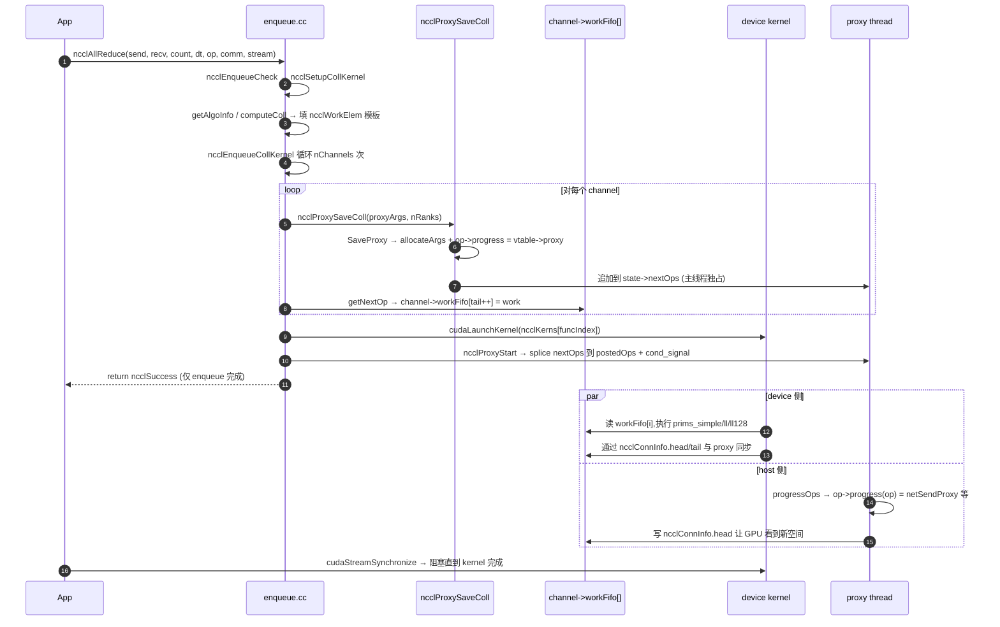

调度器把工作"对称地"投给两侧,然后退出。两侧通过 `ncclConnInfo.head/tail` 自治推进,**调度器不参与热路径同步**。这正是 §3.2.1 "把通信调度全部前置到装配阶段" 的最后一公里 —— 装配定下连接,调度负责一次性投递,稳态运行靠 ringbuf 协议。

#### 4.6.9 关键设计回顾

- **`ncclInfo` 胖参数包**:API 入口与调度内部共用,避免每次拆参数;group 模式下整包 memcpy 缓冲。
- **`ncclQueueElem` 把 device 与 proxy 任务打包**:保证一对一对齐,是双下游对称投递的基础。
- **三种调度路径**(直接 / Group / Graph)**共享同一组 setup 函数**,只在外层壳上分支,代码复用度极高。
- **`getAlgoInfo` 用预计算时间表 O(9) 选最优**:运行时无需重新建模,代价模型一次性在 `ncclTopoTuneModel` 里准备好。
- **Channel 分配与算法选择解耦**:`nChannels` 由 algo 模型决定,落到哪个 channel 由 round-robin/shortest-queue 决定。
- **Group fast path**:同种集合通信批量调用时,N 次 `getAlgoInfo` 合一,显著降低 group 内启动开销。
- **`launchMode` 三态**:默认 `PARALLEL`,**只有显式设置 `NCCL_LAUNCH_MODE=GROUP` 才切到 GROUP**;CUDA Graph capture 期间从 GROUP 进入 GROUP_GRAPH(若 launchMode 已是 GROUP)。**不是自动**,绝大多数生产部署都跑在默认的 PARALLEL。
- **调度器不参与稳态同步**:它一次性把任务交给 device 与 proxy,后续靠 ringbuf 自治。

### 4.7 `bootstrap` 模块:rank 互联与装配期同步

bootstrap 是 NCCL 装配阶段**唯一的跨节点同步通道**。所有其它通信(P2P、SHM、IB、CollNet)都需要 bootstrap 先帮所有 rank 互换 PeerInfo / connectInfo 之后才能起来 —— 鸡生蛋问题靠 bootstrap 这层独立的 TCP 解决。文档前面多次提及 bootstrap,本节给出完整剖析。

#### 4.7.1 设计定位与三个核心问题

bootstrap 要解决三个相互独立的问题:

| 问题 | 解法 |
|---|---|
| **rank 0 如何被其它 rank 找到?** | rank 0 监听一个 TCP socket,其地址塞进 128B 的 `ncclUniqueId`,通过带外通道(MPI_Bcast / Redis / 文件)分发给所有 rank |
| **N 个 rank 如何高效互换 PeerInfo?** | 在 init 阶段构造一个**逻辑 ring**(每 rank 知道前驱与后继的 TCP 地址),后续所有 AllGather 都走这个 ring,N-1 步完成 |
| **后续装配阶段(graph、transport)如何精确点对点通信?** | bootstrap 在 init 阶段也 AllGather 了**所有 rank 的监听地址**到 `peerCommAddresses[nranks]`,后续 `bootstrapSend(peer, tag, data)` / `bootstrapRecv` 直接按 rank 查地址连接 |

#### 4.7.2 `ncclUniqueId` 的本质

```c
// nccl.h
#define NCCL_UNIQUE_ID_BYTES 128
typedef struct { char internal[NCCL_UNIQUE_ID_BYTES]; } ncclUniqueId;
```

物理上 `ncclUniqueId` 就是 root rank 监听 socket 的 **`union socketAddress`**(IPv4 / IPv6 通用),共 128B(实际只占前几十字节,其余 padding)。

**生成方式**(`bootstrapGetUniqueId` @ [bootstrap.cc:173](src/bootstrap.cc)):

1. 调 `bootstrapNetInit` 选定本地网卡(优先级:`NCCL_COMM_ID` 环境变量 > `findInterfaces` 自动)
2. `bootstrapCreateRoot` 创建一个 listen socket 并**起一个 pthread `bootstrapRoot`** 作为协调者
3. 把 listen socket 地址写进 `ncclUniqueId.internal[]` 返回

`NCCL_COMM_ID=<ip>:<port>` 环境变量可强制 root 监听地址,常用于多机训练:rank 0 把 `ncclUniqueId` 通过 MPI bcast 给所有 rank,但 IP 段需要全网可达。

#### 4.7.3 装配期的"两步握手"协议

> 图 4-13:bootstrap rank 互联(ring 形成)

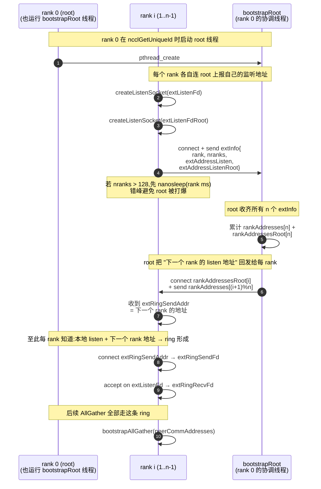

**关键设计点**:

- **两套独立的监听 fd**(`extListenFd` 用于后续 AllGather ring,`extListenFdRoot` 仅用于接收 root 回发的"下一跳"信息),分离让协议清晰。
- **`bootstrapRoot` 线程是一次性的**:收齐 n 个 rank 地址、回发完"下一跳"后**立即退出**,后续不再参与。所以 rank 0 在 init 完成后不会因为承担 root 角色而被额外占用资源。
- **`nranks > 128` 时的错峰连接**([bootstrap.cc:349-356](src/bootstrap.cc)):`rank` 越大延迟越久(`nanosleep(rank * 1ms)`),避免数千 rank 同时 SYN root 导致 backlog 溢出。

#### 4.7.4 ring 形成后的两套通信原语

bootstrap 暴露给上层(`init.cc` / `transport.cc` 等)的接口分两类:

##### 4.7.4.1 `bootstrapAllGather` — ring AllGather

```c
ncclResult_t bootstrapAllGather(void* commState, void* allData, int size);
```

实现是**最朴素的 ring AllGather**([bootstrap.cc:394-418](src/bootstrap.cc)):

```c
for (int i = 0; i < nranks - 1; i++) {
  size_t rslice = (rank - i - 1 + nranks) % nranks;
  size_t sslice = (rank - i + nranks) % nranks;
  bootstrapNetSend(extRingSendFd, data + sslice*size, size);  // → 右邻
  bootstrapNetRecv(extRingRecvFd, data + rslice*size, size);  // ← 左邻
}
```

- N 次循环,每次每 rank 发一片、收一片,N-1 步后所有 rank 都拿到完整数据。
- 用在 §5.4 中的 **AllGather1**(peerInfo + cudaCompCap)和 **AllGather3**(graphInfo + topoRanks)两次同步点。
- 性能不重要(装配只发生一次,且数据量 KB-MB 级),所以选了最简单的 ring 实现而非 recursive doubling 等更优算法。

##### 4.7.4.2 `bootstrapSend` / `bootstrapRecv` — 直连 peer-to-peer

```c
ncclResult_t bootstrapSend(void* commState, int peer, int tag, void* data, int size);
ncclResult_t bootstrapRecv(void* commState, int peer, int tag, void* data, int size);
```

实现([bootstrap.cc:420-432](src/bootstrap.cc)):

```c
// Send:
union socketAddress* addr = state->peerCommAddresses + peer;
connectAddress(&tmpFd, addr);
bootstrapNetSend(tmpFd, addr, &myRank, sizeof(int));   // 报头:发送方 rank
bootstrapNetSend(tmpFd, addr, &tag, sizeof(int));      //     :tag
bootstrapNetSend(tmpFd, addr, data, size);             // 数据
```

- 每次 `Send/Recv` 都是**新建 TCP 连接**(不复用 ring 上的 fd),因此带 `(senderRank, tag)` 元信息以便接收方解多路复用。
- 接收方的 `bootstrapRecv` 内部维护一个**未匹配消息队列**(`unexConn`,[bootstrap.cc:193](src/bootstrap.cc)):如果 accept 到的消息不是期望的 `(peer, tag)`,先暂存,等之后 `Recv` 调用匹配。
- 主要用在 `ncclTransportP2pSetup` 中互换 `ncclConnect[128B]`(每对 (rank, peer) × (channel, graph_id) 一次),tag 构造为 `(peerIdx<<8) + (graph_id+1)`(详见 §4.5.6)。

#### 4.7.5 `bootstrapBarrier` — 子集 barrier

```c
ncclResult_t bootstrapBarrier(void* commState, int* ranks, int tag, int rank, int nranks);
```

用于 `initTransportsRank` 末尾的 **intra-node barrier**([init.cc:877](src/init.cc)):同节点的 rank 在所有 P2P/SHM 连接建好之后才进入"装配完成"状态,确保下游的 `ncclProxyCreate` 不会在对端还没准备好时收到请求。

底层实现也是 N-1 步 ring,只是参与 rank 是子集(`ranks[]` 指定)。

#### 4.7.6 远端内存分配服务(`ncclRemoteMemAllocationService`)

`bootstrapInit` 末尾还启动一个 **per-rank 的 `allocThread`** pthread([bootstrap.cc:386](src/bootstrap.cc)):

```c
pthread_create(&state->allocThread, NULL,
               ncclRemoteMemAllocationService, state->allocState);
```

这个线程长期监听一个独立 socket,处理 `bootstrapRemAlloc` / `bootstrapRemFree` 请求(其它 rank 通过 bootstrap socket 请求"在我这台机上 cudaMalloc 一块内存并返回 IPC handle")。**用于 CollNet 的跨 rank 共享 buffer 分配**,普通 P2P/SHM/NET 路径不走它。

#### 4.7.7 `bootstrapClose` 与 `bootstrapAbort`

| 函数 | 何时调用 | 行为 |
|---|---|---|
| `bootstrapClose` | `commFree` 时正常关闭 | 关闭所有 socket fd、join allocThread、释放 peerCommAddresses |
| `bootstrapAbort` | 装配失败 cleanup 路径([init.cc:911](src/init.cc)) | 同 Close,但**容忍 fd 已被关闭的情况**,不再 join 线程(避免在异常状态下挂死) |

#### 4.7.8 关键设计回顾

- **TCP 起步、IB 跟上**:bootstrap 必须用 TCP,因为装配阶段还没有 PeerInfo,IB 后端起不来。装配完成后 bootstrap socket **仍保留**(供 CollNet alloc 服务、可能的 abort 信号广播),不参与热路径。
- **ring topology + 直连 fallback**:AllGather 用 ring(简单、能扩到大规模),点对点用 peer addr 直连(灵活、tag 多路复用)。**没有用 TCP 的 multicast 或 MPI_Comm_world**,完全自包含。
- **rank 0 的 root 线程是一次性的**:协调完 ring 形成立刻退出,这是 NCCL "去中心化" 思路的体现 —— 装配完成后不再有"协调者"角色。
- **`peerCommAddresses[nranks]` 是装配期黄金索引**:它把"rank 号 → IP:port" 这个映射固化下来,后续 transport setup 阶段每对 rank 互换 `ncclConnect[128B]` 直接查表。
- **错峰连接 / 未匹配队列 / FD limit 设置**(`setFilesLimit`)等细节:都是面向"数千 rank"的生产健壮性补丁,大规模 GPT 训练直接受益。

---

## 5. 关键流程

### 5.1 流程一：communicator 初始化（`ncclCommInitRank`）

本节给出一张**端到端时序总览图**作为 §5.4 详解的入口。装配过程的代码级展开(7 阶段、两次 AllGather、所有 `ncclTopo*` 调用顺序)**全部在 §5.4**,本节不重复。

> 图 5-1：通信器初始化时序(总览,详见 §5.4)

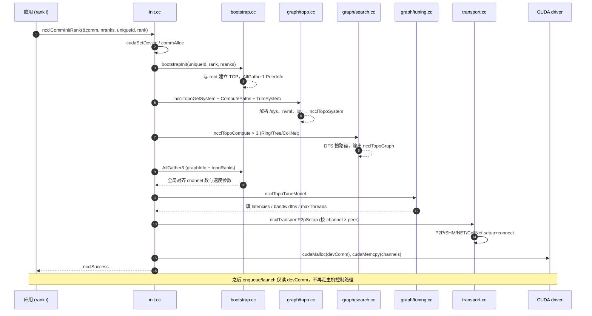

**三条关键设计决策**(完整设计讨论见 §5.4.9):

- **bootstrap 用 TCP 而非已有 IB**:IB 后端要先有 PeerInfo 才能起来,存在鸡生蛋问题,因此只用一个轻量的 TCP rendezvous 做 boot(协议细节见 §4.7)。
- **`initTransportsRank` 是最大 hub(out-degree=144)**:意味着任何对 transport / topology / channel 的修改几乎都会牵动它;PR review 重点。
- **隐式同步点**:`ncclCommInitRank` 在 bootstrap AllGather 处与所有 rank 隐式同步,因此 NCCL 要求多 rank 在不同线程/进程或 `ncclGroupStart/End` 中调用 init,否则单线程死锁。

### 5.2 流程二：单次 `ncclAllReduce` 执行（Ring + Simple 协议）

> 图 5-2：AllReduce ring/simple 端到端

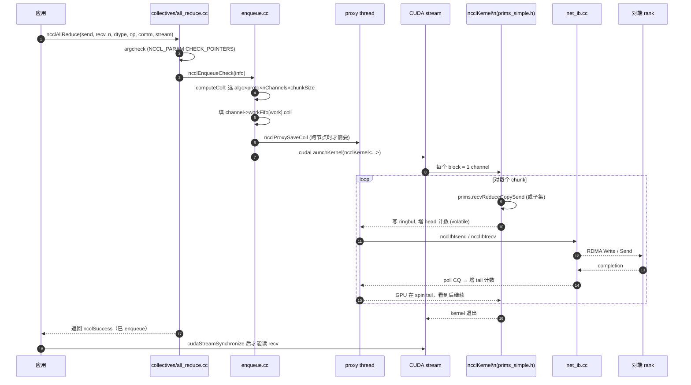

**关键决策**

- **入队即返回**：`ncclAllReduce` 不阻塞，只把 work 写入 FIFO 并 launch kernel；上层用 stream 排序保证 happens-before。
- **device ↔ proxy 通过 ringbuf 同步**：head 由 device 写、proxy 读；tail 反之。`NCCL_STEPS=8` 决定流水深度。
- **ncclAvg 的处理点**：**与数据类型相关**（见 §4.4）。浮点(`float/double/half/bf16`)走 `preOp` —— 每个 rank 在求和前先把输入乘 `1/n`，之后正常累加；整型走 `postOp` —— sum 完成后由消费 rank 做整数除。**浮点路径不依赖"环末端 rank"做事**，所有 rank 在进入 ring 通信前已经 scale 完。

### 5.3 流程三：`ncclGroupStart/End` 聚合多次调用

> 图 5-3：Group 语义聚合 launch

```mermaid
sequenceDiagram
  autonumber
  participant App
  participant G as group.cc
  participant Enq as enqueue.cc
  participant GPU

  App->>G: ncclGroupStart()
  G->>G: comm->groupCudaStream++ (深度计数)
  App->>Enq: ncclAllReduce#1 (info -> asyncOps[])
  App->>Enq: ncclAllReduce#2 (info -> asyncOps[])
  App->>Enq: ncclSend / ncclRecv (info -> p2pSends/Recvs)
  App->>G: ncclGroupEnd()
  G->>G: 把 asyncOps[] 按 channel round-robin 分配
  G->>G: 选最大公约 (nThreads, protocol) 合并到一次 launch
  G->>Enq: ncclSetupAsyncKernels / ncclSetupP2pKernel
  Enq->>GPU: 单次 cudaLaunchKernel (含多个 work elem)
  G-->>App: 返回 (groupCudaStream-- 归零)
```

**关键决策**

- **聚合带来的好处**：减少 launch 次数（CPU↔GPU 控制路径成本）+ 共用 FIFO header；尤其 send/recv 多次调用必须聚合才能避免互相阻塞。
- **`asyncAllocMode`**：`ROUND_ROBIN`（默认）或 `SHORTEST_QUEUE`；前者均衡通道占用、后者尽量打满已用通道。
- **限制**：`ncclCommInitRank` 与集合通信不能在同一个 group 中混合（API 文档已说明）。

### 5.4 流程四：拓扑发现、图搜索与通道分配

本节展开 [`initTransportsRank` (init.cc:492-889)](src/init.cc) 中所有 `ncclTopo*` 调用的真实顺序与协同关系。这套流程一次性完成"硬件拓扑→算法图→每 rank 的 channel 编排"，是 communicator 装配中最耗时也最复杂的阶段。

#### 5.4.1 总览：两次 bootstrap AllGather 夹三次搜索

`initTransportsRank` 把整个装配过程组织成 **AllGather1 → 拓扑发现 → 三次搜索 → AllGather3 → Postset → 调优 → P2P 连接** 七个阶段。两次 AllGather 是显式的全局同步点，三次 `ncclTopoCompute` 是搜索的核心。

> 图 5-4a：`initTransportsRank` 中拓扑相关 API 的调用序列

```mermaid
sequenceDiagram
  autonumber
  participant R as 本 rank
  participant B as bootstrap (TCP)
  participant T as graph/topo.cc
  participant P as graph/paths.cc
  participant S as graph/search.cc
  participant C as graph/connect.cc
  participant U as graph/tuning.cc

  Note over R,B: AllGather1: peerInfo + comm + cudaCompCap
  R->>B: bootstrapAllGather(allGather1Data)
  B-->>R: 所有 rank 的 peerInfo[]
  R->>R: 计算 intraNodeRanks / intraProcRanks<br/>minCompCap / maxCompCap

  Note over R,T: 1) 本节点拓扑发现
  R->>T: ncclTopoGetSystem(comm, &comm->topo)
  T-->>R: ncclTopoSystem* (CPU/GPU/PCI/NIC/NVS 图)
  R->>P: ncclTopoComputePaths(topo, peerInfo)
  P-->>R: 每对节点的最短路径表
  R->>T: ncclTopoTrimSystem(topo, comm)
  R->>P: ncclTopoComputePaths(topo, peerInfo) [再算一次]
  R->>S: ncclTopoSearchInit(topo)
  R->>T: ncclTopoPrint(topo)  [INFO 级日志]

  Note over R,S: 2) 三次 graph 搜索: Ring → Tree → CollNet
  R->>S: ncclTopoCompute(topo, &ringGraph)<br/>pattern=RING, maxCh=MAXCHANNELS/2
  S-->>R: ringGraph: nChannels, speedIntra/Inter, intra[], inter[]
  R->>S: ncclTopoCompute(topo, &treeGraph)<br/>pattern=BALANCED_TREE, maxCh=ringGraph.nChannels
  S-->>R: treeGraph
  R->>S: ncclTopoCompute(topo, &collNetGraph)<br/>pattern=TREE, collNet=1, max=min=ringGraph.nChannels
  S-->>R: collNetGraph
  R->>R: 本地判定 collNetSupport<br/>(intraNodeRanks≤8 & collNetGraph.nChannels>0)

  Note over R,C: 3) 本 rank 预编排
  R->>R: nChannels = min(tree.nCh, ring.nCh)
  R->>C: ncclTopoPreset(comm, &treeGraph, &ringGraph, &topoRanks)
  C-->>R: 本 rank 在每 channel 上的 ringRecv/Send/tree* 雏形

  Note over R,B: AllGather3: graphInfo + topoRanks + collNetSupport
  R->>B: bootstrapAllGather(allGather3Data)
  B-->>R: 全 rank 的 graph 参数 + topoRanks

  R->>R: 用 std::min 对齐 ring/tree/collNet 的所有参数<br/>(nChannels, speedIntra/Inter, type*, sameChannels)
  R->>R: 用 ringRecv[0] 推断 node 划分 → nNodes
  R->>R: nNodes < COLLNET_NODE_THRESHOLD(2) → 关 CollNet

  Note over R,C: 4) 全局拼接 channel
  R->>C: ncclTopoPostset(comm, nodesFirstRank, nodesTreePatterns, allTopoRanks, rings, &collNetGraph)
  C-->>R: comm->channels[].ring/tree/collTree 全部填好

  Note over R,U: 5) CPU 亲和性 + 调优
  R->>T: ncclTopoGetCpuAffinity(topo, rank, &cpuAffinity)
  R->>R: sched_setaffinity → 后续 buffer 分配在本地 NUMA
  R->>R: computeBuffSizes(comm)

  Note over R: 6) 真正建立传输连接 (见 §5.4.4)
  R->>U: ncclTopoTuneModel(comm, minCC, maxCC, &tree, &ring, &collNet)
  U-->>R: comm->latencies/bandwidths/maxThreads/threadThresholds
  R->>T: ncclTopoComputeP2pChannels(comm)
  R->>T: ncclTopoGetNvbGpus(topo, rank, &nvbPeers) [NVB_PRECONNECT=1 时]
```

#### 5.4.2 阶段一：本节点拓扑发现（[init.cc:571-582](src/init.cc)）

```c
// 1. 解析硬件 → ncclTopoSystem
NCCLCHECK(ncclTopoGetSystem(comm, &comm->topo));
// 2. 算所有节点对的最短路径
NCCLCHECK(ncclTopoComputePaths(comm->topo, comm->peerInfo));
// 3. 去掉用不到的资源（远端 GPU / 未参与的 NIC）
NCCLCHECK(ncclTopoTrimSystem(comm->topo, comm));
// 4. trim 改了拓扑，必须重算路径
NCCLCHECK(ncclTopoComputePaths(comm->topo, comm->peerInfo));
// 5. 准备 search（缓存可达 NIC 列表）
NCCLCHECK(ncclTopoSearchInit(comm->topo));
// 6. INFO 级打印
NCCLCHECK(ncclTopoPrint(comm->topo));
```

**关键点**

- `ncclTopoGetSystem` 内部走 `xml.cc → ncclTopoGetXmlFromSys` → 解析 `/sys/bus/pci/devices`、调 nvml/ibv → 输出 XML → 反序列化成 `ncclTopoSystem`。该 hub 节点 out-degree=77，是 graph 模块最大的入口。
- `NCCL_TOPO_FILE=<xml>` 注入时，**跳过整个硬件扫描**直接读文件，是 WSL2、容器、调试的核心入口。
- **路径要算两次**：trim 之前为了知道 NIC 哪些用得上（要先有路径才知道可达性），trim 之后为了让搜索看到正确的剩余拓扑。
- 单 GPU 时 trim 后只剩本 GPU，后续搜索仍能跑（ring 退化成自环）。
- **`ncclTopoSearchInit` 做的事很少**：仅写 `topo->maxWidth` 与 `topo->totalWidth` 两个全局带宽统计量（[search.cc:34-48](src/graph/search.cc)），供后续 search 的剪枝阈值参考。**不缓存任何 NIC 列表或可达性表** —— 那些是 `paths` 阶段已经填好的 `node->paths[type][n]` 提供的。

#### 5.4.3 阶段二：三次图搜索（[init.cc:584-617](src/init.cc)）

每种 graph 的入参不同，但都调同一个 `ncclTopoCompute`：

| Graph | id | pattern | crossNic | collNet | minCh | maxCh | 触发条件 |
|---|---|---|---|---|---|---|---|
| **ring** | 0 | `RING` | `NCCL_CROSS_NIC` | 0 | 1 | `MAXCHANNELS/2 = 16` | 始终搜 |
| **tree** | 1 | `BALANCED_TREE` | `NCCL_CROSS_NIC` | 0 | 1 | `ringGraph.nChannels` | 始终搜 |
| **collNet** | 2 | `TREE` | `NCCL_CROSS_NIC` | 1 | `ringGraph.nChannels` | 同左 | 始终搜，但只在条件满足时启用 |

注意两点：

1. **tree 与 collNet 的 `maxChannels` 都取自 ring 的结果** — ring 是"基准"，其它两种最多与 ring 持平。这是为了保证三种 algo 都能跑同样多的并行 channel。
2. **collNet 的 `minChannels = maxChannels = ringGraph.nChannels`** — 要么全开要么放弃，没有"开一半"。

**`ncclTopoCompute` 的搜索逻辑**（[search.cc](src/graph/search.cc)）

1. 按从 `maxChannels` 递减到 `minChannels` 的顺序尝试。
2. 对每个目标 channel 数：固定一个起点 GPU，DFS 找出一条 Hamilton-like 路径（每个 GPU 经过且只经过一次），跨节点点位由 NIC 决定。
3. 剪枝：路径上每段带宽不能低于阈值（按 NVLink/PCI/NET 各自的 WIDTH 常量）；超出当前最优 `nHops + speed` 立刻回溯。
4. 找到 N 条互不重叠的路径就停。

**搜索后立刻判定本地 CollNet 可用性**（[init.cc:619-624](src/init.cc)）：

```c
if (ncclParamCollNetEnable() == 1 && collNetSupport() == 1 && collNetGraph.nChannels > 0)
  comm->collNetSupport = 1;
if (intraNodeRanks > 8) {  // CollNet 仅支持 ≤ 8 GPU/节点
  if (comm->collNetSupport == 1) WARN("CollNet currently only supports up to 8 GPUs per node");
  comm->collNetSupport = 0;
}
```

#### 5.4.4 阶段三：AllGather3 与跨 rank 参数对齐（[init.cc:626-720](src/init.cc)）

每个 rank 本地搜出的 graph 可能不一致（异构节点、NIC 数不同、容器看到的拓扑不同），必须把所有 rank 的参数**取交集（min）**才能保证一致执行：

```c
for (int i = 0; i < nranks; i++) {
  treeGraph.nChannels    = std::min(allGather3Data[i].tree.nChannels,    treeGraph.nChannels);
  treeGraph.speedIntra   = std::min(allGather3Data[i].tree.speedIntra,   treeGraph.speedIntra);
  treeGraph.speedInter   = std::min(allGather3Data[i].tree.speedInter,   treeGraph.speedInter);
  treeGraph.typeIntra    = std::min(allGather3Data[i].tree.typeIntra,    treeGraph.typeIntra);
  treeGraph.typeInter    = std::min(allGather3Data[i].tree.typeInter,    treeGraph.typeInter);
  // ring / collNet 同理
  comm->collNetSupport   = std::min(allGather3Data[i].collNetSupport,    comm->collNetSupport);
}
comm->nChannels = treeGraph.nChannels = ringGraph.nChannels
                = std::min(treeGraph.nChannels, ringGraph.nChannels);
```

**关键设计**

- 用 `min` 而不是 `max`：通信器的能力受限于**最弱的 rank**（最少 channel、最慢的链路、最差的路径类型）。
- `nChannels < nChannelsOrig` 时还要把 `Preset` 阶段复制出来的"备份 channel"搬回前面（[init.cc:721-725](src/init.cc)）。
- 全局 `nNodes` 通过 `topoRanks.ringRecv[0]` 的 distinct 值数推断 —— 每个节点的"ring 起点 rank"是唯一的（[init.cc:678-691](src/init.cc)）。
- 全局 collNet 二次校验：`nNodes < COLLNET_NODE_THRESHOLD(默认 2)` 直接关掉 collNet —— 单节点用 collNet 没意义。

#### 5.4.5 阶段四：`ncclTopoPostset` 全局拼接（[init.cc:735-737](src/init.cc)）

```c
int *rings;
NCCLCHECK(ncclCalloc(&rings, nranks*MAXCHANNELS));
NCCLCHECK(ncclTopoPostset(comm, nodesFirstRank, nodesTreePatterns, allTopoRanks, rings, &collNetGraph));
```

`Postset` 做的事：

| 任务 | 说明 |
|---|---|
| **节点排序** | 按 `nodesFirstRank` 给所有 node 一个全局序，决定跨节点 ring 的串联顺序 |
| **Ring 跨节点连接** | 把每个节点内部的 ring 头尾,通过 NIC 串到下一个节点，形成全局环；最终输出 `rings[c*nranks + rank]` = channel c 上 rank 在环里的位置 |
| **Tree 跨节点连接** | 根据各节点的 `nodesTreePatterns`（BALANCED/SPLIT 可能不同）构建全局 tree，写到 `channel.tree.up/down` |
| **CollTree 头节点** | collNet 模式下选举每个 channel 的 head GPU（intra[c*localRanks+0]），写到 `channel.collTree` |
| **同步 sameChannels** | 如果所有 channel 拓扑相同，标记后可省 work fifo 部分元信息 |

`Postset` 完成时 `comm->channels[c].ring/tree/collTree` 三套数据结构全部就绪，**整张图搜索阶段结束**。

#### 5.4.6 阶段五：CPU 亲和性与缓冲区（[init.cc:759-769](src/init.cc)）

```c
NCCLCHECK(ncclTopoGetCpuAffinity(comm->topo, comm->rank, &comm->cpuAffinity));
if (CPU_COUNT(&comm->cpuAffinity)) {
  sched_getaffinity(0, sizeof(cpu_set_t), &affinitySave);  // 保存原亲和性
  sched_setaffinity(0, sizeof(cpu_set_t), &comm->cpuAffinity);  // 临时切到 GPU 同 NUMA 的 CPU
}
NCCLCHECK(computeBuffSizes(comm));  // 决定 LL/LL128/Simple 各自的 ringbuf 大小
// ... 后续所有 host 内存分配都在本地 NUMA 上 ...
affinity_restore:
  if (CPU_COUNT(&comm->cpuAffinity)) sched_setaffinity(0, sizeof(cpu_set_t), &affinitySave);
```

**关键设计**：装配阶段**临时**改本线程亲和性 → 让 `cudaMallocHost/calloc` 等内存落在 GPU 同 NUMA 的 DRAM 上 → 装配完后**恢复**用户原亲和性。这是 2.10.3 修复的 "proxy 内存元素亲和性 bug" 中的关键路径，影响 alltoall 性能显著。

#### 5.4.7 阶段六：调优表与 P2P 通道（[init.cc:842-872](src/init.cc)）

```c
// 1. 把搜索结果转成 9 组 (algo×proto) 的代价模型
NCCLCHECK(ncclTopoTuneModel(comm, minCompCap, maxCompCap,
                            &treeGraph, &ringGraph, &collNetGraph));

// 2. 独立计算 p2p 用的 channel 分配
NCCLCHECK(ncclTopoComputeP2pChannels(comm));

// 3. cubemesh 拓扑（A100 等）下，需要 NVB 桥接的对端要预连接
if (ncclParamNvbPreconnect()) {
  int nvbNpeers; int* nvbPeers;
  NCCLCHECK(ncclTopoGetNvbGpus(comm->topo, comm->rank, &nvbNpeers, &nvbPeers));
  // ... 设置 connectSend/connectRecv 位图 ...
  NCCLCHECK(ncclTransportP2pSetup(comm, NULL, 0));
  free(nvbPeers);
}
```

- `ncclTopoTuneModel` 是把 `ncclTopoGraph` 的速度参数（`speedIntra/Inter`）和 GPU compute capability 喂给 `baseLat/hwLat/llMaxBws/perChMaxTreeBws` 等硬编码表，最终落到 `comm->latencies[FUNC][ALGO][PROTO]` 与 `bandwidths[][][]`。enqueue 时的 algo×proto 选择完全靠查这两张表。
- `ncclTopoComputeP2pChannels` 决定 send/recv 用的通道分配：每对 (rank, peer) 按距离哈希到 `p2pChannels[]`，与 collective channels **完全分离**避免互相干扰。
- `ncclTopoGetNvbGpus` 服务于 cubemesh 拓扑（典型如 DGX-A100）下的 NVLink Bridge 桥接路径：当两个 GPU 间没有直接 NVLink 时,需要通过第三个 GPU 中转,预连接(`NCCL_NVB_PRECONNECT=1`,默认开)能在装配阶段一次性建好这些 P2P 连接,避免首次通信时的握手开销。

#### 5.4.8 与 §5.1 init 流程的关系

§5.1 的时序图把整个 `ncclCommInitRank` 抽象成"bootstrap → Topo → Search → Tune → Trans setup"五步；本节是其中 **Topo → Search → Tune** 三步的内部展开。装配完成后，所有结果都进入两个状态：

1. **`comm->topo` (ncclTopoSystem)** — 仍保留在 host，供后续 query（如 `ncclTopoGetCpuAffinity` 在 destroy 时也用得到）。
2. **`comm->channels[c].ring/tree/collTree`** — 最终编排，会随 `devCommSetup` 拷贝到 device 端 `ncclDevComm`。GPU kernel 只读这一份。

#### 5.4.9 关键决策

- **XML 中间表示**：让 sysfs 残缺（WSL2、容器）和异构集群都能用 `NCCL_TOPO_FILE` 一键修正,把硬件扫描与算法层彻底解耦。
- **DFS 剪枝**：要求路径上每段带宽不低于阈值,否则放弃,保证 search 在大规模拓扑上仍能短时收敛。
- **NVB 预连接**：cubemesh 拓扑下首次通信前完成 P2P 握手,避免热路径上多个 GPU 同时尝试桥接连接时的竞争与挂死;由 `NCCL_NVB_PRECONNECT=1` 控制(默认开)。
- **`std::min` 全局对齐**：保证所有 rank 上的 channel 编排字节级一致，是后续 `Postset` 能拼接成有效全局图的前提；任何一个 rank 的 graph 信息异常都会拖低整个 comm 的能力。
- **三次 search 串行**：未来版本可并行（无依赖），但 2.10.3 仍是串行；搜索本身已经较快（典型 < 10ms），收益有限。
- **CollNet 双重门槛**：本地 `intraNodeRanks ≤ 8` + 全局 `nNodes ≥ 2`，任一不满足都关闭。这与 SHARP 网络要求一致。

### 5.5 流程五：communicator 完整生命周期状态机

§3.2.3 给了一张概览图，本节展开装配子阶段、Active 期内的诸事件、以及销毁/中止双路径的细节，作为问题排查与 review 的依据。

> 图 5-5：详细状态机（含子状态、错误转移、外部触发）

```mermaid
stateDiagram-v2
  [*] --> Uninit

  state Uninit {
    [*] --> WaitId: rank ≠ 0
    [*] --> GenId: rank == 0
    GenId --> IdReady: ncclGetUniqueId\n→ bootstrapGetUniqueId\n→ 监听 TCP socket
    WaitId --> IdReady: 经 MPI_Bcast / Redis\n收到 ncclUniqueId
  }
  Uninit --> Allocating: ncclCommInitRank(comm,nranks,id,rank)\n@init.cc:949

  state "装配 (initTransportsRank, hub out-deg=144)" as Setup {
    Allocating: cudaGetDevice\ncommAlloc
    Allocating --> Bootstrapping: bootstrapInit(id,rank,nranks)
    Bootstrapping: 与 root 建 TCP\nAllGather peerInfo[nRanks]
    Bootstrapping --> Discovering: ncclTopoGetSystem\n(sysfs/nvml/ibv)
    Discovering: 构建 ncclTopoSystem\nXML 中间表示
    Discovering --> Searching: ncclTopoCompute
    Searching: DFS 搜出 tree/ring/collnet 各自的\nncclTopoGraph
    Searching --> Tuning: ncclTopoTuneModel
    Tuning: 写 latencies/bandwidths/maxThreads
    Tuning --> Connecting: ncclTransportP2pSetup\n(per channel × per peer)
    Connecting: P2P/SHM/NET/CollNet\n建立连接 + 注册 buffer
    Connecting --> DevSetup: devCommSetup\n@init.cc:905
    DevSetup: ncclDevComm 拷贝到 GPU\nproxy 线程已启动
  }
  Setup --> Active: Init COMPLETE\n@init.cc:907
  Allocating --> Failed: 任一步 NCCLCHECKGOTO 失败\ncleanup: bootstrapAbort + *newcomm=NULL
  Bootstrapping --> Failed
  Discovering --> Failed
  Searching --> Failed
  Connecting --> Failed
  DevSetup --> Failed
  Failed --> [*]: 返回 ncclResult_t ≠ Success

  state Active {
    [*] --> Idle
    Idle --> Enqueueing: ncclAllReduce / Send / Recv / ...\nncclEnqueueCheck (out-deg=43)
    Enqueueing: computeColl: 选 algo×proto\n填 ncclWorkElem → workFifo
    Enqueueing --> Launched: cudaLaunchKernel(ncclKernel)
    Launched: GPU kernel 跑 prims_simple/ll/ll128\nproxy 驱动网络 IO
    Launched --> Idle: kernel 退出\n(用户用 cudaStreamSynchronize 拿结果)
    Idle --> InGroup: ncclGroupStart\ngroupCudaStream++
    InGroup --> InGroup: 累积 asyncOps / p2pSends / p2pRecvs
    InGroup --> Idle: ncclGroupEnd\n按 channel 分配 + 单次 launch
    Idle --> Idle: ncclCommCount / CuDevice / UserRank\n(cheap 读)
    Idle --> CheckErr: ncclCommGetAsyncError(comm,&err)
    CheckErr --> Idle: err == Success
    CheckErr --> FatalSeen: err ≠ Success\n用户应立即 Abort
    Launched --> NetFail: proxy 拿到 IB CQ failure\n或 socket 错误
    NetFail: 设 comm->fatalError\n但 kernel 仍在 spin
    NetFail --> FatalSeen: 下次 GetAsyncError 返回
  }
  FatalSeen --> Aborting: ncclCommAbort(comm)\n@init.cc:1018
  Active --> Destroying: ncclCommDestroy(comm)\n@init.cc:1001
  Active --> Aborting: ncclCommAbort(comm)\n(用户主动 / 框架信号)

  state Destroying {
    [*] --> WaitStream: cudaStreamSynchronize(groupStream)\n@init.cc:988
    WaitStream --> StopProxy: ncclProxyDestroy
    StopProxy: 通知 proxy 退出\npthread_join
    StopProxy --> FreeRes: commFree\n@init.cc:185
    FreeRes: free peerInfo / topo / bootstrap\ncudaFree(devComm)\nfree channels × MAXCHANNELS\nfree abortFlag (mapped)\ncommPoison: rank=-1
  }

  state Aborting {
    [*] --> RaiseFlag: *comm->abortFlag = 1\n@init.cc:1024
    RaiseFlag --> KernExit: device kernel 下次 spin\n检测 abortFlag → 提前 return
    RaiseFlag --> ProxyExit: proxy CQ poll 循环\n检测 abortFlag → 退出
    KernExit --> WaitStream2: 走 commDestroy 同一清理路径
    ProxyExit --> WaitStream2
    WaitStream2: cudaStreamSynchronize\n(此时 stream 上已无未完成 work)
    WaitStream2 --> StopProxy2: ncclProxyDestroy
    StopProxy2 --> FreeRes2: commFree + commPoison
  }

  Destroying --> Freed
  Aborting --> Freed
  Freed: rank=cudaDev=busId=nRanks=-1\n后续任意 API 调用立即返回 InvalidArgument
  Freed --> [*]

  note right of Setup
    五个子阶段全部在 ncclCommInitRank
    内部串行完成 (init.cc:916–946)，
    最外层 ncclAsyncMode 时会异步化：
    ncclAsyncInit → ncclCommInitRankSync
    @init.cc:937–941
  end note

  note right of Active
    热路径所有 API 都是
    "写 workFifo + launch kernel"，
    不修改 comm 全局状态；只有
    asyncOps/p2pSends 等 Group 缓冲
    在 GroupStart..End 之间被修改。
  end note

  note left of Aborting
    Abort 是唯一的 hang 逃生路径。
    Destroy 会先 stream sync，
    挂死时 Destroy 自身也会 hang。
  end note
```

#### 5.5.1 装配阶段的失败点

任意子阶段（Allocating → DevSetup）失败都走 [init.cc:910-913](src/init.cc) 的 `cleanup` 标签：

```c
cleanup:
  if ((*newcomm) && (*newcomm)->bootstrap) bootstrapAbort((*newcomm)->bootstrap);
  *newcomm = NULL;
  return res;
```

- `bootstrapAbort` 通知 root 端"我退出了"，让其它 rank 不至于无限等。
- `*newcomm = NULL` 避免用户拿到半装配状态的 comm。
- 不会进入 Active 状态，也不会经过 Destroying/Aborting，直接返回失败码。

#### 5.5.2 Active 期内的事件

`Active` 是 comm 95% 的时间所处状态。子事件分四类：

| 事件 | 触发 | 是否修改 comm 全局状态 |
|---|---|---|
| **Enqueue** | `ncclAllReduce` 等 | 修改 `channel->workFifo`，不改 comm 其余字段 |
| **Group 聚合** | `ncclGroupStart..End` | `asyncOps[]`/`p2pSends[]`/`p2pRecvs[]` 在 Start..End 期间累积，End 时清空 |
| **元信息查询** | `ncclCommCount/CuDevice/UserRank` | 只读，不改 |
| **错误检测** | `ncclCommGetAsyncError` | 只读 `comm->fatalError`，不改 |

`NetFail → FatalSeen` 路径：proxy 线程在网络层（[net_ib.cc](src/transport/net_ib.cc) CQ poll）检测到错误，把 `comm->fatalError` 改成非 `Success`；device kernel 此时仍在 ringbuf 上 spin（看不到 fatal）；只有上层主动 `GetAsyncError` 才能发现 → 必须立即 `Abort`，否则 kernel 永远 spin。

#### 5.5.3 Destroying vs Aborting 关键区别

| 维度 | `ncclCommDestroy` | `ncclCommAbort` |
|---|---|---|
| 触发 | 用户正常退出 | 用户异常处理 / hang 逃生 |
| 第一步动作 | 直接 `cudaStreamSynchronize` | 先 `*abortFlag = 1`，再走 Destroy 路径 |
| stream 上有未完成 work 时 | **阻塞**到 stream 完成 | kernel 看到 flag 自行退出，sync 立刻通过 |
| stream 已 hang 时 | **跟着 hang** | 几十 µs 内能逃出 |
| 资源释放 | 一致（共享 `commDestroy` 函数 [init.cc:977-998](src/init.cc)） | 一致 |
| 终态 | Freed（commPoison） | Freed（commPoison） |

#### 5.5.4 Freed 状态的不变量

`commPoison`（[init.cc:179](src/init.cc)）执行后：

```c
comm->rank = comm->cudaDev = comm->busId = comm->nRanks = -1;
```

之后任何 API 在入口检查到 `rank == -1 || nRanks <= 0 || cudaDev == -1` 都会立刻返回 `ncclInvalidArgument`（[init.cc:1009](src/init.cc)）。这是**防双重释放**的关键防线 —— 但 `commPoison` 用 `__attribute__((optnone))` 防止编译器优化掉这些写入。

#### 5.5.5 上层框架的状态机映射

PyTorch / DeepSpeed 等框架通常把 NCCL 状态机映射到自己的 `ProcessGroup` 状态：

| 框架状态 | NCCL 状态 |
|---|---|
| `_init_process_group()` 调用前 | Uninit |
| `_init_process_group()` 调用中 | Setup（任一子状态） |
| `dist.is_initialized() == True` | Active |
| `dist.barrier()` / `all_reduce()` | Active → Enqueueing → Launched → Idle |
| 检测到 timeout / NCCL 错误 | FatalSeen |
| `destroy_process_group()` 优雅退出 | Destroying → Freed |
| watchdog 超时强杀 | Aborting → Freed |

这也是为什么 PyTorch 2.x 的 `ProcessGroupNCCL` 内置了 watchdog 线程定期 `ncclCommGetAsyncError`：避免训练在 NCCL `NetFail → FatalSeen` 后无限 hang。

---

## 6. 数据模型与接口

### 6.1 数据模型

#### 6.1.1 核心实体关系

> 图 6-1：核心数据结构关系（简化）

```mermaid
erDiagram
  ncclComm ||--o{ ncclChannel : "channels[MAXCHANNELS=32]"
  ncclComm ||--|| ncclTopoSystem : "topo"
  ncclComm ||--|| ncclDevComm : "devComm (GPU 镜像)"
  ncclComm ||--o{ ncclPeerInfo : "peerInfo[nRanks]"
  ncclComm ||--|| ncclProxyState : "proxyState"
  ncclComm ||--o{ ncclInfo : "asyncOps[] (group buffer)"
  ncclChannel ||--|| ncclRing : "ring"
  ncclChannel ||--|| ncclTree : "tree"
  ncclChannel ||--|| ncclDirect : "collTree"
  ncclChannel ||--o{ ncclPeer : "peers[nRanks]"
  ncclChannel ||--o{ ncclWork : "workFifo[]"
  ncclPeer ||--|| ncclConnector : "send[NCCL_MAX_CONNS=2]"
  ncclPeer ||--|| ncclConnector : "recv[NCCL_MAX_CONNS=2]"
  ncclConnector ||--|| ncclConnInfo : "conn"
  ncclConnector ||--|| ncclTransportComm : "transportComm (vtable)"
  ncclWork ||--o{ ncclWorkElem : "elems[NCCL_MAX_WORK_ELEMENTS=8]"
```

#### 6.1.2 关键结构字段

##### `ncclComm`（host，[comm.h:59](src/include/comm.h)）

| 字段 | 类型 | 说明 |
|---|---|---|
| `channels[MAXCHANNELS]` | `ncclChannel[32]` | 通信通道，nChannels 个用于 collective、p2pnChannels 个用于 send/recv |
| `peerInfo` | `ncclPeerInfo*` | bootstrap 阶段 AllGather 得到的每个 rank 的 host/PCI/GPU 信息 |
| `topo` | `ncclTopoSystem*` | 本节点拓扑（含远端 rank 的 host hash） |
| `bootstrap` | `void*` | bootstrap 状态指针（TCP socket 集合） |
| `rank/nRanks/cudaDev/busId` | int/int64 | rank 标识 |
| `node/nNodes/localRanks` | int | 物理节点划分 |
| `launchMode` | enum | `GROUP`/`PARALLEL`/`GROUP_GRAPH`，决定多 rank 同进程 launch 协议 |
| `userStream` / `groupStream` | cudaStream_t | 用户传入流 / NCCL 内部用于 CGMD 的流 |
| `opCount` / `collOpCount` | uint64 | launch 计数（NVTX/调试） |
| `nChannels` / `p2pnChannels` | int | 见上 |
| `buffSizes[NCCL_NUM_PROTOCOLS]` | int[3] | LL/LL128/Simple 各自 ringbuf 大小 |
| `latencies/bandwidths` | float | tuning 模型输出 |
| `abortFlag` | volatile uint32_t* | 跨 host/device 的中止信号 |
| `devComm` / `hostDevComm` | `ncclDevComm*` | GPU 端镜像 + host 副本（用于 free） |
| `proxyThread` / `proxyState` | pthread / struct | 网络代理线程状态 |
| `asyncOps[]` / `p2pSends/Recvs` | 多 | group 缓冲 |
| `usingCudaGraph` / `enqueueInfo` / `lastSetupNode` | int / struct / handle | CUDA graph capture 路径 |

##### `ncclChannel`（[devcomm.h:188](src/include/devcomm.h)）

定长 `0x80*sizeof(int)=512B`，对齐到 power-of-two 是为了 GPU 端整块加载。包含 `ring/tree/collTree` 三套拓扑及该 channel 的 `peers[nRanks]`、`workFifo[]`。

##### `ncclWorkElem`（[devcomm.h:152](src/include/devcomm.h)）

固定 `0x10*sizeof(int)=64B`，必须 power-of-two。承载一次集合调用或 p2p 调用所需的全部参数（buff 指针、count、root、bid、nThreads、funcIndex），是 host 与 device 沟通的最小契约。

##### `ncclConnInfo`（[devcomm.h:78](src/include/devcomm.h)）

`buffs[NCCL_NUM_PROTOCOLS]`、`head/tail/step` 三计数器构成 device ↔ proxy 之间的环形 FIFO 协议，所有传输后端都拼到这一个抽象。

#### 6.1.3 关键索引 / 内存布局

| 名称 | 大小 | 用途 |
|---|---|---|
| `MAXCHANNELS` | 32 | 单 communicator 最大通道数（= 单次 launch 的 block 上限） |
| `NCCL_NUM_FUNCTIONS` | 5 | Broadcast/Reduce/AllGather/ReduceScatter/AllReduce（SendRecv 单独路径） |
| `NCCL_NUM_ALGORITHMS` | 3 | Tree/Ring/CollNet |
| `NCCL_NUM_PROTOCOLS` | 3 | LL/LL128/Simple |
| `NCCL_MAX_OPS` | 2048 | **`channel->workFifo[]` 的深度**（每个 channel 上 host-pinned 的 work 环形队列长度，[channel.cc:34](src/channel.cc)） |
| `MAX_ASYNC_OPS` | 128 | **单次 group 内最多 async op 数**（`ncclGroupArgs[]`，[group.cc:12](src/group.cc)）。**不是 proxy 上限** — proxy ProxyArgs 池按 128 条/块按需扩展（[proxy.cc:27](src/proxy.cc) `PROXYARGS_ALLOCATE_SIZE`），无静态上限 |
| `NCCL_STEPS` | 8 | ringbuf 步数（流水深度） |
| `NCCL_MAX_TREE_ARITY` | 3 | tree 算法的最大子节点数 |
| `NCCL_MAX_DIRECT_ARITY` | 7 | CollNet direct 模式 fan-out |
| `NCCL_MAX_WORK_ELEMENTS` | 8 | 单 ncclWork 中 elem 数 |
| `NCCL_MAX_CONNS` | 2 | per peer 双连接；`connIndex=1` **专给 CollNet send 方向**（见 §4.5.4） |

### 6.2 对外接口

NCCL 暴露的是 C ABI（含 PMPI 风格的 `pncclXxx` 弱别名以便 profiling 拦截）。详见 [nccl.h.in](src/nccl.h.in)。下表只列调用者必须知道的关键约定。

#### 6.2.1 生命周期

| 函数 | 关键参数 | 阻塞性 | 备注 |
|---|---|---|---|
| `ncclGetUniqueId(out)` | `ncclUniqueId* out` (128B) | 否 | 仅 root 调用，通过带外通道（MPI/Redis/etc.）分发 |
| `ncclCommInitRank(&comm, nranks, id, rank)` | rank ∈ [0, nranks) | **隐式同步**（与所有 rank） | 多 rank 同进程时必须 group |
| `ncclCommInitAll(comms[], ndev, devlist)` | 单进程方便函数 | 内部循环 init | |
| `ncclCommDestroy(comm)` | | 阻塞至 stream 完成 | 不可在 hang 时使用 |
| `ncclCommAbort(comm)` | | 立即返回 | 唯一 hang 逃生路径 |
| `ncclCommGetAsyncError(comm, &err)` | | 否 | 框架轮询 |
| `ncclCommCount` / `CuDevice` / `UserRank` | | 否 | 元信息查询 |

#### 6.2.2 集合通信（必须传入相同 `count/datatype/op/root` 在所有 rank）

| 函数 | 签名要点 | in-place |
|---|---|---|
| `ncclAllReduce(send, recv, count, dt, op, comm, stream)` | sum/prod/min/max/**avg** | `send==recv` |
| `ncclBroadcast(send, recv, count, dt, root, comm, stream)` | | `send==recv` |
| `ncclBcast(buff, count, dt, root, comm, stream)` | deprecated，单 buff | 隐式 |
| `ncclReduce(send, recv, count, dt, op, root, comm, stream)` | recv 仅 root 必填 | `send==recv` |
| `ncclReduceScatter(send, recv, recvcount, dt, op, comm, stream)` | sendbuff = nranks×recvcount | `recv == send + rank*recvcount` |
| `ncclAllGather(send, recv, sendcount, dt, comm, stream)` | recvbuff = nranks×sendcount | `send == recv + rank*sendcount` |

**返回**：`ncclResult_t` ∈ {`Success`, `UnhandledCudaError`, `SystemError`, `InternalError`, `InvalidArgument`, `InvalidUsage`}。
**幂等性**：每次调用必须配对（所有 rank 都 call），缺一会死锁。本接口本身无重试语义。
**鉴权**：无；运行环境必须可信。
**限流**：无内置限流；上层框架通过 group 控制并发。

#### 6.2.3 点对点

| 函数 | 注意 |
|---|---|
| `ncclSend(send, count, dt, peer, comm, stream)` | 必须包在 `ncclGroupStart/End` 中（除非对端在另一线程） |
| `ncclRecv(recv, count, dt, peer, comm, stream)` | 同上；与对端的 `ncclSend` 必须 datatype + count 一致 |

#### 6.2.4 Group

| 函数 | 注意 |
|---|---|
| `ncclGroupStart()` | 可嵌套；每次 Start 计数 +1 |
| `ncclGroupEnd()` | 计数归零时才真正 launch；返回 `ncclSuccess` 仅表示已 enqueue |

#### 6.2.5 主要环境变量（运行时配置接口）

| 变量 | 默认 | 影响 |
|---|---|---|
| `NCCL_DEBUG` | "" | `WARN`/`INFO`/`TRACE`/`VERSION` |
| `NCCL_DEBUG_SUBSYS` | "" | 分子系统过滤（`INIT,COLL,P2P,NET,...`） |
| `NCCL_ALGO` | auto | `Tree`/`Ring`/`CollNet`，`^X` 排除 |
| `NCCL_PROTO` | auto | `LL`/`LL128`/`Simple` |
| `NCCL_NTHREADS` / `NCCL_LL128_NTHREADS` | -2 | per-block 线程数（必须 WARP_SIZE 倍数） |
| `NCCL_BUFFSIZE` / `NCCL_LL_BUFFSIZE` | -2 | ringbuf 字节数 |
| `NCCL_MAX_NRINGS` / `MIN_NRINGS` / `MAX_NCHANNELS` / `MIN_NCHANNELS` | -2 | 通道数上下限 |
| `NCCL_NET` | auto | `ib`/`socket`/插件名强制后端,否则按可用性 + 优先级排序 |
| `NCCL_IB_HCA` | "" | 选 IB HCA |
| `NCCL_IB_QPS_PER_CONNECTION` | 1 | 单连接拆 QP 数(对高带宽 NIC 如 200G HDR/RoCE 提升单链路吞吐) |
| `NCCL_IB_TIMEOUT` / `IB_RETRY_CNT` / `IB_GID_INDEX` / `IB_SL` / `IB_TC` | 14/7/0/0/0 | IB QP 参数 |
| `NCCL_SOCKET_IFNAME` | "" | TCP 绑定接口（白名单/黑名单） |
| `NCCL_NSOCKS_PERTHREAD` / `SOCKET_NTHREADS` | -2 | TCP 多流并发 |
| `NCCL_P2P_DISABLE` / `SHM_DISABLE` | 0 | 禁用对应后端 |
| `NCCL_GDRCOPY_ENABLE` / `GDRCOPY_FIFO_ENABLE` / `TAIL_ENABLE` / `FLUSH_ENABLE` | 0/1/1/0 | GPUDirect copy 开关 |
| `NCCL_CHECK_POINTERS` | 0 | 入口处 cudaPointerGetAttributes 检查 |
| `NCCL_NVB_DISABLE` / `NVB_PRECONNECT` | 0 / 1 | NVB（NVLink Bridge for cubemesh） |
| `NCCL_COLLNET_ENABLE` / `COLLNET_NODE_THRESHOLD` | 0 / 2 | CollNet/SHARP |
| `NCCL_TOPO_FILE` / `TOPO_DUMP_FILE` / `GRAPH_DUMP_FILE` | "" | 拓扑/图调试 |
| `NCCL_CROSS_NIC` | 2 | 是否允许跨 NIC ring |
| `NCCL_IGNORE_CPU_AFFINITY` | 0 | 调试用 |

完整列表见 `Grep "NCCL_PARAM"` 输出（共 30+ 项）。

---

## 7. 异常处理

### 7.1 入参校验

由 `src/misc/argcheck.cc` 与各 `collectives/*.cc` 入口完成。覆盖：

| 错误源 | 检查 | 返回 |
|---|---|---|
| `comm == NULL` | 始终 | `ncclInvalidArgument` |
| `count` 越界 / 负数 | 始终 | `ncclInvalidArgument` |
| `dtype` / `op` 非法（不在 enum） | 始终 | `ncclInvalidArgument` |
| `root` 越界 | reduce / broadcast | `ncclInvalidArgument` |
| `sendbuff/recvbuff` 非 device 指针 | `NCCL_CHECK_POINTERS=1` 时 | `ncclInvalidArgument` |
| `comm->fatalError != Success` | 已处于失败态再调用 | 立即返回旧错误 |

### 7.2 依赖故障

| 故障 | 检测 | 处理 |
|---|---|---|
| **CUDA 调用失败**（`cudaMalloc` 等） | `CUDACHECK` 宏 | 立即冒泡返回 `ncclUnhandledCudaError`；comm 进入 fatal |
| **bootstrap TCP 失败**（root 不可达） | socket connect/EAGAIN 重试 N 次 | 超时后返回 `ncclSystemError` |
| **IB QP 失败 / `ibv_modify_qp` 错误** | `NCCLCHECK(wrap_ibv_*)` | fatal；通过 `ncclCommGetAsyncError` 暴露 |
| **`libibverbs` / `libgdrapi` / `libnvidia-ml` dlopen 失败** | `dlopen_ibv` 等 | 该后端从可用列表中剔除（fall back 到下一个） |
| **网络 completion 出错**（IB CQ status != SUCCESS） | proxy poll | 设置 `comm->fatalError`，唤醒 device kernel 通过 abortFlag 退出 |
| **CollNet 插件加载失败** | dlopen + symbol 检查 | 关闭 `collNetSupport`，回退到 ring/tree |

### 7.3 并发与一致性

- **CUDA stream 排序**：所有 NCCL 调用对 stream 都是 enqueue，框架靠 `cudaStreamSynchronize` 拿到完成语义。
- **多 rank 同进程**：必须保证每 rank 在自己线程或 group 内调用，否则 `ncclCommInitRank` 会因为 bootstrap 同步死锁。
- **ringbuf head/tail**：`volatile uint64_t` + cache line 对齐（128B）保证 device/host 可见性；通过 `__threadfence_system()` 在 GPU 端刷写。
- **abortFlag**：`volatile uint32_t*`，跨 host/device 用 `cudaHostAlloc(...,cudaHostAllocMapped)` 共享。

### 7.4 极端场景

| 场景 | 表现 | 应对 |
|---|---|---|
| 网络中断 / 对端 crash | proxy poll 拿到失败 CQE | 设 fatalError + abortFlag；上层框架轮询 `ncclCommGetAsyncError` 看到 → 调 `ncclCommAbort` |
| 部分 rank 提前 destroy | 其他 rank 永远等不到对端 ringbuf 推进 | 必须使用 `ncclCommAbort` 跳出；不支持优雅降级 |
| GPU OOM during init | `cudaMalloc` 失败 | fatal；调用方需处理 `ncclUnhandledCudaError` |
| `MAX_ASYNC_OPS=128` group 内 op 数打爆 | `ncclGroupStart..End` 内调用 NCCL API 超过 128 次时 `ncclSaveAsyncColl` 返回 `ncclInvalidUsage` | 拆分 group 或用 collective fusion |
| `NCCL_MAX_OPS=2048` channel workFifo 打爆 | 同一 channel 上未完成的 work 超过 2048 时 `getNextOp` 报 `Too many aggregated operations` | 调小 group 规模 / 增大 channel 数 / 让 GPU 先消费再投递 |
| WSL2 / 容器拓扑残缺 | `ncclTopoGetSystem` 拿不到 NVLink | 自动降级到 P2P/SHM；可用 `NCCL_TOPO_FILE` 手工注入 |
| CUBEMESH NVB 路径异常 | 较少见但历史上有过 | `NCCL_NVB_PRECONNECT=1` 默认开作为防护;若仍发生需 abort + 重建 comm |

### 7.5 用户可见信号

- **错误码**：`ncclResult_t` 由所有 API 返回。
- **日志**：`NCCL_DEBUG=WARN` 时所有 `WARN(...)` 输出到 stderr；`INFO/TRACE` 进一步细化。
- **NVTX**：每个 collective、init 阶段都打 NVTX range，可在 Nsight Systems 上看到 host 调用与 GPU kernel 对齐。
- **dump 文件**：`NCCL_TOPO_DUMP_FILE` / `NCCL_GRAPH_DUMP_FILE` 在 init 后落盘，便于事后分析。

---

## 8. 测试策略

### 8.1 单元测试

NCCL 主仓不含传统 unit test 框架；测试主要在外部仓库 `nccl-tests`：

| 测试名 | 作用 |
|---|---|
| `all_reduce_perf` | AllReduce 不同 size/algo/proto 组合的延迟/吞吐 |
| `all_gather_perf`、`reduce_scatter_perf`、`broadcast_perf`、`reduce_perf` | 对应集合通信 |
| `sendrecv_perf`、`alltoall_perf` | 点对点 / 用 send/recv 组合的 alltoall |
| `hypercube_perf` | 多种拓扑下回归 |

底线：**每次发版前在至少两种硬件（NVLink-3 / IB EDR or HDR）上跑全套**，与上一个 release 比 throughput regression < 5%。

### 8.2 集成测试

- **多算法×多协议矩阵**：`NCCL_ALGO ∈ {Tree, Ring, CollNet} × NCCL_PROTO ∈ {LL, LL128, Simple}`，9 组合 + auto，全跑。
- **多数据类型**：每个 dtype（含 bf16）至少跑 AllReduce 一次。
- **Group 语义**：连续 16 次 AllReduce + 多组 send/recv 在一个 group 内。
- **CUDA Graph 捕获**：用 cudaStreamCapture 包裹 NCCL 调用，回放对比正确性。
- **WSL2 路径**：在 WSL2 + 单 GPU 至少跑通 init + AllReduce,验证 sysfs 残缺时的 fallback / `NCCL_TOPO_FILE` 注入路径。
- **Cubemesh 拓扑**（DGX-2/DGX-A100 类型）：在 8/16 GPU cubemesh 上跑回归,验证 search 输出 `nChannels > 0`、NVB 桥接路径正常。

### 8.3 端到端 / 业务流程

- **PyTorch DDP** + ResNet50 / GPT-style 模型 1 epoch：用 `NCCL_DEBUG=INFO` 抽查算法选择是否合理。
- **Megatron-LM** 多机 tensor parallel：检查 send/recv group 路径。
- **Horovod** 兼容性烟测。

### 8.4 性能 / 压测

| 指标 | 目标 | 工具 |
|---|---|---|
| AllReduce intra-node latency (8 B) | LL ≤ 8 µs (A100 NVLink-3) | `all_reduce_perf -b 8 -e 8` |
| AllReduce inter-node bandwidth (1 GB) | ≥ 95% IB 单链路峰值 | `all_reduce_perf -b 1G -e 1G` |
| Tree latency 中等消息（1 MB） | 较 2.9.x 提升 ≥ 5% | tuning 表更新对照 |
| `IB_QPS_PER_CONNECTION=4` 在 200G HDR | 达到接近 `2×` 单 QP 吞吐 | 单连接 BW |

### 8.5 故障注入

- **abort 中途**：训练循环里 `kill -9` 一个 worker，剩余 rank 必须 `ncclCommGetAsyncError` 返回非零并能 `Abort` 退出，不应永久挂起。
- **网络丢包/抖动**：`tc netem` 模拟 1% 丢包 + 1ms jitter；socket 后端应能在 IB 启用重传后正常完成。
- **GPU ECC 错误**：模拟 cuda error，验证 fatal 传播。

### 8.6 灰度策略

NCCL 是 lib，不存在灰度；发版按 `MAJOR.MINOR.PATCH-PKG_REVISION` 节奏(例如 `2.10.3-1`)推进,框架(PyTorch / Megatron / DeepSpeed)通常在 patch release 中跟随升级。生产升级建议:**每个新 minor 版本先 canary 1 个 pod 1 周再全量铺开**,重点关注异构集群下的算法选择与 corner-case hang。

---

## 9. 假设与待确认事项

| # | 内容 | 来源章节 | 责任人 |
|---|---|---|---|
| A1 | "单 communicator ≥ 10k ranks" 仅作目标，实际上限受 IB QP 数与节点 fd 限制，需大规模试验确认 | 2.2 规模 | 性能 |
| A2 | bf16 仅在 `CUDART_VERSION >= 11000` 时启用；老 CUDA 9/10 编译产物不含此 dtype，调用会拿到 `ncclInvalidArgument`。是否需要在文档显式声明？ | 2.1 F6 | API |
| A3 | `ncclAvg` 在 `ncclProd/Min/Max` 上语义无效（仅对 `Sum` 有意义）；当前代码对非法组合的处理是 silent fallback 还是 error 待 review | 5.2 关键决策 | 设备端 |
| A4 | `NCCL_NET=ib` 强制选择时若 ib 不可用，是直接失败还是回退？默认行为待确认 | 4.5 transport | NET 模块 |
| A5 | `NCCL_IB_QPS_PER_CONNECTION` 与 IB 网卡 max QP 数交互：超出会被截断还是报错？默认 1 是否对 200G+ 网卡偏保守 | 2.1 F11 | NET 模块 |
| A6 | `MAX_ASYNC_OPS=128` 在大规模 GPT 训练里(每 step group 内可能数百次 send/recv)是否够用？— 这是 **group 限制**而非 proxy 限制；超过会 `ncclInvalidUsage`。建议加 telemetry 或在框架层做分批 | 6.1.3 / 7.4 | group |
| A7 | proxy 单线程在 800G+ 网卡场景是否成为瓶颈？是否需要规划 multi-threaded proxy（后续版本）？ | 4.5 transport | 性能 |
| A8 | `ncclCommAbort` 在 collNet（SHARP）启用时是否有已知 hang 路径？需要专项测 | 7.4 | NET 模块 |
| A9 | CUDA Graph 路径下 `enqueueInfo` 对 `IB_QPS_PER_CONNECTION>1` 的兼容性是否做过测试 | 5.3 / 4 | enqueue |

---

## 10. 附录

### 10.1 术语

| 术语 | 含义 |
|---|---|
| **rank** | communicator 内的进程序号，范围 `[0, nranks)` |
| **channel** | 一个并行通信通道，对应 GPU 上一个 thread block |
| **algorithm** | 通信算法：Tree / Ring / CollNet |
| **protocol** | 协议：Simple（大消息）、LL（8 B flag，小消息延迟）、LL128（128 B 行 + flag，平衡） |
| **prims** | device 端通信原语层（prims_simple/ll/ll128） |
| **proxy** | host 端代理线程，驱动需要 CPU 介入的传输（NET、CollNet） |
| **CollNet** | "in-network reduction"（如 NVIDIA SHARP） |
| **NVB** | NVLink Bridge，cubemesh 拓扑下的桥接路径 |
| **GDRCopy** | GPUDirect RDMA 的 user-space copy，避免 BAR1 push 到 host |
| **LL flag** | low-latency 协议中数据每 4B 后跟 4B 标志位的内存格式 |

### 10.2 参考资料

- 上游仓库：[NVIDIA/nccl](https://github.com/NVIDIA/nccl)
- 性能测试：[NVIDIA/nccl-tests](https://github.com/NVIDIA/nccl-tests)
- NCCL 文档：[docs.nvidia.com/deeplearning/nccl/](https://docs.nvidia.com/deeplearning/nccl/)
- 关键文件（本仓相对路径）：
  - [src/nccl.h.in](src/nccl.h.in) — 公共 ABI
  - [src/include/comm.h](src/include/comm.h) — `ncclComm` 主结构
  - [src/include/devcomm.h](src/include/devcomm.h) — device 端结构定义
  - [src/init.cc](src/init.cc) — 通信器初始化
  - [src/enqueue.cc](src/enqueue.cc) — kernel 选择与 launch
  - [src/group.cc](src/group.cc) — Group 语义
  - [src/proxy.cc](src/proxy.cc) — 网络代理线程
  - [src/graph/topo.cc](src/graph/topo.cc) — 拓扑发现
  - [src/graph/search.cc](src/graph/search.cc) — Tree/Ring 搜索
  - [src/graph/tuning.cc](src/graph/tuning.cc) — algo×proto 选择模型
  - [src/collectives/device/prims_simple.h](src/collectives/device/prims_simple.h) — Simple 协议胶水层
  - [src/collectives/device/reduce_kernel.h](src/collectives/device/reduce_kernel.h) — preOp/postOp（含 `ncclAvg`）
  - [src/transport/net_ib.cc](src/transport/net_ib.cc) — IB 后端（含 `IB_QPS_PER_CONNECTION`）
  - [src/transport/net.cc](src/transport/net.cc) — `NCCL_NET` 选择逻辑
- 知识图谱（本地）：1524 nodes / 8150 edges / 100 files / 133 flows / 10 communities，构建于 commit `7e515921295a`。

### 10.3 本文档所基于的代码基线增量

本文档以 commit `7e515921295a`(branch `2.10.3-1`)为读图。该基线相对前序 2.9.x 的主要增量(自 [git show 7e51592](.) 提取):

```
2.10.3-1
- Add support for bfloat16
- Add ncclAvg reduction operation
- Improve performance for aggregated operations
- Improve performance for tree
- Improve network error reporting
- Add NCCL_NET parameter to force a specific network
- Add NCCL_IB_QPS_PER_CONNECTION to split IB traffic
- Fix topology detection error in WSL2
- Fix proxy memory elements affinity (alltoall perf)
- Fix graph search on cubemesh topologies
- Fix hang in cubemesh during NVB connections
```

变更面:52 个文件、+3462 / −2435 行;主要集中在 `device/*.h`(统一 prims_simple 胶水层)与 `enqueue.cc`(funcIndex 表扩展以容纳 bf16 + ncclAvg)。

> **本文档主体内容描述 NCCL 项目设计本身**,不局限于这些增量;此处仅作版本溯源参考,以便读者在阅读时定位文中提到的具体行号。

---

*本文档为 v0.1 评审版，请按 §9 列表逐项确认假设；之后进入 v1.0 release。*
