# 《GPU 高性能集合通信库》详细设计文档

- [《GPU 高性能集合通信库》详细设计文档](#gpu-高性能集合通信库详细设计文档)
  - [1. 背景与目标](#1-背景与目标)
    - [1.1 背景](#11-背景)
    - [1.2 设计目标](#12-设计目标)
    - [1.3 非目标（明确不做的事）](#13-非目标明确不做的事)
    - [1.4 集合通信基础](#14-集合通信基础)
      - [1.4.1 五个核心原语](#141-五个核心原语)
      - [1.4.2 ring AllReduce 工作原理](#142-ring-allreduce-工作原理)
        - [阶段 1：Reduce-Scatter（N-1 = 3 步）](#阶段-1reduce-scattern-1--3-步)
        - [阶段 2：All-Gather（N-1 = 3 步）](#阶段-2all-gathern-1--3-步)
        - [最终状态](#最终状态)
      - [1.4.3 tree AllReduce 工作原理（小消息优先）](#143-tree-allreduce-工作原理小消息优先)
      - [1.4.4 三协议（数据传输格式）](#144-三协议数据传输格式)
      - [1.4.5 NCCL 抽象层级速记](#145-nccl-抽象层级速记)
    - [1.5 设计目标 ↔ 实现章节追溯表](#15-设计目标--实现章节追溯表)
  - [2. 需求分析](#2-需求分析)
    - [2.1 功能性需求](#21-功能性需求)
    - [2.2 非功能性需求](#22-非功能性需求)
    - [2.3 性能预算拆解](#23-性能预算拆解)
  - [3. 整体架构](#3-整体架构)
    - [3.1 系统架构与关键设计原则](#31-系统架构与关键设计原则)
    - [3.2 五条贯穿全局的设计原则](#32-五条贯穿全局的设计原则)
    - [3.3 装配重 / 热路径轻](#33-装配重--热路径轻)
    - [3.4 Communicator 设计模型](#34-communicator-设计模型)
    - [3.5 分层架构总览](#35-分层架构总览)
    - [3.6 核心数据结构总览](#36-核心数据结构总览)
  - [4. 模块划分与职责](#4-模块划分与职责)
    - [4.1 模块 ↔ 分层 ↔ 实现章节对照表](#41-模块--分层--实现章节对照表)
    - [4.2 装配期与热路径的模块依赖图](#42-装配期与热路径的模块依赖图)
    - [4.3 模块契约（接口边界）](#43-模块契约接口边界)
    - [4.4 各模块设计要点](#44-各模块设计要点)
      - [4.4.1 graph 模块：硬件拓扑 → 算法图](#441-graph-模块硬件拓扑--算法图)
      - [4.4.2 device 模块：算法 × 协议 矩阵](#442-device-模块算法--协议-矩阵)
        - [4.4.2.1 模板矩阵：≈  数千个编译期 kernel](#4421-模板矩阵--数千个编译期-kernel)
        - [4.4.2.2 算法层：Ring / Tree / CollNet 的工作原理](#4422-算法层ring--tree--collnet-的工作原理)
        - [4.4.2.3 协议层：Simple / LL / LL128 三种 ringbuf 格式](#4423-协议层simple--ll--ll128-三种-ringbuf-格式)
        - [4.4.2.4 Reduce hook：preOp / postOp 处理浮点精度](#4424-reduce-hookpreop--postop-处理浮点精度)
        - [4.4.2.5 三层执行单元的物理对应](#4425-三层执行单元的物理对应)
      - [4.4.3 transport 模块：vtable 多态 + 4 后端](#443-transport-模块vtable-多态--4-后端)
      - [4.4.4 enqueue / group 模块：中央调度器](#444-enqueue--group-模块中央调度器)
      - [4.4.5 bootstrap 模块：装配期 rank 互联](#445-bootstrap-模块装配期-rank-互联)
        - [四层功能分解](#四层功能分解)
        - [L1：ring 互联建立](#l1ring-互联建立)
        - [L2：ring AllGather](#l2ring-allgather)
      - [4.4.6 proxy 模块：host 端网络驱动](#446-proxy-模块host-端网络驱动)
      - [4.4.7 ringbuf 数据通路（device ↔ transport ↔ proxy 横切契约）](#447-ringbuf-数据通路device--transport--proxy-横切契约)
  - [5. 关键流程](#5-关键流程)
    - [5.1 流程一：Communicator 初始化（`ncclCommInitRank`）](#51-流程一communicator-初始化ncclcomminitrank)
    - [5.2 流程二：AllReduce 热路径（Ring + Simple 协议）](#52-流程二allreduce-热路径ring--simple-协议)
    - [5.3 流程三：Group 聚合多次调用](#53-流程三group-聚合多次调用)
    - [5.4 流程四：Communicator 生命周期状态机](#54-流程四communicator-生命周期状态机)
    - [5.5 流程五：CUDA Graph 捕获与回放](#55-流程五cuda-graph-捕获与回放)
  - [6. 内存模型、ABI 与运行时接口](#6-内存模型abi-与运行时接口)
    - [6.1 内存模型与一致性（设计关键章节）](#61-内存模型与一致性设计关键章节)
      - [6.1.1 涉及的内存域](#611-涉及的内存域)
      - [6.1.2 ringbuf head/tail 的可见性论证](#612-ringbuf-headtail-的可见性论证)
      - [6.1.3 关键设计决策](#613-关键设计决策)
      - [6.1.4 待评审验证的边界场景](#614-待评审验证的边界场景)
    - [6.2 C ABI 与符号导出策略](#62-c-abi-与符号导出策略)
      - [6.2.1 公开符号清单](#621-公开符号清单)
      - [6.2.2 符号可见性策略](#622-符号可见性策略)
      - [6.2.3 ABI 兼容性策略](#623-abi-兼容性策略)
    - [6.3 环境变量配置接口](#63-环境变量配置接口)
  - [7. 异常处理](#7-异常处理)
    - [7.1 异常分类与处置](#71-异常分类与处置)
    - [7.2 abortFlag / fatalError 两阶段语义（关键设计）](#72-abortflag--fatalerror-两阶段语义关键设计)
    - [7.3 用户可见信号](#73-用户可见信号)
  - [8. 测试策略](#8-测试策略)
    - [8.1 单元测试](#81-单元测试)
    - [8.2 集成测试](#82-集成测试)
    - [8.3 性能基准](#83-性能基准)
    - [8.4 故障注入](#84-故障注入)
    - [8.5 端到端（DL 框架集成）](#85-端到端dl-框架集成)
  - [9. 安全、部署与运维](#9-安全部署与运维)
    - [9.1 安全威胁模型](#91-安全威胁模型)
      - [9.1.1 威胁分析](#911-威胁分析)
      - [9.1.2 设计层面的最小化攻击面](#912-设计层面的最小化攻击面)
      - [9.1.3 留作后续版本的安全工作](#913-留作后续版本的安全工作)
    - [9.2 部署视图](#92-部署视图)
    - [9.3 可观测性与 SRE 指标](#93-可观测性与-sre-指标)
      - [9.3.1 应当采集的指标](#931-应当采集的指标)
      - [9.3.2 排障流程](#932-排障流程)
      - [9.3.3 调试入口](#933-调试入口)
  - [10. 设计假设、替代方案与演进路径](#10-设计假设替代方案与演进路径)
    - [10.1 关键设计假设（评审需逐条确认）](#101-关键设计假设评审需逐条确认)
    - [10.2 评估过但未采用的替代方案](#102-评估过但未采用的替代方案)
    - [10.3 后续版本演进路径](#103-后续版本演进路径)
  - [11. 附录](#11-附录)
    - [11.1 术语](#111-术语)
      - [11.1.1 通信器与角色](#1111-通信器与角色)
      - [11.1.2 集合通信原语](#1112-集合通信原语)
      - [11.1.3 三层执行单元](#1113-三层执行单元)
      - [11.1.4 协议层细节](#1114-协议层细节)
      - [11.1.5 graph 模块（仅装配期）](#1115-graph-模块仅装配期)
      - [11.1.6 transport 模块](#1116-transport-模块)
      - [11.1.7 网络与硬件](#1117-网络与硬件)
      - [11.1.8 调度与同步](#1118-调度与同步)
      - [11.1.9 设计原则速记](#1119-设计原则速记)
    - [11.2 参考资料](#112-参考资料)
    - [11.3 本文档与代码基线的关系](#113-本文档与代码基线的关系)

---

## 1. 背景与目标

### 1.1 背景

深度学习训练与推理框架（PyTorch DDP、Megatron-LM、DeepSpeed、Horovod、TensorFlow）在分布式场景下都依赖一个**高性能的多 GPU、多节点集合通信库**，提供以下原语：

- **集合通信**：`AllReduce` / `AllGather` / `ReduceScatter` / `Broadcast` / `Reduce`
- **点对点**：`Send` / `Recv`
- **聚合语义**：`GroupStart` / `GroupEnd`

底层硬件具备显著的异构性：单机内有 NVLink / NVSwitch / PCIe / CUDA IPC / 共享内存等多种互连；跨机有 InfiniBand verbs / RoCE / TCP socket / 网内 reduction（NVIDIA SHARP / CollNet）等多种网络后端。**框架不应感知这些差异**——这是本方案要屏蔽的复杂性。

关键诉求归纳为四点：

1. **充分利用硬件带宽**：NVLink-3 单链路 ~25 GB/s、IB HDR 单端口 ~25 GB/s。软件层应做到 ≥ 95% 理论带宽。
2. **小消息低延迟**：tensor parallel / pipeline parallel 中有大量 < 1 MB 的同步，延迟敏感（目标 P99 < 10 µs intra-node）。
3. **拓扑感知**：同样 8 GPU 配置，NVSwitch 全连接（如 DGX-A100 / DGX-2）、NVLink Bridge cubemesh（如 DGX-1V 与无 NVSwitch 的 HGX 配置）、PCIe-only 节点三种拓扑的最优算法 / 路径完全不同，需要运行时自适应。
4. **多框架可移植**：同一份 `.so` 同时被 PyTorch / TensorFlow / Horovod 调用，ABI 必须极简且稳定。

### 1.2 设计目标

| 编号 | 目标 | 验证方式 |
|---|---|---|
| **G1** | **高带宽**：大消息吞吐接近硬件理论上限 | A100 NVLink-3 实测 AllReduce ≥ 240 GB/s（理论 250 GB/s）|
| **G2** | **低延迟**：小消息延迟达到硬件 RTT 量级 | 8B AllReduce intra-node < 10 µs，inter-node < 30 µs（LL 协议）|
| **G3** | **拓扑自适应**：对同构 / 异构 / 容器 / 跨节点拓扑自适应 | 装配期从 `/sys` + nvml + ibv 扫描生成拓扑模型，支持 XML 手工注入 |
| **G4** | **算法自动选择**：运行时按消息大小、拓扑、硬件代特性挑最优 algo × proto | 装配期建代价表，热路径 O(常数) 查表 |
| **G5** | **多后端可扩展**：同一上层代码支持 NVLink / IPC / SHM / Socket / IB / 网内 reduction / 第三方插件 | vtable 多态 + 插件 ABI |
| **G6** | **C ABI 极简稳定**：对所有 DL 框架暴露同一稳定接口 | 公开符号 ≤ 25 个，加 PMPI 风格弱别名以支持 profiling 拦截 |
| **G7** | **零热路径决策**：稳态调用 µs 级开销，带宽不被软件吃掉 | 所有重决策前置到装配阶段；运行时只查表 + 投递 |
| **G8** | **失败可逃生**：不可恢复但可放弃 | abort 信号在 µs 级生效，stream 不阻塞 |
| **G9** | **可观测**：结构化日志、tracing、拓扑/算法图导出 | 分级 debug log + NVTX range + topo/graph dump |

### 1.3 非目标（明确不做的事）

| Non-goal | 不做的理由 | 替代方案（由谁负责） |
|---|---|---|
| GPU 错误的细粒度可恢复语义 | 单 rank 容错需要分布式快照协议，复杂度与 NCCL 的"零热路径决策"哲学冲突 | 上层框架（PyTorch elastic、Megatron checkpointing）|
| Communicator 动态拆分（split） | 2.10.3 时代尚不支持，rank 集合创建时确定 | 留作后续版本（见 §10.3）|
| 跨进程动态拓扑（运行时加入/退出 rank） | 同上，与一次性装配模型冲突 | 上层框架重建 communicator |
| 非阻塞集合通信变体（`ncclIallReduce`）| CUDA stream 已提供完成语义，再加 Request 模型只是冗余 | stream + event |
| 网络鉴权 / 加密 | 假设所有 rank 在受控网络平面内 | 部署侧 TLS / IPSec |
| 集合通信 ↔ P2P 的统一调度 | 二者负载特征差异大，硬合并会牺牲两者最优算法 | 各走独立 channel 集合 |
| 高级集合原语（`AllToAll` / `Scatter` / `Gather`）| 可用 `Send/Recv` × Group 组合，原生原语收益有限 | 上层框架封装 |
| GPU 内部计算 kernel 对外暴露 | 仅服务通信路径，不是通用 reduction 库 | 用户用 CUB / Thrust |

### 1.4 集合通信基础

本节为初次接触集合通信的读者建立**最小必要背景**。已有 MPI / NCCL 使用经验的读者可跳过。

#### 1.4.1 五个核心原语

| 原语 | 输入 | 输出 | 一句话功能 | DL 训练里典型用途 |
|---|---|---|---|---|
| **Broadcast** | root 有 `data[N]`，其它 rank 没有 | 所有 rank 都有 `data[N]` | "root 发给所有 rank" | 初始化广播模型参数 |
| **Reduce** | 每 rank 有 `data[N]` | **仅 root** 有 `Σ(data[N])` | "所有 rank 求和到 root" | （较少独立使用）|
| **AllReduce** | 每 rank 有 `data[N]` | 所有 rank 都有 `Σ(data[N])` | "所有 rank 一起求和、所有 rank 都拿到结果" | **DDP 梯度同步**（最常用）|
| **AllGather** | 每 rank 有 `data[N]` | 所有 rank 都有 `data[nranks × N]`（按 rank 顺序拼接）| "所有 rank 把各自数据拼接、所有 rank 都拿到完整" | ZeRO-3 参数收集 |
| **ReduceScatter** | 每 rank 有 `data[nranks × N]` | 每 rank 有 `Σ` 的 1/nranks 切片 | "所有 rank 一起求和，结果切片分发" | ZeRO-3 梯度分散 |

**关系**：`AllReduce = ReduceScatter + AllGather`。理解这两个分解原语，就理解了 AllReduce 的本质。

#### 1.4.2 ring AllReduce 工作原理

NCCL 最常用的算法。设 N=4 个 rank，每 rank 持有 `data[N]`（已切成 N 个 chunk）。

**初始状态**：

| | chunk 0 | chunk 1 | chunk 2 | chunk 3 |
|---|---|---|---|---|
| rank 0 | A0 | A1 | A2 | A3 |
| rank 1 | B0 | B1 | B2 | B3 |
| rank 2 | C0 | C1 | C2 | C3 |
| rank 3 | D0 | D1 | D2 | D3 |

**环形拓扑**：`0 → 1 → 2 → 3 → 0`（首尾相接）。

**算法核心规则**：每 step 所有 rank 同时执行 ——
- rank `r` 发送 chunk `(r - s + 1 + N) mod N` 给右邻 `(r+1) mod N`
- rank `r` 从左邻 `(r-1+N) mod N` 收到 chunk `(r - s + N) mod N`，累加到本地对应位置

**直观图像**：每个 chunk 像接力棒沿 ring 流动，每经过一个 rank 累加一次。

---

##### 阶段 1：Reduce-Scatter（N-1 = 3 步）

**step 1**（每 rank 发自己的 chunk `r`）：

| 动作 | rank 0 | rank 1 | rank 2 | rank 3 |
|---|---|---|---|---|
| 发送（chunk r）| A0 → r1 | B1 → r2 | C2 → r3 | D3 → r0 |
| 接收（累加到 chunk r-1） | D3 加进 chunk 3 | A0 加进 chunk 0 | B1 加进 chunk 1 | C2 加进 chunk 2 |

**step 1 末态**（粗体 = 本步新累加）：

| | chunk 0 | chunk 1 | chunk 2 | chunk 3 |
|---|---|---|---|---|
| rank 0 | A0 | A1 | A2 | **A3+D3** |
| rank 1 | **B0+A0** | B1 | B2 | B3 |
| rank 2 | C0 | **C1+B1** | C2 | C3 |
| rank 3 | D0 | D1 | **D2+C2** | D3 |

**step 2**（rank `r` 转发刚累加好的 chunk `r-1`）：

| 动作 | rank 0 | rank 1 | rank 2 | rank 3 |
|---|---|---|---|---|
| 发送（chunk r-1 = step 1 累加结果）| A3+D3 → r1 | B0+A0 → r2 | C1+B1 → r3 | D2+C2 → r0 |
| 接收（累加到 chunk r-2）| D2+C2 加进 chunk 2 | A3+D3 加进 chunk 3 | B0+A0 加进 chunk 0 | C1+B1 加进 chunk 1 |

**step 2 末态**：

| | chunk 0 | chunk 1 | chunk 2 | chunk 3 |
|---|---|---|---|---|
| rank 0 | A0 | A1 | **A2+D2+C2** | A3+D3 |
| rank 1 | B0+A0 | B1 | B2 | **B3+A3+D3** |
| rank 2 | **C0+B0+A0** | C1+B1 | C2 | C3 |
| rank 3 | D0 | **D1+C1+B1** | D2+C2 | D3 |

**step 3**（rank `r` 转发 chunk `r-2`）：

| 动作 | rank 0 | rank 1 | rank 2 | rank 3 |
|---|---|---|---|---|
| 发送 | A2+D2+C2 → r1 | B3+A3+D3 → r2 | C0+B0+A0 → r3 | D1+C1+B1 → r0 |
| 接收（累加到 chunk r-3 = chunk r+1）| 加进 chunk 1 | 加进 chunk 2 | 加进 chunk 3 | 加进 chunk 0 |

**Reduce-Scatter 末态**（粗体 = 本 rank 持有的"全和 chunk"）：

| | chunk 0 | chunk 1 | chunk 2 | chunk 3 |
|---|---|---|---|---|
| rank 0 | A0 | **Σchunk1** = A1+B1+C1+D1 | A2+D2+C2 | A3+D3 |
| rank 1 | B0+A0 | B1 | **Σchunk2** = B2+A2+D2+C2 | B3+A3+D3 |
| rank 2 | C0+B0+A0 | C1+B1 | C2 | **Σchunk3** = C3+B3+A3+D3 |
| rank 3 | **Σchunk0** = D0+C0+B0+A0 | D1+C1+B1 | D2+C2 | D3 |

**关键观察**：rank `r` 最终持有 chunk `(r+1) mod N` 的全和：

| rank | 持有的全和 chunk |
|---|---|
| rank 0 | **chunk 1 全和** |
| rank 1 | **chunk 2 全和** |
| rank 2 | **chunk 3 全和** |
| rank 3 | **chunk 0 全和** |

---

##### 阶段 2：All-Gather（N-1 = 3 步）

目标：让每 rank 都拿到 **全部 4 个 chunk 的全和**。

**规则**：每 step rank `r` 把自己刚拿到的"最新全和 chunk"发给右邻；右邻直接**覆盖**（不再做 reduce）。

经过 N-1 = 3 步后，**每个全和 chunk 在 ring 上走完了 N 个 rank**——所有 rank 都持有完整的 `[Σchunk 0, Σchunk 1, Σchunk 2, Σchunk 3]`。

---

##### 最终状态

```
所有 rank: [Σchunk 0, Σchunk 1, Σchunk 2, Σchunk 3]
        = [A0+B0+C0+D0, A1+B1+C1+D1, A2+B2+C2+D2, A3+B3+C3+D3]
```

每个 chunk 都是 N 个 rank 对应位置的元素之和——即完成了 AllReduce 的 Sum 语义。

**关键性质**：

| 性质 | 数值 / 含义 |
|---|---|
| 总通信步数 | `2(N-1)` 步 |
| 每步每 rank 发送量 | `count / N` 字节（一个 chunk）|
| 每 rank 总收发量 | `2(N-1) / N × count` —— **N 大时趋近 2 × count，与 N 无关** |
| 优势 | **带宽最优**——每条链路全程满载 |
| 劣势 | 延迟随 N 增长（2(N-1) 步）|

这就是为什么 NCCL 把"带宽优先"场景默认走 Ring。

#### 1.4.3 tree AllReduce 工作原理（小消息优先）

```
ranks 排成二叉/三叉树:
                rank 0 (root)
               /       \
           rank 1     rank 2
           /  \         /  \
       rank 3 ...   ...  ...

阶段 1 - Reduce 上行: leaf → root 逐层 reduce,深度 = log(N) 步
阶段 2 - Broadcast 下行: root → leaf 逐层广播,深度 = log(N) 步
总步数 = 2 log(N) 步
```

**对比 Ring 的取舍**：

| 维度 | Ring | Tree |
|---|---|---|
| 总步数 | 2(N-1) | 2 log(N) |
| 每步带宽利用 | 满 | **部分链路闲置**（树形非全连接）|
| 小消息延迟 | 差（步数多）| **好** |
| 大消息带宽 | **优** | 差 |

NCCL 在装配阶段同时建好 ring 和 tree（详见 §4.4.1），运行时按消息大小**自动二选一**（详见 §4.4.4 `getAlgoInfo`）。

#### 1.4.4 三协议（数据传输格式）

| 协议 | 数据布局 | 优点 | 适用 |
|---|---|---|---|
| **Simple** | 纯数据 + 独立 tail 计数器同步 | 满带宽 | 大消息 |
| **LL**（low-latency）| 4B 数据 + 4B flag 交错 | 省一次 fence，**延迟最低** | 小消息（≤ 几 KB）|
| **LL128** | 128B 行 = 15×8B 数据 + 8B flag | 平衡（93.75% 载荷率 + 较低延迟）| 中消息（几 KB ~ 几百 KB）|

三协议在每个 channel 上**各持一份独立 ringbuf**，由 `getAlgoInfo` 选用。详见 §4.4.2。

#### 1.4.5 NCCL 抽象层级速记

读后续章节时记住这个**两轴**：

```
                   并行轴
              ←——————————→
                channel (32 个,GPU thread block)

时    | algo (3): Ring  / Tree / CollNet
间    |   ×
轴    | proto (3): Simple / LL / LL128
↓     |   ×
      | per channel ringbuf (8 slot 流水)
```

- **channel** 是 SM 并发的载体（横向 32 路）
- **algo** 决定"数据在 rank 间怎么循环"（Ring/Tree）
- **proto** 决定"每步数据怎么落 ringbuf"（Simple/LL/LL128）
- **chunk × NCCL_STEPS=8** 是流水深度

### 1.5 设计目标 ↔ 实现章节追溯表

每条目标列出：① 关键架构 / 设计原则、② 模块级实现、③ 数据 / 测试支撑。

| 目标 | 架构与原则 | 模块级实现 | 数据 / 测试 |
|---|---|---|---|
| **G1 高带宽** | §3.2 P1 装配前置、§3.3 二分、§3.5 L4 执行层 | §4.4.1 graph 搜索 + 调优、§4.4.2 协议层 / 算法层、§4.4.3 P2P/SHM/IB-GDR 零拷贝 | §2.3 性能预算、§8.3 性能基准 |
| **G2 低延迟** | §3.2 P2 对称投递、§3.5 跨层服务 S2 | §4.4.2 LL/LL128 协议、§4.4.4 调度器 O(9) 查表、§4.4.7 ringbuf 自治 | §2.3 表 2-1 预算、§6.1 内存一致性 |
| **G3 拓扑自适应** | §3.5 L5 图与拓扑层 | §4.4.1 graph 模块、§5.1 装配流程、§1.4 集合通信基础 | §6.3 `NCCL_TOPO_FILE`、§8.1 多拓扑回归 |
| **G4 算法自动选择** | §3.2 P3 三层执行单元 | §4.4.1 调优代价模型、§4.4.4 `getAlgoInfo` + Channel 分配 | §6.3 `NCCL_ALGO/PROTO` 覆盖 |
| **G5 多后端可扩展** | §3.2 P4 vtable 多态 | §4.4.3 transport vtable + 4 后端、§4.4.6 proxy 二次多态 | §10.3 演进路径（tuner plugin）|
| **G6 C ABI 稳定** | §3.5 L2 API 层 | §6.2 符号清单 + 弱别名、§4.3 模块契约 | §6.2.3 ABI 兼容性 |
| **G7 零热路径决策** | §3.2 P1 装配前置、§3.3 二分 | §4.4.4 调度器、§3.6 ncclDevComm 镜像、§4.4.7 ringbuf 自治 | §2.3 性能预算验证 |
| **G8 失败可逃生** | §3.2 P5 不可变句柄 | §7.2 abortFlag/fatalError 两阶段、§5.4 状态机、§4.4.5 bootstrap abort | §8.4 故障注入、§10.1 A9 假设 |
| **G9 可观测** | §3.5 跨层服务 S5 / S7 | §6.3 环境变量、§9.3 SRE 指标 / 排障流程 | §7.3 用户可见信号、§9.3.3 调试入口 |

**P-G 矩阵**（贯穿原则 ↔ 设计目标对照）：

| 原则 | 主要服务的目标 |
|---|---|
| P1 装配前置 | G1 / G4 / G7 |
| P2 对称投递 | G2 / G7 |
| P3 三层执行单元 | G1 / G4 |
| P4 vtable 多态 | G5 |
| P5 不可变句柄 | G8 |

---

## 2. 需求分析

### 2.1 功能性需求

| ID | 需求 | 用户视角的例子 |
|---|---|---|
| F1 | Communicator 生命周期管理 | 用户调 `ncclCommInitRank(&comm, nranks, id, rank)` → 在所有 rank 上同时生效；调 `ncclCommDestroy(comm)` 退出；调 `ncclCommAbort(comm)` 强制放弃 |
| F2 | 5 种集合通信原语 | AllReduce / AllGather / ReduceScatter / Broadcast / Reduce |
| F3 | 2 种点对点原语 | Send / Recv，必须包在 `GroupStart/End` 内防止死锁 |
| F4 | Group 聚合语义 | `GroupStart` ... 多次 collective / send / recv ... `GroupEnd` 合并为单次 GPU launch |
| F5 | 5 种 reduction op | Sum / Prod / Max / Min / Avg |
| F6 | 10 种数据类型 | int8 / uint8 / int32 / uint32 / int64 / uint64 / float16 / float32 / float64 / bfloat16（CUDA ≥ 11.0）|
| F7 | 3 种通信算法 | Ring / Tree / CollNet（网内 reduction），运行时自动选择 |
| F8 | 3 种传输协议 | Simple（大消息）/ LL（低延迟小消息）/ LL128（中消息带宽 + 延迟兼顾）|
| F9 | 多种网络后端 | P2P（NVLink/IPC）/ SHM / TCP socket / IB verbs / CollNet / 第三方插件 |
| F10 | 异步错误轮询 | `ncclCommGetAsyncError(comm, &err)` 让框架定期检查 |
| F11 | CUDA Graph 捕获 | NCCL 调用可被 `cudaStreamBeginCapture` 捕获并 replay |
| F12 | 拓扑导入/导出 | `NCCL_TOPO_FILE` 注入、`NCCL_TOPO_DUMP_FILE` / `GRAPH_DUMP_FILE` 导出 |
| F13 | 环境变量运行时配置 | ≥ 30 个 `NCCL_*` 参数控制算法、缓冲、网络细节 |

### 2.2 非功能性需求

**测试硬件假设**：以下数字以单节点 8×A100-SXM4 + NVLink-3 + ConnectX-6 HDR 200G IB 为基准（参考 nccl-tests `all_reduce_perf`）。其它硬件 *(待评审确认实际目标值)*。

| 维度 | 目标 | 备注 |
|---|---|---|
| **吞吐**：ring AllReduce 大消息 | ≥ 95% 单链路理论带宽 | NVLink-3 上目标 ≥ 240 GB/s |
| **延迟**：8 B AllReduce intra-node | < 10 µs（LL 协议）| 单次 NVLink store/load |
| **延迟**：8 B AllReduce inter-node | < 30 µs（LL 协议）| 带 IB 单跳 |
| **规模** | 单 communicator 目标 ≥ 10k ranks *(实际上限受 IB QP / fd 限制，规模化测试待确认)* | |
| **可用性** | 进程内任一 rank 异常 → 整个 comm 失效 | 不支持单 rank 容错（见 §1.3） |
| **一致性** | CUDA stream 顺序提供完成语义 | `GroupEnd` 仅保证已 enqueue；完成靠 `cudaStreamSynchronize` |
| **安全** | 假设所有 rank 在受控网络平面内（无鉴权层） | 详见 §9.1 威胁模型 |
| **可观测** | 分级 debug log + NVTX range + 拓扑/图导出 | 详见 §9.3 |
| **可扩展性** | 网络后端支持第三方插件动态加载 | 通过 `ext-net/<plugin>.so` ABI |
| **构建依赖** | CUDA ≥ 10.2；可选 `libibverbs`、`libnvidia-ml`、`libgdrapi`（dlopen 动态） | 缺失依赖时该后端自动剔除 |

### 2.3 性能预算拆解

为了让 §2.2 的延迟 SLO 可验证，需要把 10 µs 的预算拆解到各组成部分。**这一拆解决定了"哪一步出 regression 时应该在哪个模块查"**。

> 表 2-1：8 B AllReduce intra-node（LL 协议）延迟预算

| 阶段 | 预算（µs） | 占比 | 备注 |
|---|---|---|---|
| API 入口参数校验 + ncclInfo 填充 | < 0.3 | 3% | C ABI 薄壳 |
| algo/proto 查表选择 | < 0.2 | 2% | O(9) 表查找 |
| 填 workFifo + cudaLaunchKernel | ~1.5 | 15% | GPU driver 开销主导 |
| GPU kernel 进入 + 读 work elem | ~0.5 | 5% | block 启动 |
| 算法循环（tree LL，~6 steps × ~1.0 µs）| ~6.0 | 60% | 8 GPU 时 tree depth ≈ 3，reduce 上行 + broadcast 下行各 3 步；小消息默认走 Tree 而非 Ring（§1.4.3 / §1.4.4），故不走 ring 的 2(N-1)=14 步 |
| `__threadfence_system` 总和 | ~1.0 | 10% | LL 比 Simple 省一次 fence 是关键收益 |
| kernel 退出 + stream event | < 0.5 | 5% | |
| **合计** | **< 10** | 100% | |

> 表 2-2：8 B AllReduce inter-node（LL 协议）增量预算

| 阶段 | 增量（µs） | 备注 |
|---|---|---|
| Proxy 线程 wake + post WR | ~3 | host CPU 一次跨域 |
| IB write RTT（单跳）| ~7 | 取决于网络拓扑 |
| Proxy poll CQE + 推进 head | ~3 | |
| GPU spin 看到新 tail → 继续 | ~2 | |
| **合计增量** | **~15** | 加上 intra-node 10 µs ≈ < 30 µs |

**用途**：实现期任一阶段超过预算 50% 即视为该模块违规，PR 必须给出说明。性能 regression 调查时从占比最大的阶段开始查。

---

## 3. 整体架构

### 3.1 系统架构与关键设计原则

> 图 3-1：系统整体架构

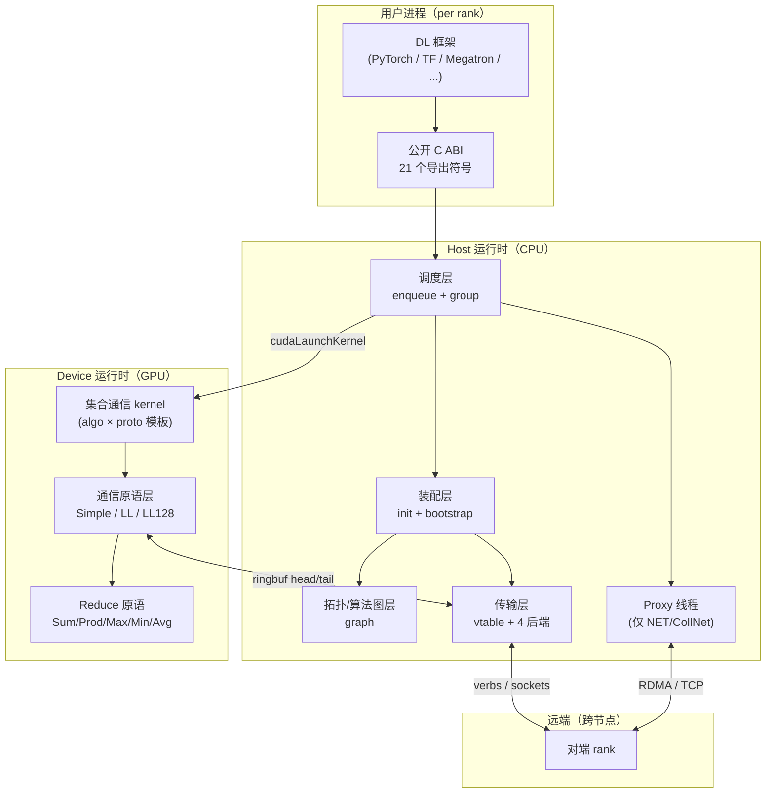

### 3.2 五条贯穿全局的设计原则

| # | 原则 | 含义 | 替代方案与放弃理由 |
|---|---|---|---|
| **P1** | **装配前置，热路径精简** | 所有重决策（拓扑发现、算法搜索、连接建立、CPU 亲和、代价建模）一次性在 `ncclCommInitRank` 完成；运行时只查表 + 投递 | *替代*：每次调用动态选 algo —— 放弃，会引入 host 决策开销，违反 G7 |
| **P2** | **调度器对称投递、不参与稳态同步** | 调度器同时把同一份 work 投给 GPU device（kernel）和 host proxy（线程），两侧通过 ringbuf head/tail 自治推进 | *替代*：中央协调（如事件队列 / mutex）—— 放弃，会成为 µs 级热路径瓶颈 |
| **P3** | **三层执行单元（Channel × Algorithm × Protocol）** | 32 channel × 3 algo × 3 proto = 9 (algo, proto) × 多 channel 并行 | *替代*：单 channel 单 algo —— 放弃，无法吃满多 NVLink 带宽 |
| **P4** | **vtable 多态贯穿 transport 与 proxy** | 同一上层代码（selectTransport / proxy 主循环）通过函数指针调到具体后端，新后端走插件 ABI | *替代*：每后端编译期 `#ifdef` —— 放弃，违反 G5，第三方网卡无法接入 |
| **P5** | **Communicator 作为重资源 / 不可变句柄** | 创建即不可变、失败即整体作废；rank 集合固定 | *替代*：动态可变 communicator —— 放弃，与 G7 装配前置冲突；split 留给后续版本 |

### 3.3 装配重 / 热路径轻

P1 决定整个系统呈现"装配阶段重、热路径轻"的不对称形态。这种二分**不是优化**，而是**设计哲学的视觉表达**——下面两张图刻意分开：

> 图 3-2：装配期与热路径的模块依赖差异（概念图）

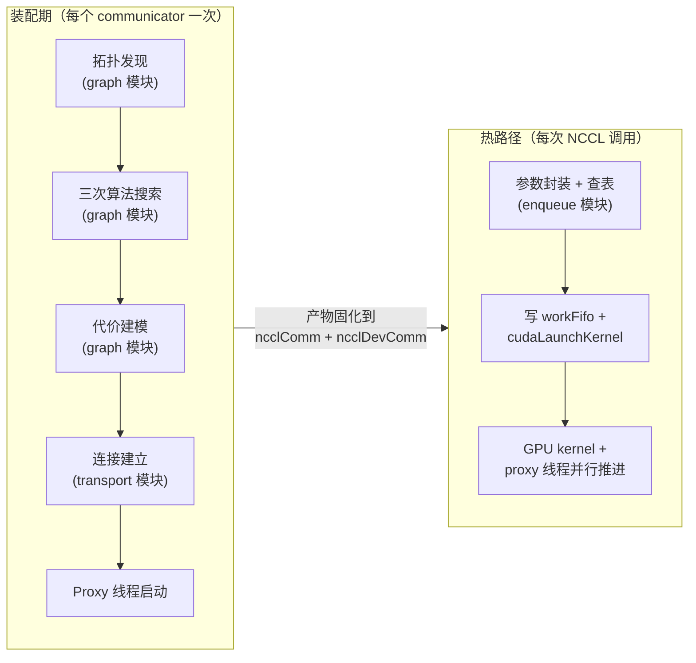

| 维度 | 装配期 | 热路径 |
|---|---|---|
| 触发频率 | 每个 communicator 一次（典型一个训练 job 一次）| 每次 NCCL 调用 |
| 时间预算 | 10² ms ～ 几秒 | 单调用 µs 级 |
| 主同步原语 | bootstrap TCP AllGather | ringbuf head/tail（无锁）|
| 失败处理 | 返回错误码 → 用户重试 | 设 fatalError → 上层轮询 `GetAsyncError` → Abort |
| graph 模块 | 高度活跃 | **完全不出现** |
| misc 弱依赖模块 | dlopen + 调函数指针 | 不出现 |

**对实现者的硬约束**：任何修改若让"热路径调用 graph 模块"或"装配期延迟 < µs 级"，PR 必须给出充分理由。

### 3.4 Communicator 设计模型

`ncclComm` 是对外的核心抽象。**完整使用模式与反模式属于用户手册范畴，不在本详设展开**；这里仅描述设计层面的约束：

1. **一 rank ↔ 一 GPU**：由 `cudaGetDevice` 抓当前线程的设备绑定，要求调用方先 `cudaSetDevice`。
2. **入队即返回**：完成语义由 CUDA stream 提供，所有 API 不阻塞返回。
3. **失败即整体作废**：任一 rank 异常 → 整个 comm 失效；不支持单 rank 恢复（见 G8 + §7.2）。
4. **重资源**：装配涉及拓扑发现、算法搜索、传输连接、device channel 物化，单节点 8 GPU 典型耗时 10² ms 量级；跨机更慢。**禁止每 iteration 重建**。
5. **生命周期阶段**：Uninit → Bootstrapping → Discovering → Connecting → Active → (Destroying | Aborting) → Freed。详细状态机见 §5.4。

资源占用（单 rank 视角）：

| 资源 | 量级 | 备注 |
|---|---|---|
| ncclComm host 结构 | KB 级 | |
| 每 connector ringbuf（host + device，三协议合计）| ≈ 9.2 MiB（Simple 4 MiB + LL 0.5 MiB + LL128 ≈ 4.7 MiB；ARM 上 Simple 降为 1 MiB） | 一个 connector = 一对 peer × 一个方向 × 一个 channel 上的一个 connIndex；完整公式与典型量级见 §4.4.7 |
| 每 channel 激活的 connector 数 | Ring 2 个 / Tree ≤ 4 个 / CollNet ≤ 7 个；混合算法时常态 ≈ 6 个 | 仅"本 rank 在该 channel 上的直接邻居方向"才实例化 ringbuf |
| 单 rank device 端 ringbuf 总量 | ≈ `nChannels × 邻居方向数 × 9.2 MiB` | 典型 nChannels=4、6 方向 → ~220 MiB；nChannels=8 → ~440 MiB |
| peerInfo 数组 | nRanks × ~64 B | |
| Proxy pthread | 1 条 | |
| 网络资源 | IB QP / TCP socket / SHM segment | 取决于后端 |

### 3.5 分层架构总览

§3.1 的图 3-1 按**进程边界**（App / Host / Dev / Net）分组，§3.3 的图 3-2 按**时间边界**（装配期 / 热路径）二分。两者都不直接回答 "系统由哪些层组成、每层职责是什么、谁伴随 communicator 全程"——这是本节要补的视角。

> 图 3-3：分层架构总览（左：主调用栈分层 - 自顶向下；右：跨层服务 - 横切伴随全程）

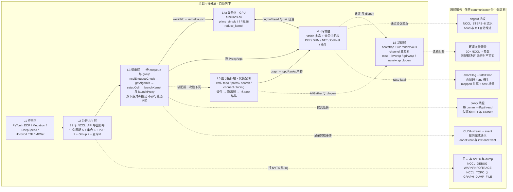

**层职责一句话表**：

| 层 | 何时活跃 | 一句话职责 | 关键设计章节 |
|---|---|---|---|
| **L1 应用层** | — | DL 训练/推理框架（不属于 NCCL 本体）| §1.1 背景 |
| **L2 公开 API 层** | 全程 | 21 个符号的 C ABI 表面 + 参数校验薄壳 | §6.2 ABI |
| **L3 调度层** | 热路径每次调用 | 把用户参数翻译成 device kernel + proxy 任务的中央分发器 | §4.4.4 |
| **L4a 设备层** | 热路径 | GPU kernel：算法循环 + 协议数据搬运 + reduction | §4.4.2 |
| **L4b 传输层** | 装配建连 + 热路径 NET/CollNet | vtable + 4 后端，屏蔽 NVLink / SHM / IB / SHARP 差异 | §4.4.3 |
| **L5 图与拓扑层** | **仅装配期** | 硬件拓扑发现 → 算法图搜索 → 代价模型 → 本 rank 编排 | §4.4.1 |
| **L6 基础层** | 装配启动 + 弱依赖加载 | TCP rendezvous + channel 资源池 + 弱依赖 dlopen 包装 | §4.4.5 |

**跨层服务的设计意图**：右侧 6 项 **不属于任何单一层**，而是**横切贯穿**主调用栈的全生命周期——图中 6 条虚线箭头分别标注了"谁触发哪个服务"，让"L2/L3/L4T/L6 在不同时机调用同一组横切服务"的关系一目了然。把它们独立成栏的可视化分离是关键设计哲学："**重决策装配前置（L5/L6）→ 双下游对称投递（L3 ↔ L4a/L4b）→ 跨层服务自治推进（右栏）**"。如果未来某项跨层服务（如 proxy 线程）需要拆分为多个，仅在右栏内部演进，对左侧调用栈分层无影响。

**与图 3-1 / 图 3-2 的关系**：

| 图 | 视角 | 用途 |
|---|---|---|
| 图 3-1 | 进程/设备边界 | 回答"代码跑在哪里"（App / Host / Dev / Net）|
| 图 3-2 | 时间边界 | 回答"什么时候执行什么"（装配期 vs 热路径）|
| **图 3-3**（本图）| 模块分层 + 跨层服务 | 回答"系统由哪些层组成、谁横切全程" |

三张图正交，组合起来构成 §3 整体架构的完整视图。对照实现的精细 SVG 版本见 [nccl-arch-layered.svg](nccl-arch-layered.svg)。

### 3.6 核心数据结构总览

进入 §4 模块细节、§5 流程时序、§7 异常处理前，先建立**数据结构的鸟瞰**——以下结构会在后续章节反复出现，**先认识对象、再看动作**。

> 图 3-4：核心数据结构关系（设计层面，省略字段）

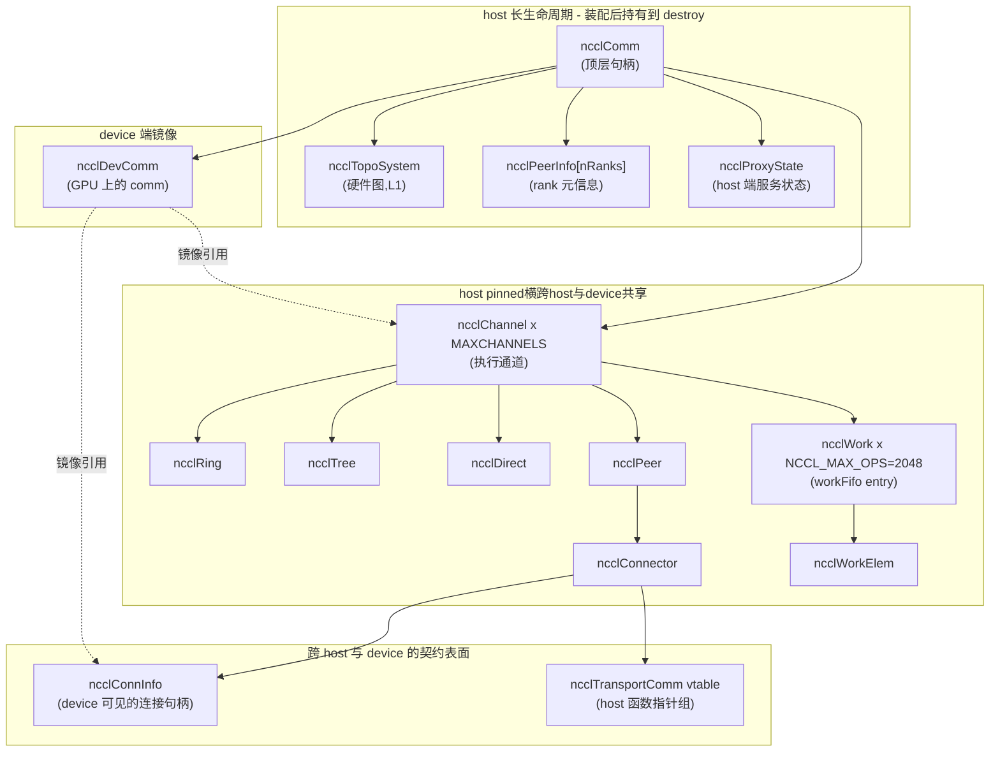

**结构按角色分四组**：

| 组 | 物理位置 | 代表结构 | 谁主要读写 |
|---|---|---|---|
| **host 长生命周期** | host 内存 | `ncclComm` / `ncclTopoSystem` / `ncclPeerInfo` / `ncclProxyState` | host 各模块（init / enqueue / graph）|
| **host pinned 共享** | host pinned 内存（GPU 可读）| `ncclChannel` / `ncclPeer` / `ncclConnector` / `ncclWork` | host 写 + GPU 读 |
| **跨 host/device 契约** | host pinned（device 也可访问）| `ncclConnInfo`（buffs/head/tail）/ `ncclTransportComm`（vtable）| device 与 transport 共享 |
| **device 镜像** | GPU device global memory | `ncclDevComm` | 装配末一次写、GPU kernel 只读 |

**关键容量常量**：

| 常量 | 值 | 含义 |
|---|---|---|
| `MAXCHANNELS` | 32 | 单 communicator 最大通道数（= GPU 单次 launch block 上限） |
| `NCCL_NUM_PROTOCOLS` | 3 | LL / LL128 / Simple |
| `NCCL_NUM_ALGORITHMS` | 3 | Ring / Tree / CollNet |
| `NCCL_STEPS` | 8 | ringbuf 流水深度 |
| `NCCL_MAX_OPS` | 2048 | 单 channel workFifo 深度 |
| `MAX_ASYNC_OPS` | 128 | 单次 Group 内最多 op 数 |
| `NCCL_MAX_TREE_ARITY` | 3 | tree 算法最大子节点数 |
| `NCCL_MAX_CONNS` | 2 | 每对 peer × 方向的 connector 槽位 |

各结构的字段详解与生命周期分析见 §4.4 各模块章节；ncclDevComm 镜像策略详见 §3.3"装配重 / 热路径轻"；内存可见性论证见 §6.1。

---

## 4. 模块划分与职责

### 4.1 模块 ↔ 分层 ↔ 实现章节对照表

§3.5 图 3-3 已经从"分层 + 跨层服务"角度展示了整体架构；本节把那些分层**展开为具体模块清单**，并给出每个模块在 §4.4 的细节锚点。

| §3.5 层 | 模块 | 一句话职责 | 详细设计 |
|---|---|---|---|
| **L2 公开 API** | public-api | C ABI 入口 + 参数校验薄壳 | §6.2 |
| **L3 调度层** | enqueue / group | API ↔ device kernel ↔ proxy 的中央调度 | §4.4.4 |
| **L4a 设备层** | device | GPU kernel + 算法/协议模板矩阵 | §4.4.2 |
| **L4b 传输层** | transport | P2P / SHM / NET / CollNet vtable + 插件 | §4.4.3 |
| **L5 图与拓扑层** | graph | 拓扑发现 / 算法图搜索 / 代价调优（**仅装配期**）| §4.4.1 |
| **L6 基础层** | bootstrap | 装配期 rank 互联（TCP ring + P2P 直连）| §4.4.5 |
| **L6 基础层** | misc | `ibvwrap / nvmlwrap / gdrwrap` dlopen 弱依赖 | — |
| **L6 基础层** | init / commLifecycle | 装配编排 + 生命周期管理 | §5.1, §5.4 |
| **跨层服务 S1** | proxy | host 端网络驱动（每 comm 一 pthread）| §4.4.6 |
| **跨层服务 S2** | ringbuf 数据通路 | 三协议 × NCCL_STEPS=8 ringbuf 横切契约 | §4.4.7 |
| **L4b 扩展** | plugin SDK | 第三方网络后端入口（`NCCL_NET_PLUGIN`）| §10.3 演进 |

### 4.2 装配期与热路径的模块依赖图

§3.3"装配重 / 热路径轻"已经讲了**概念上的二分**；本节用两张依赖图把它**具体到模块名**——读者可以直观看出"装配期参与的模块"在热路径如何消失。

> 图 4-1：装配期模块编排（每 comm 一次）

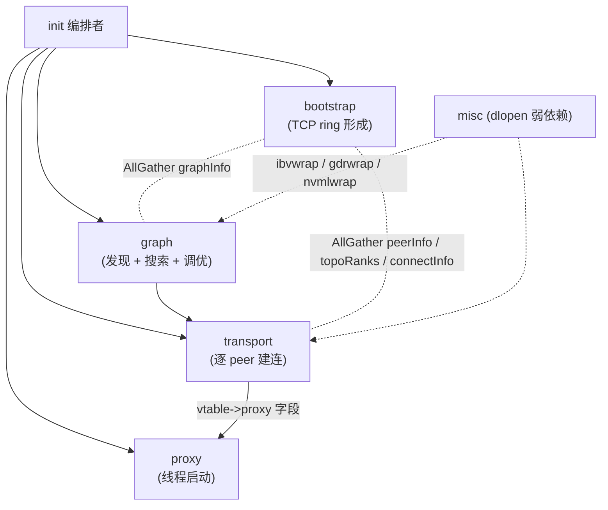

> 图 4-2：热路径模块编排（每次 NCCL 调用）

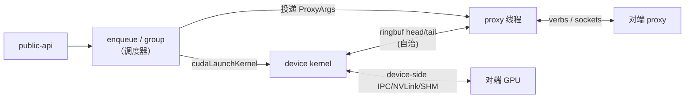

**关键观察**：装配期的 graph / misc 模块在热路径**完全消失**。这是 P1 装配前置原则的可视化体现。

### 4.3 模块契约（接口边界）

模块之间通过**数据结构契约**而非函数调用耦合，便于独立演进：

| 上游 → 下游 | 契约数据结构 | 含义 |
|---|---|---|
| graph → transport | `ncclTopoGraph + topoRanks` | "每 channel 走哪条路径" + "本 rank 在每 channel 的位置" |
| init → device | `ncclDevComm`（含 channels）| GPU kernel 启动后从 device global 读 |
| 调度器 → device | `ncclWorkElem`（64 B）| 单次集合通信的工作描述符 |
| 调度器 → proxy | `ncclProxyArgs` | 单次集合通信的网络任务模板 |
| transport ↔ device | `ncclConnInfo`（含 buffs / head / tail）| device 与传输后端的唯一接触面 |
| bootstrap → transport | `ncclConnect`（128 B 不透明）| 每对 rank 互换的后端出口信息（IB QP/GID、CUDA IPC handle、SHM key）|

**设计意图**：契约的字段集越窄，模块演进就越自由。新增网络后端只需理解 `ncclConnect` 和 `ncclConnInfo` 两个结构。

### 4.4 各模块设计要点

#### 4.4.1 graph 模块：硬件拓扑 → 算法图

**职责**：装配期一次性完成"硬件拓扑 → 三种通信算法的全局编排"。

**四层数据契约**（从硬件到算法）：

| 层 | 数据结构 | 抽象层级 | 是否长生命周期 |
|---|---|---|---|
| L0 | `ncclXml`（节点池）| 硬件中间表示，屏蔽 sysfs 残缺 | 装配后即释放 |
| L1 | `ncclTopoSystem` | 硬件图：CPU/GPU/PCI/NIC/NVS/NET 6 类节点 + 链路 | 持有到 destroy |
| L2 | `ncclTopoGraph` | 算法图：每 channel 走的路径序列 | 装配期临时 |
| L3 | `ncclTopoRanks` | 本 rank 在每 channel 的位置 | AllGather 后归并入 channel |

**关键设计决策**：

1. **XML 作为硬件中间表示**：让 sysfs 残缺（WSL2 / 容器）与异构集群都能通过 `NCCL_TOPO_FILE` 一键修正。*替代*：直接从 sysfs 构建图——放弃，无法处理 WSL2 与受限容器环境。
2. **图搜索：双层启发式（外层退避 + 内层 DFS）**：在硬件图上找 N 条互不重叠的 Hamilton-like 路径。算法本身、剪枝维度、工程兜底、与 ILP 的对比展开见下方"**图搜索算法**"小节。
3. **三种 algo（Ring / Tree / CollNet）独立搜索一次**：跑三次 `Compute`，各产出一份 `ncclTopoGraph`。*替代*：统一搜一次——放弃，三种算法对路径的约束完全不同。
4. **`std::min` 全局参数对齐**：所有 rank 各自搜出的 graph 通过 AllGather 取交集（最少 channel、最慢链路、最差路径类型）。**通信器能力受限于最弱 rank**——这是必要妥协，否则跨 rank 不一致会导致死锁。
5. **代价模型用硬编码表 + 速度参数**：`baseLat / hwLat / llMaxBws` 等硬编码常数 + 搜索得到的 `speedIntra/Inter` 喂给 `comm->latencies[F][A][P]` 与 `bandwidths[F][A][P]`。*替代*：实测建模——放弃，装配期开销爆炸；线上重测代价不可控。

**图搜索算法**（决策 2 的展开）

**问题归约**：在 `ncclTopoSystem` 上找 N 条**互不重叠的 Hamilton-like 路径**（每条经过所有参与 GPU 一次），满足四类约束：

| 约束类型 | 含义 |
|---|---|
| 形态约束 | 环（Ring）或树（Tree / SplitTree / BalancedTree / CollNet head）|
| 带宽阈值 | 路径瓶颈带宽 ≥ `speedIntra/Inter` |
| 路径类型上限 | 最差链路类型 ≤ `typeIntra/Inter`（NVL ≤ NVB ≤ PIX ≤ ...）|
| 跨 channel 不重叠 | N 条路径在每条物理链路上的累计带宽 ≤ 链路总带宽 |

这是经典的 **NP-hard 问题族**（多 Hamilton 路径覆盖 + 容量约束）。装配延迟硬约束 ≤ 几秒，因此采用启发式搜索而非精确解法。

**前置 — 路径预计算（类 Dijkstra）**：搜索开始前先为每对节点预计算"按路径类型分类的最短路径表"`node->paths[type][n]`。搜索阶段把这张表当距离查表使用，O(1) 命中。Trim 拓扑前后**各算一次**——trim 改了图后路径表必须重算。

**双层搜索结构**：

| 层级 | 策略 | 任务 |
|---|---|---|
| **外层** | 参数空间退避搜索（greedy degradation）| 在固定参数下调内层搜；找不到解则按固定优先级**逐级放松约束**重试；找到可行解后再用 pass 2 反向尝试提升性能 |
| **内层** | DFS + 多维剪枝 | 在固定参数下，以 NIC（跨节点时）或 GPU（单节点时）为起点深搜；回溯找一条合法路径；继续找下一条不重叠的 channel，累计达 `maxChannels` 或时间用尽 |

**外层放宽约束的优先级**（设计意图：先保拓扑结构、后让带宽降级）：

```
sameChannels (要求多 channel 同构)
  → typeIntra (节点内最差路径类型,NVL → NVB → PIX → PXB → ...)
  → typeInter (节点间最差路径类型,PIX → PXB → PHB → SYS)
  → pattern 简化 (SPLIT_TREE → TREE)
  → crossNic (允许 channel 跨多 NIC)
  → speed (按预定义速度档位降阶)
```

这个顺序刻意把"性能阈值"放在最后——尽量保住拓扑结构的优美，只在万不得已才让带宽降级。

**内层 DFS 的剪枝维度**：可达性 / 单段带宽阈值 / 单段路径类型上限 / channel 内 GPU 不重复 / 跨 channel 累计带宽不超链路总量 / 当前代价劣于已知最优 / **时间预算耗尽**。回溯时把已分配的带宽还回每条边，便于其它分支复用。

**三道工程兜底**：

| 兜底 | 内容 | 必要性 |
|---|---|---|
| **时间预算** | 每次搜索带递减 time budget，预算用尽返回已知次优 | 让数千 rank 集群装配可在几秒内完成（防大拓扑指数爆炸）|
| **顺序排列 fallback** | 完全找不到合法路径时回落到 GPU 按编号成环 + speed = 0.1 GB/s | 装配不失败但显式标低速，便于上层调优器和监控识别"非最优配置"|
| **NVLink-3 倍增** | 当 `speedIntra ≥ 25 GB/s` 时 `nChannels` 翻倍并把 speed 摊薄到一半 | A100 / H100 NVLink 单链路带宽极高，单 channel 上 SM 打不满，多 channel 并发吃满 GPU 的 issue rate |

**为什么不用 ILP / 整体优化**（强化 §10.2 R8）：

| 维度 | DFS + 退避 | ILP |
|---|---|---|
| 典型拓扑（≤ 16 GPU + ≤ 8 NIC）求解时间 | < 10 ms | 100 ms ～ 秒级 |
| 异构 / 病态拓扑时间稳定性 | 由 timeout 保证有界 | 不可控，可能爆炸 |
| 解质量 | 启发式近似，两轮退避可达"够好" | 全局最优 |
| 外部依赖 | 无 | 需 LP/MIP 求解器库 |

NCCL 的取舍是**牺牲少量解质量换取装配延迟稳定性与零外部依赖**——这对训练 job 启动时间（数千 rank 集群从几十秒降到几秒）至关重要，也避免了在生产环境引入求解器作为新的故障点。

#### 4.4.2 device 模块：算法 × 协议 矩阵

**职责**：GPU kernel 实现集合通信的实际数据搬运与归约——**这是 NCCL 完成"将数据按算法在 rank 间循环、按协议落到 ringbuf"两件事的物理执行层**。集合通信基础（ring/tree 工作原理）见 §1.4。

##### 4.4.2.1 模板矩阵：≈  数千个编译期 kernel

device 模块用 C++ 模板把 **5 维参数**展开成大量编译期 kernel：

```
5 集合通信(F)  ×  3 算法(A)  ×  3 协议(P)  ×  5 redop(R)  ×  10 dtype(T)  ≈  2000
   AllReduce        Ring         Simple       Sum            int8/32/64
   Broadcast        Tree         LL           Prod           uint8/32/64
   Reduce           CollNet      LL128        Max            half/float/double
   AllGather                                  Min            bfloat16
   ReduceScatter                              Avg
```

**为什么这么多 kernel**：

| 选择 | 替代 | 放弃理由 |
|---|---|---|
| 编译期模板全展开 | 运行时通用 kernel + 函数指针 | 函数指针 jump 在 GPU 上代价高（无 inline）；模板让编译器为每个 (F,A,P,R,T) 组合生成最优代码 |
| 5 维独立 | 合并为单一 jump table | 维度大小差异大（A=3 vs T=10），合并会让分支预测器表项爆炸 |

**代价**：`libnccl.so` 体积 ~ 几十 MB；编译时间 ~ 5-10 分钟（瓶颈在 nvcc 单 TU 时间长）。

**运行时如何选 kernel**：调度器（§4.4.4）的 `getAlgoInfo` 用 `latencies/bandwidths` 代价表选定 `(A, P)`，然后用 `FUNC_INDEX(F, R, T, A, P)` 编码成单一 int 索引 `funcIndex`，作为 `ncclWorkElem` 的字段传给 GPU。GPU kernel 启动后从 `funcIndex` 跳转到对应模板实例化。

##### 4.4.2.2 算法层：Ring / Tree / CollNet 的工作原理

| 算法 | rank 间循环方式 | 总步数 | 适用 |
|---|---|---|---|
| **Ring** | reduce-scatter + all-gather 两阶段，沿环 N-1 步轮转 | 2(N-1) | 大消息带宽优先 |
| **Tree** | reduce 上行 + broadcast 下行 | 2 log(N) | 小消息延迟优先 |
| **CollNet** | 经 NIC 接到网内 reduction 树（SHARP）| 1（offload 到网络硬件）| 启用 SHARP 的集群 |

详细算法工作原理（chunk 怎么流转、为什么 ring 是带宽最优）见 §1.4.2 / §1.4.3。

**Ring AllReduce 的 device kernel 伪代码**：

```
__global__ ncclKernel_AllReduce_Ring_Simple(...) {
  int bid = blockIdx.x;                       // bid 即 channel id
  ncclChannel* ch = devComm->channels[bid];
  int rank = comm.rank, N = comm.nRanks;
  int chunkSize = ch->workElem.coll.chunkSize;
  int nChunks = totalSize / chunkSize / N;    // 切成 N 份

  // 阶段 1: reduce-scatter (N-1 步)
  for (int step = 0; step < N - 1; step++) {
    int sendChunkIdx = (rank - step + N) % N;
    int recvChunkIdx = (rank - step - 1 + N) % N;

    // 通过 prims (Simple/LL/LL128) 发给 ring.next, 收 ring.prev
    prims.recvReduceCopySend(
      input  + recvChunkIdx * chunkSize,      // 收上游数据 + reduce 进本地
      output + sendChunkIdx * chunkSize,      // 同时发给下游
      chunkSize
    );
  }

  // 阶段 2: all-gather (N-1 步)
  for (int step = 0; step < N - 1; step++) {
    int chunkIdx = (rank - step + 1 + N) % N;
    prims.directRecvCopySend(
      output + chunkIdx * chunkSize,          // 转发给下游
      chunkSize
    );
  }
}
```

**关键点**：

- `bid = blockIdx.x = channel id`（详见 §4.4.4）
- 算法层只负责"循环、收发哪个 chunk、是否做 reduce"，**数据怎么搬到 ringbuf 由协议层 prims 决定**
- `prims.recvReduceCopySend` 在 Simple/LL/LL128 三种 prims 中各有实现，**算法代码完全一致**——只是模板参数 `<Proto>` 不同

##### 4.4.2.3 协议层：Simple / LL / LL128 三种 ringbuf 格式

| 维度 | Simple | LL | LL128 |
|---|---|---|---|
| 就绪检测 | 独立 `tail` 计数器；写 data → fence → 写 tail | flag 与 data 同次原子写入（8 B），消费者读到期望 flag 才认为就绪 | 同 LL，但每 128 B 行只有 8 B flag（行尾）|
| 有效载荷率 | 100% | 50%（4B data + 4B flag）| 93.75%（120B / 128B 行）|
| 关键收益 | 大消息满带宽 | 省一次 `__threadfence_system`，**最低延迟** | 兼顾延迟与带宽 |
| 适用消息大小 | ≥ 数百 KB | ≤ 几 KB | 几 KB ～ 数百 KB |
| 硬件要求 | 任意 | 任意 | Volta+ 推荐（wide load 性能稳定）|
| device 端原语类 | `prims_simple.h` | `prims_ll.h` | `prims_ll128.h` |

> 图 4-3：LL 协议 4B 数据 + 4B flag 交错布局

```
ringbuf slot (假设 16B):
  +--------+--------+--------+--------+
  | data1  | flag1  | data2  | flag2  |
  | (4B)   | (4B)   | (4B)   | (4B)   |
  +--------+--------+--------+--------+

写入侧 (producer):
  把 [data1, flag1] 作为单次 8B 原子 store
  把 [data2, flag2] 作为单次 8B 原子 store
  → flag 与 data 同次写入,中间无 fence

读取侧 (consumer):
  spin 读 8B,检查 flag == 期望值 (= 当前 step 的标签)
  → 如果 flag 还是旧值,读到的 data 也是旧值,继续等
  → 如果 flag 是期望值,data 也一定是新的 (8B 原子保证)
```

**关键设计决策**：

1. **LL 协议的 flag 必须在 data 之后**：网络上不完整接收或非原子写入可能让 flag 先于 data 到达；flag 后置保证"读到 flag 时数据一定在"
2. **LL flag 取自 step 计数**：每 step 用不同 flag（`flag = NCCL_LL_FLAG(step)`），旧数据不会误伤；clean mask 保证 flag 不为 0（避免与零初始化 buffer 混淆）
3. **LL128 行尺寸为 128 B**：契合 NVLink 与 IB write 的 cache line 粒度；老硬件（< Volta）wide load 性能不稳定，搜索阶段直接禁用
4. **三协议共用算法层代码**：通过 C++ 模板 `<Proto>` 参数让 prims 的实现细节切换，算法循环完全相同——**算法/协议正交**

##### 4.4.2.4 Reduce hook：preOp / postOp 处理浮点精度

`reduce_kernel.h` 定义 5 个 reduce 函数对象（`FuncSum / Prod / Min / Max / Avg`），每个含三个钩子：

```c++
template<typename T, typename Op>
struct Func {
  __device__ T operator()(T a, T b);   // 真正的 reduce 动作 (a op b)
  __device__ T preOp(T x);              // 进入累加前的预处理
  __device__ T postOp(T x);             // 累加完成后的后处理
};
```

绝大多数 op 的 `preOp/postOp` 是恒等函数（`x → x`）。**关键例外是 `FuncAvg`**：

| 数据类型 | preOp | postOp | 设计意图 |
|---|---|---|---|
| 整型（int8/32/64/uint*）| 恒等 | `x / n` | 整数 `x × 1/n` 会丢精度，只能 sum 完后整数除 |
| float / double | `x × rcp`（`rcp = 1/n`，硬件 rcp 指令）| 恒等 | **每 rank 先 scale**，避免大数累加破坏浮点有效位 |
| half / bf16 | 同 float（fp32 rcp 转回半精度）| 恒等 | 浮点路径必走 preOp；fp16/bf16 累加误差扩大尤其严重 |

**关键澄清**：浮点 `Avg` 的 `preOp` 让每 rank 在**进入 ring 通信前**就把输入 scale 完。所有 rank 之后正常 sum——这是浮点精度的标准做法，**不依赖"环末端 rank 做除法"这种位置耦合**。

##### 4.4.2.5 三层执行单元的物理对应

呼应 §3.2 P3"三层执行单元"原则：

| 层 | 单位 | 数量 | 在 device 模块的体现 |
|---|---|---|---|
| **Channel** | GPU thread block | `nChannels ≤ 32` | `bid = blockIdx.x` 直接索引 |
| **Algorithm** | 算法循环 | Ring / Tree / CollNet | 模板参数 `<Algo>` 决定哪份 run 函数 |
| **Protocol** | ringbuf 数据格式 | Simple / LL / LL128 | 模板参数 `<Proto>` 决定哪份 prims 类 |

三层正交，所以模板能展开成 `(F × A × P × R × T)` 而不需要为每种组合手写 kernel。

#### 4.4.3 transport 模块：vtable 多态 + 4 后端

**职责**：装配期建立 peer 间连接；热路径上 P2P/SHM 让 device kernel 直接读写远端 buffer，NET/CollNet 由 proxy 线程驱动网络 IO。

> 图 4-4：transport 对象关系

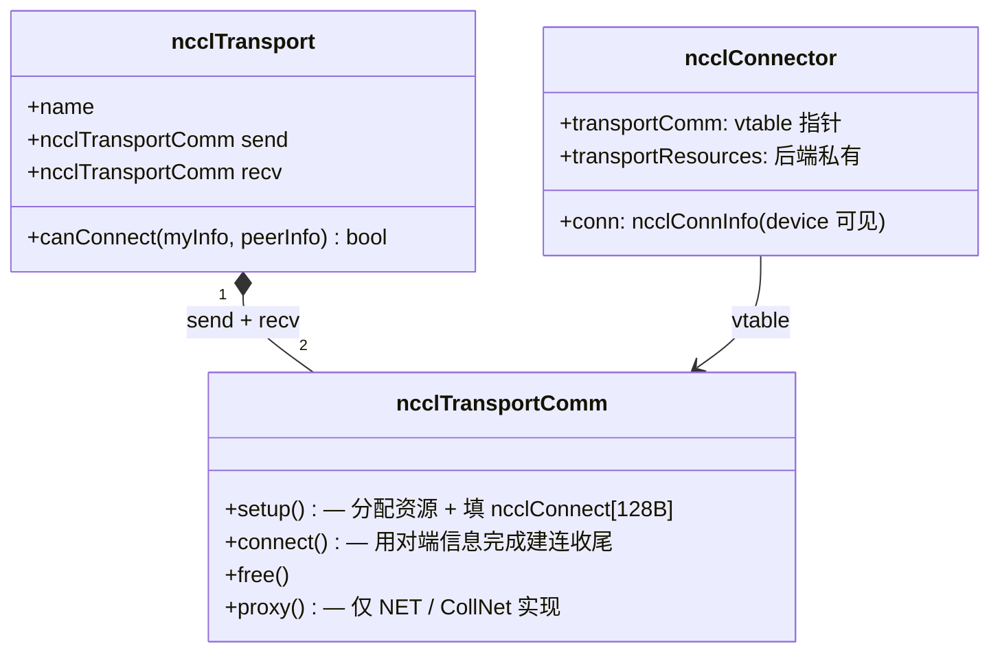

**关键设计决策**：

1. **vtable + 全局注册表**：`ncclTransports[]` 中三个 transport（P2P / SHM / NET）按优先级排列，`selectTransport` 第一个 `canConnect=true` 的胜出。*替代*：编译期 `#ifdef` 选后端——放弃，违反 G5 与插件化目标。
2. **send / recv 分两份 vtable**：两个方向的资源完全不同（IB 的 QP 单向、内存注册各自）。*替代*：合并 setup——放弃，会让 net_ib 的逻辑更复杂、IPC handle 路径混乱。
3. **`ncclConnect = char[128]` 不透明**：bootstrap 不需要理解任何后端协议，按字节透传。*替代*：定义后端无关的 union——放弃，新增后端需要改 union 定义，违反插件化目标。
4. **CollNet 不在全局注册表**：CollNet 是 "N rank 经 NIC 接到网内 reduction 树"，与 P2P/SHM/NET 的两端配对模型不兼容，单走专路。
5. **proxy 字段 `NULL` vs 非 `NULL` 的二分**：`NULL` 意味着完全 device-driven（P2P/SHM），非 `NULL` 意味着 host 必须参与（NET/CollNet）。这是 transport 模块设计上最重要的二分。

**后端优先级**：P2P > SHM > NET。NVLink/PCI 直接 memcpy 最快，先试；不可达试 SHM；再不行才走 NET。

**类型层 vs 实例层**（vtable 多态的关键分层）

5 个相关结构按抽象层级递增，编译期常量与运行时实例严格分离：

| 层 | 结构 | 谁创建 | 数量 | 可变性 |
|---|---|---|---|---|
| **类型层**（编译期）| `ncclTransport` | 静态 const | **4**（P2P / SHM / NET / CollNet）| 不可变 |
| **类型层**（编译期）| `ncclTransportComm` | 嵌入在父 `ncclTransport` 内 | **8**（每后端的 send + recv 各一份）| 不可变 |
| **实例层**（运行时）| `ncclConnector` | 装配 setup 时分配 | 邻居方向数 × `nChannels` × `NCCL_MAX_CONNS` | 高频变（proxyAppend / step）|
| **实例层**（运行时）| `ncclConnInfo` | 嵌入在 `ncclConnector.conn` 内 | 同上 | device 可见 |
| **临时透传**| `ncclConnect`（128B 字节包）| setup 临时栈 | 装配中每对 peer × graph × channel 一次 | 用完即丢 |

**多态点**：运行时 `connector->transportComm = &transport->send/recv` 让同一份 `ncclConnector` 类型通过赋不同 vtable 指针实现"运行时选后端"——C 模仿虚函数的标准做法。

**`ncclConnInfo` 字段在不同后端下的物理映射**

`ncclConnInfo` 的字段名（`buffs[]` / `head` / `tail`）**对 GPU kernel 全部一样**，但**字段值在各后端下指向完全不同的物理位置**——这正是"kernel 不感知后端"的物理基础：

| 后端 | `buffs[]` 指向 | `head` / `tail` 物理位置 | 谁写 buffs |
|---|---|---|---|
| **P2P (NVLink)** | 远端 GPU 的 device buffer（cudaIpcOpenMemHandle 映射）| 远端 GPU 的计数器（IPC 映射）| 远端 GPU kernel 通过 NVLink store |
| **SHM** | host 共享内存（mmap）| 同一共享内存的计数器 | 远端 GPU 写共享内存 |
| **NET / IB（GDR）** | 本端 device buffer（NIC 通过 GPUDirect RDMA 直写）| host pinned 计数器 | 对端 NIC（RDMA write）|
| **NET / IB（非 GDR）**| host pinned bounce buffer | host pinned 计数器 | 本端 proxy 线程（从 IB 收到后拷入）|

对 GPU kernel 而言，访问代码完全一样：读 `conn->buffs[NCCL_PROTO_SIMPLE]`、spin `conn->tail`、写 `conn->head`——不论下层是 IPC、SHM 还是 RDMA，**字段语义不变，物理位置由 transport 后端在 setup 阶段填好**。

**`ncclConnect[128B]` 在各后端填什么**

bootstrap L3 直连原语透传的 128 字节不透明字节包，各后端按自己的格式塞入：

| 后端 | 128B 内容 |
|---|---|
| **P2P** | 本地 device buffer 的 **CUDA IPC handle**（`cudaIpcMemHandle_t`）|
| **SHM** | 本地 shm 段的 **key + size**（对端 mmap 用）|
| **NET / IB** | 本端 NIC 的 **GID + QP 号 + 内存 key + 远端 buffer 地址** |
| **CollNet** | SHARP 网络的 **request handle + group id** |

**bootstrap 不需要理解任何内容**——按字节透传——这是新增后端不改 bootstrap 代码的设计前提，详见 §4.4.5 决策。

#### 4.4.4 enqueue / group 模块：中央调度器

**职责**：每次 NCCL 调用时，把"用户参数"翻译成 GPU kernel 启动 + proxy 任务投递。

> 图 4-5：调度器对称投递双下游

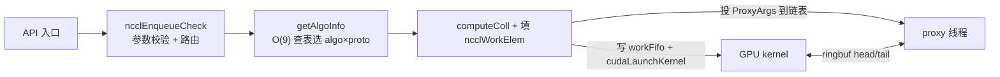

**关键设计决策**：

1. **三种调度路径共享同一组 setup 函数**：
   - 同步直接路径（默认）：立即 setup + launch
   - Group 缓冲路径（在 GroupStart..End 间）：只攒 `ncclInfo` 到 `asyncOps[]`，GroupEnd 时统一 setup + launch
   - CUDA Graph 捕获路径：setup 跑，但 launch 改为注册 host node
   
   *替代*：每路径独立实现——放弃，会导致 N×3 倍代码膨胀且容易行为漂移。

2. **`getAlgoInfo` 用 O(9) 表查找**：穷举 3 algo × 3 proto，用装配期填好的 `latencies[F][A][P] + nBytes / bandwidths[F][A][P]` 估算时间取最小。*替代*：在线建模——放弃，违反 G7 热路径无决策。

3. **Channel 分配与算法选择解耦**：`nChannels` 由 algo 模型决定（用多少），落到哪个 channel 由 round-robin 或 shortest-queue 决定（用哪些）。

4. **Group 聚合的 fast path**：N 个同种 collective 共用 algo/proto，省 N-1 次 `getAlgoInfo`；但**不 fusion**——每个 op 仍按各自 funcIndex 走各自 kernel 路径。

5. **`launchMode` 默认 PARALLEL**：单进程多 GPU 通过用户的 `GroupStart..End` + 多次 PARALLEL launch 实现，**不是** Cooperative Multi-Device launch。GROUP 模式仅在 `NCCL_LAUNCH_MODE=GROUP` 显式开启时生效。

6. **`ncclLaunchKernel` 必须先于 `ncclLaunchProxy`**：否则 `cudaFree` 可能死锁——这是一个被代码注释明确标注的顺序硬约束。

**Channel 分配策略详解**（决策 3 的展开）

调度器对每个 op 调 `getNextChannel` 选 channel，**不是简单的"每次从 0 开始遍历"**——常见误解需要澄清四点：

| 关键事实 | 含义 |
|---|---|
| **单次调用通常占用多个 channel** | `info->nChannels` 由 `getAlgoInfo` 决定（典型 2-8），调度器循环调 `getNextChannel` 取一组连续 id |
| **`lastChannel` 在 launch 边界归零** | ROUND_ROBIN 用 `comm->lastChannel++ % nChannels` 递增；但每次 `ncclLaunchProxy` 末尾会执行 `lastChannel = 0`（见 enqueue.cc），因此**同一 launch 批次内（Group 内多 op）接力，跨 launch 批次（独立调用之间、或两个 Group 之间）从 0 重新起步** |
| **collective 与 P2P 走独立 channel 集合** | `comm->nChannels`（ring/tree）vs `comm->p2pnChannels`（send/recv 按 rank↔peer 距离哈希）—— 互不干扰、各自调度 |
| **所有 channel 等价，没有"快慢"** | `ncclTopoGraph.speedIntra/Inter` 是标量（所有 channel 共享同一带宽阈值），所以分配不偏好低索引 |

两种策略对比：

| 策略 | 算法 | 决策代价 | 适用场景 |
|---|---|---|---|
| **`ROUND_ROBIN`**（默认）| `lastChannel++ % nChannels` 全局轮转 | O(1) | 同尺寸 op 占主导（典型 DDP gradient bucketing）|
| **`SHORTEST_QUEUE`** | 遍历所有 channel，选当前已分配 `totalSize` 最小的 | O(nChannels) | **异构尺寸 op 混合**（DP+TP+PP 多 comm 混跑、op size 差异大）|

需通过 `comm->asyncAllocMode` 显式切换，默认 ROUND_ROBIN。

**典型行为示例**（`nChannels=4`，演示 launch 边界归零语义）：

| 场景 | enqueue 期间 `lastChannel` 轨迹 | 该批次实际 channel id | launch 完成后 `lastChannel` |
|---|---|---|---|
| 1: 独立 AllReduce 小消息（直接路径，自带 launch）| 0 → 1 → 2 | 0, 1 | **0**（launch 末尾归零）|
| 2: 紧接的下一次独立 AllReduce 小消息 | 0 → 1 → 2 | 0, 1 | **0**（依然从 0 起，与上一次无接力）|
| 3: 独立 AllReduce 大消息 | 0 → 1 → 2 → 3 → 4 | 0, 1, 2, 3 | **0** |
| 4: `Group{ AllReduce 小, AllReduce 小 }` 内：op1 | 0 → 1 → 2 | 0, 1 | （Group 内不归零）|
| 4: 同 Group 内：op2 | 2 → 3 → 4 | 2, 3 | **0**（`GroupEnd` 触发 launch 时归零）|
| 5: `Group{ AllReduce 小 × 3 }`，op1/op2/op3 | 0→1→2→3→4→5→6 | op1: 0,1；op2: 2,3；op3: 0,1 | **0** |

这种"**Group 内接力 + launch 边界归零**"是 Group 聚合（决策 4）的性能基石——把多个梯度的 AllReduce 聚合在一个 Group 内，ROUND_ROBIN 在该 Group 的单次 launch 内自动均衡到所有 channel，最大化并行度；Group 之间互相独立、不带历史偏置，避免长期累积造成某些 channel 总是优先被填满。注意：**对非 Group 的连续独立调用而言，每次都从 channel 0 起步**，因此小消息密集场景下若不显式聚合到 Group 内，仅 channel 0 / 1 会被反复使用——这是性能 regression 排查时容易忽略的一个调度细节。

#### 4.4.5 bootstrap 模块：装配期 rank 互联

**职责**：装配阶段唯一的跨节点同步通道。所有其它通信（P2P、SHM、IB、CollNet）都依赖它先互换 PeerInfo / connectInfo。

**核心问题与解法**：

| 问题 | 解法 |
|---|---|
| rank 0 如何被其它 rank 找到？ | rank 0 监听 TCP socket，地址塞进 128 B 的 `ncclUniqueId`，通过带外通道（MPI_Bcast / Redis / 文件）分发 |
| N 个 rank 如何高效互换 PeerInfo？ | 构造逻辑 ring（每 rank 知前驱后继），后续所有 AllGather 走 ring，N-1 步完成 |
| 后续装配阶段如何精确点对点通信？ | AllGather 出每 rank 的监听地址到 `peerCommAddresses[nranks]`，`bootstrapSend/Recv` 按 rank 查表 |

##### 四层功能分解

bootstrap 实际提供**四个层次的功能**，从下到上层层依赖：

| 层 | 功能 | 何时活跃 | 触发频率 |
|---|---|---|---|
| **L1** | **ring 互联建立**（rank 0 协调下让所有 rank 构成逻辑 ring）| `ncclGetUniqueId` + `ncclCommInitRank` 早期 | 一次性 |
| **L2** | **ring AllGather**（沿 L1 闭环做 N-1 步点对点轮转）| 装配中 2 个关键同步点 | AllGather1 + AllGather3 |
| **L3** | **peer-to-peer 直连**（基于 L2 副产物 `peerCommAddresses` 查表直连）| transport setup 阶段 | 每对 peer × 每 channel × 每 graph 一次 |
| **L4** | **轻量服务**（barrier + 远端内存分配 + 关闭/abort 路径）| 装配末尾 + CollNet 启用时 | 按需 |

**层间依赖关系**：L2 的副产物 `peerCommAddresses[nranks]`（rank → IP:port 映射表）是 L3 能工作的基础。L4 共用 L3 已有的 socket 基础设施。**装配完成后 L1 / L2 不再使用**，但 L3 / L4 socket 仍保留——供异常路径的 abort 广播与 CollNet remote alloc 服务。

##### L1：ring 互联建立

> 图 4-6：ring 形成的两步握手协议

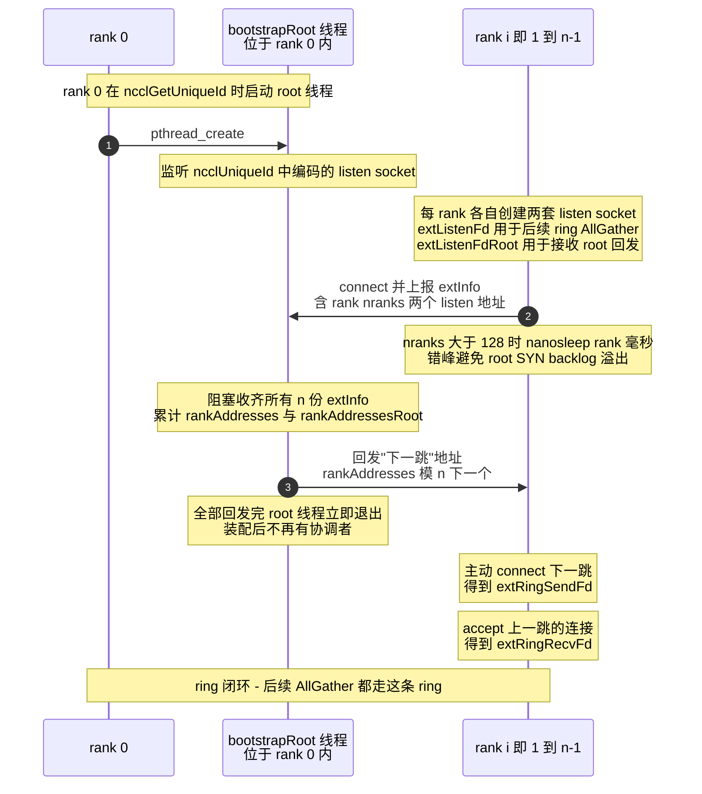

**关键点**：

- **两套独立监听 fd**：`extListenFd` 用于后续 ring AllGather；`extListenFdRoot` 仅用于接收 root 回发"下一跳"。分离让协议路径清晰、互不串扰
- **root 线程一次性**：收齐 → 回发 → 退出。**装配后不再有"协调者"角色**——这是 bootstrap 去中心化的根基
- **错峰连接**：大规模训练（≥ 128 rank）时所有 rank 同时 SYN root 会让 backlog 溢出。`nanosleep(rank ms)` 简单有效

##### L2：ring AllGather

L1 闭环建立后，AllGather 用**最朴素的 ring 算法**：

```
data = malloc(nranks)
data[rid] = init()        # 初始化本rank的数据结构
for i in 0 .. nranks-1:
    sslice = (rank - i)     mod nranks   # 本轮发哪一片
    rslice = (rank - i - 1) mod nranks   # 本轮收哪一片
    send(extRingSendFd, data[sslice], size)   # 给右邻
    recv(extRingRecvFd, data[rslice], size)   # 从左邻收
# N-1 轮后所有 rank 拿到完整数据
```

**装配过程调用两次**，承担两次显式全局同步：

| 调用点 | 数据 | 用途 |
|---|---|---|
| **AllGather1** | `peerInfo[nRanks]`（每 rank 的 cudaDev / busId / hostHash / pidHash / gdrSupport） | 让所有 rank 知道彼此的硬件位置，作为后续拓扑发现与 transport 选择的依据 |
| **AllGather3** | `graphInfo + topoRanks`（每 rank 本地搜索结果）| 让所有 rank 用 `std::min` 取交集对齐 channel 参数（详见 §4.4.1 决策 4）|

**副产物 `peerCommAddresses[nranks]`**：AllGather1 同时把每 rank 的 listen 地址也带过去了，于是每 rank 都有了一张完整的 "rank → IP:port" 映射表。**这张表是 L3 能工作的关键基础**。

**为什么用朴素 ring 而不是 recursive doubling 等更优算法**：装配只发生一次、数据 KB-MB 级，N-1 步 ring 在 10² ms 级完成，不值得增加代码复杂度。

#### 4.4.6 proxy 模块：host 端网络驱动

**职责**：每个 communicator 一条 pthread，专职推进需要 CPU 介入的传输（NET / CollNet）。

> 图 4-7：proxy 线程的工作模型

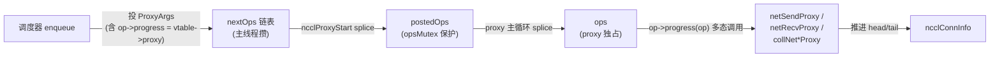

**关键设计决策**：

1. **每 comm 一条 proxy 线程**（不是每 channel 一条）：单线程驱动所有 channel 的 NET/CollNet 任务，简化资源管理。*替代*：多线程（每 channel 一条 / 全局线程池）——放弃，2.10.3 的 100/200G NIC 场景下单线程 CPU 占用尚可（< 50%）；800G+ 场景留待后续版本（见 §10.3）。
2. **二次 vtable 多态**：`ProxyArgs.progress = connector->transportComm->proxy`，proxy 主循环只调 `op->progress(op)`，**不感知后端类型**。让单一线程同时驱动 NET + CollNet 多种后端。
3. **NUMA 亲和性显式切换**：分配 ProxyArgs 池前切到 GPU 同 NUMA 的 CPU，分配完恢复用户亲和性。否则 proxy poll 跨 socket 访问延迟在 alltoall 小消息场景上显著放大（这是 2.10.3 修复的实际 bug）。
4. **生产者-消费者解耦**：主线程攒 `nextOps`、提交进 `postedOps`、proxy 拾起进 `ops`，三段链表。主线程与 proxy 线程几乎不直接同步，仅在 `cond_signal` 唤醒时短暂接触。

#### 4.4.7 ringbuf 数据通路（device ↔ transport ↔ proxy 横切契约）

ringbuf 不属于任何单一模块，而是 device / transport / proxy **三模块共享的"数据中转站"**。P2 对称投递原则之所以能成立——调度器把工作扔给双下游后退出、稳态无中央协调——全靠 ringbuf 这一层承载实际数据搬运 + 双方自治推进。

**物理结构**（每个 connector 一份，每个 channel × 每个 peer × send/recv 各一份 connector）：

| 协议专用 buffer | 默认容量 | slot 数 | 每 slot 大小 | slot 内单元格式 |
|---|---|---|---|---|
| `buffs[Simple]` | 4 MiB（ARM 1 MiB）| 8 (`NCCL_STEPS`) | 512 KiB | 纯数据 |
| `buffs[LL]` | 512 KiB | 8 | 64 KiB | `[4 B data][4 B flag]` × N（flag 后置）|
| `buffs[LL128]` | ~4.7 MB | 8 | ~600 KiB | 128 B 行：15 × 8 B data + 1 × 8 B flag（行尾）|

由 `NCCL_BUFFSIZE / NCCL_LL_BUFFSIZE / NCCL_LL128_BUFFSIZE` 覆盖。

**实例数量与内存占用**：ringbuf 不是 comm 全局共享，而是按 **5 维坐标**唯一确定一条物理实例：

```
(channel_id, peer_rank, send|recv, connIndex, protocol)
   32 上限      nRanks      ×2         ×2 (NCCL_MAX_CONNS)  ×3
```

理论上限 `nChannels × nRanks × 2 × 2 × 3` 是 connector 槽位数，但**绝大多数槽位是空的**——只有当前 rank 在某 channel 上的**直接邻居**（ring.prev / ring.next / tree.up / tree.down 等）才会实际分配 ringbuf：

| 算法 | 每 channel 激活的邻居方向数 |
|---|---|
| Ring | 2（prev recv + next send）|
| Tree | ≤ 4（up + down[0..2]，双向）|
| CollNet | ≤ 7（collTree fan-out + head）|

**实际激活数与典型内存占用**（典型 ring + tree 混合）：

```
本 rank 激活的 ringbuf 数 ≈ nChannels × 邻居方向数(~6) × 协议数(3)
                          ≈ nChannels × 18 份独立 ringbuf

device 内存占用(仅 Simple 协议) ≈ nChannels × 6 × 4 MiB
  - nChannels=2  → ~48 MiB
  - nChannels=4  → ~96 MiB
  - nChannels=8  → ~192 MiB
  - nChannels=16 → ~384 MiB
```

加上 LL/LL128 两个协议各自的内存（512 KiB + 4.7 MiB 每 connector），**总占用大致是 Simple 的 ~2.3 倍**。

**关键推论**：

- **同一节点在不同 channel 上的接收 ringbuf 完全独立**——即便对端是同一 peer，channel 0 与 channel 1 的 ringbuf 也是两套不同的物理内存（因算法路径不同、流水进度独立）
- **`nChannels` 是装配阶段的关键调优参数**：太少 → 多 channel 并发吃不满 SM；太多 → 内存爆炸。`NCCL_MAX_NCHANNELS / MIN_NCHANNELS` 让用户在两端找平衡
- **大规模 comm（≥ 10k ranks）的资源边界不只是 IB QP / fd**（§10.1 A1），**ringbuf 内存也是硬约束**：不过实际激活数与邻居方向数相关而非 nRanks，所以这条约束实际上不随 rank 数线性放大

**装的是什么 / 不是什么**：

| 装 | 不装 |
|---|---|
| 用户 sendbuff 切片后的数据 **chunk**（payload）| 集合通信的调度元信息（→ `channel->workFifo[]`）|
| LL / LL128 协议的 **inline flag**（与 data 交错）| 完成同步信号（→ `head / tail` 计数器，独立于 buffs）|
| 变长 chunk 大小（`sizesFifo`，仅特殊场景）| abort 信号（→ `abortFlag`，mapped 共享内存）|

**数据 chunk 的具体内容因算法阶段而异**：

| 算法阶段 | ringbuf 接收的 chunk 是什么 |
|---|---|
| **Ring AllReduce - reduce-scatter** 前 N-1 步 | 上游 rank 写来的"**已累加的部分和**"——本 rank 与自己对应片段 reduce 后写给下游 |
| **Ring AllReduce - all-gather** 后 N-1 步 | 上游 rank 写来的"**完整 reduce 结果**"——本 rank 直接转发给下游 |
| **Tree Reduce 上行** | 子节点写给父节点的**部分和**（子节点已合并自己的子树）|
| **Tree Broadcast 下行** | 父节点写给子节点的**广播完整结果** |
| **P2P Send/Recv** | 发送方写入的**原始数据切片**，无 reduce 介入 |

**写入者 / 读出者**（按 transport 后端）：

| 后端 | 写入 ringbuf 的人 | 读出 ringbuf 的人 |
|---|---|---|
| P2P / NVLink | 对端 GPU kernel 通过 NVLink store 直写 | 本端 GPU kernel 通过 NVLink load 直读 |
| CUDA IPC | 对端 GPU kernel（mapped 远端 buffer）| 本端 GPU kernel |
| SHM | 对端 GPU 通过 host shared memory 写 | 本端 GPU 读 |
| NET / IB（无 GDR）| 本端 proxy 接收完成后写入 | 本端 proxy 读出后用 IB Send 发到对端 |
| NET / IB（GDR）| 对端 NIC 通过 GPUDirect RDMA 直写本端 ringbuf | 本端 GPU 直读 |

注意 **ringbuf 自身是单向的**——一个 connector 一份 ringbuf；一对 peer 之间 send / recv 各一份 connector，所以共两份独立的 ringbuf。

**关键设计决策**：

1. **三协议各一份独立 buffer**：LL / LL128 / Simple 的 slot 内格式完全不同（flag 是否 inline、单元大小、对齐），共用 buffer 会让协议切换时元数据混淆。三份独立 buffer 让协议选择仅是"指针切换"，不需要清空 / 重新格式化。*替代*：单一 buffer 复用——放弃，协议切换开销 + 边界情况复杂度都不可接受。

2. **chunk 流水化中转，slot 数固定为 8**：ringbuf 容量与用户消息大小**完全解耦**——4 MiB 的 Simple ringbuf 能搬 GB 级用户数据，靠 8 个 slot 循环复用。`NCCL_STEPS = 8` 的选择：太少（< 4）流水深度不足，掩盖不了 host/device 同步抖动；太多（> 16）每 slot 太小，反而损失带宽。8 是综合 NVLink RTT + IB RTT + 典型 chunk size 的经验值。*替代*：动态 slot 数——放弃，固定值让代码与寻址简单（`step % NCCL_STEPS`）。

3. **`head / tail` 计数器与 payload 分离**：控制信号独立成 8 字节计数器，不混在 data 里（LL / LL128 例外，因为 flag inline 是延迟优化）。让多协议共用同一套 head/tail 推进逻辑。

4. **GDR 路径让 NIC 直写 GPU 内存的 ringbuf**：避免 host bounce buffer 的一次额外拷贝。这是 P1 装配前置的延伸——装配期就要决定 ringbuf 分配在 device global memory（GDR）还是 host pinned memory（非 GDR）。

5. **chunkSize 由调优表决定**：单次 step 搬多大 chunk 不是固定值，由 `getAlgoInfo / computeColl` 根据消息大小、算法、协议、nChannels 在 enqueue 阶段算出。**这把"ringbuf 容量"与"算法切片粒度"解耦**——前者是装配期物理分配，后者是热路径动态调度。

**与其它结构的边界**（避免混淆）：

| 数据流 | 走哪里 | 不走 ringbuf 的原因 |
|---|---|---|
| 集合通信 work elem（funcIndex / count / nThreads / 算法参数）| `channel->workFifo[NCCL_MAX_OPS = 2048]` | 是**调度元信息**而非数据，host pinned，device 读 |
| 完成同步信号 | `ncclConnInfo.head / tail`（独立 8B 字段）| 是**控制信号**，与数据路径解耦 |
| Abort 信号 | `abortFlag`（`cudaHostAllocMapped`）| 跨 host / device 实时可见的全局信号 |
| Proxy 任务 | `ncclProxyArgs` 链表 | 是**host 端任务**，与 GPU 数据通路无关 |

**位置在分层架构中**（呼应 §3.5 图 3-3）：ringbuf 是**跨层服务 S2** 在物理层面的实现，横切 L3 调度层 / L4a 设备层 / L4b 传输层三层——所以放在 §4.4 各模块讲完之后单独一节，而不是塞进任何单一模块。

---

## 5. 关键流程

本节展开 5 条最关键的流程。每条流程的目标是回答"模块之间在某个具体场景下如何协作"，**不重复 §4 的模块内部设计**。

### 5.1 流程一：Communicator 初始化（`ncclCommInitRank`）

> 图 5-1：装配端到端时序

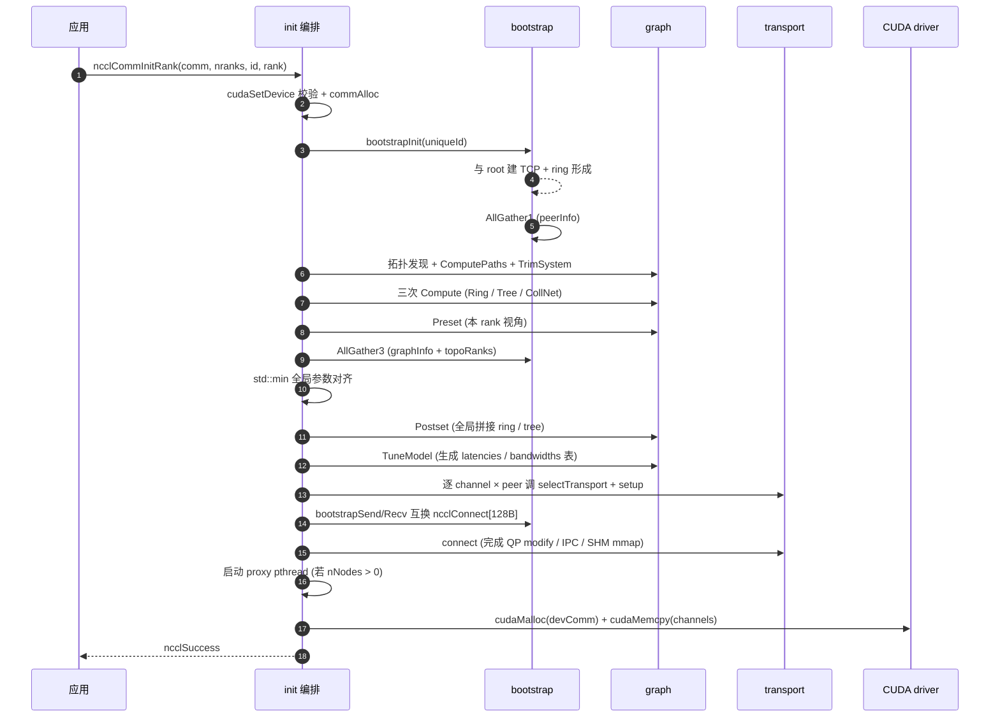

**关键决策**：

- **隐式同步点**：bootstrap 的两次 AllGather 是显式全局同步；要求所有 rank 几乎同时调 `ncclCommInitRank`，否则单线程死锁。
- **路径要算两次**：TrimSystem 之前为判定 NIC 可达性，之后为让搜索看到正确拓扑。
- **CollNet 双重门槛**：本地 `intraNodeRanks ≤ 8` + 全局 `nNodes ≥ 2`，任一不满足都关闭。这与 SHARP 网络硬件要求一致。

### 5.2 流程二：AllReduce 热路径（Ring + Simple 协议）

> 图 5-2：单次 AllReduce 端到端

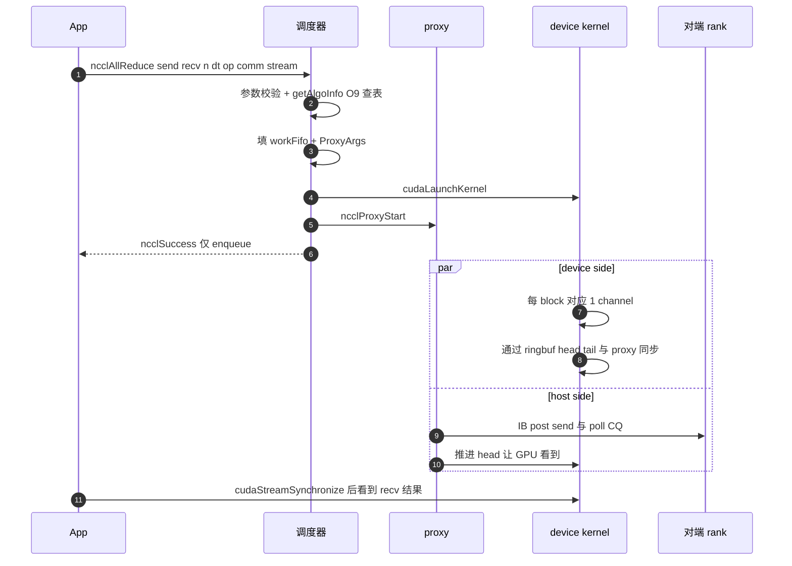

**关键决策**：

- **入队即返回**：调度器写完 workFifo + launch kernel 后立刻返回。`ncclSuccess` ≠ 操作完成。
- **device ↔ proxy 通过 ringbuf 同步**：head 由 device 写、proxy 读；tail 反之。`NCCL_STEPS=8` 决定流水深度。
- **调度器不参与稳态同步**：把工作"对称地"投给两侧后退出。

### 5.3 流程三：Group 聚合多次调用

> 图 5-3：Group 语义

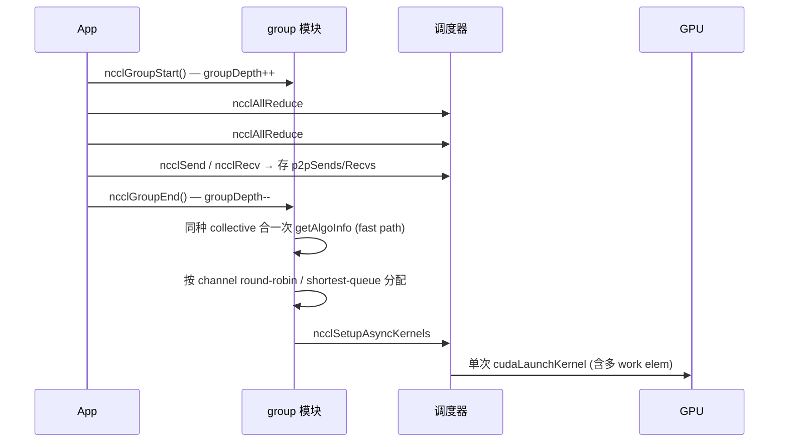

**关键决策**：

- **聚合的根本收益**：减少 launch 次数（CPU↔GPU 控制路径成本）。**16 次 AllReduce 合一次 launch** 是 DDP gradient bucketing 的基础。
- **`asyncAllocMode`**：默认 `ROUND_ROBIN` 均衡 channel；`SHORTEST_QUEUE` 适合异构尺寸 op 混合场景。
- **限制**：`ncclCommInitRank` 与集合通信不能在同一 group 中混合（API 文档已说明）。
- **send/recv 必须聚合**：单 `Send` 不配 `Recv` 会让 GPU SM 阻塞等对端，必须在同一 group 内配对。

### 5.4 流程四：Communicator 生命周期状态机

> **阅读导引**：本节用状态机视角覆盖 communicator 全生命周期。下图中的**装配子状态**（Bootstrapping → Discovering → Searching → Tuning → Connecting → DevSetup → Active）对应 §5.1 时序图的各阶段——若已阅读 §5.1 可快速略过。本节真正的价值落在状态机才能展示的三处：① **Active 期内的并发事件**（Enqueueing / Launched / InGroup / CheckErr / NetFail）、② **故障传播路径**（NetFail → FatalSeen）、③ **销毁双路径**（Destroying vs Aborting 的本质差异）。

> 图 5-4：完整状态机（含子状态、错误转移、外部触发）

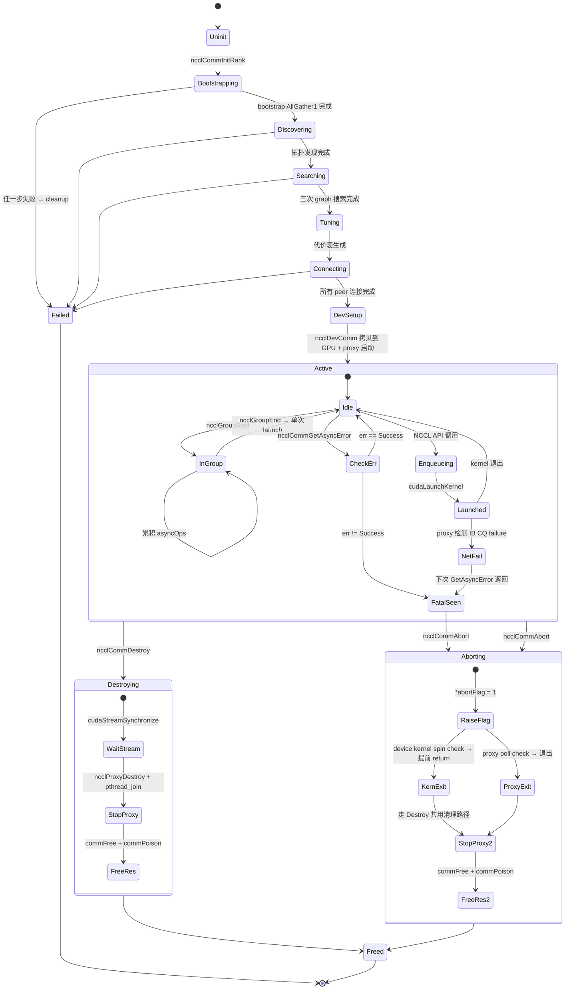

**关键决策**：

- **Destroying vs Aborting 的本质区别**：Destroy 先 `cudaStreamSynchronize`，stream hang 时跟着 hang；Abort 先设 `abortFlag=1`，device/proxy 看到后自行退出，几十 µs 内能逃出。**Abort 是唯一的 hang 逃生路径**。
- **commPoison 防双重释放**：Freed 状态把 `rank/cudaDev/busId/nRanks` 全置 -1，后续任意 API 入口检查到立即返回 `ncclInvalidArgument`。
- **FatalSeen → Aborting 路径**：proxy 在网络层检测到错误 → 设 `fatalError` → kernel 仍在 spin（看不到 fatal）→ 上层主动 `GetAsyncError` → 看到错误 → 必须 `Abort` 否则 kernel 永远 spin。abortFlag / fatalError 的两阶段语义详见 §7.2。

### 5.5 流程五：CUDA Graph 捕获与回放

> 图 5-5：CUDA Graph 捕获路径

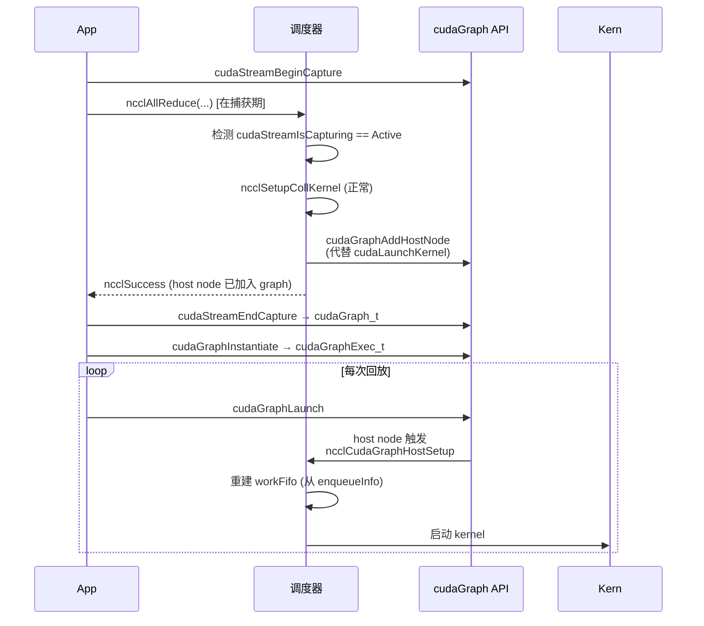

**关键决策**：

- **设计动机**：DL 训练每 step 重复同样的 NCCL 调用序列。用 CUDA Graph 可把整个序列固化为一个图，省去每 step 的 host 调度开销。
- **关键挑战**：NCCL 的 workFifo 是动态的 ringbuf，每次 launch 写入新 work elem；CUDA Graph 要求 host 行为可重放。解法：把 enqueue 阶段的"动作"打包成 `ncclQueueInfo` 注册为 graph 的 host node，回放时由 driver 调起重建 workFifo。
- **限制与待确认**：
  - 不支持 capture 期间 ncclGroup 嵌套不同 nChannels 的调用 *(待验证)*。
  - 不支持 capture 期间 abort *(明确不支持)*。
  - 与 `IB_QPS_PER_CONNECTION > 1` 的兼容性 *(待测，列为 §10.1 假设 A8)*。

---

## 6. 内存模型、ABI 与运行时接口

> 数据结构总览已前移到 §3.6。本章只讲三件事：内存一致性论证（§6.1）、对外 ABI（§6.2）、环境变量配置接口（§6.3）。

### 6.1 内存模型与一致性（设计关键章节）

NCCL 在 GPU 与 host、device 与 device、host 与 NIC 之间共享 ringbuf。各方平台的内存序模型不同，必须明确**全局可见性的论证**，否则 head/tail 同步在弱序硬件上可能出错。

#### 6.1.1 涉及的内存域

| 域 | 内存序 | 同步原语 |
|---|---|---|
| GPU 同 SM 内 | program order + `__syncthreads()` | block 内同步 |
| GPU 跨 SM | relaxed（弱序）| `__threadfence_block()` / `__threadfence()` |
| GPU ↔ Host 共享 mapped 内存 | relaxed | `__threadfence_system()` |
| Host ↔ NIC（IB write）| RDMA write 保证发送方写完整顺序到对端，但 CPU 看到 CQE 的顺序不蕴含 buffer 已可见 | `ibv_post_send + poll_cq` |
| Host ↔ Host（跨 NUMA）| TSO（x86）/ weakly ordered（aarch64）| `mfence` 或 release/acquire |

#### 6.1.2 ringbuf head/tail 的可见性论证

> 表 6-1：data 与 flag 的可见顺序保证

| 写入侧 | 操作序列 | 保证 |
|---|---|---|
| GPU 生产者（Simple 协议） | 写 buffs[step % NCCL_STEPS] → `__threadfence_system()` → 写 tail | 消费者看到 tail > step 时，data 一定已可见 |
| GPU 生产者（LL 协议） | data 与 flag 同次 8B 原子写入 ringbuf | 消费者读 8B 时要么看到旧值（flag 不匹配，重读）要么看到新值（data 与 flag 都已就位）|
| Host proxy 生产者（IB recv 完成）| `ibv_poll_cq` 返回成功 → 写 head | poll_cq 返回时 buffer 已被 NIC 写入完成 |
| Host proxy 消费者（IB send 准备）| 读 channel tail → 看到推进 → `ibv_post_send` | tail 由 GPU `__threadfence_system` 推进，host 可见 |

#### 6.1.3 关键设计决策

1. **LL 协议的 8 B 原子写**：把 4 B data + 4 B flag 合并为单次 8 B atomic store。这是 LL 比 Simple 省一次 `__threadfence_system` 的根本机制。**前提**：硬件保证 8 B 对齐 store 是原子的（NVLink/PCIe 都满足）。
2. **`volatile uint64_t head/tail`**：volatile 防止编译器缓存到寄存器；64 位防止跨 step 计数回绕（NCCL_STEPS 远小于 2^64）。
3. **cache line 对齐（128 B）**：避免 false sharing。head 与 tail 在不同 cache line。
4. **`__threadfence_system` 仅在跨 host 边界用**：intra-GPU 不需要，这是 LL 在 NVLink 上的延迟优势。
5. **abortFlag 用 `cudaHostAllocMapped`**：单一物理页跨 host/device 映射，host 写、device 读，无需显式 fence——CUDA driver 保证 mapped memory 的 host 写在合理延迟内对 device 可见。

#### 6.1.4 待评审验证的边界场景

- ARM 服务器（aarch64 + GH200）上 host ↔ GPU 共享内存的可见性论证是否仍成立 *(待硬件确认)*。
- IB write 在 SHARP CollNet 路径上的完成语义与单播 RDMA 是否一致 *(待 SHARP 文档复核)*。

### 6.2 C ABI 与符号导出策略

#### 6.2.1 公开符号清单

总计 21 个 `NCCL_API` 导出函数（设计目标 G6 要求 ≤ 25 个）：

| 类别 | 数量 | 函数 |
|---|---|---|
| 生命周期 | 5 | `ncclGetUniqueId`、`ncclCommInitRank`、`ncclCommInitAll`、`ncclCommDestroy`、`ncclCommAbort` |
| 集合通信 | 6 | `ncclAllReduce`、`ncclBroadcast`、`ncclBcast`（deprecated）、`ncclReduce`、`ncclReduceScatter`、`ncclAllGather` |
| 点对点 | 2 | `ncclSend`、`ncclRecv` |
| Group | 2 | `ncclGroupStart`、`ncclGroupEnd` |
| 查询 | 6 | `ncclCommCount`、`ncclCommCuDevice`、`ncclCommUserRank`、`ncclCommGetAsyncError`、`ncclGetErrorString`、`ncclGetVersion` |

#### 6.2.2 符号可见性策略

- **默认 hidden**：构建时 `-fvisibility=hidden`，避免内部符号污染调用方命名空间。
- **显式 default**：仅上述 21 个函数通过 `__attribute__((visibility("default")))` 导出。
- **PMPI 风格弱别名**：每个公开符号都有 `pnccl<Name>` 的弱别名，让 profiling 工具（如 Nsight Systems、自研 tracer）可以 LD_PRELOAD 拦截而不破坏链接。

#### 6.2.3 ABI 兼容性策略

| 兼容性级别 | 含义 | 跨版本保证 |
|---|---|---|
| ABI 兼容 | `.so` 可二进制替换 | minor 版本内（如 2.10.x）保证 |
| API 兼容 | 源码可重编译 | major 版本内（如 2.x）保证 |
| ABI 不兼容 | 必须重链 | major 版本之间 *(待与上游策略对齐确认)* |

调用方（PyTorch / TF）通过 `ncclGetVersion` 检测运行时版本，并对已知 bug 做版本门控。

### 6.3 环境变量配置接口

总计 30+ 个 `NCCL_*` 参数。完整清单见上游文档；本节按用途分类列出**对设计有结构性影响**的参数：

| 类别 | 参数 | 用途 |
|---|---|---|
| 调试 | `NCCL_DEBUG`、`NCCL_DEBUG_SUBSYS` | 分级日志 |
| 算法覆盖 | `NCCL_ALGO`、`NCCL_PROTO` | 复现性能问题时强制选择 |
| 资源调优 | `NCCL_NTHREADS`、`NCCL_BUFFSIZE`、`NCCL_MAX_NCHANNELS` | per-block 线程数、ringbuf 大小、通道数 |
| 网络后端 | `NCCL_NET`、`NCCL_NET_PLUGIN`、`NCCL_IB_HCA`、`NCCL_IB_QPS_PER_CONNECTION`、`NCCL_SOCKET_IFNAME` | 后端选择与细节 |
| 拓扑 | `NCCL_TOPO_FILE`、`NCCL_TOPO_DUMP_FILE`、`NCCL_GRAPH_DUMP_FILE` | 调试与异构环境 |
| 容错 | `NCCL_IB_TIMEOUT`、`NCCL_IB_RETRY_CNT` | 网络抖动容忍 |
| 启用开关 | `NCCL_P2P_DISABLE`、`NCCL_SHM_DISABLE`、`NCCL_COLLNET_ENABLE`、`NCCL_NVB_PRECONNECT` | 各后端 / 路径开关 |

**设计原则**：环境变量是**运行时不可变的配置接口**——用户启动前设好；不提供运行时改变 NCCL 行为的 API（这会破坏 G7 装配前置）。

---

## 7. 异常处理

### 7.1 异常分类与处置

| 异常源 | 检测点 | 处置 | 用户可见 |
|---|---|---|---|
| **入参非法**（NULL / 越界 / 非法 dtype）| API 入口 | 返回 `ncclInvalidArgument` | 错误码 |
| **设备指针校验**（`NCCL_CHECK_POINTERS=1`）| API 入口 | `cudaPointerGetAttributes` 检查，非 device 指针 → `ncclInvalidArgument` | 错误码 |
| **CUDA 调用失败**（`cudaMalloc` 等）| `CUDACHECK` 宏 | 冒泡返回 `ncclUnhandledCudaError`；进入 fatal | 错误码 + log |
| **Bootstrap TCP 失败** | socket 重试 | 超时后返回 `ncclSystemError` | 错误码 |
| **IB QP 失败 / verbs 错误** | `NCCLCHECK(wrap_ibv_*)` | fatal；通过 `GetAsyncError` 暴露 | 异步错误 |
| **dlopen 失败**（ibverbs / gdrapi 缺失）| 装配期 | 该后端从可用列表剔除，回退 | INFO 日志 |
| **网络 completion 出错**（IB CQ != SUCCESS）| proxy poll | 设 `comm->fatalError`，等上层 abort | 异步错误 |
| **CollNet 插件加载失败** | dlopen + 符号检查 | 关闭 `collNetSupport`，回退到 ring/tree | INFO 日志 |
| **GPU OOM during init** | `cudaMalloc` 失败 | fatal | 错误码 |
| **`MAX_ASYNC_OPS=128` 打爆** | group 内 op 超 128 | `ncclSaveAsyncColl` 返回 `ncclInvalidUsage` | 错误码 |
| **`NCCL_MAX_OPS=2048` workFifo 打爆** | `getNextOp` | "Too many aggregated operations" 错误 | 错误码 |

### 7.2 abortFlag / fatalError 两阶段语义（关键设计）

NCCL 把"异常发现"和"异常退出"刻意分成两个阶段。理解这两阶段是排查 hang 问题的关键。

> 图 7-1：故障传播时序

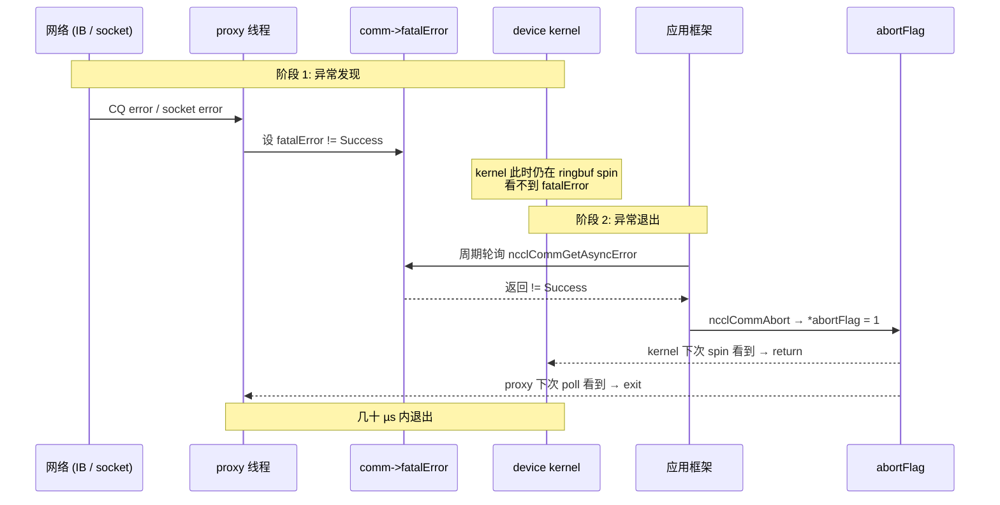

**两阶段的设计意图**：

| 阶段 | 信号 | 谁能看到 | 设计意图 |
|---|---|---|---|
| 阶段 1：发现 | `fatalError`（host 标量） | host 主动轮询 | proxy 线程发现网络层故障后**立即**记录，但**不强行打断** kernel——避免误判（瞬时网络抖动可能 retry 恢复）|
| 阶段 2：退出 | `abortFlag`（mapped 共享）| GPU + host 自动 spin check | 由**应用框架显式决定**何时放弃；一旦决定，几十 µs 内全员退出 |

**为什么不让 proxy 直接置 abortFlag**：避免把"业务决策"下放到 transport 层。瞬时 IB 抖动 + 重传 vs 不可恢复故障，由上层框架（带超时上下文）判断更合适。

**对应用方的硬约束**：

- **生产代码必须周期轮询 `GetAsyncError`**——否则 fatal 后下次 NCCL 调用永久 hang。
- **hang 时必须用 `Abort` 不用 `Destroy`**——Destroy 自己先 stream sync 会跟着 hang。

### 7.3 用户可见信号

| 信号 | 来源 | 用途 |
|---|---|---|
| 错误码 `ncclResult_t` | 所有 API 返回值 + `GetAsyncError` | 同步检测 / 异步轮询 |
| WARN 日志 | `NCCL_DEBUG=WARN` | 用户排查异常 |
| INFO/TRACE 日志 | `NCCL_DEBUG=INFO/TRACE` | 装配期决策、算法选择、连接细节 |
| NVTX range | `nvtxRangePush/Pop` | Nsight Systems 时间线分析 |
| 拓扑/图 dump | `NCCL_TOPO_DUMP_FILE` / `GRAPH_DUMP_FILE` | 事后离线分析 |
| 异步错误码 | `GetAsyncError` | 框架轮询 hang 检测 |

---

## 8. 测试策略

本章描述**实现该方案时必须覆盖的测试矩阵**，不是对 NCCL 现有测试的描述。

### 8.1 单元测试

| 测试类别 | 覆盖目标 | 关键 case |
|---|---|---|
| **graph 模块** | 拓扑解析与搜索 | DGX-A100 NVSwitch 全连接、DGX-1V / HGX NVLink Bridge cubemesh、PCIe-only 8 GPU、单 GPU、跨 NUMA、`NCCL_TOPO_FILE` 注入 |
| **device kernel** | 9 (algo, proto) 组合 × 5 redop × 10 dtype | 每种组合至少一个 size 跑通 |
| **transport vtable** | 4 后端 `setup/connect/free` | mock peerInfo，验证 vtable 调用顺序 |
| **bootstrap** | ring 形成 + AllGather + Send/Recv | 单节点 8 rank、跨节点 16 rank |
| **enqueue 调度** | 三种调度路径（直接 / Group / Graph）| 每路径覆盖 collective + p2p |
| **状态机** | 装配失败、Active 期内事件、双路径销毁 | 注入失败、模拟 NetFail → FatalSeen |

底线：覆盖率 ≥ 70% 行覆盖、≥ 60% 分支覆盖 *(待与上游策略对齐)*。

### 8.2 集成测试

| 测试场景 | 验证点 |
|---|---|
| **9 组合矩阵**（3 algo × 3 proto）| `NCCL_ALGO=X NCCL_PROTO=Y` 全跑 AllReduce，结果数值一致 |
| **多 dtype**（含 bf16）| 每 dtype 跑一次 AllReduce + Avg |
| **Group 聚合** | 连续 16 次 AllReduce + 多组 send/recv 在一个 group 内，结果与逐次调用一致 |
| **CUDA Graph 捕获** | 用 `cudaStreamCapture` 包裹 NCCL 调用，replay 10 次结果一致 |
| **WSL2 路径** | WSL2 + 单 GPU 跑通 init + AllReduce |
| **NVLink Bridge cubemesh 拓扑**（DGX-1V / 无 NVSwitch 的 HGX 配置）| 4 / 8 GPU 上回归，验证 NVB 桥接路径与 search 输出 `nChannels > 0`。DGX-A100 / DGX-2 因 NVSwitch 全连接不走 NVB，单独建一组回归 |
| **多 comm 隔离** | 同进程内同时持 DP + TP + PP 三个 comm，并行跑各自 AllReduce 无干扰 |
| **失败注入装配** | 装配各子阶段返回错误码 → 验证 cleanup 路径无资源泄漏 |

### 8.3 性能基准

| 指标 | 目标 | 工具 |
|---|---|---|
| AllReduce intra-node latency (8 B) | LL ≤ 8 µs（A100 NVLink-3）| nccl-tests `all_reduce_perf -b 8 -e 8` |
| AllReduce inter-node bandwidth (1 GB) | ≥ 95% IB 单链路峰值 | `all_reduce_perf -b 1G -e 1G` |
| Tree latency 中等消息（1 MB） | 较前版本提升 ≥ 5% | tuning 表对照 |
| `IB_QPS_PER_CONNECTION=4` 在 200G HDR | 接近 2× 单 QP 吞吐 | 单连接 BW |
| Proxy 线程 CPU 占用（200G NIC、AllReduce 1 GB）| < 50% 单核 | `top` / `perf` |

**回归底线**：每个新版本相对上一个 release，throughput regression < 5%。

### 8.4 故障注入

| 故障 | 注入方式 | 期望行为 |
|---|---|---|
| Abort 中途 | 训练循环里 `kill -9` 一个 worker | 剩余 rank `GetAsyncError != Success`，能 `Abort` 退出，不永久 hang |
| 网络丢包/抖动 | `tc netem` 1% 丢包 + 1 ms jitter | socket 后端在 IB 重传后正常完成；超时后 fatal |
| GPU ECC 错误 | 模拟 cuda error 注入 | fatal 传播；abort 路径生效 |
| 装配期失败 | mock `cudaMalloc` 返回错误 | cleanup 路径运行，`*newcomm = NULL` |
| Group 内 op > 128 | 单 group 内调 200 次 send | `ncclInvalidUsage` 返回 |

### 8.5 端到端（DL 框架集成）

| 框架 | 验证 |
|---|---|
| PyTorch DDP + ResNet50 | 1 epoch 收敛，`NCCL_DEBUG=INFO` 抽查算法选择 |
| Megatron-LM 多机 TP | send/recv group 路径正常 |
| DeepSpeed ZeRO-3 | AllGather + ReduceScatter 性能符合 budget |
| Horovod 兼容 | 烟测通过 |

---

## 9. 安全、部署与运维

### 9.1 安全威胁模型

**信任边界假设**：所有 rank 在受控网络平面内，无外部攻击者直接访问 IB / socket 端口。这一假设对**单租户裸金属集群成立**，对**多租户云 / Kubernetes 共享 GPU 节点不成立**。

#### 9.1.1 威胁分析

| 威胁 | 攻击面 | 影响 | 缓解措施（由谁负责）|
|---|---|---|---|
| **恶意 `NCCL_TOPO_FILE`** | 同进程用户控制环境变量 | 解析时缓冲区越界 | XML 解析必须做严格边界检查（NCCL 自身责任）|
| **IB GID 劫持** | 共享 IB fabric 多租户 | 中间人读取/伪造 RDMA write | 部署侧 IB partition + PKey 隔离 |
| **CUDA IPC handle 泄漏** | 同节点跨进程 | 攻击进程 mmap 受害进程显存 | 部署侧 cgroup + 用户隔离（NCCL 无法防范）|
| **SHM segment 越界读** | 同节点跨进程 | 攻击进程 mmap NCCL shm | 部署侧 namespace 隔离 |
| **Bootstrap TCP 中间人** | rank 0 的 listen socket | 伪造 PeerInfo / connectInfo | 部署侧 TLS 隧道 / VPN（NCCL 不内置）|
| **环境变量注入** | 用户控制 `NCCL_NET=<malicious_plugin>` | 加载攻击者 .so | `LD_LIBRARY_PATH` 控制 / 受信任插件白名单（部署侧）|

#### 9.1.2 设计层面的最小化攻击面

- **解析路径硬化**：XML 解析使用预分配节点池（无 malloc 失败 / 越界 / use-after-free 风险）。
- **不内置加密**：避免引入复杂攻击面；TLS / IPSec 由部署侧负责。
- **dlopen 路径限制**：插件加载受 `LD_LIBRARY_PATH` 和 `NCCL_NET_PLUGIN` 控制，不扫描全盘。
- **不暴露通用 RPC**：bootstrap TCP 仅用于 rendezvous，不接受任意命令。

#### 9.1.3 留作后续版本的安全工作

- 端到端加密（TLS over bootstrap、IB IPSec）*(留作 §10.3 演进)*
- 插件签名验证 *(留作演进)*

### 9.2 部署视图

> 图 9-1：典型部署拓扑（4 节点、每节点 8 GPU）

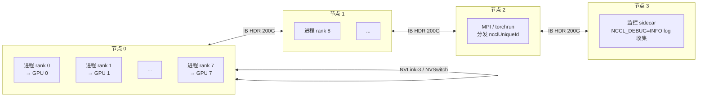

**部署单元**：

| 单元 | 数量 | 资源占用 |
|---|---|---|
| 每 rank 一个进程 | nranks | 一个 GPU + 一条 proxy pthread |
| 每 comm 一个 proxy 线程 | per comm | < 50% 单核 CPU @ 200G |
| 每 comm 一组 IB QP | per comm × per peer × QPS_PER_CONNECTION | 受 NIC max QP 限制 |
| 每 comm SHM segment | per comm × per intra-node peer | 一个 segment ~ 12 MB |

**部署侧关键决策**：

1. **CPU 亲和性**：让进程的 host 部分绑定到 GPU 同 NUMA 的 CPU（NCCL 装配期自动处理本地内存分配的亲和；用户进程亲和性由部署侧设置）。
2. **IB partition 隔离**：多租户共享 fabric 时必须配置 PKey。
3. **fd 限制**：bootstrap + IB CM + proxy 在大规模训练（≥ 10k ranks）下消耗大量 fd，必须把 `ulimit -n` 调到至少 65536。
4. **rendezvous 通道**：`ncclUniqueId` 分发通道（MPI / Redis / file）由部署侧选定，影响启动健壮性。

### 9.3 可观测性与 SRE 指标

#### 9.3.1 应当采集的指标

| 指标 | 采集方式 | 告警阈值 |
|---|---|---|
| **proxy 线程 CPU 使用率** | `/proc/<pid>/task/<tid>/stat` | > 80% 单核持续 1 min 告警 |
| **IB CQE 错误率** | `ibv_query_qp` + 自采 | > 0/min 告警 |
| **ringbuf 满 vs 空时长比** | NCCL_DEBUG=TRACE 采样 | 长期空 = 算法选择偏小 / 大消息走 LL |
| **AllReduce P99 延迟（per size bucket）** | NVTX range 解析 / 自打点 | 偏离基线 > 20% 告警 |
| **fatalError 计数** | 框架层 `GetAsyncError` 轮询计数 | > 0 即告警 |
| **abort 次数** | 框架层 `ncclCommAbort` 调用计数 | > 0 即告警 |
| **comm 创建延迟** | init 入口/出口打点 | > 5 s 告警（可能是 bootstrap 卡死） |

#### 9.3.2 排障流程

> 表 9-1：常见症状 → 怀疑模块

| 症状 | 第一怀疑 | 第二怀疑 | 排查工具 |
|---|---|---|---|
| 训练 hang 但 GPU 100% | proxy 等 CQE / GPU spin 等 head | abortFlag 未触发 | `cuda-gdb` 看 kernel pc + `ibv_query_qp` |
| 训练 hang 且 GPU 0% | bootstrap rank 等不齐 / Destroy hang | rank 提前退出 | netstat + 各 rank 的 NCCL_DEBUG=TRACE |
| 性能 regression 30% | 算法选错（tuning 表）| 后端选错（dlopen 失败）| `NCCL_DEBUG=INFO` 看选择日志 |
| P99 延迟漂移 | NUMA 亲和性丢失 | proxy CPU 竞争 | `numactl --show` + perf |
| init 慢（> 10 s） | bootstrap 网络 / TopoFile 慢 | search 慢（cubemesh）| 装配各阶段打点 |
| OOM during init | ringbuf 配置过大 | nChannels 选错 | `NCCL_BUFFSIZE` 调小测试 |

#### 9.3.3 调试入口

- **`NCCL_DEBUG=WARN`**：默认生产配置，仅出错时输出。
- **`NCCL_DEBUG=INFO`**：装配期决策（拓扑、算法、连接）全打印，**生产可常开**（开销小）。
- **`NCCL_DEBUG=TRACE`**：每次调用打印，**仅排障开启**（开销大）。
- **`NCCL_DEBUG_SUBSYS`**：按子系统过滤（INIT / COLL / P2P / NET / ENV / ALLOC / ...）。
- **`NCCL_TOPO_DUMP_FILE` / `NCCL_GRAPH_DUMP_FILE`**：装配完成后落盘，供离线分析。
- **NVTX range**：Nsight Systems 上可看到每个集合通信的 host enqueue 与 GPU kernel 对齐。

---

## 10. 设计假设、替代方案与演进路径

### 10.1 关键设计假设（评审需逐条确认）

这一节列出本设计依赖的**未充分验证的假设**。评审会议应逐条过。

| # | 假设 | 来源章节 | 影响 | 验证方式 |
|---|---|---|---|---|
| **A1** | 单 communicator ≥ 10k ranks 在 IB QP / fd 限制下可达 | §2.2 | 影响超大规模训练上限 | 在 1024+ 节点集群压测 |
| **A2** | 浮点 `Avg` 用 preOp scale 而非 postOp divide 的精度收益对 fp16 / bf16 显著 | §4.4.2 | 影响小规模训练数值稳定性 | 与 MPI MPI_AVG 实现做精度对比 |
| **A3** | LL 协议的 8 B 原子 store 在所有目标硬件（NVLink/PCIe/aarch64）上成立 | §6.1.3 | 影响 LL 协议正确性 | 硬件文档复核 + stress test |
| **A4** | proxy 单线程在 800 G+ NIC 下不会成为瓶颈 *(2.10.3 上限是 200/400G)* | §4.4.6 | 影响未来大带宽 NIC 兼容性 | 800G 网卡压测，看 CPU 占用 |
| **A5** | `MAX_ASYNC_OPS=128` 在大规模 GPT 训练（每 step 数百次 send/recv）够用 | §3.6 容量常量 | 超出会 `ncclInvalidUsage` | Megatron 3D 并行实测 |
| **A6** | `std::min` 全局对齐策略不会让异构集群（如 8×H100 + 8×A100）的性能跌到 A100 一半以下 | §4.4.1 | 影响异构集群可用性 | 混合硬件实测 |
| **A7** | `NCCL_NET=ib` 强制选择时若 IB 不可用立即报错（不回退） | §6.3 | 影响错误诊断的清晰度 | 设计行为待评审确认 |
| **A8** | CUDA Graph 路径与 `IB_QPS_PER_CONNECTION > 1` 兼容 | §5.5 | 影响新版 PyTorch compile + 多 QP 组合 | 矩阵测试 |
| **A9** | abortFlag 的几十 µs 内退出 SLO 在所有路径（包括 CollNet）成立 | §7.2 | 影响生产环境 hang 逃生 | 故障注入测试 |
| **A10** | 多 comm（DP + TP + PP）并存时 NVLink 物理链路不会因竞争产生死锁 | §3.4 | 影响 3D 并行训练稳定性 | Megatron 多 comm 压测 |

### 10.2 评估过但未采用的替代方案

| # | 替代方案 | 放弃理由 |
|---|---|---|
| **R1** | 每次调用动态选 algo（不预建代价表） | 违反 G7 装配前置；µs 级开销不可接受 |
| **R2** | 单中央调度协调（事件队列 + mutex） | 违反 P2 对称投递；µs 级竞争 |
| **R3** | 编译期 `#ifdef` 选传输后端 | 违反 G5；第三方插件无法接入 |
| **R4** | 用 IPoIB 代替 TCP 做 bootstrap | 鸡生蛋；IB 起步需要 PeerInfo |
| **R5** | proxy 每 channel 一条线程 | 资源消耗放大 nChannels 倍；2.10.3 场景下单线程够用 |
| **R6** | 集合通信 + P2P 统一调度 | 两者负载特征差异大，硬合并牺牲两者最优算法 |
| **R7** | ABI 暴露 future / promise 模型 | 与 CUDA stream 重复；增加调用方复杂度 |
| **R8** | 用 ILP / 整体优化代替 DFS 搜索 | 小规模拓扑收益不明显，装配延迟可能爆炸 |
| **R9** | 通信器支持动态 split | 与 P1 装配前置冲突；留作后续版本（见 §10.3）|
| **R10** | 单 rank 容错（local checkpoint + replay） | 与 P5 失败即整体作废冲突；上层框架更适合做 |

### 10.3 后续版本演进路径

本节标注 2.10.3 之后的关键演进，及其对本设计的影响。

| 版本 | 关键能力 | 对本设计的影响 |
|---|---|---|
| **2.13+** | `ncclCommSplit` | 需要可变 communicator 状态；本设计的 P5 "创建即不可变" 要放宽。具体改动：rank 集合改为可变、部分 channel 资源支持复制/裁剪 |
| **2.16+** | `ncclMemAlloc` / register buffer | 把用户 buffer 与 NCCL 内部 buffer 注册关系前置，减少首次调用的 IB MR 注册延迟。本设计的"装配前置"原则进一步扩展到 buffer 注册 |
| **2.18+** | Userbuffers（用户提供 RDMA-registered buffer）| 零拷贝路径上 LL/LL128 协议可直接读写用户内存 |
| **2.19+** | Tuner plugin | 允许第三方提供 algo 选择策略，覆盖默认代价模型。本设计的 §4.4.1 调优表需要插件 ABI 化 |
| **2.20+** | NVLink SHARP | 网内 reduction 不再仅限 IB SHARP；CollNet 路径需要扩展到 NVLink 域 |
| **未来** | 多线程 proxy | 解决 A4 假设可能失败的 800G+ NIC 场景 |
| **未来** | 端到端加密 | §9.1 留待的安全工作 |
| **未来** | Elastic rank（运行时加入/退出）| 与本设计的 G7、P5 冲突最大，可能需要架构级重构 |

**对评审者的提示**：如果本设计要尽量贴近未来 2.18+ 的演进方向，应该在以下几处提前埋好接口扩展点：

1. communicator 内部状态拆分为"不可变部分" + "可变部分"（为 split 准备）
2. buffer 注册流程独立成模块（为 Userbuffers 准备）
3. 调优表暴露为插件接口（为 tuner plugin 准备）

---

## 11. 附录

### 11.1 术语

按主题分组列出，标 ★ 的为新同事最关键术语。

#### 11.1.1 通信器与角色

| 术语 | 含义 |
|---|---|
| **rank** ★ | communicator 内的进程序号，范围 `[0, nranks)` |
| **communicator / comm** ★ | NCCL 对一组 rank 的通信抽象，由 `ncclCommInitRank` 创建，重资源不可变（详见 §3.4）|
| **装配期** ★ | `ncclCommInitRank` 调用期间，做一切重决策（拓扑发现、算法搜索、传输连接、proxy 启动）|
| **稳态** | 装配完成后的整段时期，多次 NCCL API 调用合集 |
| **热路径** ★ | 单次 NCCL API（如 `ncclAllReduce`）调用的执行路径，目标 µs 级开销 |
| **bootstrap** | 装配阶段唯一的跨节点同步通道（TCP rendezvous）；详见 §4.4.5 |

#### 11.1.2 集合通信原语

| 术语 | 含义 |
|---|---|
| **AllReduce** ★ | 每 rank 输入 `data[N]`，所有 rank 输出 `Σ data[N]`（详见 §1.4）|
| **AllGather** | 每 rank 输入 `data[N]`，所有 rank 输出 `data[nranks × N]`（拼接）|
| **ReduceScatter** | 每 rank 输入 `data[nranks × N]`，每 rank 输出 `Σ` 的 1/nranks 切片 |
| **Broadcast** | root rank 输入 `data[N]`，所有 rank 输出 `data[N]`（root 发给所有）|
| **Reduce** | 每 rank 输入 `data[N]`，仅 root 输出 `Σ data[N]` |
| **Send / Recv** | 点对点单向通信；必须包在 `GroupStart/End` 中 |
| **Group** | `ncclGroupStart..End` 聚合多次调用合一次 launch（详见 §5.3）|

#### 11.1.3 三层执行单元

| 术语 | 含义 |
|---|---|
| **channel** ★ | 一个并行通信通道，对应 GPU 上一个 thread block；`bid = blockIdx.x = channel id`；上限 `MAXCHANNELS = 32`（详见 §4.4.4）|
| **algorithm** ★ | 通信算法：Ring / Tree / CollNet 三选一，由 `getAlgoInfo` 按消息大小选定 |
| **protocol** ★ | 协议：Simple（大消息）/ LL（小消息低延迟）/ LL128（中消息平衡）|
| **prims** | device 端通信原语类（`prims_simple.h` / `prims_ll.h` / `prims_ll128.h`）|
| **chunk** | 用户 sendbuff 切片后的数据片段，一次 step 搬运一个 chunk |
| **step** | ringbuf 流水化的一个单位；`NCCL_STEPS = 8` |
| **ringbuf** ★ | device 与 transport 共享的环形缓冲区，每协议各一份；详见 §4.4.7 |

#### 11.1.4 协议层细节

| 术语 | 含义 |
|---|---|
| **LL（low-latency）** | 协议名，每 4B data 后跟 4B flag 交错布局，省一次 fence |
| **LL128** | 协议名，128B 行内 15×8B data + 1×8B flag（行尾），载荷率 93.75% |
| **LL flag** | LL 协议中嵌入数据流的 4B 标志位，取自 step 计数 |
| **head / tail** | ringbuf 同步计数器；`tail` 由生产侧推进（slot 就绪信号）、`head` 由消费侧推进（slot 可复用信号）|
| **NCCL_STEPS** | ringbuf 流水深度（slot 数），固定 8 |

#### 11.1.5 graph 模块（仅装配期）

| 术语 | 含义 |
|---|---|
| **ncclTopoSystem (L1)** | 硬件图：6 类节点（CPU/GPU/PCI/NVS/NIC/NET）+ 链路 |
| **ncclTopoGraph (L2)** | 算法图：每 channel 走的路径序列（`intra[]` 节点内 GPU + `inter[]` 跨节点 NIC 对）|
| **ncclTopoRanks (L3)** | 本 rank 视角的 channel 端点信息 |
| **Preset / Postset** | bootstrap AllGather3 前/后两步：本地预编排 + 全局拼接 |
| **Hamilton-like 路径** | search 找的"经过所有 GPU 一次"的路径形态 |
| **退避搜索** | 外层在参数空间逐级放松约束的启发式策略（详见 §4.4.1）|
| **BALANCED_TREE / SPLIT_TREE / TREE** | 三种 tree pattern：NIC 流量在 2 个 GPU 平摊 / 分离到 2 个 GPU / 集中到 1 个 GPU |

#### 11.1.6 transport 模块

| 术语 | 含义 |
|---|---|
| **transport 后端** | 4 类：P2P（NVLink/IPC）/ SHM / NET（IB+socket）/ CollNet |
| **P2P** | 同节点 GPU 直接通信（NVLink store/load 或 CUDA IPC）|
| **SHM** | 同节点跨进程通过 host shared memory（无 P2P 时回退）|
| **vtable 多态** | `ncclConnector.transportComm` 指向不同后端 vtable 实现运行时选后端 |
| **GDR (GPUDirect RDMA)** | NIC 直接读写 GPU memory 的 RDMA 路径，避免 host bounce buffer |
| **GDRCopy** | GPUDirect RDMA 的 user-space copy 路径 |
| **ncclConnect[128B]** | bootstrap 透传的不透明出口信息（IB QP+GID / IPC handle / SHM key 等）|

#### 11.1.7 网络与硬件

| 术语 | 含义 |
|---|---|
| **NVLink** | NVIDIA GPU 间高速点对点链路（NVLink-3 单链 25 GB/s）|
| **NVSwitch** | NVLink 全连接交换芯片（DGX-A100/DGX-2 上 8 GPU 全连）|
| **NVB (NVLink Bridge)** | 无 NVSwitch 时的桥接路径，cubemesh 拓扑（DGX-1V、HGX 子集）|
| **IB (InfiniBand)** | NIC 类型，用 verbs API 编程 |
| **RDMA** | Remote Direct Memory Access，IB/RoCE 的核心机制 |
| **IB QP / CQ / GID** | Queue Pair（连接句柄）/ Completion Queue（完成事件队列）/ Global Identifier（地址）|
| **CollNet / SHARP** | 网内 reduction，NIC 硬件直接做 AllReduce |
| **CUDA IPC** | CUDA Inter-Process Communication，跨进程共享 device 内存 |
| **cubemesh** | 部分连接 GPU 拓扑（不是全连接），GPU 间需第三方 GPU 中转 |

#### 11.1.8 调度与同步

| 术语 | 含义 |
|---|---|
| **proxy 线程** ★ | host 端代理线程，每 comm 一条，驱动 NET / CollNet 网络 IO |
| **workFifo** | 每 channel 一个 host pinned 环形队列，调度器写、GPU kernel 读；深度 `NCCL_MAX_OPS=2048` |
| **funcIndex** | 5 维参数 `(F,A,P,R,T)` 编码成的单一 int 索引，GPU kernel 用它跳到对应模板 |
| **getAlgoInfo** | 调度器查 `latencies/bandwidths` 表选 (algo, proto) 的 O(9) 函数 |
| **abortFlag** ★ | host/device 共享的中止信号（`cudaHostAllocMapped`），唯一 hang 逃生路径 |
| **fatalError** | host 端标量错误状态，proxy 检测网络错误后设置；上层轮询 `GetAsyncError` 看到 |
| **ROUND_ROBIN / SHORTEST_QUEUE** | `getNextChannel` 的两种策略（详见 §4.4.4）|

#### 11.1.9 设计原则速记

| 缩写 | 含义 |
|---|---|
| **P1** | 装配前置 / 热路径精简 |
| **P2** | 对称投递 / 不参与稳态同步 |
| **P3** | 三层执行单元（Channel × Algorithm × Protocol）|
| **P4** | vtable 多态贯穿 transport 与 proxy |
| **P5** | Communicator 作为重资源 / 不可变句柄 |
| **G1-G9** | 9 条设计目标（详见 §1.2 / §1.5 追溯表）|

### 11.2 参考资料

- 上游仓库：[NVIDIA/nccl](https://github.com/NVIDIA/nccl)
- 性能测试：[NVIDIA/nccl-tests](https://github.com/NVIDIA/nccl-tests)
- 官方文档：[docs.nvidia.com/deeplearning/nccl/](https://docs.nvidia.com/deeplearning/nccl/)
- 代码逆向分析（含 file:line 引用）：[nccl-2.10.3-design.md](nccl-2.10.3-design.md)
- 分层架构图：[nccl-arch-layered.svg](nccl-arch-layered.svg)
- 拓扑 XML 模板：[nccl-topo-template.xml](nccl-topo-template.xml)

### 11.3 本文档与代码基线的关系

本文档以 NCCL 2.10.3-1（commit `7e515921295a`）为对照实现，但**目标是描述设计层面的决策与契约**，不依赖具体 commit。当对照实现演进到后续版本时，本文档的设计原则与契约部分仍然适用；具体的代码位置请参考 [nccl-2.10.3-design.md](nccl-2.10.3-design.md) 的 file:line 索引。

2.10.3 相对前序 2.9.x 的关键增量（仅作版本溯源）：

- 增加 bf16 支持
- 增加 `ncclAvg` reduction
- 聚合操作性能改进
- Tree 算法性能改进
- 网络错误报告改进
- 增加 `NCCL_NET` 参数强制选择后端
- 增加 `NCCL_IB_QPS_PER_CONNECTION` 拆 IB 流量
- 修复 WSL2 拓扑检测
- 修复 proxy 内存元素亲和性（alltoall 性能）
- 修复 cubemesh 拓扑的搜索与 NVB 连接 hang

---

> **评审重点提示**（建议评审者优先关注）
>
> 1. **§1.5 设计目标 ↔ 章节追溯表**：是否覆盖了所有 G1-G9？
> 2. **§3.2 五条设计原则 + 替代方案**：P1-P5 的替代方案放弃理由是否站得住脚？
> 3. **§6.1 内存模型与一致性**：LL 协议的原子写假设（A3）、`__threadfence_system` 的最小化使用，是否在所有目标硬件成立？
> 4. **§7.2 abortFlag / fatalError 两阶段语义**：是否同意"业务决策不下放到 transport 层"的设计原则？
> 5. **§10.1 假设 A1-A10**：A4（800G proxy 瓶颈）、A6（异构集群）、A10（多 comm 死锁）是当前最大的设计风险，请优先验证。
> 6. **§10.3 演进路径**：是否同意在 communicator 状态拆分、buffer 注册独立、调优表插件化三处预留接口扩展点？
