# 《GPU 高性能集合通信库》详细设计文档

- [《GPU 高性能集合通信库》详细设计文档](#gpu-高性能集合通信库详细设计文档)
  - [1. 背景与目标](#1-背景与目标)
    - [1.1 背景](#11-背景)
    - [1.2 设计目标](#12-设计目标)
    - [1.3 非目标（明确不做的事）](#13-非目标明确不做的事)
    - [1.4 设计目标 ↔ 实现章节追溯表](#14-设计目标--实现章节追溯表)
  - [2. 需求分析](#2-需求分析)
    - [2.1 功能性需求](#21-功能性需求)
    - [2.2 非功能性需求](#22-非功能性需求)
    - [2.3 性能预算拆解](#23-性能预算拆解)
  - [3. 整体架构](#3-整体架构)
    - [3.1 系统架构与关键设计原则](#31-系统架构与关键设计原则)
    - [3.2 五条贯穿全局的设计原则](#32-五条贯穿全局的设计原则)
    - [3.3 装配重 / 热路径轻的二分](#33-装配重--热路径轻的二分)
    - [3.4 Communicator 设计模型（精简）](#34-communicator-设计模型精简)
    - [3.5 分层架构总览](#35-分层架构总览)
  - [4. 模块划分与职责](#4-模块划分与职责)
    - [4.1 顶层模块表](#41-顶层模块表)
    - [4.2 装配期与热路径的模块依赖差异](#42-装配期与热路径的模块依赖差异)
    - [4.3 模块契约（接口边界）](#43-模块契约接口边界)
    - [4.4 各模块设计要点](#44-各模块设计要点)
      - [4.4.1 graph 模块：硬件拓扑 → 算法图](#441-graph-模块硬件拓扑--算法图)
      - [4.4.2 device 模块：算法 × 协议 矩阵](#442-device-模块算法--协议-矩阵)
      - [4.4.3 transport 模块：vtable 多态 + 4 后端](#443-transport-模块vtable-多态--4-后端)
      - [4.4.4 enqueue / group 模块：中央调度器](#444-enqueue--group-模块中央调度器)
      - [4.4.5 bootstrap 模块：装配期 rank 互联](#445-bootstrap-模块装配期-rank-互联)
      - [4.4.6 proxy 模块：host 端网络驱动](#446-proxy-模块host-端网络驱动)
  - [5. 关键流程](#5-关键流程)
    - [5.1 流程一：Communicator 初始化（`ncclCommInitRank`）](#51-流程一communicator-初始化ncclcomminitrank)
    - [5.2 流程二：AllReduce 热路径（Ring + Simple 协议）](#52-流程二allreduce-热路径ring--simple-协议)
    - [5.3 流程三：Group 聚合多次调用](#53-流程三group-聚合多次调用)
    - [5.4 流程四：Communicator 生命周期状态机](#54-流程四communicator-生命周期状态机)
    - [5.5 流程五：CUDA Graph 捕获与回放](#55-流程五cuda-graph-捕获与回放)
  - [6. 数据模型与接口](#6-数据模型与接口)
    - [6.1 核心数据结构关系](#61-核心数据结构关系)
    - [6.2 内存模型与一致性（设计关键章节）](#62-内存模型与一致性设计关键章节)
      - [6.2.1 涉及的内存域](#621-涉及的内存域)
      - [6.2.2 ringbuf head/tail 的可见性论证](#622-ringbuf-headtail-的可见性论证)
      - [6.2.3 关键设计决策](#623-关键设计决策)
      - [6.2.4 待评审验证的边界场景](#624-待评审验证的边界场景)
    - [6.3 C ABI 与符号导出策略](#63-c-abi-与符号导出策略)
      - [6.3.1 公开符号清单](#631-公开符号清单)
      - [6.3.2 符号可见性策略](#632-符号可见性策略)
      - [6.3.3 ABI 兼容性策略](#633-abi-兼容性策略)
    - [6.4 环境变量配置接口](#64-环境变量配置接口)
  - [7. 异常处理](#7-异常处理)
    - [7.1 异常分类与处置](#71-异常分类与处置)
    - [7.2 abortFlag / fatalError 两阶段语义（关键设计）](#72-abortflag--fatalerror-两阶段语义关键设计)
    - [7.3 用户可见信号](#73-用户可见信号)
  - [8. 测试策略](#8-测试策略)
    - [8.1 单元测试](#81-单元测试)
    - [8.2 集成测试](#82-集成测试)
    - [8.3 性能基准](#83-性能基准)
    - [8.4 故障注入](#84-故障注入)
    - [8.5 端到端（DL 框架集成）](#85-端到端dl-框架集成)
  - [9. 安全、部署与运维](#9-安全部署与运维)
    - [9.1 安全威胁模型](#91-安全威胁模型)
      - [9.1.1 威胁分析](#911-威胁分析)
      - [9.1.2 设计层面的最小化攻击面](#912-设计层面的最小化攻击面)
      - [9.1.3 留作后续版本的安全工作](#913-留作后续版本的安全工作)
    - [9.2 部署视图](#92-部署视图)
    - [9.3 可观测性与 SRE 指标](#93-可观测性与-sre-指标)
      - [9.3.1 应当采集的指标](#931-应当采集的指标)
      - [9.3.2 排障流程](#932-排障流程)
      - [9.3.3 调试入口](#933-调试入口)
  - [10. 设计假设、替代方案与演进路径](#10-设计假设替代方案与演进路径)
    - [10.1 关键设计假设（评审需逐条确认）](#101-关键设计假设评审需逐条确认)
    - [10.2 评估过但未采用的替代方案](#102-评估过但未采用的替代方案)
    - [10.3 后续版本演进路径](#103-后续版本演进路径)
  - [11. 附录](#11-附录)
    - [11.1 术语](#111-术语)
    - [11.2 参考资料](#112-参考资料)
    - [11.3 本文档与代码基线的关系](#113-本文档与代码基线的关系)

---

## 1. 背景与目标

### 1.1 背景

深度学习训练与推理框架（PyTorch DDP、Megatron-LM、DeepSpeed、Horovod、TensorFlow）在分布式场景下都依赖一个**高性能的多 GPU、多节点集合通信库**，提供以下原语：

- **集合通信**：`AllReduce` / `AllGather` / `ReduceScatter` / `Broadcast` / `Reduce`
- **点对点**：`Send` / `Recv`
- **聚合语义**：`GroupStart` / `GroupEnd`

底层硬件具备显著的异构性：单机内有 NVLink / NVSwitch / PCIe / CUDA IPC / 共享内存等多种互连；跨机有 InfiniBand verbs / RoCE / TCP socket / 网内 reduction（NVIDIA SHARP / CollNet）等多种网络后端。**框架不应感知这些差异**——这是本方案要屏蔽的复杂性。

关键诉求归纳为四点：

1. **充分利用硬件带宽**：NVLink-3 单链路 ~25 GB/s、IB HDR 单端口 ~25 GB/s。软件层应做到 ≥ 95% 理论带宽。
2. **小消息低延迟**：tensor parallel / pipeline parallel 中有大量 < 1 MB 的同步，延迟敏感（目标 P99 < 10 µs intra-node）。
3. **拓扑感知**：同样 8 GPU 配置，DGX-A100 cubemesh 与 PCIe-only 节点的最优算法/路径完全不同，需要运行时自适应。
4. **多框架可移植**：同一份 `.so` 同时被 PyTorch / TensorFlow / Horovod 调用，ABI 必须极简且稳定。

### 1.2 设计目标

| 编号 | 目标 | 验证方式 |
|---|---|---|
| **G1** | **高带宽**：大消息吞吐接近硬件理论上限 | A100 NVLink-3 实测 AllReduce ≥ 240 GB/s（理论 250 GB/s）|
| **G2** | **低延迟**：小消息延迟达到硬件 RTT 量级 | 8B AllReduce intra-node < 10 µs，inter-node < 30 µs（LL 协议）|
| **G3** | **拓扑自适应**：对同构 / 异构 / 容器 / 跨节点拓扑自适应 | 装配期从 `/sys` + nvml + ibv 扫描生成拓扑模型，支持 XML 手工注入 |
| **G4** | **算法自动选择**：运行时按消息大小、拓扑、硬件代特性挑最优 algo × proto | 装配期建代价表，热路径 O(常数) 查表 |
| **G5** | **多后端可扩展**：同一上层代码支持 NVLink / IPC / SHM / Socket / IB / 网内 reduction / 第三方插件 | vtable 多态 + 插件 ABI |
| **G6** | **C ABI 极简稳定**：对所有 DL 框架暴露同一稳定接口 | 公开符号 ≤ 25 个，加 PMPI 风格弱别名以支持 profiling 拦截 |
| **G7** | **零热路径决策**：稳态调用 µs 级开销，带宽不被软件吃掉 | 所有重决策前置到装配阶段；运行时只查表 + 投递 |
| **G8** | **失败可逃生**：不可恢复但可放弃 | abort 信号在 µs 级生效，stream 不阻塞 |
| **G9** | **可观测**：结构化日志、tracing、拓扑/算法图导出 | 分级 debug log + NVTX range + topo/graph dump |

### 1.3 非目标（明确不做的事）

| Non-goal | 不做的理由 | 替代方案（由谁负责） |
|---|---|---|
| GPU 错误的细粒度可恢复语义 | 单 rank 容错需要分布式快照协议，复杂度与 NCCL 的"零热路径决策"哲学冲突 | 上层框架（PyTorch elastic、Megatron checkpointing）|
| Communicator 动态拆分（split） | 2.10.3 时代尚不支持，rank 集合创建时确定 | 留作后续版本（见 §10.3）|
| 跨进程动态拓扑（运行时加入/退出 rank） | 同上，与一次性装配模型冲突 | 上层框架重建 communicator |
| 非阻塞集合通信变体（`ncclIallReduce`）| CUDA stream 已提供完成语义，再加 Request 模型只是冗余 | stream + event |
| 网络鉴权 / 加密 | 假设所有 rank 在受控网络平面内 | 部署侧 TLS / IPSec |
| 集合通信 ↔ P2P 的统一调度 | 二者负载特征差异大，硬合并会牺牲两者最优算法 | 各走独立 channel 集合 |
| 高级集合原语（`AllToAll` / `Scatter` / `Gather`）| 可用 `Send/Recv` × Group 组合，原生原语收益有限 | 上层框架封装 |
| GPU 内部计算 kernel 对外暴露 | 仅服务通信路径，不是通用 reduction 库 | 用户用 CUB / Thrust |

### 1.4 设计目标 ↔ 实现章节追溯表

| 目标 | 关键设计章节 |
|---|---|
| G1 高带宽 | §3.3 装配重/热路径轻、§4.4.1 graph 搜索、§4.4.2 协议层、§4.4.3 传输零拷贝路径 |
| G2 低延迟 | §4.4.2 LL/LL128 协议、§4.4.4 调度器路径长度、§6.2 内存一致性 |
| G3 拓扑自适应 | §4.4.1 graph 模块、§6.4 `NCCL_TOPO_FILE` 注入 |
| G4 算法自动选择 | §4.4.1 调优代价模型、§4.4.4 `getAlgoInfo` |
| G5 多后端可扩展 | §4.4.3 vtable + 插件 ABI |
| G6 C ABI 稳定 | §6.3 ABI 与符号导出 |
| G7 零热路径决策 | §3.3、§4.4.4 调度器 |
| G8 失败可逃生 | §7.2 abortFlag 双阶段语义、§5.4 状态机 |
| G9 可观测 | §9.3 SRE 指标、§6.4 环境变量 |

---

## 2. 需求分析

### 2.1 功能性需求

| ID | 需求 | 用户视角的例子 |
|---|---|---|
| F1 | Communicator 生命周期管理 | 用户调 `ncclCommInitRank(&comm, nranks, id, rank)` → 在所有 rank 上同时生效；调 `ncclCommDestroy(comm)` 退出；调 `ncclCommAbort(comm)` 强制放弃 |
| F2 | 5 种集合通信原语 | AllReduce / AllGather / ReduceScatter / Broadcast / Reduce |
| F3 | 2 种点对点原语 | Send / Recv，必须包在 `GroupStart/End` 内防止死锁 |
| F4 | Group 聚合语义 | `GroupStart` ... 多次 collective / send / recv ... `GroupEnd` 合并为单次 GPU launch |
| F5 | 5 种 reduction op | Sum / Prod / Max / Min / Avg |
| F6 | 10 种数据类型 | int8 / uint8 / int32 / uint32 / int64 / uint64 / float16 / float32 / float64 / bfloat16（CUDA ≥ 11.0）|
| F7 | 3 种通信算法 | Ring / Tree / CollNet（网内 reduction），运行时自动选择 |
| F8 | 3 种传输协议 | Simple（大消息）/ LL（低延迟小消息）/ LL128（中消息带宽 + 延迟兼顾）|
| F9 | 多种网络后端 | P2P（NVLink/IPC）/ SHM / TCP socket / IB verbs / CollNet / 第三方插件 |
| F10 | 异步错误轮询 | `ncclCommGetAsyncError(comm, &err)` 让框架定期检查 |
| F11 | CUDA Graph 捕获 | NCCL 调用可被 `cudaStreamBeginCapture` 捕获并 replay |
| F12 | 拓扑导入/导出 | `NCCL_TOPO_FILE` 注入、`NCCL_TOPO_DUMP_FILE` / `GRAPH_DUMP_FILE` 导出 |
| F13 | 环境变量运行时配置 | ≥ 30 个 `NCCL_*` 参数控制算法、缓冲、网络细节 |

### 2.2 非功能性需求

**测试硬件假设**：以下数字以单节点 8×A100-SXM4 + NVLink-3 + ConnectX-6 HDR 200G IB 为基准（参考 nccl-tests `all_reduce_perf`）。其它硬件 *(待评审确认实际目标值)*。

| 维度 | 目标 | 备注 |
|---|---|---|
| **吞吐**：ring AllReduce 大消息 | ≥ 95% 单链路理论带宽 | NVLink-3 上目标 ≥ 240 GB/s |
| **延迟**：8 B AllReduce intra-node | < 10 µs（LL 协议）| 单次 NVLink store/load |
| **延迟**：8 B AllReduce inter-node | < 30 µs（LL 协议）| 带 IB 单跳 |
| **规模** | 单 communicator 目标 ≥ 10k ranks *(实际上限受 IB QP / fd 限制，规模化测试待确认)* | |
| **可用性** | 进程内任一 rank 异常 → 整个 comm 失效 | 不支持单 rank 容错（见 §1.3） |
| **一致性** | CUDA stream 顺序提供完成语义 | `GroupEnd` 仅保证已 enqueue；完成靠 `cudaStreamSynchronize` |
| **安全** | 假设所有 rank 在受控网络平面内（无鉴权层） | 详见 §9.1 威胁模型 |
| **可观测** | 分级 debug log + NVTX range + 拓扑/图导出 | 详见 §9.3 |
| **可扩展性** | 网络后端支持第三方插件动态加载 | 通过 `ext-net/<plugin>.so` ABI |
| **构建依赖** | CUDA ≥ 10.2；可选 `libibverbs`、`libnvidia-ml`、`libgdrapi`（dlopen 动态） | 缺失依赖时该后端自动剔除 |

### 2.3 性能预算拆解

为了让 §2.2 的延迟 SLO 可验证，需要把 10 µs 的预算拆解到各组成部分。**这一拆解决定了"哪一步出 regression 时应该在哪个模块查"**。

> 表 2-1：8 B AllReduce intra-node（LL 协议）延迟预算

| 阶段 | 预算（µs） | 占比 | 备注 |
|---|---|---|---|
| API 入口参数校验 + ncclInfo 填充 | < 0.3 | 3% | C ABI 薄壳 |
| algo/proto 查表选择 | < 0.2 | 2% | O(9) 表查找 |
| 填 workFifo + cudaLaunchKernel | ~1.5 | 15% | GPU driver 开销主导 |
| GPU kernel 进入 + 读 work elem | ~0.5 | 5% | block 启动 |
| 算法循环（ring 7 steps × LL）| ~6.0 | 60% | 主要部分，每 step ~0.8 µs NVLink RTT |
| `__threadfence_system` 总和 | ~1.0 | 10% | LL 比 Simple 省一次 fence 是关键收益 |
| kernel 退出 + stream event | < 0.5 | 5% | |
| **合计** | **< 10** | 100% | |

> 表 2-2：8 B AllReduce inter-node（LL 协议）增量预算

| 阶段 | 增量（µs） | 备注 |
|---|---|---|
| Proxy 线程 wake + post WR | ~3 | host CPU 一次跨域 |
| IB write RTT（单跳）| ~7 | 取决于网络拓扑 |
| Proxy poll CQE + 推进 head | ~3 | |
| GPU spin 看到新 tail → 继续 | ~2 | |
| **合计增量** | **~15** | 加上 intra-node 10 µs ≈ < 30 µs |

**用途**：实现期任一阶段超过预算 50% 即视为该模块违规，PR 必须给出说明。性能 regression 调查时从占比最大的阶段开始查。

---

## 3. 整体架构

### 3.1 系统架构与关键设计原则

> 图 3-1：系统整体架构

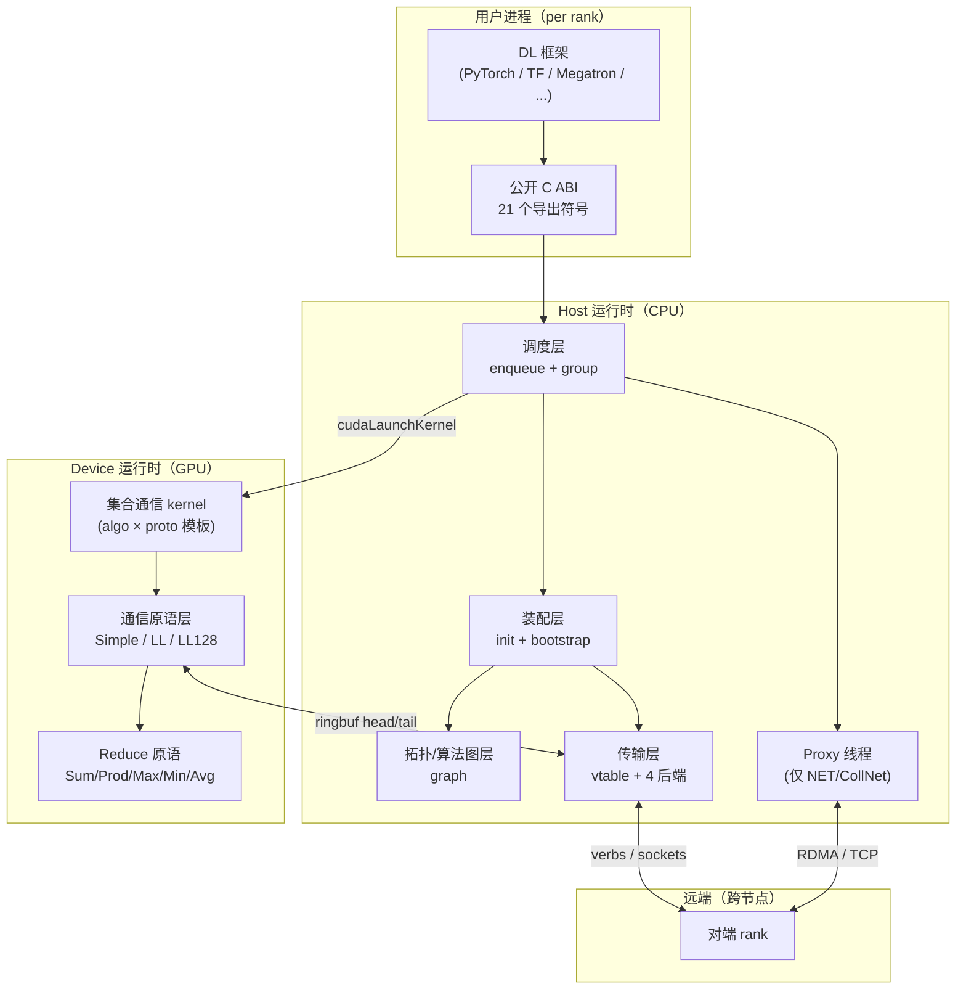

### 3.2 五条贯穿全局的设计原则

| # | 原则 | 含义 | 替代方案与放弃理由 |
|---|---|---|---|
| **P1** | **装配前置，热路径精简** | 所有重决策（拓扑发现、算法搜索、连接建立、CPU 亲和、代价建模）一次性在 `ncclCommInitRank` 完成；运行时只查表 + 投递 | *替代*：每次调用动态选 algo —— 放弃，会引入 host 决策开销，违反 G7 |
| **P2** | **调度器对称投递、不参与稳态同步** | 调度器同时把同一份 work 投给 GPU device（kernel）和 host proxy（线程），两侧通过 ringbuf head/tail 自治推进 | *替代*：中央协调（如事件队列 / mutex）—— 放弃，会成为 µs 级热路径瓶颈 |
| **P3** | **三层执行单元（Channel × Algorithm × Protocol）** | 32 channel × 3 algo × 3 proto = 9 (algo, proto) × 多 channel 并行 | *替代*：单 channel 单 algo —— 放弃，无法吃满多 NVLink 带宽 |
| **P4** | **vtable 多态贯穿 transport 与 proxy** | 同一上层代码（selectTransport / proxy 主循环）通过函数指针调到具体后端，新后端走插件 ABI | *替代*：每后端编译期 `#ifdef` —— 放弃，违反 G5，第三方网卡无法接入 |
| **P5** | **Communicator 作为重资源 / 不可变句柄** | 创建即不可变、失败即整体作废；rank 集合固定 | *替代*：动态可变 communicator —— 放弃，与 G7 装配前置冲突；split 留给后续版本 |

### 3.3 装配重 / 热路径轻的二分

P1 决定整个系统呈现"装配阶段重、热路径轻"的不对称形态。这种二分**不是优化**，而是**设计哲学的视觉表达**——下面两张图刻意分开：

> 图 3-2：装配期与热路径的模块依赖差异（概念图）

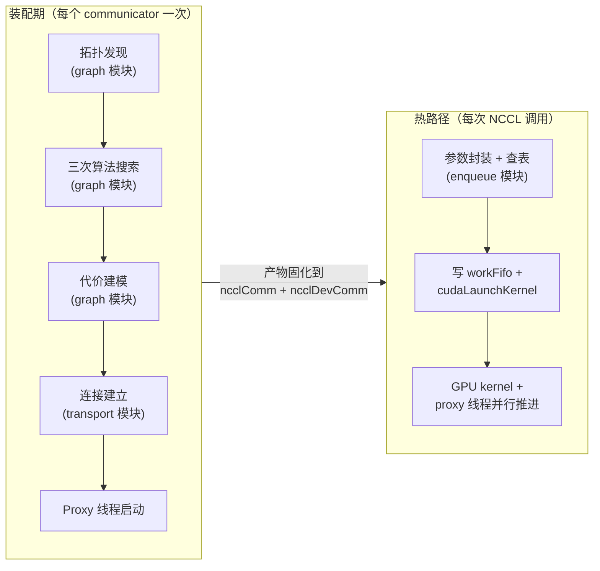

| 维度 | 装配期 | 热路径 |
|---|---|---|
| 触发频率 | 每个 communicator 一次（典型一个训练 job 一次）| 每次 NCCL 调用 |
| 时间预算 | 10² ms ～ 几秒 | 单调用 µs 级 |
| 主同步原语 | bootstrap TCP AllGather | ringbuf head/tail（无锁）|
| 失败处理 | 返回错误码 → 用户重试 | 设 fatalError → 上层轮询 `GetAsyncError` → Abort |
| graph 模块 | 高度活跃 | **完全不出现** |
| misc 弱依赖模块 | dlopen + 调函数指针 | 不出现 |

**对实现者的硬约束**：任何修改若让"热路径调用 graph 模块"或"装配期延迟 < µs 级"，PR 必须给出充分理由。

### 3.4 Communicator 设计模型（精简）

`ncclComm` 是对外的核心抽象。**完整使用模式与反模式属于用户手册范畴，不在本详设展开**；这里仅描述设计层面的约束：

1. **一 rank ↔ 一 GPU**：由 `cudaGetDevice` 抓当前线程的设备绑定，要求调用方先 `cudaSetDevice`。
2. **入队即返回**：完成语义由 CUDA stream 提供，所有 API 不阻塞返回。
3. **失败即整体作废**：任一 rank 异常 → 整个 comm 失效；不支持单 rank 恢复（见 G8 + §7.2）。
4. **重资源**：装配涉及拓扑发现、算法搜索、传输连接、device channel 物化，单节点 8 GPU 典型耗时 10² ms 量级；跨机更慢。**禁止每 iteration 重建**。
5. **生命周期阶段**：Uninit → Bootstrapping → Discovering → Connecting → Active → (Destroying | Aborting) → Freed。详细状态机见 §5.4。

资源占用（单 rank 视角）：

| 资源 | 量级 | 备注 |
|---|---|---|
| ncclComm host 结构 | KB 级 | |
| 每 channel ringbuf（host + device）| 12 MB（3 协议 × 4 MB）| `nChannels` 通常 2-8 → 数十至上百 MB device 内存 |
| peerInfo 数组 | nRanks × ~64 B | |
| Proxy pthread | 1 条 | |
| 网络资源 | IB QP / TCP socket / SHM segment | 取决于后端 |

### 3.5 分层架构总览

§3.1 的图 3-1 按**进程边界**（App / Host / Dev / Net）分组，§3.3 的图 3-2 按**时间边界**（装配期 / 热路径）二分。两者都不直接回答 "系统由哪些层组成、每层职责是什么、谁伴随 communicator 全程"——这是本节要补的视角。

> 图 3-3：分层架构总览（左：主调用栈分层 - 自顶向下；右：跨层服务 - 横切伴随全程）

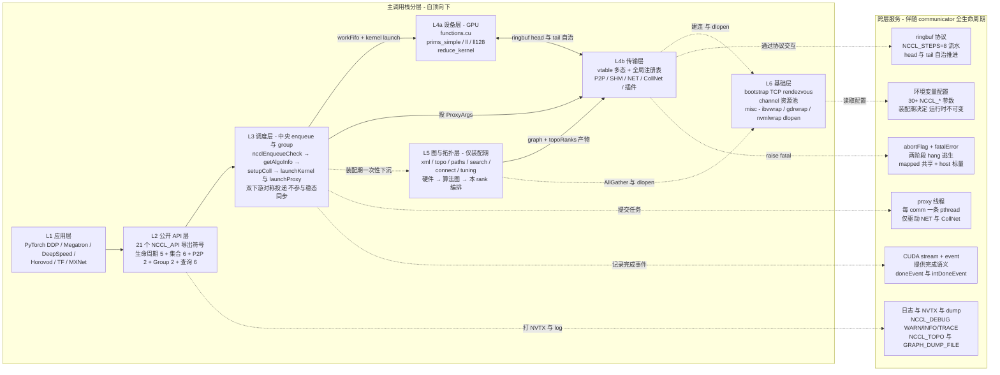

**层职责一句话表**：

| 层 | 何时活跃 | 一句话职责 | 关键设计章节 |
|---|---|---|---|
| **L1 应用层** | — | DL 训练/推理框架（不属于 NCCL 本体）| §1.1 背景 |
| **L2 公开 API 层** | 全程 | 21 个符号的 C ABI 表面 + 参数校验薄壳 | §6.3 ABI |
| **L3 调度层** | 热路径每次调用 | 把用户参数翻译成 device kernel + proxy 任务的中央分发器 | §4.4.4 |
| **L4a 设备层** | 热路径 | GPU kernel：算法循环 + 协议数据搬运 + reduction | §4.4.2 |
| **L4b 传输层** | 装配建连 + 热路径 NET/CollNet | vtable + 4 后端，屏蔽 NVLink / SHM / IB / SHARP 差异 | §4.4.3 |
| **L5 图与拓扑层** | **仅装配期** | 硬件拓扑发现 → 算法图搜索 → 代价模型 → 本 rank 编排 | §4.4.1 |
| **L6 基础层** | 装配启动 + 弱依赖加载 | TCP rendezvous + channel 资源池 + 弱依赖 dlopen 包装 | §4.4.5 |

**跨层服务的设计意图**：右侧 6 项 **不属于任何单一层**，而是**横切贯穿**主调用栈的全生命周期——图中 6 条虚线箭头分别标注了"谁触发哪个服务"，让"L2/L3/L4T/L6 在不同时机调用同一组横切服务"的关系一目了然。把它们独立成栏的可视化分离是关键设计哲学："**重决策装配前置（L5/L6）→ 双下游对称投递（L3 ↔ L4a/L4b）→ 跨层服务自治推进（右栏）**"。如果未来某项跨层服务（如 proxy 线程）需要拆分为多个，仅在右栏内部演进，对左侧调用栈分层无影响。

**与图 3-1 / 图 3-2 的关系**：

| 图 | 视角 | 用途 |
|---|---|---|
| 图 3-1 | 进程/设备边界 | 回答"代码跑在哪里"（App / Host / Dev / Net）|
| 图 3-2 | 时间边界 | 回答"什么时候执行什么"（装配期 vs 热路径）|
| **图 3-3**（本图）| 模块分层 + 跨层服务 | 回答"系统由哪些层组成、谁横切全程" |

三张图正交，组合起来构成 §3 整体架构的完整视图。对照实现的精细 SVG 版本见 [nccl-arch-layered.svg](nccl-arch-layered.svg)。

---

## 4. 模块划分与职责

### 4.1 顶层模块表

| 模块 | 一句话职责 | 关键设计点（详见 §4.4） |
|---|---|---|
| **public-api** | C ABI 入口与参数校验 | 21 个导出符号，PMPI 风格弱别名 |
| **enqueue / group**（调度层） | API ↔ device kernel ↔ proxy 的中央调度 | 对称投递双下游，不参与稳态同步 |
| **init / commLifecycle**（装配编排） | communicator 生命周期 | 串行装配，bootstrap + graph + transport 的编排者 |
| **bootstrap** | 装配期的 rank 互联通道 | 基于 TCP 的 ring + 直连 fallback |
| **graph** | 拓扑发现、算法图搜索、调优 | XML 中间表示 + DFS 搜索 + 硬编码代价模型 |
| **transport** | 传输后端（P2P / SHM / NET / CollNet）| vtable 多态 + 全局注册表 + 插件 ABI |
| **proxy** | host 端网络驱动 | 每 comm 一条 pthread，二次 vtable 多态 |
| **device** | GPU kernel + 通信原语 | algo × proto 模板矩阵 |
| **misc** | 弱依赖 dlopen 包装 | ibvwrap / nvmlwrap / gdrwrap |
| **plugin SDK** | 第三方网络后端入口 | 通过 `NCCL_NET_PLUGIN` 加载 |

### 4.2 装配期与热路径的模块依赖差异

> 图 4-1：装配期模块编排（每 comm 一次）

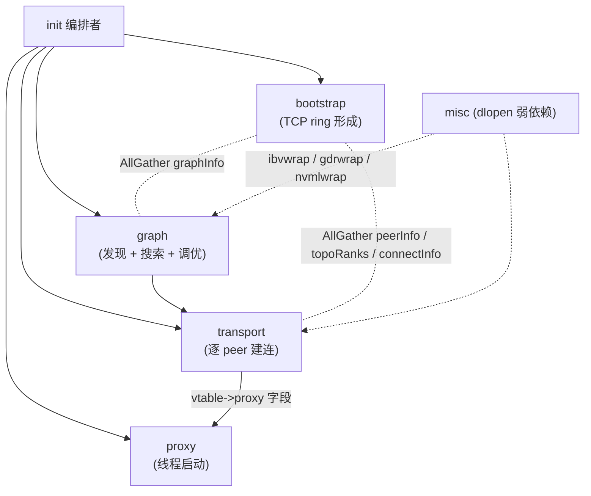

> 图 4-2：热路径模块编排（每次 NCCL 调用）

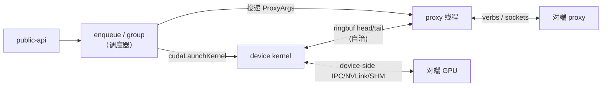

**关键观察**：装配期的 graph / misc 模块在热路径**完全消失**。这是 P1 装配前置原则的可视化体现。

### 4.3 模块契约（接口边界）

模块之间通过**数据结构契约**而非函数调用耦合，便于独立演进：

| 上游 → 下游 | 契约数据结构 | 含义 |
|---|---|---|
| graph → transport | `ncclTopoGraph + topoRanks` | "每 channel 走哪条路径" + "本 rank 在每 channel 的位置" |
| init → device | `ncclDevComm`（含 channels）| GPU kernel 启动后从 device global 读 |
| 调度器 → device | `ncclWorkElem`（64 B）| 单次集合通信的工作描述符 |
| 调度器 → proxy | `ncclProxyArgs` | 单次集合通信的网络任务模板 |
| transport ↔ device | `ncclConnInfo`（含 buffs / head / tail）| device 与传输后端的唯一接触面 |
| bootstrap → transport | `ncclConnect`（128 B 不透明）| 每对 rank 互换的后端出口信息（IB QP/GID、CUDA IPC handle、SHM key）|

**设计意图**：契约的字段集越窄，模块演进就越自由。新增网络后端只需理解 `ncclConnect` 和 `ncclConnInfo` 两个结构。

### 4.4 各模块设计要点

#### 4.4.1 graph 模块：硬件拓扑 → 算法图

**职责**：装配期一次性完成"硬件拓扑 → 三种通信算法的全局编排"。

**四层数据契约**（从硬件到算法）：

| 层 | 数据结构 | 抽象层级 | 是否长生命周期 |
|---|---|---|---|
| L0 | `ncclXml`（节点池）| 硬件中间表示，屏蔽 sysfs 残缺 | 装配后即释放 |
| L1 | `ncclTopoSystem` | 硬件图：CPU/GPU/PCI/NIC/NVS/NET 6 类节点 + 链路 | 持有到 destroy |
| L2 | `ncclTopoGraph` | 算法图：每 channel 走的路径序列 | 装配期临时 |
| L3 | `ncclTopoRanks` | 本 rank 在每 channel 的位置 | AllGather 后归并入 channel |

**关键设计决策**：

1. **XML 作为硬件中间表示**：让 sysfs 残缺（WSL2 / 容器）与异构集群都能通过 `NCCL_TOPO_FILE` 一键修正。*替代*：直接从 sysfs 构建图——放弃，无法处理 WSL2 与受限容器环境。
2. **DFS 搜索 + 带宽阈值剪枝**：满足"每段带宽不低于阈值"的 N 条不重叠 Hamilton-like 路径。*替代*：ILP / 启发式整体优化——放弃，小规模收益不明显且增加装配延迟。
3. **三种 algo（Ring / Tree / CollNet）独立搜索一次**：跑三次 `Compute`，各产出一份 `ncclTopoGraph`。*替代*：统一搜一次——放弃，三种算法对路径的约束完全不同。
4. **`std::min` 全局参数对齐**：所有 rank 各自搜出的 graph 通过 AllGather 取交集（最少 channel、最慢链路、最差路径类型）。**通信器能力受限于最弱 rank**——这是必要妥协，否则跨 rank 不一致会导致死锁。
5. **代价模型用硬编码表 + 速度参数**：`baseLat / hwLat / llMaxBws` 等硬编码常数 + 搜索得到的 `speedIntra/Inter` 喂给 `comm->latencies[F][A][P]` 与 `bandwidths[F][A][P]`。*替代*：实测建模——放弃，装配期开销爆炸；线上重测代价不可控。

#### 4.4.2 device 模块：算法 × 协议 矩阵

**职责**：GPU kernel 实现集合通信的实际数据搬运与归约。

**二维矩阵**：5 集合通信 × 3 算法 × 3 协议 × 5 redop × 10 dtype（按需展开）= 大量编译期 kernel。**算法层负责"数据在 rank 之间怎么循环"，协议层负责"每步数据怎么落 ringbuf"**。

**三协议核心差异**：

| 维度 | Simple | LL | LL128 |
|---|---|---|---|
| 就绪检测 | 通过独立 `tail` 计数器同步；写 data → fence → 写 tail | flag 与 data 同次原子写入（8 B），消费者读到期望 flag 才认为就绪 | 同 LL，但每 128 B 行只有 8 B flag |
| 有效载荷率 | 100% | 50% | 93.75% |
| 关键收益 | 大消息满带宽 | 省一次 `__threadfence_system` | 兼顾延迟与带宽 |
| 适用区间 | ≥ 数百 KB | ≤ 几 KB | 几 KB ～ 数百 KB |
| 硬件要求 | 任意 | 任意 | Volta+ 推荐 |

**关键设计决策**：

1. **LL 协议的 flag 必须在 data 之后**：网络上不完整接收或非原子写入可能让 flag 先于 data 到达；flag 后置保证"读到 flag 时数据一定在"。
2. **LL flag 取自 step 计数**：每 step 用不同 flag，旧数据不会误伤；clean mask 保证 flag 不为 0（避免与零初始化 buffer 混淆）。
3. **LL128 行尺寸为 128 B**：契合 NVLink 与 IB write 的 cache line 粒度；老硬件（< Volta）wide load 性能不稳定，搜索阶段直接禁用。
4. **Reduce hook 区分 preOp / postOp**：浮点 `Avg` 走 `preOp(x) = x * 1/n` 在求和前 scale，避免 fp16 累加破坏有效位；整型 `Avg` 走 `postOp(x) = x / n`。这是浮点精度的标准处理，**所有 rank 在进入 ring 前已完成 scale**，不依赖环末端 rank 做事。

#### 4.4.3 transport 模块：vtable 多态 + 4 后端

**职责**：装配期建立 peer 间连接；热路径上 P2P/SHM 让 device kernel 直接读写远端 buffer，NET/CollNet 由 proxy 线程驱动网络 IO。

> 图 4-3：transport 对象关系

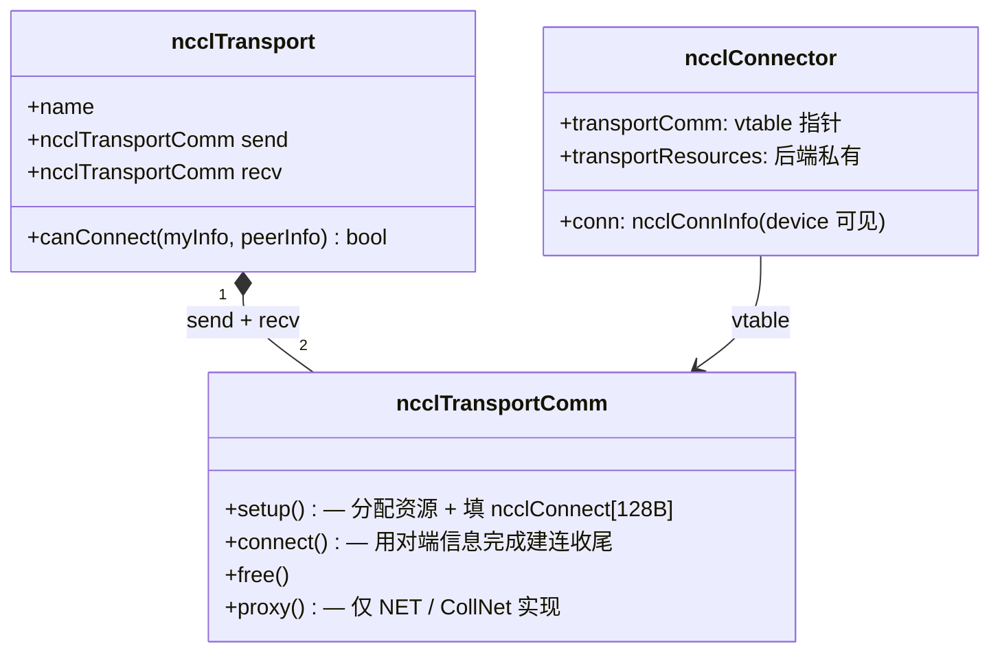

**关键设计决策**：

1. **vtable + 全局注册表**：`ncclTransports[]` 中三个 transport（P2P / SHM / NET）按优先级排列，`selectTransport` 第一个 `canConnect=true` 的胜出。*替代*：编译期 `#ifdef` 选后端——放弃，违反 G5 与插件化目标。
2. **send / recv 分两份 vtable**：两个方向的资源完全不同（IB 的 QP 单向、内存注册各自）。*替代*：合并 setup——放弃，会让 net_ib 的逻辑更复杂、IPC handle 路径混乱。
3. **`ncclConnect = char[128]` 不透明**：bootstrap 不需要理解任何后端协议，按字节透传。*替代*：定义后端无关的 union——放弃，新增后端需要改 union 定义，违反插件化目标。
4. **CollNet 不在全局注册表**：CollNet 是 "N rank 经 NIC 接到网内 reduction 树"，与 P2P/SHM/NET 的两端配对模型不兼容，单走专路。
5. **proxy 字段 `NULL` vs 非 `NULL` 的二分**：`NULL` 意味着完全 device-driven（P2P/SHM），非 `NULL` 意味着 host 必须参与（NET/CollNet）。这是 transport 模块设计上最重要的二分。

**后端优先级**：P2P > SHM > NET。NVLink/PCI 直接 memcpy 最快，先试；不可达试 SHM；再不行才走 NET。

#### 4.4.4 enqueue / group 模块：中央调度器

**职责**：每次 NCCL 调用时，把"用户参数"翻译成 GPU kernel 启动 + proxy 任务投递。

> 图 4-4：调度器对称投递双下游

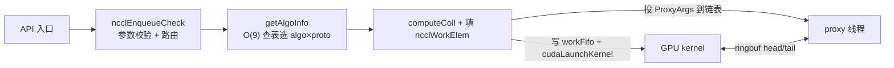

**关键设计决策**：

1. **三种调度路径共享同一组 setup 函数**：
   - 同步直接路径（默认）：立即 setup + launch
   - Group 缓冲路径（在 GroupStart..End 间）：只攒 `ncclInfo` 到 `asyncOps[]`，GroupEnd 时统一 setup + launch
   - CUDA Graph 捕获路径：setup 跑，但 launch 改为注册 host node
   
   *替代*：每路径独立实现——放弃，会导致 N×3 倍代码膨胀且容易行为漂移。

2. **`getAlgoInfo` 用 O(9) 表查找**：穷举 3 algo × 3 proto，用装配期填好的 `latencies[F][A][P] + nBytes / bandwidths[F][A][P]` 估算时间取最小。*替代*：在线建模——放弃，违反 G7 热路径无决策。

3. **Channel 分配与算法选择解耦**：`nChannels` 由 algo 模型决定（用多少），落到哪个 channel 由 round-robin 或 shortest-queue 决定（用哪些）。

4. **Group 聚合的 fast path**：N 个同种 collective 共用 algo/proto，省 N-1 次 `getAlgoInfo`；但**不 fusion**——每个 op 仍按各自 funcIndex 走各自 kernel 路径。

5. **`launchMode` 默认 PARALLEL**：单进程多 GPU 通过用户的 `GroupStart..End` + 多次 PARALLEL launch 实现，**不是** Cooperative Multi-Device launch。GROUP 模式仅在 `NCCL_LAUNCH_MODE=GROUP` 显式开启时生效。

6. **`ncclLaunchKernel` 必须先于 `ncclLaunchProxy`**：否则 `cudaFree` 可能死锁——这是一个被代码注释明确标注的顺序硬约束。

#### 4.4.5 bootstrap 模块：装配期 rank 互联

**职责**：装配阶段唯一的跨节点同步通道。所有其它通信（P2P、SHM、IB、CollNet）都依赖它先互换 PeerInfo / connectInfo。

**核心问题与解法**：

| 问题 | 解法 |
|---|---|
| rank 0 如何被其它 rank 找到？ | rank 0 监听 TCP socket，地址塞进 128 B 的 `ncclUniqueId`，通过带外通道（MPI_Bcast / Redis / 文件）分发 |
| N 个 rank 如何高效互换 PeerInfo？ | 构造逻辑 ring（每 rank 知前驱后继），后续所有 AllGather 走 ring，N-1 步完成 |
| 后续装配阶段如何精确点对点通信？ | AllGather 所有 rank 的监听地址到 `peerCommAddresses[nranks]`，`bootstrapSend/Recv` 按 rank 查表 |

**关键设计决策**：

1. **TCP 起步、IB 跟上**：IB 后端需要 PeerInfo 才能起，存在鸡生蛋，必须先用一个轻量 TCP rendezvous。*替代*：用 IPoIB——放弃，依赖 IB 已经初始化。
2. **rank 0 的 root 线程是一次性的**：收齐 n 个 rank 地址、回发"下一跳"后立即退出。**装配后不再有"协调者"角色**——体现去中心化思路。
3. **AllGather 用最朴素 ring 实现**：装配只发生一次，数据 KB-MB 级，不值得用 recursive doubling 等更优算法增加代码复杂度。
4. **错峰连接**：`nranks > 128` 时，rank 越大延迟越久（`nanosleep(rank * 1ms)`），避免数千 rank 同时 SYN root 导致 backlog 溢出。
5. **未匹配消息队列**：`bootstrapRecv` 收到非期望 `(peer, tag)` 时先暂存，避免乱序 Send 导致丢包。

#### 4.4.6 proxy 模块：host 端网络驱动

**职责**：每个 communicator 一条 pthread，专职推进需要 CPU 介入的传输（NET / CollNet）。

> 图 4-5：proxy 线程的工作模型

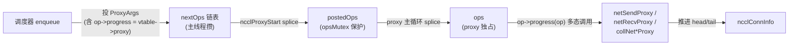

**关键设计决策**：

1. **每 comm 一条 proxy 线程**（不是每 channel 一条）：单线程驱动所有 channel 的 NET/CollNet 任务，简化资源管理。*替代*：多线程（每 channel 一条 / 全局线程池）——放弃，2.10.3 的 100/200G NIC 场景下单线程 CPU 占用尚可（< 50%）；800G+ 场景留待后续版本（见 §10.3）。
2. **二次 vtable 多态**：`ProxyArgs.progress = connector->transportComm->proxy`，proxy 主循环只调 `op->progress(op)`，**不感知后端类型**。让单一线程同时驱动 NET + CollNet 多种后端。
3. **NUMA 亲和性显式切换**：分配 ProxyArgs 池前切到 GPU 同 NUMA 的 CPU，分配完恢复用户亲和性。否则 proxy poll 跨 socket 访问延迟在 alltoall 小消息场景上显著放大（这是 2.10.3 修复的实际 bug）。
4. **生产者-消费者解耦**：主线程攒 `nextOps`、提交进 `postedOps`、proxy 拾起进 `ops`，三段链表。主线程与 proxy 线程几乎不直接同步，仅在 `cond_signal` 唤醒时短暂接触。

---

## 5. 关键流程

本节展开 5 条最关键的流程。每条流程的目标是回答"模块之间在某个具体场景下如何协作"，**不重复 §4 的模块内部设计**。

### 5.1 流程一：Communicator 初始化（`ncclCommInitRank`）

> 图 5-1：装配端到端时序

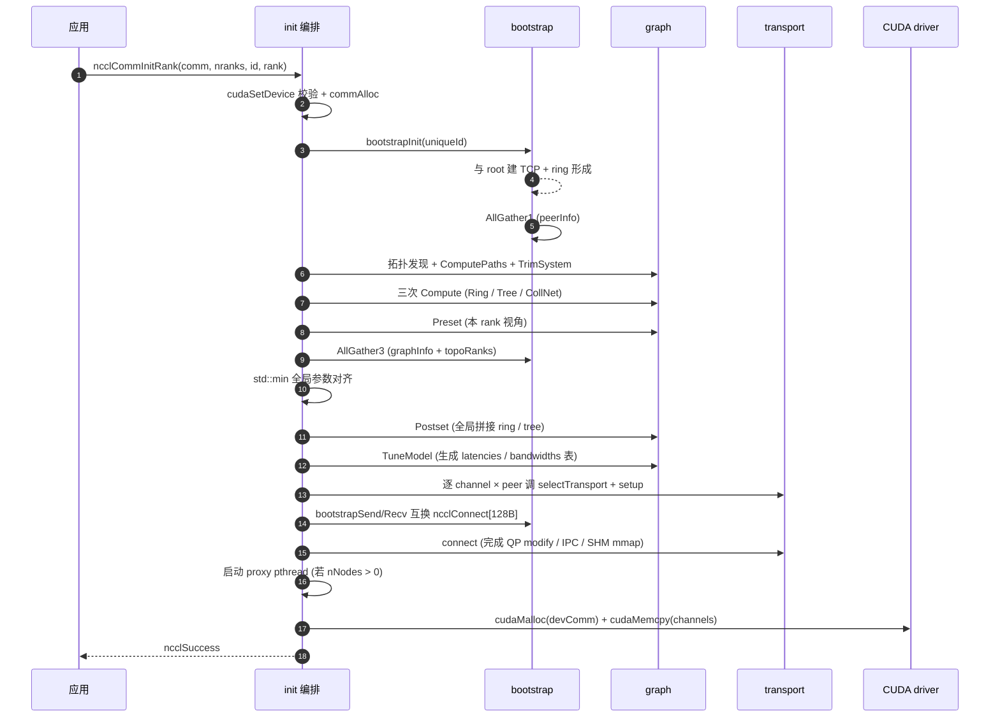

**关键决策**：

- **隐式同步点**：bootstrap 的两次 AllGather 是显式全局同步；要求所有 rank 几乎同时调 `ncclCommInitRank`，否则单线程死锁。
- **路径要算两次**：TrimSystem 之前为判定 NIC 可达性，之后为让搜索看到正确拓扑。
- **CollNet 双重门槛**：本地 `intraNodeRanks ≤ 8` + 全局 `nNodes ≥ 2`，任一不满足都关闭。这与 SHARP 网络硬件要求一致。

### 5.2 流程二：AllReduce 热路径（Ring + Simple 协议）

> 图 5-2：单次 AllReduce 端到端

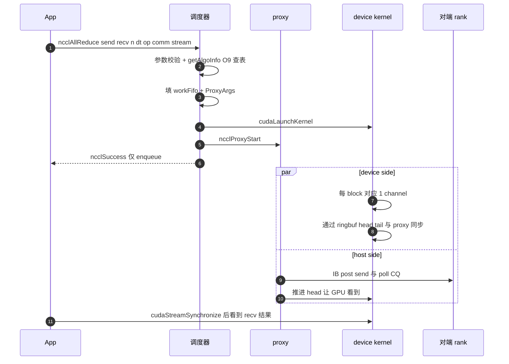

**关键决策**：

- **入队即返回**：调度器写完 workFifo + launch kernel 后立刻返回。`ncclSuccess` ≠ 操作完成。
- **device ↔ proxy 通过 ringbuf 同步**：head 由 device 写、proxy 读；tail 反之。`NCCL_STEPS=8` 决定流水深度。
- **调度器不参与稳态同步**：把工作"对称地"投给两侧后退出。

### 5.3 流程三：Group 聚合多次调用

> 图 5-3：Group 语义

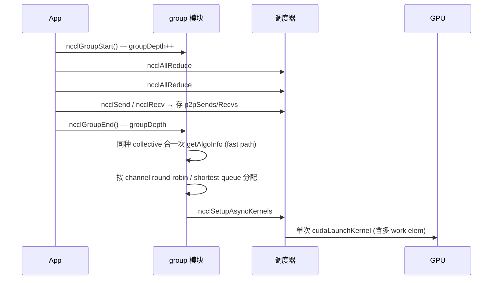

**关键决策**：

- **聚合的根本收益**：减少 launch 次数（CPU↔GPU 控制路径成本）。**16 次 AllReduce 合一次 launch** 是 DDP gradient bucketing 的基础。
- **`asyncAllocMode`**：默认 `ROUND_ROBIN` 均衡 channel；`SHORTEST_QUEUE` 适合异构尺寸 op 混合场景。
- **限制**：`ncclCommInitRank` 与集合通信不能在同一 group 中混合（API 文档已说明）。
- **send/recv 必须聚合**：单 `Send` 不配 `Recv` 会让 GPU SM 阻塞等对端，必须在同一 group 内配对。

### 5.4 流程四：Communicator 生命周期状态机

> 图 5-4：完整状态机（含子状态、错误转移、外部触发）

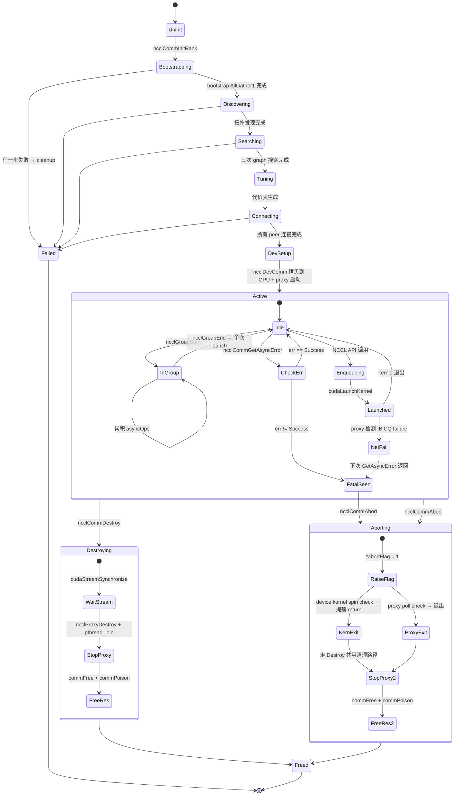

**关键决策**：

- **Destroying vs Aborting 的本质区别**：Destroy 先 `cudaStreamSynchronize`，stream hang 时跟着 hang；Abort 先设 `abortFlag=1`，device/proxy 看到后自行退出，几十 µs 内能逃出。**Abort 是唯一的 hang 逃生路径**。
- **commPoison 防双重释放**：Freed 状态把 `rank/cudaDev/busId/nRanks` 全置 -1，后续任意 API 入口检查到立即返回 `ncclInvalidArgument`。
- **FatalSeen → Aborting 路径**：proxy 在网络层检测到错误 → 设 `fatalError` → kernel 仍在 spin（看不到 fatal）→ 上层主动 `GetAsyncError` → 看到错误 → 必须 `Abort` 否则 kernel 永远 spin。abortFlag / fatalError 的两阶段语义详见 §7.2。

### 5.5 流程五：CUDA Graph 捕获与回放

> 图 5-5：CUDA Graph 捕获路径

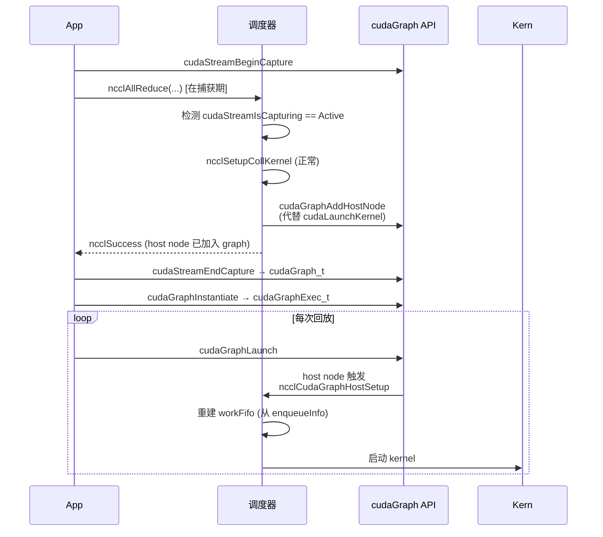

**关键决策**：

- **设计动机**：DL 训练每 step 重复同样的 NCCL 调用序列。用 CUDA Graph 可把整个序列固化为一个图，省去每 step 的 host 调度开销。
- **关键挑战**：NCCL 的 workFifo 是动态的 ringbuf，每次 launch 写入新 work elem；CUDA Graph 要求 host 行为可重放。解法：把 enqueue 阶段的"动作"打包成 `ncclQueueInfo` 注册为 graph 的 host node，回放时由 driver 调起重建 workFifo。
- **限制与待确认**：
  - 不支持 capture 期间 ncclGroup 嵌套不同 nChannels 的调用 *(待验证)*。
  - 不支持 capture 期间 abort *(明确不支持)*。
  - 与 `IB_QPS_PER_CONNECTION > 1` 的兼容性 *(待测，列为 §10.1 假设 A8)*。

---

## 6. 数据模型与接口

### 6.1 核心数据结构关系

> 图 6-1：核心数据结构关系（设计层面，省略字段）

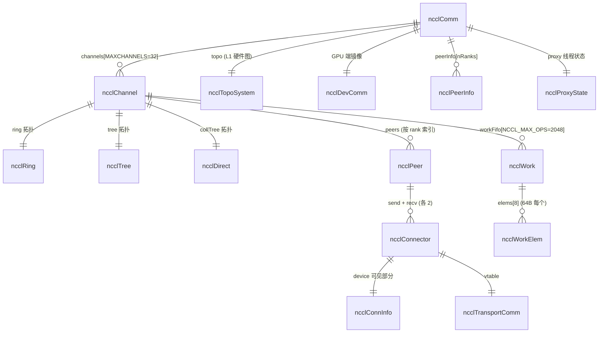

**关键容量常量**（设计层面，不展开字节布局）：

| 常量 | 值 | 含义 |
|---|---|---|
| `MAXCHANNELS` | 32 | 单 communicator 最大通道数（= GPU 单次 launch block 上限） |
| `NCCL_NUM_PROTOCOLS` | 3 | LL / LL128 / Simple |
| `NCCL_NUM_ALGORITHMS` | 3 | Ring / Tree / CollNet |
| `NCCL_STEPS` | 8 | ringbuf 流水深度 |
| `NCCL_MAX_OPS` | 2048 | 单 channel workFifo 深度 |
| `MAX_ASYNC_OPS` | 128 | 单次 Group 内最多 op 数 |
| `NCCL_MAX_TREE_ARITY` | 3 | tree 算法最大子节点数 |

### 6.2 内存模型与一致性（设计关键章节）

NCCL 在 GPU 与 host、device 与 device、host 与 NIC 之间共享 ringbuf。各方平台的内存序模型不同，必须明确**全局可见性的论证**，否则 head/tail 同步在弱序硬件上可能出错。

#### 6.2.1 涉及的内存域

| 域 | 内存序 | 同步原语 |
|---|---|---|
| GPU 同 SM 内 | program order + `__syncthreads()` | block 内同步 |
| GPU 跨 SM | relaxed（弱序）| `__threadfence_block()` / `__threadfence()` |
| GPU ↔ Host 共享 mapped 内存 | relaxed | `__threadfence_system()` |
| Host ↔ NIC（IB write）| RDMA write 保证发送方写完整顺序到对端，但 CPU 看到 CQE 的顺序不蕴含 buffer 已可见 | `ibv_post_send + poll_cq` |
| Host ↔ Host（跨 NUMA）| TSO（x86）/ weakly ordered（aarch64）| `mfence` 或 release/acquire |

#### 6.2.2 ringbuf head/tail 的可见性论证

> 表 6-1：data 与 flag 的可见顺序保证

| 写入侧 | 操作序列 | 保证 |
|---|---|---|
| GPU 生产者（Simple 协议） | 写 buffs[step % NCCL_STEPS] → `__threadfence_system()` → 写 tail | 消费者看到 tail > step 时，data 一定已可见 |
| GPU 生产者（LL 协议） | data 与 flag 同次 8B 原子写入 ringbuf | 消费者读 8B 时要么看到旧值（flag 不匹配，重读）要么看到新值（data 与 flag 都已就位）|
| Host proxy 生产者（IB recv 完成）| `ibv_poll_cq` 返回成功 → 写 head | poll_cq 返回时 buffer 已被 NIC 写入完成 |
| Host proxy 消费者（IB send 准备）| 读 channel tail → 看到推进 → `ibv_post_send` | tail 由 GPU `__threadfence_system` 推进，host 可见 |

#### 6.2.3 关键设计决策

1. **LL 协议的 8 B 原子写**：把 4 B data + 4 B flag 合并为单次 8 B atomic store。这是 LL 比 Simple 省一次 `__threadfence_system` 的根本机制。**前提**：硬件保证 8 B 对齐 store 是原子的（NVLink/PCIe 都满足）。
2. **`volatile uint64_t head/tail`**：volatile 防止编译器缓存到寄存器；64 位防止跨 step 计数回绕（NCCL_STEPS 远小于 2^64）。
3. **cache line 对齐（128 B）**：避免 false sharing。head 与 tail 在不同 cache line。
4. **`__threadfence_system` 仅在跨 host 边界用**：intra-GPU 不需要，这是 LL 在 NVLink 上的延迟优势。
5. **abortFlag 用 `cudaHostAllocMapped`**：单一物理页跨 host/device 映射，host 写、device 读，无需显式 fence——CUDA driver 保证 mapped memory 的 host 写在合理延迟内对 device 可见。

#### 6.2.4 待评审验证的边界场景

- ARM 服务器（aarch64 + GH200）上 host ↔ GPU 共享内存的可见性论证是否仍成立 *(待硬件确认)*。
- IB write 在 SHARP CollNet 路径上的完成语义与单播 RDMA 是否一致 *(待 SHARP 文档复核)*。

### 6.3 C ABI 与符号导出策略

#### 6.3.1 公开符号清单

总计 21 个 `NCCL_API` 导出函数（设计目标 G6 要求 ≤ 25 个）：

| 类别 | 数量 | 函数 |
|---|---|---|
| 生命周期 | 5 | `ncclGetUniqueId`、`ncclCommInitRank`、`ncclCommInitAll`、`ncclCommDestroy`、`ncclCommAbort` |
| 集合通信 | 6 | `ncclAllReduce`、`ncclBroadcast`、`ncclBcast`（deprecated）、`ncclReduce`、`ncclReduceScatter`、`ncclAllGather` |
| 点对点 | 2 | `ncclSend`、`ncclRecv` |
| Group | 2 | `ncclGroupStart`、`ncclGroupEnd` |
| 查询 | 6 | `ncclCommCount`、`ncclCommCuDevice`、`ncclCommUserRank`、`ncclCommGetAsyncError`、`ncclGetErrorString`、`ncclGetVersion` |

#### 6.3.2 符号可见性策略

- **默认 hidden**：构建时 `-fvisibility=hidden`，避免内部符号污染调用方命名空间。
- **显式 default**：仅上述 21 个函数通过 `__attribute__((visibility("default")))` 导出。
- **PMPI 风格弱别名**：每个公开符号都有 `pnccl<Name>` 的弱别名，让 profiling 工具（如 Nsight Systems、自研 tracer）可以 LD_PRELOAD 拦截而不破坏链接。

#### 6.3.3 ABI 兼容性策略

| 兼容性级别 | 含义 | 跨版本保证 |
|---|---|---|
| ABI 兼容 | `.so` 可二进制替换 | minor 版本内（如 2.10.x）保证 |
| API 兼容 | 源码可重编译 | major 版本内（如 2.x）保证 |
| ABI 不兼容 | 必须重链 | major 版本之间 *(待与上游策略对齐确认)* |

调用方（PyTorch / TF）通过 `ncclGetVersion` 检测运行时版本，并对已知 bug 做版本门控。

### 6.4 环境变量配置接口

总计 30+ 个 `NCCL_*` 参数。完整清单见上游文档；本节按用途分类列出**对设计有结构性影响**的参数：

| 类别 | 参数 | 用途 |
|---|---|---|
| 调试 | `NCCL_DEBUG`、`NCCL_DEBUG_SUBSYS` | 分级日志 |
| 算法覆盖 | `NCCL_ALGO`、`NCCL_PROTO` | 复现性能问题时强制选择 |
| 资源调优 | `NCCL_NTHREADS`、`NCCL_BUFFSIZE`、`NCCL_MAX_NCHANNELS` | per-block 线程数、ringbuf 大小、通道数 |
| 网络后端 | `NCCL_NET`、`NCCL_NET_PLUGIN`、`NCCL_IB_HCA`、`NCCL_IB_QPS_PER_CONNECTION`、`NCCL_SOCKET_IFNAME` | 后端选择与细节 |
| 拓扑 | `NCCL_TOPO_FILE`、`NCCL_TOPO_DUMP_FILE`、`NCCL_GRAPH_DUMP_FILE` | 调试与异构环境 |
| 容错 | `NCCL_IB_TIMEOUT`、`NCCL_IB_RETRY_CNT` | 网络抖动容忍 |
| 启用开关 | `NCCL_P2P_DISABLE`、`NCCL_SHM_DISABLE`、`NCCL_COLLNET_ENABLE`、`NCCL_NVB_PRECONNECT` | 各后端 / 路径开关 |

**设计原则**：环境变量是**运行时不可变的配置接口**——用户启动前设好；不提供运行时改变 NCCL 行为的 API（这会破坏 G7 装配前置）。

---

## 7. 异常处理

### 7.1 异常分类与处置

| 异常源 | 检测点 | 处置 | 用户可见 |
|---|---|---|---|
| **入参非法**（NULL / 越界 / 非法 dtype）| API 入口 | 返回 `ncclInvalidArgument` | 错误码 |
| **设备指针校验**（`NCCL_CHECK_POINTERS=1`）| API 入口 | `cudaPointerGetAttributes` 检查，非 device 指针 → `ncclInvalidArgument` | 错误码 |
| **CUDA 调用失败**（`cudaMalloc` 等）| `CUDACHECK` 宏 | 冒泡返回 `ncclUnhandledCudaError`；进入 fatal | 错误码 + log |
| **Bootstrap TCP 失败** | socket 重试 | 超时后返回 `ncclSystemError` | 错误码 |
| **IB QP 失败 / verbs 错误** | `NCCLCHECK(wrap_ibv_*)` | fatal；通过 `GetAsyncError` 暴露 | 异步错误 |
| **dlopen 失败**（ibverbs / gdrapi 缺失）| 装配期 | 该后端从可用列表剔除，回退 | INFO 日志 |
| **网络 completion 出错**（IB CQ != SUCCESS）| proxy poll | 设 `comm->fatalError`，等上层 abort | 异步错误 |
| **CollNet 插件加载失败** | dlopen + 符号检查 | 关闭 `collNetSupport`，回退到 ring/tree | INFO 日志 |
| **GPU OOM during init** | `cudaMalloc` 失败 | fatal | 错误码 |
| **`MAX_ASYNC_OPS=128` 打爆** | group 内 op 超 128 | `ncclSaveAsyncColl` 返回 `ncclInvalidUsage` | 错误码 |
| **`NCCL_MAX_OPS=2048` workFifo 打爆** | `getNextOp` | "Too many aggregated operations" 错误 | 错误码 |

### 7.2 abortFlag / fatalError 两阶段语义（关键设计）

NCCL 把"异常发现"和"异常退出"刻意分成两个阶段。理解这两阶段是排查 hang 问题的关键。

> 图 7-1：故障传播时序

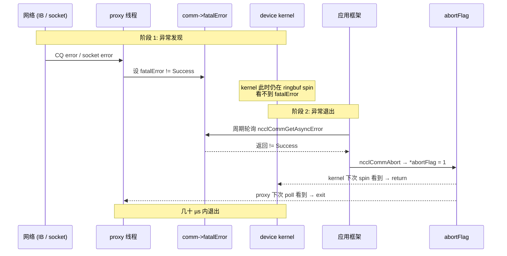

**两阶段的设计意图**：

| 阶段 | 信号 | 谁能看到 | 设计意图 |
|---|---|---|---|
| 阶段 1：发现 | `fatalError`（host 标量） | host 主动轮询 | proxy 线程发现网络层故障后**立即**记录，但**不强行打断** kernel——避免误判（瞬时网络抖动可能 retry 恢复）|
| 阶段 2：退出 | `abortFlag`（mapped 共享）| GPU + host 自动 spin check | 由**应用框架显式决定**何时放弃；一旦决定，几十 µs 内全员退出 |

**为什么不让 proxy 直接置 abortFlag**：避免把"业务决策"下放到 transport 层。瞬时 IB 抖动 + 重传 vs 不可恢复故障，由上层框架（带超时上下文）判断更合适。

**对应用方的硬约束**：

- **生产代码必须周期轮询 `GetAsyncError`**——否则 fatal 后下次 NCCL 调用永久 hang。
- **hang 时必须用 `Abort` 不用 `Destroy`**——Destroy 自己先 stream sync 会跟着 hang。

### 7.3 用户可见信号

| 信号 | 来源 | 用途 |
|---|---|---|
| 错误码 `ncclResult_t` | 所有 API 返回值 + `GetAsyncError` | 同步检测 / 异步轮询 |
| WARN 日志 | `NCCL_DEBUG=WARN` | 用户排查异常 |
| INFO/TRACE 日志 | `NCCL_DEBUG=INFO/TRACE` | 装配期决策、算法选择、连接细节 |
| NVTX range | `nvtxRangePush/Pop` | Nsight Systems 时间线分析 |
| 拓扑/图 dump | `NCCL_TOPO_DUMP_FILE` / `GRAPH_DUMP_FILE` | 事后离线分析 |
| 异步错误码 | `GetAsyncError` | 框架轮询 hang 检测 |

---

## 8. 测试策略

本章描述**实现该方案时必须覆盖的测试矩阵**，不是对 NCCL 现有测试的描述。

### 8.1 单元测试

| 测试类别 | 覆盖目标 | 关键 case |
|---|---|---|
| **graph 模块** | 拓扑解析与搜索 | DGX-A100 cubemesh、PCIe-only 8 GPU、单 GPU、跨 NUMA、`NCCL_TOPO_FILE` 注入 |
| **device kernel** | 9 (algo, proto) 组合 × 5 redop × 10 dtype | 每种组合至少一个 size 跑通 |
| **transport vtable** | 4 后端 `setup/connect/free` | mock peerInfo，验证 vtable 调用顺序 |
| **bootstrap** | ring 形成 + AllGather + Send/Recv | 单节点 8 rank、跨节点 16 rank |
| **enqueue 调度** | 三种调度路径（直接 / Group / Graph）| 每路径覆盖 collective + p2p |
| **状态机** | 装配失败、Active 期内事件、双路径销毁 | 注入失败、模拟 NetFail → FatalSeen |

底线：覆盖率 ≥ 70% 行覆盖、≥ 60% 分支覆盖 *(待与上游策略对齐)*。

### 8.2 集成测试

| 测试场景 | 验证点 |
|---|---|
| **9 组合矩阵**（3 algo × 3 proto）| `NCCL_ALGO=X NCCL_PROTO=Y` 全跑 AllReduce，结果数值一致 |
| **多 dtype**（含 bf16）| 每 dtype 跑一次 AllReduce + Avg |
| **Group 聚合** | 连续 16 次 AllReduce + 多组 send/recv 在一个 group 内，结果与逐次调用一致 |
| **CUDA Graph 捕获** | 用 `cudaStreamCapture` 包裹 NCCL 调用，replay 10 次结果一致 |
| **WSL2 路径** | WSL2 + 单 GPU 跑通 init + AllReduce |
| **Cubemesh 拓扑**（DGX-A100 / DGX-2）| 8/16 GPU 上回归，验证 NVB 桥接路径与 search 输出 `nChannels > 0` |
| **多 comm 隔离** | 同进程内同时持 DP + TP + PP 三个 comm，并行跑各自 AllReduce 无干扰 |
| **失败注入装配** | 装配各子阶段返回错误码 → 验证 cleanup 路径无资源泄漏 |

### 8.3 性能基准

| 指标 | 目标 | 工具 |
|---|---|---|
| AllReduce intra-node latency (8 B) | LL ≤ 8 µs（A100 NVLink-3）| nccl-tests `all_reduce_perf -b 8 -e 8` |
| AllReduce inter-node bandwidth (1 GB) | ≥ 95% IB 单链路峰值 | `all_reduce_perf -b 1G -e 1G` |
| Tree latency 中等消息（1 MB） | 较前版本提升 ≥ 5% | tuning 表对照 |
| `IB_QPS_PER_CONNECTION=4` 在 200G HDR | 接近 2× 单 QP 吞吐 | 单连接 BW |
| Proxy 线程 CPU 占用（200G NIC、AllReduce 1 GB）| < 50% 单核 | `top` / `perf` |

**回归底线**：每个新版本相对上一个 release，throughput regression < 5%。

### 8.4 故障注入

| 故障 | 注入方式 | 期望行为 |
|---|---|---|
| Abort 中途 | 训练循环里 `kill -9` 一个 worker | 剩余 rank `GetAsyncError != Success`，能 `Abort` 退出，不永久 hang |
| 网络丢包/抖动 | `tc netem` 1% 丢包 + 1 ms jitter | socket 后端在 IB 重传后正常完成；超时后 fatal |
| GPU ECC 错误 | 模拟 cuda error 注入 | fatal 传播；abort 路径生效 |
| 装配期失败 | mock `cudaMalloc` 返回错误 | cleanup 路径运行，`*newcomm = NULL` |
| Group 内 op > 128 | 单 group 内调 200 次 send | `ncclInvalidUsage` 返回 |

### 8.5 端到端（DL 框架集成）

| 框架 | 验证 |
|---|---|
| PyTorch DDP + ResNet50 | 1 epoch 收敛，`NCCL_DEBUG=INFO` 抽查算法选择 |
| Megatron-LM 多机 TP | send/recv group 路径正常 |
| DeepSpeed ZeRO-3 | AllGather + ReduceScatter 性能符合 budget |
| Horovod 兼容 | 烟测通过 |

---

## 9. 安全、部署与运维

### 9.1 安全威胁模型

**信任边界假设**：所有 rank 在受控网络平面内，无外部攻击者直接访问 IB / socket 端口。这一假设对**单租户裸金属集群成立**，对**多租户云 / Kubernetes 共享 GPU 节点不成立**。

#### 9.1.1 威胁分析

| 威胁 | 攻击面 | 影响 | 缓解措施（由谁负责）|
|---|---|---|---|
| **恶意 `NCCL_TOPO_FILE`** | 同进程用户控制环境变量 | 解析时缓冲区越界 | XML 解析必须做严格边界检查（NCCL 自身责任）|
| **IB GID 劫持** | 共享 IB fabric 多租户 | 中间人读取/伪造 RDMA write | 部署侧 IB partition + PKey 隔离 |
| **CUDA IPC handle 泄漏** | 同节点跨进程 | 攻击进程 mmap 受害进程显存 | 部署侧 cgroup + 用户隔离（NCCL 无法防范）|
| **SHM segment 越界读** | 同节点跨进程 | 攻击进程 mmap NCCL shm | 部署侧 namespace 隔离 |
| **Bootstrap TCP 中间人** | rank 0 的 listen socket | 伪造 PeerInfo / connectInfo | 部署侧 TLS 隧道 / VPN（NCCL 不内置）|
| **环境变量注入** | 用户控制 `NCCL_NET=<malicious_plugin>` | 加载攻击者 .so | `LD_LIBRARY_PATH` 控制 / 受信任插件白名单（部署侧）|

#### 9.1.2 设计层面的最小化攻击面

- **解析路径硬化**：XML 解析使用预分配节点池（无 malloc 失败 / 越界 / use-after-free 风险）。
- **不内置加密**：避免引入复杂攻击面；TLS / IPSec 由部署侧负责。
- **dlopen 路径限制**：插件加载受 `LD_LIBRARY_PATH` 和 `NCCL_NET_PLUGIN` 控制，不扫描全盘。
- **不暴露通用 RPC**：bootstrap TCP 仅用于 rendezvous，不接受任意命令。

#### 9.1.3 留作后续版本的安全工作

- 端到端加密（TLS over bootstrap、IB IPSec）*(留作 §10.3 演进)*
- 插件签名验证 *(留作演进)*

### 9.2 部署视图

> 图 9-1：典型部署拓扑（4 节点、每节点 8 GPU）

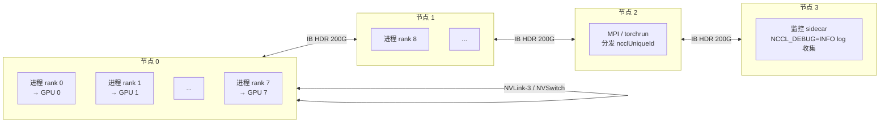

**部署单元**：

| 单元 | 数量 | 资源占用 |
|---|---|---|
| 每 rank 一个进程 | nranks | 一个 GPU + 一条 proxy pthread |
| 每 comm 一个 proxy 线程 | per comm | < 50% 单核 CPU @ 200G |
| 每 comm 一组 IB QP | per comm × per peer × QPS_PER_CONNECTION | 受 NIC max QP 限制 |
| 每 comm SHM segment | per comm × per intra-node peer | 一个 segment ~ 12 MB |

**部署侧关键决策**：

1. **CPU 亲和性**：让进程的 host 部分绑定到 GPU 同 NUMA 的 CPU（NCCL 装配期自动处理本地内存分配的亲和；用户进程亲和性由部署侧设置）。
2. **IB partition 隔离**：多租户共享 fabric 时必须配置 PKey。
3. **fd 限制**：bootstrap + IB CM + proxy 在大规模训练（≥ 10k ranks）下消耗大量 fd，必须把 `ulimit -n` 调到至少 65536。
4. **rendezvous 通道**：`ncclUniqueId` 分发通道（MPI / Redis / file）由部署侧选定，影响启动健壮性。

### 9.3 可观测性与 SRE 指标

#### 9.3.1 应当采集的指标

| 指标 | 采集方式 | 告警阈值 |
|---|---|---|
| **proxy 线程 CPU 使用率** | `/proc/<pid>/task/<tid>/stat` | > 80% 单核持续 1 min 告警 |
| **IB CQE 错误率** | `ibv_query_qp` + 自采 | > 0/min 告警 |
| **ringbuf 满 vs 空时长比** | NCCL_DEBUG=TRACE 采样 | 长期空 = 算法选择偏小 / 大消息走 LL |
| **AllReduce P99 延迟（per size bucket）** | NVTX range 解析 / 自打点 | 偏离基线 > 20% 告警 |
| **fatalError 计数** | 框架层 `GetAsyncError` 轮询计数 | > 0 即告警 |
| **abort 次数** | 框架层 `ncclCommAbort` 调用计数 | > 0 即告警 |
| **comm 创建延迟** | init 入口/出口打点 | > 5 s 告警（可能是 bootstrap 卡死） |

#### 9.3.2 排障流程

> 表 9-1：常见症状 → 怀疑模块

| 症状 | 第一怀疑 | 第二怀疑 | 排查工具 |
|---|---|---|---|
| 训练 hang 但 GPU 100% | proxy 等 CQE / GPU spin 等 head | abortFlag 未触发 | `cuda-gdb` 看 kernel pc + `ibv_query_qp` |
| 训练 hang 且 GPU 0% | bootstrap rank 等不齐 / Destroy hang | rank 提前退出 | netstat + 各 rank 的 NCCL_DEBUG=TRACE |
| 性能 regression 30% | 算法选错（tuning 表）| 后端选错（dlopen 失败）| `NCCL_DEBUG=INFO` 看选择日志 |
| P99 延迟漂移 | NUMA 亲和性丢失 | proxy CPU 竞争 | `numactl --show` + perf |
| init 慢（> 10 s） | bootstrap 网络 / TopoFile 慢 | search 慢（cubemesh）| 装配各阶段打点 |
| OOM during init | ringbuf 配置过大 | nChannels 选错 | `NCCL_BUFFSIZE` 调小测试 |

#### 9.3.3 调试入口

- **`NCCL_DEBUG=WARN`**：默认生产配置，仅出错时输出。
- **`NCCL_DEBUG=INFO`**：装配期决策（拓扑、算法、连接）全打印，**生产可常开**（开销小）。
- **`NCCL_DEBUG=TRACE`**：每次调用打印，**仅排障开启**（开销大）。
- **`NCCL_DEBUG_SUBSYS`**：按子系统过滤（INIT / COLL / P2P / NET / ENV / ALLOC / ...）。
- **`NCCL_TOPO_DUMP_FILE` / `NCCL_GRAPH_DUMP_FILE`**：装配完成后落盘，供离线分析。
- **NVTX range**：Nsight Systems 上可看到每个集合通信的 host enqueue 与 GPU kernel 对齐。

---

## 10. 设计假设、替代方案与演进路径

### 10.1 关键设计假设（评审需逐条确认）

这一节列出本设计依赖的**未充分验证的假设**。评审会议应逐条过。

| # | 假设 | 来源章节 | 影响 | 验证方式 |
|---|---|---|---|---|
| **A1** | 单 communicator ≥ 10k ranks 在 IB QP / fd 限制下可达 | §2.2 | 影响超大规模训练上限 | 在 1024+ 节点集群压测 |
| **A2** | 浮点 `Avg` 用 preOp scale 而非 postOp divide 的精度收益对 fp16 / bf16 显著 | §4.4.2 | 影响小规模训练数值稳定性 | 与 MPI MPI_AVG 实现做精度对比 |
| **A3** | LL 协议的 8 B 原子 store 在所有目标硬件（NVLink/PCIe/aarch64）上成立 | §6.2.3 | 影响 LL 协议正确性 | 硬件文档复核 + stress test |
| **A4** | proxy 单线程在 800 G+ NIC 下不会成为瓶颈 *(2.10.3 上限是 200/400G)* | §4.4.6 | 影响未来大带宽 NIC 兼容性 | 800G 网卡压测，看 CPU 占用 |
| **A5** | `MAX_ASYNC_OPS=128` 在大规模 GPT 训练（每 step 数百次 send/recv）够用 | §6.1 | 超出会 `ncclInvalidUsage` | Megatron 3D 并行实测 |
| **A6** | `std::min` 全局对齐策略不会让异构集群（如 8×H100 + 8×A100）的性能跌到 A100 一半以下 | §4.4.1 | 影响异构集群可用性 | 混合硬件实测 |
| **A7** | `NCCL_NET=ib` 强制选择时若 IB 不可用立即报错（不回退） | §6.4 | 影响错误诊断的清晰度 | 设计行为待评审确认 |
| **A8** | CUDA Graph 路径与 `IB_QPS_PER_CONNECTION > 1` 兼容 | §5.5 | 影响新版 PyTorch compile + 多 QP 组合 | 矩阵测试 |
| **A9** | abortFlag 的几十 µs 内退出 SLO 在所有路径（包括 CollNet）成立 | §7.2 | 影响生产环境 hang 逃生 | 故障注入测试 |
| **A10** | 多 comm（DP + TP + PP）并存时 NVLink 物理链路不会因竞争产生死锁 | §3.4 | 影响 3D 并行训练稳定性 | Megatron 多 comm 压测 |

### 10.2 评估过但未采用的替代方案

| # | 替代方案 | 放弃理由 |
|---|---|---|
| **R1** | 每次调用动态选 algo（不预建代价表） | 违反 G7 装配前置；µs 级开销不可接受 |
| **R2** | 单中央调度协调（事件队列 + mutex） | 违反 P2 对称投递；µs 级竞争 |
| **R3** | 编译期 `#ifdef` 选传输后端 | 违反 G5；第三方插件无法接入 |
| **R4** | 用 IPoIB 代替 TCP 做 bootstrap | 鸡生蛋；IB 起步需要 PeerInfo |
| **R5** | proxy 每 channel 一条线程 | 资源消耗放大 nChannels 倍；2.10.3 场景下单线程够用 |
| **R6** | 集合通信 + P2P 统一调度 | 两者负载特征差异大，硬合并牺牲两者最优算法 |
| **R7** | ABI 暴露 future / promise 模型 | 与 CUDA stream 重复；增加调用方复杂度 |
| **R8** | 用 ILP / 整体优化代替 DFS 搜索 | 小规模拓扑收益不明显，装配延迟可能爆炸 |
| **R9** | 通信器支持动态 split | 与 P1 装配前置冲突；留作后续版本（见 §10.3）|
| **R10** | 单 rank 容错（local checkpoint + replay） | 与 P5 失败即整体作废冲突；上层框架更适合做 |

### 10.3 后续版本演进路径

本节标注 2.10.3 之后的关键演进，及其对本设计的影响。

| 版本 | 关键能力 | 对本设计的影响 |
|---|---|---|
| **2.13+** | `ncclCommSplit` | 需要可变 communicator 状态；本设计的 P5 "创建即不可变" 要放宽。具体改动：rank 集合改为可变、部分 channel 资源支持复制/裁剪 |
| **2.16+** | `ncclMemAlloc` / register buffer | 把用户 buffer 与 NCCL 内部 buffer 注册关系前置，减少首次调用的 IB MR 注册延迟。本设计的"装配前置"原则进一步扩展到 buffer 注册 |
| **2.18+** | Userbuffers（用户提供 RDMA-registered buffer）| 零拷贝路径上 LL/LL128 协议可直接读写用户内存 |
| **2.19+** | Tuner plugin | 允许第三方提供 algo 选择策略，覆盖默认代价模型。本设计的 §4.4.1 调优表需要插件 ABI 化 |
| **2.20+** | NVLink SHARP | 网内 reduction 不再仅限 IB SHARP；CollNet 路径需要扩展到 NVLink 域 |
| **未来** | 多线程 proxy | 解决 A4 假设可能失败的 800G+ NIC 场景 |
| **未来** | 端到端加密 | §9.1 留待的安全工作 |
| **未来** | Elastic rank（运行时加入/退出）| 与本设计的 G7、P5 冲突最大，可能需要架构级重构 |

**对评审者的提示**：如果本设计要尽量贴近未来 2.18+ 的演进方向，应该在以下几处提前埋好接口扩展点：

1. communicator 内部状态拆分为"不可变部分" + "可变部分"（为 split 准备）
2. buffer 注册流程独立成模块（为 Userbuffers 准备）
3. 调优表暴露为插件接口（为 tuner plugin 准备）

---

## 11. 附录

### 11.1 术语

| 术语 | 含义 |
|---|---|
| **rank** | communicator 内的进程序号，范围 `[0, nranks)` |
| **channel** | 一个并行通信通道，对应 GPU 上一个 thread block |
| **algorithm** | 通信算法：Tree / Ring / CollNet |
| **protocol** | 协议：Simple（大消息）/ LL（小消息低延迟）/ LL128（中消息平衡）|
| **prims** | device 端通信原语层（prims_simple / ll / ll128）|
| **proxy** | host 端代理线程，驱动需要 CPU 介入的传输（NET、CollNet）|
| **CollNet** | "in-network reduction"，如 NVIDIA SHARP |
| **NVB** | NVLink Bridge，cubemesh 拓扑下的桥接路径 |
| **GDRCopy** | GPUDirect RDMA 的 user-space copy 路径 |
| **LL flag** | LL 协议中数据每 4 B 后跟 4 B 标志位的内存格式 |
| **装配期** | `ncclCommInitRank` 调用期间，做一切重决策 |
| **热路径** | 单次 NCCL API 调用的执行路径 |

### 11.2 参考资料

- 上游仓库：[NVIDIA/nccl](https://github.com/NVIDIA/nccl)
- 性能测试：[NVIDIA/nccl-tests](https://github.com/NVIDIA/nccl-tests)
- 官方文档：[docs.nvidia.com/deeplearning/nccl/](https://docs.nvidia.com/deeplearning/nccl/)
- 代码逆向分析（含 file:line 引用）：[nccl-2.10.3-design.md](nccl-2.10.3-design.md)
- 分层架构图：[nccl-arch-layered.svg](nccl-arch-layered.svg)
- 拓扑 XML 模板：[nccl-topo-template.xml](nccl-topo-template.xml)

### 11.3 本文档与代码基线的关系

本文档以 NCCL 2.10.3-1（commit `7e515921295a`）为对照实现，但**目标是描述设计层面的决策与契约**，不依赖具体 commit。当对照实现演进到后续版本时，本文档的设计原则与契约部分仍然适用；具体的代码位置请参考 [nccl-2.10.3-design.md](nccl-2.10.3-design.md) 的 file:line 索引。

2.10.3 相对前序 2.9.x 的关键增量（仅作版本溯源）：

- 增加 bf16 支持
- 增加 `ncclAvg` reduction
- 聚合操作性能改进
- Tree 算法性能改进
- 网络错误报告改进
- 增加 `NCCL_NET` 参数强制选择后端
- 增加 `NCCL_IB_QPS_PER_CONNECTION` 拆 IB 流量
- 修复 WSL2 拓扑检测
- 修复 proxy 内存元素亲和性（alltoall 性能）
- 修复 cubemesh 拓扑的搜索与 NVB 连接 hang

---

> **评审重点提示**（建议评审者优先关注）
>
> 1. **§1.4 设计目标 ↔ 章节追溯表**：是否覆盖了所有 G1-G9？
> 2. **§3.2 五条设计原则 + 替代方案**：P1-P5 的替代方案放弃理由是否站得住脚？
> 3. **§6.2 内存模型与一致性**：LL 协议的原子写假设（A3）、`__threadfence_system` 的最小化使用，是否在所有目标硬件成立？
> 4. **§7.2 abortFlag / fatalError 两阶段语义**：是否同意"业务决策不下放到 transport 层"的设计原则？
> 5. **§10.1 假设 A1-A10**：A4（800G proxy 瓶颈）、A6（异构集群）、A10（多 comm 死锁）是当前最大的设计风险，请优先验证。
> 6. **§10.3 演进路径**：是否同意在 communicator 状态拆分、buffer 注册独立、调优表插件化三处预留接口扩展点？
