# 《zeus-CCL 集合通信库》概要设计文档

- [《zeus-CCL 集合通信库》概要设计文档](#zeus-ccl-集合通信库概要设计文档)
  - [1. 背景与目标](#1-背景与目标)
    - [1.1 背景](#11-背景)
    - [1.2 Tree AllReduce 工作原理](#12-tree-allreduce-工作原理)
      - [1.2.1 直觉：N=7 的具体例子](#121-直觉n7-的具体例子)
    - [1.3 Ring AllGather / ReduceScatter 工作原理](#13-ring-allgather--reducescatter-工作原理)
      - [1.3.1 Ring ReduceScatter](#131-ring-reducescatter)
      - [1.3.2 Ring AllGather](#132-ring-allgather)
      - [1.3.3 与 AllReduce 的关系](#133-与-allreduce-的关系)
    - [1.4 核心取舍：装配重 / 热路径轻](#14-核心取舍装配重--热路径轻)
  - [2. 术语对照](#2-术语对照)
    - [2.1 部署级](#21-部署级)
    - [2.2 算法级](#22-算法级)
    - [2.3 传输级](#23-传输级)
    - [2.4 运维级](#24-运维级)
  - [3. 需求范围](#3-需求范围)
    - [3.1 功能性需求](#31-功能性需求)
  - [4. 外部接口与运行环境](#4-外部接口与运行环境)
    - [4.1 调用方](#41-调用方)
    - [4.2 进程 / 线程模型](#42-进程--线程模型)
    - [4.3 下游依赖](#43-下游依赖)
  - [5. 总体架构](#5-总体架构)
    - [5.1 模块架构](#51-模块架构)
    - [5.2 分层调用关系](#52-分层调用关系)
  - [6. 模块划分与职责](#6-模块划分与职责)
    - [6.1 模块清单](#61-模块清单)
    - [6.2 各模块实现思路](#62-各模块实现思路)
      - [6.2.1 comm 初始化](#621-comm-初始化)
      - [6.2.2 bootstrap 模块](#622-bootstrap-模块)
      - [6.2.3 graph 模块](#623-graph-模块)
      - [6.2.4 transport 模块](#624-transport-模块)
      - [6.2.5 enqueue 模块](#625-enqueue-模块)
      - [6.2.6 device 模块](#626-device-模块)
        - [A. AllReduce × Tree](#a-allreduce--tree)
        - [B. ReduceScatter × Ring](#b-reducescatter--ring)
        - [C. AllGather × Ring](#c-allgather--ring)
      - [6.2.7 group 语义模块](#627-group-语义模块)
  - [7. 关键流程](#7-关键流程)
    - [7.1 流程一：Communicator 初始化](#71-流程一communicator-初始化)
    - [7.2 流程二：集合通信热路径（含 algo 分发）](#72-流程二集合通信热路径含-algo-分发)
    - [7.3 流程三：group 批量提交](#73-流程三group-批量提交)
    - [7.4 流程四：异常退出](#74-流程四异常退出)
  - [8. 后续 TODO](#8-后续-todo)
  - [附录](#附录)
    - [公开 ABI](#公开-abi)
    - [拓扑 XML 配置约定](#拓扑-xml-配置约定)

---

## 1. 背景与目标

### 1.1 背景

深度学习训练中，数据/大模型参数等同步是 GPU 间通信的最大消耗，而 AllReduce 是其核心原语：所有 rank 输入相同形状的张量，输出是各 rank 对应位置求和（或其它归约）的结果。

本文给出一个最小可用、行为完备的集合通信实现：以 **Tree 算法 + Simple 协议**作为默认形态、并把"算法"做成**XML 可插拔**——每种通信拓扑（Tree / Ring / 其它）由一份独立的 XML 描述，库装配期把所有可加载的 XML 解析为一组"per-algo 通道集合"（`comm->graphs[algo]`）；运行期由 enqueue 按 `(collOp, msgBucket)` 在算法之间分发（`msgBucket` 由消息字节数 `count × sizeof(dtype)` 落档得到），挑选合适的 graph / channels 跑 kernel。覆盖**单机多卡**部署形态，从 API 入口到 GPU 内核 + transport 后端的完整链路。同节点 GPU 间通过 P2P (CUDA IPC) 或 SHM (`/dev/shm`) 直连，两种 transport 后端在装配期由 graph 模块按链路可达性自动分发，对上层 API 完全透明。

> 算法可插拔的价值：硬件团队可以为不同机型 / 不同规模、为不同集合通信操作（小消息 AllReduce 走 Tree、大消息 AllReduce 走 Ring、Broadcast 走 Tree 等）独立设计 XML，**库内零修改、零重新编译**；后续接入新算法（如 Double-Tree / Recursive-Halving-Doubling）也只需新增一份 XML + 对应的 kernel 模板。

> 图 1.1-1：典型硬件拓扑——同节点 GPU 经 PBLink / PCIe 互联；本设计两种 transport 后端正是对应这张图上不同链路类别的抽象。


### 1.2 Tree AllReduce 工作原理

> Tree AllReduce = **Reduce 上行（叶→根，逐级累加）+ Broadcast 下行（根→叶，逐级分发）**。整个 communicator 共用一棵预定义的树，每个 rank 只有一个 parent 和最多两个 children。

#### 1.2.1 直觉：N=7 的具体例子

设 7 个 rank 排成一棵以 rank 0 为根的二叉树（按 rank id 自然映射：rank i 的 parent = (i-1)/2，children = 2i+1, 2i+2）。

- **初始**：每 rank 持有自己的本地张量 `Vi`（同形状）。
- **目标**：最终所有 rank 都持有 `V = V0 + V1 + ... + V6`。

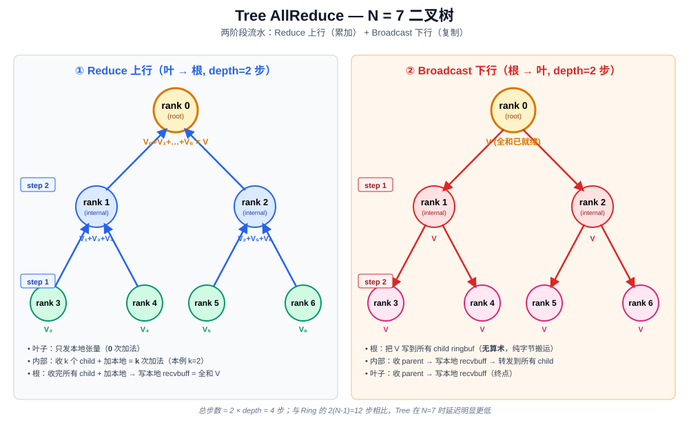

算法分两阶段，共 `2·depth` 轮（depth = ⌈log₂N⌉）：

| 阶段 | 方向 | 每步动作 | 直觉 |
|---|---|---|---|
| Reduce（上行） | 叶 → 根 | 每非叶 rank 等所有 child 把数据送到自己 → **累加** 自己的本地值 → 转发给 parent | 自底向上把整棵树的元素逐级累加；根节点最终持有完整全和 |
| Broadcast（下行） | 根 → 叶 | 根直接把全和写到 output；每非叶 rank 收到 parent 发来的全和 → 写 output → 转发给所有 child | 全和从根沿树枝逐级分发到所有 rank |

> 与 Ring 相比，Tree 的总步数是 `O(log N)` 而非 `O(N)`，**小消息延迟低**；代价是不同节点工作量不对称（根承担更多扇入扇出），中等及大消息的带宽利用率不如 Ring。本期聚焦延迟敏感场景。

### 1.3 Ring AllGather / ReduceScatter 工作原理

> **AllReduce ≡ ReduceScatter + AllGather**。两者既是 AllReduce 的"两半"，本身也是常用的独立原语。

#### 1.3.1 Ring ReduceScatter

设 N=4 个 rank 排成环 `0 → 1 → 2 → 3 → 0`，每 rank 持有同形状的张量切成 4 块：

- **初始**：rank i 持有 `[Xi_0, Xi_1, Xi_2, Xi_3]`（4 段）
- **目标**：rank i 最终只持有 `Si = X0_i + X1_i + X2_i + X3_i`（全和的第 i 段）；其它段废弃

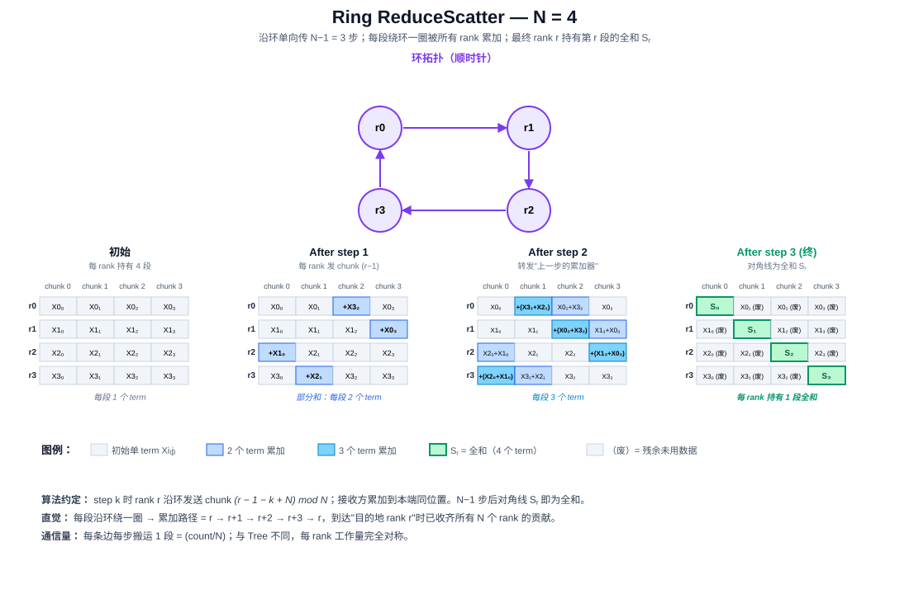

算法走 N−1 = 3 步，每步沿环单向传一段、收到后**累加**到本地对应段。逐步发送的 chunk 索引（与图中"新到段"对应）：

| step | r0 发出 | r1 发出 | r2 发出 | r3 发出 |
|---|---|---|---|---|
| 1 | chunk 3 (X0₃) → r1 | chunk 0 (X1₀) → r2 | chunk 1 (X2₁) → r3 | chunk 2 (X3₂) → r0 |
| 2 | chunk 2 (X3₂+X0₂) → r1 | chunk 3 (X0₃+X1₃) → r2 | chunk 0 (X1₀+X2₀) → r3 | chunk 1 (X2₁+X3₁) → r0 |
| 3 | chunk 1 (X3₁+X2₁+X0₁) → r1 | chunk 2 (X0₂+X3₂+X1₂) → r2 | chunk 3 (X1₃+X0₃+X2₃) → r3 | chunk 0 (X2₀+X1₀+X3₀) → r0 |

3 步后：rank r 在 chunk r 位置持有 `Sr = X0_r + X1_r + X2_r + X3_r`（图中对角线绿色单元格）。

> 直觉：每段"绕环一圈"被所有 rank 累加一次；环的方向决定每段最终落在哪个 rank（本约定下 → rank r 持有 chunk r 的全和）。

#### 1.3.2 Ring AllGather

设 N=4 个 rank 排成环 `0 → 1 → 2 → 3 → 0`，每 rank 持有 N 段 buffer，其中**只有自己负责的那一段已写入数据**，其它段为空：

- **初始**：rank i 持有 `[_, _, ..., Di, ..., _]`（只有第 i 段是 Di）
- **目标**：所有 rank 都持有 `[D0, D1, D2, D3]`

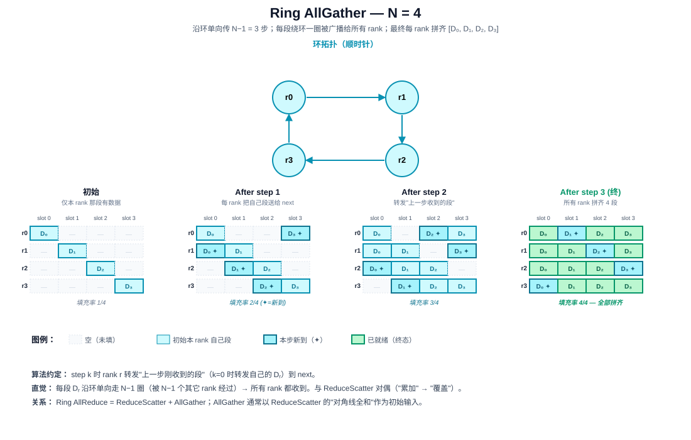

算法走 N−1 = 3 步，每步把"上一步刚收到的段"原样转发给 next、收到后**覆盖**写入本端对应槽位（k=0 时转发自己的 Dr）：

| step | r0 发出 | r1 发出 | r2 发出 | r3 发出 |
|---|---|---|---|---|
| 1 | D₀ → r1 | D₁ → r2 | D₂ → r3 | D₃ → r0 |
| 2 | D₃ → r1（上一步收到的）| D₀ → r2 | D₁ → r3 | D₂ → r0 |
| 3 | D₂ → r1 | D₃ → r2 | D₀ → r3 | D₁ → r0 |

3 步后：每 rank 都收齐其它 N−1 段，与自己原本的段拼出完整 `[D0, D1, D2, D3]`。

> 直觉：每段沿环单向传一圈即"广播"给了所有其它 rank；与 ReduceScatter 的对偶在于"累加"换成"覆盖"。

#### 1.3.3 与 AllReduce 的关系

> 图 1.3.3-1：Ring AllReduce ≡ ReduceScatter + AllGather。三个 4×4 状态网格依次为 ① 初始（每 rank 全 4 段独立）→ ② RS 后（每 rank 1 段全和，对角线绿色）→ ③ AG 后（每 rank 全部 4 段全和，全黄）。底部 3 块色卡说明 zeusCCL 中三种 kernel（RS / AG / AllReduce）的原语序列与共享 `graphs[ring].channels[*]` 的关系。

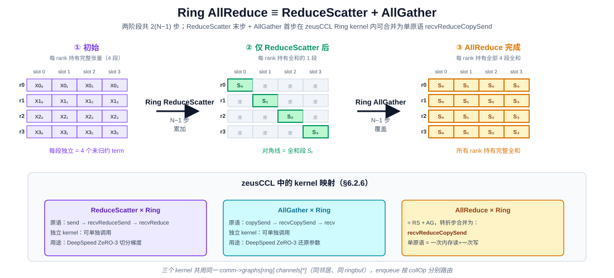

```
Ring AllReduce
   = Ring ReduceScatter         ── N−1 步，每 rank 持有全和的某一段
   + Ring AllGather             ── N−1 步，把那一段广播给所有 rank
   总步数 = 2(N−1)
```

zeusCCL 中：
- **AllGather / ReduceScatter 各有独立 kernel**，由 enqueue 按 collOp 选中后单独 launch（不必先跑完整 AllReduce）。
- **Ring AllReduce kernel 在结构上就是"ReduceScatter 末步 + AllGather 首步"被合并的一次原语调用**——这正是 §6.2.6 中 `recvReduceCopySend` 的语义。
- 三个原语**共用同一份 `comm->graphs[algo].channels[*]`**（同样的 prev/next 邻居、同样的 ringbuf），运行期由 dispatch 表分别路由到各自 kernel。

### 1.4 核心取舍：装配重 / 热路径轻

本设计把所有"需要决策、需要 syscall、需要进程间交互"的工作集中到 `commInit` 一次性完成；每次 `ncclAllReduce` 调用只剩固定的几步：参数校验 → 查表 → 填描述符 → launch kernel，**无任何运行时决策、无 host 侧通信**。

| 阶段 | 何时发生 | 谁参与 | 耗时量级 | 干什么 |
|---|---|---|---|---|
| **装配期** | `commInit` 一次性 | host 多模块 + 跨进程握手 + CUDA 分配 | 毫秒～秒 | 枚举 GPU、读 BDF、**逐一加载所有 XML（XML = 算法topo = n组 channels）、BDF↔rankId 映射、把每份 XML 翻译为 rank 视角的 `graphs[algo]`**、边可达性探测、后端选择（P2P / SHM）、IPC handle 交换、ringbuf 分配（每 algo × channel × peer 各一份）、填 dispatch 表（`(collOp, msgBucket) → (algo, nChannels, nThreads)`）、`devComm` 装配并拷到 GPU |
| **热路径** | 每次集合通信调用 | host 查表 + GPU kernel | μs 级 | 参数校验 → 由消息字节数 `count × sizeof(dtype)` 落档得 `msgBucket` → **按 `(collOp, msgBucket)` 查 dispatch 表选 algo + (nChannels, nThreads)** → 派生 chunkSize → 填工作描述符 → `cudaLaunchKernel`（绑定该 algo 的 kernel 符号 + `graphs[algo].channels`） |

GPU kernel 启动后**自主在 device 上推进**，host 与其它 rank 之间只通过 ringbuf 的 head/tail 计数器同步。后续章节凡涉及"为什么这件事在装配期做"或"为什么运行期不做这件事"——都回到这个原则。

---

## 2. 术语对照

> 术语按"组织维度"分组：**部署级**（库与外界 / 进程模型）→ **算法级**（数据如何切分流转）→ **传输级**（字节如何在 GPU 之间搬运）→ **运维级**（异常如何处理）。

### 2.1 部署级

| 术语 | 含义 |
|---|---|
| **rank** | 一个参与通信的 GPU 进程 / 线程 |
| **communicator**（comm）| 一组 rank 的通信上下文，不可变句柄；所有集合操作都基于一个 comm |
| **装配** / **装配期** | communicator 一次性初始化阶段：拓扑发现 + Tree 构造 + 建连 + ringbuf 分配；每 comm 仅一次（详见 §1.4） |
| **热路径** | 单次 `ncclAllReduce` 调用所经过的高频代码路径（参数校验 → 查表 → launch kernel） |
| **同步握手**（rendezvous） | CPU 侧进程间同步屏障 + 信息交换：所有 rank 必须到齐才能继续；在 `commInit` 时用于交换 `peerInfo` |
| **UDS**（Unix Domain Socket）| 同一台机器上进程间通信的本地 socket，地址是文件系统路径；本项目用它实现 rank 间同步握手与 IPC handle 交换 |
| **IPC** | CUDA Inter-Process Communication——跨进程显存映射，让一个进程的 GPU buffer 在另一个进程里也能被 GPU 直接 `load / store` |
| **BDF** | PCIe **B**us:**D**evice.**F**unction 标识（如 `0000:1a:00.0`），同一台机器内全局唯一定位一块 PCIe 设备。本项目 GPU 在拓扑 XML 中用 BDF 标识，因为 BDF 由硬件位置决定、与启动顺序无关；rank ↔ GPU 的映射可能因 `CUDA_VISIBLE_DEVICES` / 进程启动顺序而变化，所以"硬件层 BDF ↔ 算法层 rankId"的映射在装配期由 graph 模块构造 |
| **拓扑 XML** | 预生成的静态文件，每个 XML 描述**一种算法**在某型号机器上的拓扑结构（如 Tree、Ring）。文件内节点用 BDF 标识，根元素带 `algo="tree" \| "ring" \| ...` 属性；多算法 / 多机型场景库里同时携带多份 XML，graph 按 `(algo, nranks, BDF 集合)` 自动选取每种 algo 的匹配项并加载为一个 `comm->graphs[algo]` |

### 2.2 算法级

| 术语 | 含义 |
|---|---|
| **algorithm**（algo） | 一种逻辑通信拓扑 + 数据搬运模式的组合，如 **Tree**（树形扇入扇出）、**Ring**（环形 Reduce-Scatter + All-Gather）。每个 algo 对应一份 XML、一组 kernel 模板、一份 `comm->graphs[algo]` 通道集合 |
| **graph set**（`graphs[algo]`） | graph 模块为某个 algo 加载并装配出来的所有 channel 的集合；同一 comm 可同时持有多个 graph set（Tree 一份 + Ring 一份），互不干扰 |
| **msgBytes** | 运行期单次集合通信调用的原始消息字节数，由 `count × sizeof(dtype)` 计算得出 |
| **msgBucket** | dispatch 表的索引维度，由 `msgBytes` **落档**得到（典型分档：`≤1KB / 1KB~64KB / 64KB~1MB / 1MB~16MB / >16MB`）。**dispatch 表的索引永远是 `msgBucket` 而非 `msgBytes`**——用枚举式分档而非连续值是为了让 dispatch 退化为 O(1) 数组下标，无需任何范围比较 |
| **dispatch 表** | 装配期填好的 host 端二维表 `dispatch[collOp][msgBucket] → (algo, nChannels, nThreads, kernelSymbol)`；enqueue 用它一次查表选定本次跑哪个 algo / 哪几个 channels，是"算法选择"的物理形态 |
| **集合通信操作**（collOp） | 上层 API 暴露的语义动作：`AllReduce` / `Broadcast` / `Reduce` / `AllGather` / `ReduceScatter` 等；不同 collOp 可路由到不同 algo（如 Broadcast 天然走 Tree、AllGather 天然走 Ring） |
| **tree** | 一种 algo 的逻辑拓扑：N 个 rank 组织成一棵树，由 `algo="tree"` 的 XML 文件按硬件拓扑显式给出；根节点持有全和，上下行各 `depth` 步 |
| **ring** | 一种 algo 的逻辑拓扑：N 个 rank 组成一个环，由 `algo="ring"` 的 XML 文件按硬件拓扑显式给出；Reduce-Scatter + All-Gather 各 `N-1` 步 |
| **parent / children** | tree 结构中的相邻 rank 关系；从 XML 中"以 BDF 标识的 parent/children"经 BDF↔rankId 映射后得到；根节点无 parent，叶子节点无 children |
| **prev / next** | ring 结构中的相邻 rank 关系；同样由 XML 经 BDF↔rankId 映射得到 |
| **depth** | tree 深度，由 XML 中实际拓扑决定（典型 ⌈log_k N⌉，k 是平均扇出）；上下行各 depth 步 |
| **chunk** | 张量被切分的传输单元；每个 ringbuf slot 容纳一个 chunk |
| **channel** | GPU 上一组并行执行单元；本库一个 channel 对应一个 GPU thread block。**每个 algo 拥有独立的 channels[]**（Tree 一组、Ring 一组），互不复用 ringbuf；多 channel 并发执行以提高带宽利用率 |
| **Reduce / Broadcast** | Tree AllReduce 的两个阶段：上行累加 + 下行分发，参见 §1.2 |
| **Reduce-Scatter / All-Gather** | Ring AllReduce 的两个阶段：环上分段累加 + 环上分段分发 |

### 2.3 传输级

| 术语 | 含义 |
|---|---|
| **PBLink** | 本项目用来代指 GPU 间高带宽直连（类似 NVLink 的位置）；transport 层 P2P 主路径优先走 PBLink，不可用时退回 PCIe Peer，再不可用则降级 SHM |
| **ringbuf** | channel 上的**环形缓冲（ring buffer）**——一种 FIFO 数据结构：固定 `NCCL_STEPS=8` 个 slot 循环复用，slot 用完后回到第 0 个继续写。**"ring" 指 slot 的循环复用模式，不是 Ring 算法**——Tree 算法（parent↔child 边）与 Ring 算法（prev→next 边）都使用同一份 ringbuf 实现，仅邻居关系不同。每 `(algo, channel, peer)` 三元组各持一份 ringbuf |
| **ringbuf head / tail** | ringbuf 的读 / 写游标，写者推 tail、读者推 head；无锁推进——运行期 GPU 与 GPU 之间的同步机制 |
| **Simple 协议** | 本库使用的传输协议：数据 + 独立的 tail 计数器 + `__threadfence_system` 内存屏障实现写者 / 读者同步 |

### 2.4 运维级

| 术语 | 含义 |
|---|---|
| **abortFlag / fatalError** | 异常退出两阶段：检测到异常 → 设 `fatalError`；用户调 `commAbort` → 置 `abortFlag` → kernel spin 看到后 return |
| **装配重 / 热路径轻** | 贯穿全文的设计原则：可提前计算的工作放到装配阶段；运行期只查表 + launch kernel，避免运行期决策。详见 §1.4 |

---

## 3. 需求范围

### 3.1 功能性需求

| ID | 需求 | 用户视角 |
|---|---|---|
| F1 | Communicator 生命周期 | `ncclGetUniqueId(&uid)`（rank 0 调，应用层带外分发）/ `commInit(comm, nranks, rank, BootstrapAddr)` / `commDestroy(comm)` / `commAbort(comm)`（`BootstrapAddr` 为 UDS 路径） |
| F2 | 集合通信原语 | `allReduce` / `broadcast` / `reduce` / `allGather` / `reduceScatter`（本期 P0 实现 `allReduce`，其余原语在多算法框架下增量接入，详见 §8） |
| F3 | 多算法可插拔架构 | 同一 comm 同时持有多种算法（Tree / Ring / ……）的拓扑与 kernel，**算法选择对调用方完全无感**。三个组成部分：① **数据驱动加载**——库内可携带多份 XML，每份描述一种 algo 在某机型上的拓扑（`algo="tree"` / `algo="ring"`），graph 模块按 `(algo, nranks, BDF 集合)` 选匹配项、用 `peerInfo[*].busId` 翻译为 `comm->graphs[algo].channels[*]`，并给每条邻居边贴 P2P / SHM 后端标签；② **装配期物化 dispatch**——enqueue 按"已加载 algo 集合 + 内置策略"填好 `dispatch[collOp][msgBucket] → (algo, nChannels, nThreads, kernelSymbol)`，热路径只查表；③ **算法扩展开放**——新增算法只需提供 XML + 对应 kernel + 注册 parser，无需修改 enqueue / transport / device 主流程 |
| F4 | 异步错误轮询 | `commGetAsyncError(comm, &err)`；任一模块检测到异常 → 写 `comm->fatalError` 被该接口读到 |
| F5 | Group 批量语义 | `ncclGroupStart()` / `ncclGroupEnd()` 包裹任意多次集合通信调用；区间内调用只入队不 launch，GroupEnd 时合并为一次 cudaLaunchKernel（kernel 参数为 WorkElem 数组）。两类核心收益：① 把 N 次 launch 开销（每次 ~5μs）降为 1 次；② 多 comm 串行调用可能形成的死锁（A 等 B、B 等 A）通过 GroupEnd 的全局编排消除。支持嵌套（库 / 框架各自包裹）；线程局部状态，无跨线程同步 |

---

## 4. 外部接口与运行环境

### 4.1 调用方

| 类别 | 集成方式 | 典型场景 |
|---|---|---|
| **DL 训练 / 推理框架** | 链接动态库（`libnccl.so` / `nccl.dll`）+ `#include "nccl.h"` | PyTorch DDP 梯度同步 / DeepSpeed ZeRO 参数广播 / Megatron-LM 张量并行同步 |
| **测试驱动 / 基准程序** | 同上 | `nccl-tests` 数值正确性比对、自定义功能用例、CI 集成测试 |

### 4.2 进程 / 线程模型

| 部署形态 | 描述 | 通信通路 |
|---|---|---|
| **单进程多 GPU** | 一个进程的N个线程持有 N 个 GPU、N 个 communicator | 直接 CUDA IPC + PBLink；同进程的地址空间内 handle 可直接共享，**绕过 UDS 同步握手** |
| **多进程多 GPU**（同节点）| 每进程一个 GPU、一个 communicator | 通过 **UDS 同步握手** 交换 `peerInfo`（busId + pid + IPC handle），再走 CUDA IPC + PBLink |

所有 rank **几乎同时** 调用 `ncclCommInit`；某个 rank 迟到会让其他 rank 阻塞在同步握手上。

### 4.3 下游依赖

| 依赖 | 作用 | 涉及 API / 接口 |
|---|---|---|
| **CUDA Runtime + Driver** | kernel 启动、显存管理、跨进程显存映射、流同步 | `cudaLaunchKernel` / `cudaMalloc` / `cudaIpcGetMemHandle` / `cudaIpcOpenMemHandle` / `cudaStreamSynchronize` / `cudaEventRecord` |
| **PBLink**（主路径）| GPU 间数据搬运 | 由 CUDA 透明使用 |
| **PCIe**（次选）| PBLink 不可用时退回 PCIe Peer | 由 CUDA 透明使用 |
| **host `/dev/shm`**（备用）| CUDA IPC 不可达时退化 | `shm_open` / `mmap` |

---

## 5. 总体架构

### 5.1 模块架构

zeusCCL 按职责拆为 **6 个分层**（API / 调度 / GPU 内核 / 传输 / 算法 / 装配编排）+ **1 个跨层服务列**。每个模块按其在生命周期中的活跃阶段标记为：
- **装配期**（紫色虚框，仅 `commInit` 一次性）—— bootstrap、graph、装配编排，以及 transport.connect / enqueue 填 dispatch 表 / devComm 装配三个装配子任务
- **热路径**（橙色实框，每次集合通信调用）—— enqueue 5 步流水、device kernel 族、transport 运行期 ringbuf 访问

> 图 5.1-1：zeusCCL 分层架构（多算法可插拔 · 装配 / 热路径分相）
>
> 完整 SVG 见 [`zeusCCL-arch-layered-v1.0.svg`](zeusCCL-arch-layered-v1.0.svg)。

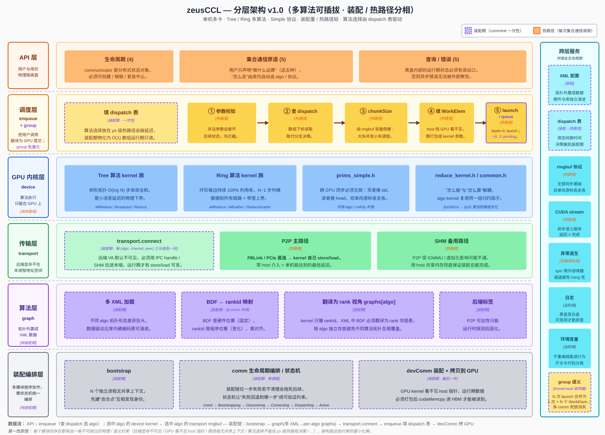

**图中关键看点**：

| 看点 | 体现位置 |
|---|---|
| **算法可插拔** | 算法层（紫色） graph 输出 `graphs[Tree]` / `graphs[Ring]` / ... 多份并存，互不干扰 |
| **dispatch 表是装配↔热路径的桥梁** | 调度层 enqueue 左侧紫色虚框（装配期填表） → 右侧 5 步流水（热路径查表 + launch） |
| **device kernel 按 algo 成族矩阵** | GPU 内核层并列展示 Tree kernel 族（AllReduce/Broadcast/Reduce）与 Ring kernel 族（AllReduce/AllGather/ReduceScatter） |
| **transport ringbuf 按 (algo, channel, peer) 三元组独立** | 传输层左侧紫色虚框 transport.connect 标注"每 (algo, channel, peer) 三元组各一份 ringbuf" |
| **跨层服务伴随全生命周期** | 右侧蓝色列：XML 配置 + dispatch 表 + ringbuf 协议 + CUDA stream + 异常逃生 + 日志 + 环境变量 + peerInfo |
| **装配阶段串调链** | 底部装配编排层的状态机：Uninit → Bootstrapping → Discovering → Connecting → Dispatching → Active |

### 5.2 分层调用关系

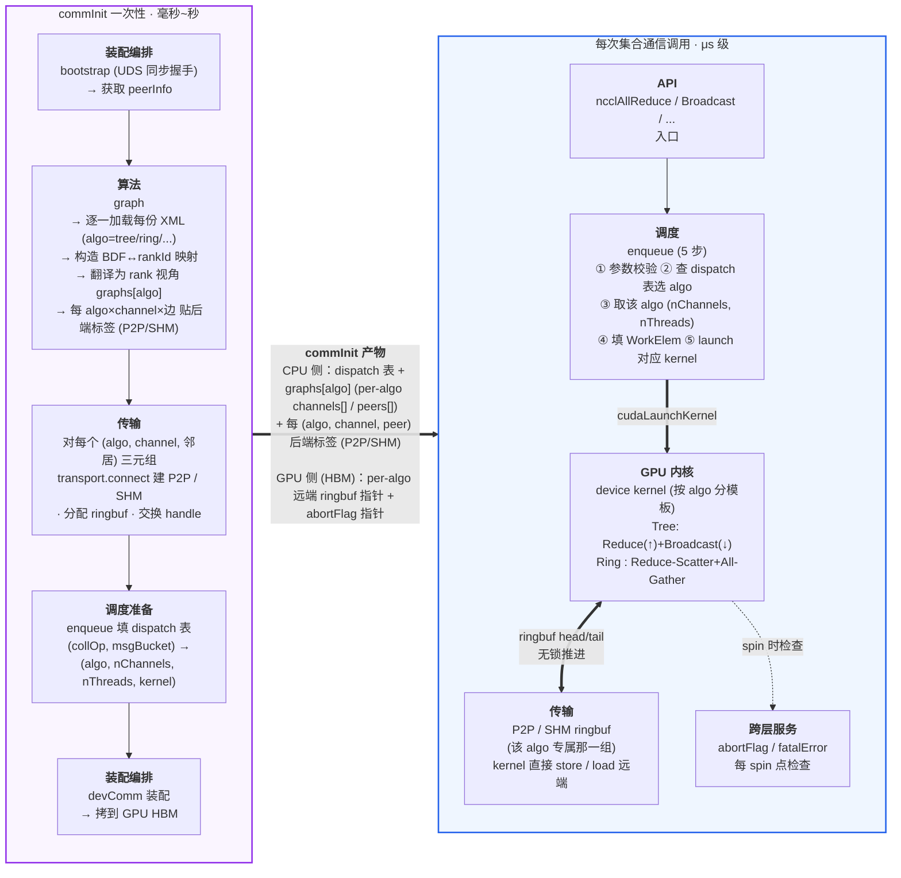

---

## 6. 模块划分与职责

### 6.1 模块清单

| 模块 | 职责描述 |
|---|---|
| **public-api** | 对外暴露 C ABI 公开符号，承接调用方的所有交互。本模块**只做轻量参数合法性检查**（指针非空、数值范围、`comm->state` 合法），不做任何语义解析（不展开 dtype/op 的具体含义、不做 GPU 选择、不做内存分配），随后**把请求转交内部对应模块**（`commInit` → comm；`ncclAllReduce` → enqueue；查询类直接读 comm 字段）。它是稳定 ABI 的物理边界，C++ 内部签名调整不会外溢。 |
| **comm**（init / commLifecycle）| `commInit / commDestroy / commAbort / commGetAsyncError` 四个 API 的总编排器。commInit 对内按顺序调度 bootstrap → graph → transport → devComm 装配，维护 `comm->state` 字段表示当前阶段。本模块本身不做拓扑分析、不做建连、不做 GPU 数据搬运，只负责**调度顺序、状态推进、错误传播和异常逃生**（`abortFlag` / `fatalError`）。 |
| **bootstrap** | 装配链路的第一站。通过 UDS socket（由 rank 0 创建、应用层带外分发到其他 rank）把所有 N 个 rank 拉到同一会合点，做**同步屏障**；并让每个 rank 各自起一个常驻的监听 socket，把自己的 listen 地址（UDS 路径）与本地 GPU 的 **PCIe BDF**（通过 `cudaDeviceGetPCIBusId` 读取）塞进 `peerInfo` 上报。完成后所有 rank 都拿到一份完整的 `peerInfo[]`（含所有 rank 的 `listenAddr` + `busId`），graph 据此构建 BDF↔rankId 映射、transport 据此 rank i ↔ rank j 二次握手交换 IPC handle / SHM 路径，无需经 rank 0 中转。单进程多线程场景跳过，直接走全局变量。 |
| **graph** | 装配期完成"**多 XML 加载 + 构造 BDF↔rankId 映射 + 把每份 XML 翻译为 rank 视角的 graph set + 给每条边贴 transport 后端标签**"四件事。**每个 algo 一份 XML**（`algo="tree" \| "ring" \| ...`），由硬件团队按机型预生成、节点用 PCIe BDF 标识；库内不构造代价矩阵、不做拓扑搜索、不在运行时计算拓扑。graph 的工作是：① 扫描库内携带的所有 XML，按 `(algo, nranks, BDF 集合)` 给每种 algo 选匹配项（一种 algo 命中即加载，未命中跳过）；② 按 algo 类型分派 parser，把 XML 解析为 BDF 视角拓扑（Tree 的 parent/children 嵌套 / Ring 的环顺序）；③ 用 `peerInfo[*].busId` 建 BDF→rankId 映射；④ 把 BDF 替换为 rankId，得到 `graphs[algo].channels[*].{tree \| ring}`；⑤ 对每个 (algo, channel) 上的相邻边做 `cudaDeviceCanAccessPeer`，通则 P2P、不通则 SHM。结果写入 `comm->graphs[algo].channels[*]` 后固化，运行期不再活跃。**至少一个 algo 加载成功**才能进入下一阶段；否则装配失败。 |
| **transport** | 装配期**为每个 (algo, channel, 相邻边) 三元组分别建立数据通路**。具体做法：**读 graph 模块写好的 `graphs[algo].channels[c].peers[p].transport` 标签**决定走 P2P (CUDA IPC + PBLink / PCIe) 主路径还是 SHM (`/dev/shm` mmap) 备用路径（**不重复调 `cudaDeviceCanAccessPeer`**）；为每个 (algo, channel, peer) 三元组分配独立本端 ringbuf（不跨 algo 共享）、导出 IPC handle / SHM 路径、按 `peerInfo[peer].listenAddr` 直连对端做二次握手交换 handle、映射对端 buffer 到本端 VA。装配完成后，运行期 device kernel 直接 store / load 对端 ringbuf，transport 层不再参与。 |
| **enqueue** | 运行期 host 侧的实现入口，是**热路径中负责 algo 分发 + launch kernel 的 host 模块**。每次用户调 `ncclAllReduce / Broadcast / ...` 都进入这里，按五步执行：参数校验 → 用 `(collOp, count×sizeof(dtype))` 查 dispatch 表选出 `(algo, nChannels, nThreads, kernelSymbol)` → 派生 chunkSize → 填 `ncclWorkElem`（带 `graphs[algo].channels` 指针）→ `cudaLaunchKernel`。dispatch 表在装配期由 enqueue 自身按"已加载 algo 集合 + 内置策略"填好，运行期只查表。约束严格：不做任何运行时决策（除查表）、不做 host 侧通信、不做内存分配；返回 `ncclSuccess` 仅表示入队成功。**当线程处于 group 状态（`tlGroupDepth > 0`）时，第 5 步 `cudaLaunchKernel` 被替换为"WorkElem 写入 pending 队列"** —— 由 group 模块在 `GroupEnd` 时统一 launch。 |
| **group**（语义聚合）| 线程局部的**延迟提交装饰器**。维护 `__thread int tlGroupDepth` + per-thread `pendingWork[comm][]` 队列；`ncclGroupStart` 把 depth +1，区间内的集合通信调用进入 enqueue 后**只填 WorkElem 写 pending 队列不 launch**；`ncclGroupEnd` 把 depth -1，最外层归零时把所有 comm 的 pending 队列按 stream 分组，**每 stream 一次 `cudaLaunchKernel` 提交全部 WorkElem 数组**。两类核心价值：① 把 N 次 launch 开销（每次 ~5μs）合并为 1 次；② 多 comm 串行调用形成的"A 等 B、B 等 A"死锁通过 GroupEnd 的全局顺序编排消除。本模块不持有 comm 状态、不分配 GPU 资源、不参与拓扑；纯 host 侧 thread-local 编排，对多线程无锁交互。 |
| **device**（GPU 内核）| 整个库**唯一在 GPU 上运行的模块**。模板维度 `<CollOp, Algo, Protocol, Op, Dtype>`——协议固定为 `Simple`，algo 维度按已支持的算法（Tree、Ring……）各产出一份 kernel 实例族 `ncclKernel_{CollOp}_{Algo}_Simple_{Op}_{Dtype}`。kernel 由 enqueue / group launch 后从 `ncclDevComm` 读取本 algo 在本 rank 的拓扑邻居（Tree 取 parent/children，Ring 取 prev/next）、ringbuf 指针、`abortFlag`，按本 algo 自己的步骤推进——Tree 走"Reduce 上行 + Broadcast 下行"、Ring 走"Reduce-Scatter + All-Gather"；通过 ringbuf 的 head/tail 与邻居无锁同步。每个 spin 点检查 abortFlag 以支持 hang 逃生。**接收 WorkElem 数组（N≥1）**：group launch 时单次 launch 传入多个 WorkElem，block 通过 `blockIdx` 索引到具体 WorkElem 再按其 algo 执行。 |

> 备注 : **NVML** (NVIDIA Management Library) 是 NVIDIA 提供的 GPU 管理与监控接口库 (libnvidia-ml.so)，nvidia-smi 建立在它之上。它走控制平面旁路，不需要 CUDA Context、不占显存、不影响计算，通过 ioctl 直达内核驱动，即便 CUDA 崩了也能查 GPU 状态。

### 6.2 各模块实现思路

#### 6.2.1 comm 初始化

**模块作用**：装配期涉及多个模块按特定顺序协作（bootstrap → graph → transport → devComm），任一步失败都必须能干净清理、不让残留资源拖死后续——所以必须有一个**总编排器 + 状态机**来串这条链。

**模块定位**：负责 communicator 的生命周期管理。它对外暴露 `commInit` / `commDestroy` / `commAbort` / `commGetAsyncError` 四个 API，对内按顺序调用 bootstrap、graph、transport 和 devComm 装配，并维护 `comm->state` 字段表示 communicator 当前所处的阶段。其它模块通过读 `comm->state` 判断当前 comm 是否可用。

**要做的工作**：
- **生命周期编排**：`commInit` 按 Bootstrapping → Discovering → Connecting → Active 顺序串调 bootstrap / graph / transport，并在最后把 `devComm` 拷到 GPU。
- **状态机维护**：每个阶段对应一个 `comm->state`，保证调用方在错误时机不能继续推进（如 `Failed` 状态下 enqueue 必须拒绝入队）。
- **错误收敛**：任一阶段失败 → `state = Failed` → 走清理路径返回错误码；提供 `commGetAsyncError` 让外部线程异步查询运行期错误。
- **异常逃生入口**：`commAbort` 置位 `abortFlag`，让 GPU kernel 跳出 spin；`commDestroy` 等待 kernel 自然结束后释放资源。

**输入与输出**：

| 项 | 内容 |
|---|---|
| 入口 | `ncclCommInit / Destroy / Abort / GetAsyncError` |
| 持有状态 | `comm->state`、`comm->fatalError`、`comm->abortFlag`、`comm->devComm` |
| 协作模块 | 串行调用 bootstrap → graph → transport → 装配 devComm |

**状态机**：

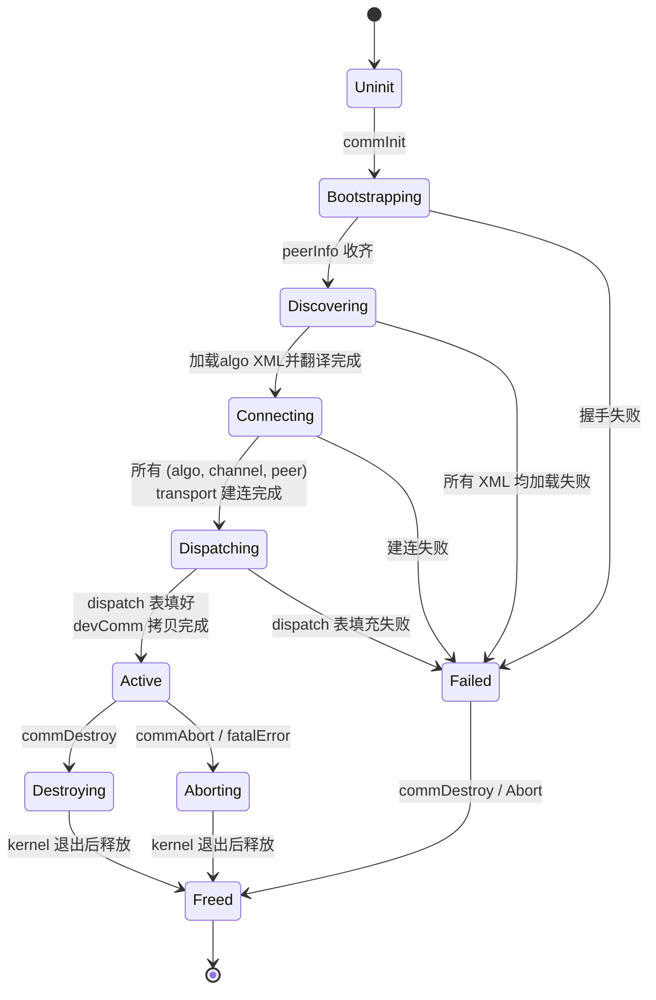

**`ncclCommInit` 实现流程**：

1. **预备**：分配 `comm` 结构，设 `state = Uninit`；`cudaGetDevice` 校验调用线程绑定的 device 与传入参数一致。
2. **Bootstrapping**：`state = Bootstrapping` → 调 bootstrap 模块（§6.2.2）完成同步握手 → 拿到 `peerInfo[]`。
3. **Discovering**：`state = Discovering` → 调 graph 模块（§6.2.3）逐一加载库内携带的多份 XML → 每种 algo 加载成功后写入 `comm->graphs[algo].channels[*]`（含 tree 邻居或 ring 邻居 + 后端标签）；至少有一个 algo 加载成功才能继续，否则装配失败。
4. **Connecting**：`state = Connecting` → 调 transport 模块（§6.2.4）对每个 (algo, channel, 相邻边) 三元组建连 → `cudaMalloc` 分配本端 ringbuf（per algo 独立）→ P2P / SHM 两分支各自完成 handle 交换 → 写入 `comm->graphs[algo].channels[*].peers[*]`。
5. **Dispatching**：调 enqueue 模块（§6.2.5）按"已加载的 algo 集合 + 内置 (collOp, msgBucket) → algo 策略"填好 dispatch 表 `comm->dispatch[collOp][msgBucket]`。本步全在 host 侧、单 rank 局部完成，无跨 rank 通信。
6. **DevComm 装配**：把 `comm` 中需要在 GPU 端访问的字段（**所有 algo 的 channels + 每个 channel 的邻居 / ringbuf 指针**、abortFlag 指针等）打包到 `ncclDevComm` 结构 → `cudaMemcpyAsync` 拷到 GPU global memory → `comm->devComm` 指向之。
7. **Active**：`state = Active` → 返回 `ncclSuccess`，从此可接收集合通信调用。

任一步骤失败 → `state = Failed` → 走清理路径（与 Destroy 共享），返回错误码。

**`ncclCommDestroy` 实现**：
1. `state = Destroying`，拒绝新的 AllReduce 入队。等当前执行 kernel 完成（`cudaStreamSynchronize` 或显式 event 等待）。
2. `cudaIpcCloseMemHandle` / SHM `munmap` → `cudaFree` ringbuf → 释放 `peerInfo[]` → 释放 `comm` 结构。

**`ncclCommAbort` 实现**（异常逃生路径，与 Destroy 共享清理代码）：
1. `state = Aborting`，拒绝新的入队。置 `*abortFlag = 1`（host 写，GPU 读）。
2. 等 kernel 看到 flag 后 `return`。
3. 进入与 Destroy 相同的资源释放路径。

**`ncclCommGetAsyncError` 实现**：原子读 `comm->fatalError` 返回。这是少数允许上层应用查询接口，便于训练框架在另一个线程做健康检查；检测到错误后调用方应主动调 `commAbort` 完成清理。

**错误传播路径**：
- 装配期失败 → 当前调用线程同步返回错误码。
- 运行期 kernel hang / peer 失联 → 由检测者（kernel 内 spin 超时检查 / host 侧轮询）写 `comm->fatalError` → 调用方通过 `commGetAsyncError` 看到 → 主动调 `commAbort` 终结整 comm。

#### 6.2.2 bootstrap 模块

**模块作用**：N 个独立 rank 进程之间没有任何公共上下文，必须先有一个"会合点"让它们互相发现并交换"我是谁"。

**模块定位**：bootstrap 在 `commInit` 阶段执行进程间同步握手。它通过一条预先约定的 UDS 会合 socket（由 rank 0 创建、应用层带外分发到其他 rank）**把所有 N 个 rank 拉到同一会合点**，等所有 rank 都到达后再继续推进；并在此过程中**让每个 rank 各自起一个自己的 UDS 监听 socket**，把"自己的 listen 地址 + 基本信息"打包进 `peerInfo` 上报。bootstrap 执行完后，每个 rank 都拿到完整的 `peerInfo[]`（含**所有 rank 的监听地址**），后续 graph 模块据此完成本节点 GPU 拓扑探测，transport 模块据此直接 rank i ↔ rank j 二次握手交换 IPC handle / SHM 路径，**无需经 rank 0 中转**。

**输入与输出**：

| 项 | 内容 |
|---|---|
| 输入 | `nranks`, `rank`, `BootstrapAddr`（UDS 路径如 `/tmp/zeus-uid.sock`；**由 rank 0 调 `ncclGetUniqueId` 生成后由应用层带外分发**——rank 0 在此监听，其它 rank 主动 connect 上报） |
| 输出 | `peerInfo[nranks]`，每项含 `{ busId, pid, nranks, listenAddr }`（`busId` 是该 rank 所绑定 GPU 的 PCIe BDF，由 `cudaDeviceGetPCIBusId` 读取，**graph 模块据此与 XML 拓扑中的 BDF 对齐**；`listenAddr` 是该 rank 自己监听的 UDS 路径，供 transport 二次握手时直连） |
| 副作用 | 本 rank 持有一个长期监听的 UDS socket，生命周期与 comm 同步——`commDestroy` 时才 close 并 unlink |
| 失败模式 | 路径不可达 / 权限不足 / 连接超时 / 各 rank `nranks` 不一致 / 本 rank 监听 socket 创建失败 → 返回 `ncclSystemError`，调用方释放 comm |

**单进程多线程例外**：`commInit` 检测到所有 rank 在同一进程时跳过同步握手，直接走全局变量共享 `peerInfo`，连 socket 都不创建。

**UDS 方案同步流程**：

> 图 6.2.2-1：UDS 同步握手时序——uniqueID 生成与带外分发 → 各 rank 调 commInit → rank i 上报 peerInfo → rank 0 同步屏障 → rank 0 广播完整 peerInfo[]

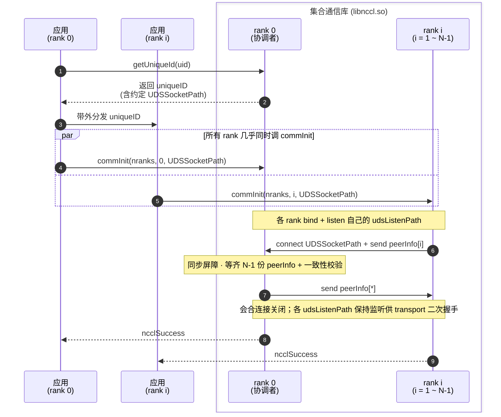

**伪代码对照**：

```
// 前置条件 (由应用层完成,不在库内):
//   ① rank 0 调 ncclGetUniqueId 生成 uniqueID (含约定 UDSSocketPath)
//   ② 应用层通过 MPI / 文件 / 环境变量带外分发 uniqueID 给所有 rank
//   ③ 各 rank 从 uniqueID 解析出 UDSSocketPath 作为 commInit 参数

rank 0 (协调者):
  1. bind+listen(UDSSocketPath)               // 会合路径,同时作为自己的 udsListenPath
  2. for i in 1..N-1: conn[i] = accept()       // 接受 N-1 个会合连接
  3. for i in 1..N-1: recv peerInfo[i]         // 收齐 (含 udsListenPath = UDSSocketPath.i)
  4. peerInfo[0] = { self busId/pid/nranks,
                     udsListenPath = UDSSocketPath }
  5. 校验 peerInfo[i].nranks 全部一致
  6. for i in 1..N-1: send peerInfo[*]         // 广播完整数组
  7. 关闭会合用的 conn[i];保留 UDSSocketPath 上的 listen socket
     (后续 transport 二次握手时被其它 rank 直连)

rank i (i ≥ 1):
  1. bind+listen(UDSSocketPath.i)              // 先把自己的 udsListenPath 建好
  2. retry connect(UDSSocketPath, 超时数秒)    // 等 rank 0 监听就绪
  3. send peerInfo[i] = { busId, pid, nranks,
                          udsListenPath = UDSSocketPath.i }
  4. recv peerInfo[*]                          // 接收完整数组
  5. 关闭与 rank 0 的会合连接;保留 UDSSocketPath.i 上的 listen socket
```

#### 6.2.3 graph 模块

**模块作用**：每种算法（Tree、Ring、……）需要本 rank 知道自己在该算法拓扑下的邻居（Tree 的 parent/children、Ring 的 prev/next），并给每条邻居边选定合适的 transport 后端。**所有算法的拓扑结构都由硬件团队按机型预先生成、以一组 XML 文件形式随库交付**（每份 XML 对应一种 algo）；graph 模块的工作不再是"搜索拓扑"，而是"把所有可用 XML 一份一份正确加载进来、对齐到本次启动的 rank 集合"。这把"拓扑设计"从运行时迁移到了离线，运行时只剩查表 + 翻译。

**模块定位**：graph 在装配期完成四件事——
1. **多 XML 扫描**：库内可携带多份 XML（不同 algo × 不同机型 × 不同规模），按 `(algo, nranks, BDF 集合)` 给每种 algo 选匹配项。
2. **按 algo 类型解析**：根据 XML 根元素的 `algo` 属性挑 parser（Tree parser 处理 `<tree>` 嵌套结构；Ring parser 处理 `<ring>` 顺序列表），输出 BDF 视角的拓扑。
3. **BDF↔rankId 映射**：用 bootstrap 收齐的 `peerInfo[*].busId` 与 XML 中 BDF 集合做双向对齐，得到 `bdf2rank` / `rank2bdf` 两张表（**整个 comm 共用一份**，所有 algo 通用）。
4. **翻译 + 标后端**：把每份 BDF 视角拓扑翻译为 rankId 视角，写入 `comm->graphs[algo].channels[*]`；对每个 (algo, channel) 上的相邻边做 `cudaDeviceCanAccessPeer` 可达性探测，贴 P2P / SHM 标签。

**没有代价矩阵、没有拓扑搜索、没有 NVML / sysfs 现场扫描**——XML 已经把"哪些 GPU 通过哪条链路、按什么父子 / 前后顺序组织"全部决定好了；graph 只做加载与对齐。结果写入 `comm->graphs[algo].channels[*]` 后固化，运行期不再活跃。

**输入与输出**：

| 项 | 内容 |
|---|---|
| 输入 | `peerInfo[nranks]`（含每 rank 的 `busId`、pid）+ **多份 XML 拓扑文件**（库内携带 N 份，每份描述一种 algo；路径由约定目录如 `<lib_dir>/topo/` 或 `ZEUS_TOPO_DIR` 环境变量指定） |
| 输出 | `comm->graphs[algo]`——对每个加载成功的 algo，包含其 `nChannels`、`channels[c].{tree \| ring}`（rankId 视角邻居）、`channels[c].peers[*].transport`（P2P / SHM 标签）；以及 `comm->loadedAlgosMask` 标记哪些 algo 可用（供 enqueue 填 dispatch 表用）；`bdf2rank[]` / `rank2bdf[]` 映射表（诊断 / 日志用，不进入 devComm） |
| 失败模式 | 候选 XML 中**没有任何一种 algo 找到匹配项** / 某份 XML 格式非法 / 某条边 P2P 不通且 SHM 也不可达 → 返回 `ncclInternalError` |

> **部分加载允许**：只要至少一种 algo 加载成功就继续——例如某机型可能没有 Ring XML，那 comm 就只持有 Tree graph，enqueue 在填 dispatch 表时把所有桶都路由到 Tree。这让"新算法增量上线"不会卡住已有部署。

**XML 拓扑文件格式**（每份 XML 一种 algo，根元素 `algo` 属性区分）：

```xml
<!-- 文件名建议: topo_<arch>_<nranks>gpu_<algo>.xml -->
<!-- ============ 例 1：Tree ============ -->
<topology version="1" arch="example-8gpu" nranks="8" algo="tree">
  <gpus>
    <gpu bdf="0000:1a:00.0"/>  <gpu bdf="0000:1b:00.0"/>
    <gpu bdf="0000:1c:00.0"/>  <gpu bdf="0000:1d:00.0"/>
    <gpu bdf="0000:1e:00.0"/>  <gpu bdf="0000:1f:00.0"/>
    <gpu bdf="0000:20:00.0"/>  <gpu bdf="0000:21:00.0"/>
  </gpus>

  <!-- 每个 channel 一棵树；根节点 parent="" -->
  <tree channel="0">
    <node bdf="0000:1a:00.0" parent="">
      <node bdf="0000:1b:00.0" parent="0000:1a:00.0">
        <node bdf="0000:1d:00.0" parent="0000:1b:00.0"/>
        <node bdf="0000:1e:00.0" parent="0000:1b:00.0"/>
      </node>
      <node bdf="0000:1c:00.0" parent="0000:1a:00.0">
        <node bdf="0000:1f:00.0" parent="0000:1c:00.0"/>
        <node bdf="0000:20:00.0" parent="0000:1c:00.0"/>
        <node bdf="0000:21:00.0" parent="0000:1c:00.0"/>
      </node>
    </node>
  </tree>
  <tree channel="1"> ... </tree>     <!-- 互补树 -->
</topology>

<!-- ============ 例 2：Ring ============ -->
<topology version="1" arch="example-8gpu" nranks="8" algo="ring">
  <gpus>
    <gpu bdf="0000:1a:00.0"/>  <gpu bdf="0000:1b:00.0"/>
    <gpu bdf="0000:1c:00.0"/>  <gpu bdf="0000:1d:00.0"/>
    <gpu bdf="0000:1e:00.0"/>  <gpu bdf="0000:1f:00.0"/>
    <gpu bdf="0000:20:00.0"/>  <gpu bdf="0000:21:00.0"/>
  </gpus>

  <!-- 按顺序列出环上的节点；最后一个节点的 next 自动回到第一个 -->
  <ring channel="0">
    <node bdf="0000:1a:00.0"/>
    <node bdf="0000:1b:00.0"/>
    <node bdf="0000:1d:00.0"/>
    <node bdf="0000:1f:00.0"/>
    <node bdf="0000:21:00.0"/>
    <node bdf="0000:20:00.0"/>
    <node bdf="0000:1e:00.0"/>
    <node bdf="0000:1c:00.0"/>
  </ring>
  <ring channel="1"> ... </ring>     <!-- 反向环 -->
</topology>
```

> **XML 的 `<gpus>` 段必须一致**：同机型不同 algo 的 XML 文件，`<gpus>` 段必须给出完全相同的 BDF 集合（同机型上的 GPU 是固定的）。graph 加载时会校验这一点，不一致直接装配失败。
> **`<tree>` / `<ring>` 节点数**：必须严格等于 `<gpus>` 段中 BDF 数；每个 BDF 在该 `<tree>`/`<ring>` 中恰好出现一次。

**链路分类与后端选择**（本期仅同节点，仅两类——所有 algo 共用）：

| 类别 | 检测方式 | 装配后端 |
|---|---|---|
| P2P 可达（PBLink / PCIe Peer） | `cudaDeviceCanAccessPeer(i, j) == true` | P2P |
| P2P 不通（同节点但被隔离） | `cudaDeviceCanAccessPeer(i, j) == false` | SHM（`/dev/shm` 降级） |

> 拓扑结构由 XML 给定，跑哪条物理链路是硬件团队拍板的，库内只需要"通或不通"的二值判断兜底。

**整体流程概览**：

```
              ┌──────────────────────────────────┐
              │ peerInfo[] (含 busId / BDF)        │
              │ + 库内携带的多份 XML 文件          │
              │   (algo=tree, algo=ring, ...)     │
              └────────────────┬─────────────────┘
                               ▼
              ┌──────────────────────────────────┐
              │ 1. 扫描候选 XML，按 algo 分组      │
              │    对每个 algo 选匹配项            │
              │    (algo, nranks, BDF 集合)        │
              └────────────────┬─────────────────┘
                               ▼
              ┌──────────────────────────────────┐
              │ 2. 构造全局 BDF↔rankId 映射 (一次)│
              │    用 peerInfo[i].busId 填表       │
              └────────────────┬─────────────────┘
                               ▼
              ┌──────────────────────────────────┐
              │ 3. 对每个加载成功的 algo:          │
              │    a. 按 algo 类型挑 parser        │
              │       (TreeParser / RingParser)   │
              │    b. 解析 → BDF 视角拓扑          │
              │    c. BDF → rankId 翻译            │
              │    d. 每条邻居边可达性探测         │
              │       贴 P2P / SHM                 │
              │    e. 写 comm->graphs[algo]        │
              └────────────────┬─────────────────┘
                               ▼
              ┌──────────────────────────────────┐
              │ 4. 设 comm->loadedAlgosMask        │
              │    (供 enqueue 填 dispatch 表)      │
              └──────────────────────────────────┘
```

**`commInit` 中按以下步骤执行**：

1. **扫描候选 XML，按 algo 分组挑匹配项**：
   - 候选集合：约定目录（如 `<lib_dir>/topo/`）下所有 `*.xml` + 环境变量 `ZEUS_TOPO_DIR` 指定目录下的 `*.xml`。
   - 解析每份 XML 的根元素，取 `algo` 与 `nranks` 属性，以及 `<gpus>` 段的 BDF 集合 `S_xml`。
   - 计算本次启动 `peerInfo[*].busId` 的集合 `S_actual`。
   - **按 algo 分桶**：对每个 algo（tree、ring、……），从候选中筛出满足 `algo == 该 algo && nranks 匹配 && S_actual ⊆ S_xml` 的 XML；命中多个按文件名字典序取第一个并打 warning；命中零个则该 algo 不可用、跳过。
   - 若所有 algo 全部 0 命中 → 装配失败；至少 1 个 algo 命中 → 继续。

2. **构造 BDF↔rankId 映射（一次性、所有 algo 共用）**：
   - 遍历 `peerInfo[i]`，用 `busId` 填 `bdf2rank[busId] = i` / `rank2bdf[i] = busId`。
   - 校验：`peerInfo[*].busId` 互不相同；每个 `busId` 都能在每份选中的 XML 的 `S_xml` 中找到（隐含校验：不同 algo 的 XML `<gpus>` 必须一致）。任一条不满足 → 装配失败。

3. **对每个加载成功的 algo，分派对应 parser 解析 + 翻译 + 标后端**：
   - **algo = "tree"**：把 `<tree channel="c">` 下的嵌套 `<node bdf="..." parent="...">` 展开为 BDF 视角邻居表（每 BDF → `{parentBDF, childrenBDF[]}`，含根的 BDF）。校验：每 `<tree>` 内每 BDF 恰好出现一次；恰好一个根；除根外每节点 parent 在该树内；无环。然后：
     - `graphs[tree].channels[c].tree.parent = (本 rank BDF 的 parentBDF == "") ? -1 : bdf2rank[parentBDF]`
     - `graphs[tree].channels[c].tree.children[k] = bdf2rank[childrenBDF[k]]`，未占用位 `-1`
   - **algo = "ring"**：把 `<ring channel="c">` 下顺序排列的 `<node bdf="..."/>` 展开为 BDF 视角的有序列表。校验：每 `<ring>` 内每 BDF 恰好出现一次。然后：
     - 找到本 rank BDF 在列表中的索引 `i`
     - `graphs[ring].channels[c].ring.prev = bdf2rank[列表[(i-1+N) % N]]`
     - `graphs[ring].channels[c].ring.next = bdf2rank[列表[(i+1) % N]]`
     - `graphs[ring].channels[c].ring.userRanks[]` = 列表整体翻译为 rankId 序列
   - **新 algo 接入**：在 graph 模块注册表里追加一个 `(algoName, parser, translator)` 三元组即可，graph 主流程零修改。
   - **每条邻居边后端选择**：对本 rank 在该 (algo, channel) 上的每个邻居 `peer`，调 `cudaDeviceCanAccessPeer` → true 标 P2P、false 标 SHM；写入 `graphs[algo].channels[c].peers[peer].transport`。

4. **设置 loadedAlgosMask**：把已加载 algo 的位标 1（如 `Tree=0x1, Ring=0x2`），写到 `comm->loadedAlgosMask`，供 enqueue 在装配末段填 dispatch 表时识别哪些 algo 可路由。

5. **channel 数量**：每个 algo 自己的 `nChannels = 对应 XML 中 <tree>/<ring> 元素数量`；不同 algo 间 `nChannels` 可以不同（如 Tree 给 2 棵互补树、Ring 给 1 个正向 + 1 个反向 = 2 个，也允许 Tree 4 + Ring 2 之类）。

> **设计要点**：把"拓扑设计"完全外置到一组按 algo 拆分的 XML。运维侧若发现某机型上某 algo 不够优，只需替换对应 XML；接入新 algo 也只需新增 XML + 注册 parser，**无需改动 graph 主流程、enqueue 主流程、transport 模块**——这正是把这件事做成数据驱动的价值。

#### 6.2.4 transport 模块

**模块作用**：GPU kernel 要像访问本地内存一样访问远端 GPU 显存，但远端 buffer 默认在另一个进程的地址空间里 GPU 指令访问不到——transport 在装配期**把远端 buffer 映射进本端虚拟地址空间**，并准备好运行期的搬运机制。

**模块定位**：transport 在装配期为**每个 (algo, channel, 相邻边) 三元组**分别建立数据通路，按 graph 写好的后端标签分两类——
- **P2P**（CUDA IPC + PBLink / PCIe）：把对端 GPU buffer 映射到本端 VA，运行期 kernel 直接 `store / load`，host 不参与。
- **SHM**（`/dev/shm` mmap）：双方 mmap 同物理页，运行期 kernel 直接访问，host 不参与。

每个 algo 拥有**独立的 ringbuf**（不跨 algo 共享）——同一对 (peer, direction) 在 Tree graph 和 Ring graph 下各有一份独立 ringbuf。这避免了运行期算法切换时的同步污染，代价是显存占用按 algo 数量线性增加（典型 2 个 algo × 4 channels × 8 slots × ~4 MB ≈ 256 MB / rank，仍可控）。

装配完成后，运行期 host 不参与数据搬运，device kernel 直接 store / load 对端 ringbuf。

**输入与输出**：

| 项 | 内容 |
|---|---|
| 输入 | `comm->graphs[algo].channels[c].{tree \| ring}`（决定要连哪些 peer：tree 取 parent+children、ring 取 prev+next）+ `comm->graphs[algo].channels[c].peers[p].transport`（**graph 模块在 §6.2.3 已贴好的后端标签**，P2P / SHM）+ `peerInfo[*].listenAddr`（用于直连对端做二次握手） |
| 输出 | `comm->graphs[algo].channels[c].peers[p].{connSend, connRecv}`：buffer 指针 + head/tail 计数器地址（每 algo / channel / peer 各一份） |
| 失败模式 | P2P 不通且 SHM 也创建失败、IPC handle 交换超时 → 返回 `ncclSystemError` |

**装配期实现步骤**（在 `commInit` 的 connect 阶段执行，对 `algo × channels × 邻居` 三重循环）：

1. **按 graph 标签分发后端**：直接读 `graphs[algo].channels[c].peers[p].transport` 标签——P2P 走 CUDA IPC + PBLink/PCIe 分支；SHM 走 `/dev/shm` mmap 分支。**不再调 `cudaDeviceCanAccessPeer`**，可达性判断在 §6.2.3 已完成。两个分支用条件 switch 表达，不引入 vtable 多态。
2. **导出本端 buffer**：
   - **P2P 分支**：`cudaMalloc` 分配 `buffSize` 显存 → `cudaIpcGetMemHandle` 导出为 64 字节不透明 handle。
   - **SHM 分支**：在 `/dev/shm` 创建文件 → `ftruncate(buffSize)` → `mmap` 拿到 host VA；head/tail 计数器与 buffer 同段放置。
3. **handle 交换**：`connect(peerInfo[peer].listenAddr)` 直连对端常驻监听 socket，发送本端的 IPC handle / SHM 路径，收对端的同型；每对 (channel, peer) 一次往返；transport 层不解析包内容，仅按字节包传递。
4. **映射对端 buffer**：
   - **P2P 分支**：`cudaIpcOpenMemHandle(对端 handle)` → 得到本地虚拟地址。
   - **SHM 分支**：`open(对端发来的路径)` → `mmap` → 本地虚拟地址。
5. **连接落地（host 端）**：把以下指针写入 host 端 `comm->graphs[algo].channels[c].peers[p]`：
   - `connSend.buffs`：写入侧使用的**远端** buffer 地址（本端 VA 中映射到的对端段），本端 GPU 通过它直接远程写入 receiver。
   - `connRecv.buffs`：读出侧使用的**本地** buffer 地址，本端 GPU 从这里本地读取。
   - `connSend.tail` / `connRecv.head`：Simple 协议的对端 / 本端计数器虚拟地址。
   - 本步只写 host 内存，GPU kernel 此时还看不到这些指针。

6. **指针下发到 HBM（与 §6.2.1 Step 6 协同）**：transport 完成 host 端写入后，init / commLifecycle 接管：
   - 把**所有 algo** 的 `graphs[*].channels[*].peers[*]` 中 kernel 运行期会用到的字段（ringbuf 指针、tail / head 地址、tree/ring 邻居、abortFlag 指针）打包到 `ncclDevComm` 结构。
   - `cudaMalloc` 在 GPU HBM 分配 `ncclDevComm` 空间 → `cudaMemcpyAsync` 把 host 打包好的结构拷到 GPU 端 → `comm->devComm` 记下 GPU 端地址。
   - enqueue 在 launch kernel 时把 `comm->devComm` 作为 kernel 参数传入；kernel 启动后通过 `ncclShmem.comm` 引用 `ncclDevComm`，从 HBM 读出这些指针，再 dereference 访问真正的 ringbuf / 计数器。
   - **关键约束**：所有"GPU 端取指针"的动作必须落在 HBM 上才能成立。HBM 上存放的是**指针值（虚拟地址）**；指针指向的实际 ringbuf 数据 / 计数器，按后端落在：
     - **P2P**：receiver HBM
     - **SHM**：host pinned / SHM 段（`cudaHostRegister` 后 device 可访问）

**ringbuf 布局**（每对相邻 rank、每方向、每 channel 一份）：

- **P2P**：`sendBuff` 在本端 GPU 显存，对端通过 `cudaIpcOpenMemHandle` 映射后直接 `load`，零拷贝。
- **SHM**：`sendBuff` 在 `/dev/shm`，双方 `mmap` 同物理页，通过 host memory coherence 协议同步。
- `head` / `tail` 计数器同样在 P2P / SHM 段中，分配方式与 buffer 一致。

只服务 Simple 协议，每 channel 一份 buffer 足够（LL/LL128 才需额外的 flag buffer）。两种后端通过同一 ABI（`buffs + head/tail` 指针对）暴露给 kernel，布局差异在装配期吸收；运行期 kernel 拿到的就是普通虚拟地址指针，store/load 直接走硬件路径。**P2P / SHM 都不需要 host 辅助线程**——单机部署中 host 侧零开销。

**邻居边的方向性**：
- **Tree algo**：Reduce 阶段 child → parent、Broadcast 阶段 parent → child；同一对 (parent, child) 在两阶段中读写方向相反。transport 为每条边**双向**分配 ringbuf：
  - "child 写入 parent" 方向：child 端 `connSend` ↔ parent 端 `connRecv`（用于 Reduce 上行）。
  - "parent 写入 child" 方向：parent 端 `connSend` ↔ child 端 `connRecv`（用于 Broadcast 下行）。
- **Ring algo**：数据始终沿环单向流动（rank → next）；Reduce-Scatter 与 All-Gather 共用同一方向的 ringbuf：
  - "rank 写入 next" 方向：本端 `connSend` ↔ next 端 `connRecv`。
  - "prev 写入 rank" 方向：本端 `connRecv` ↔ prev 端 `connSend`（即 prev 视角下 "rank 写入 next" 的接收端）。
- **新 algo 接入**：transport 不需要感知具体算法，只感知"哪些 (peer, direction) 对"——这由 graph 模块输出的 `channels[c].{tree | ring}` 邻居信息决定。新增 algo 只需在 graph 里输出对应的邻居结构，transport 自动适配。

#### 6.2.5 enqueue 模块

**模块作用**：用户视角的"一次 API 调用"必须翻译成 GPU 视角的"一次 kernel 提交"——enqueue 是这个翻译器：**按集合通信操作 + 消息大小挑算法**、填好工作描述符并 `cudaLaunchKernel`，**入队即返回**，完成由 stream 异步保证。

**模块定位**：enqueue 在 commInit 装配末段做一次"填 dispatch 表"，在运行期每次集合通信调用做一次"查表 + launch"。dispatch 表把"`(collOp, msgBucket)` → `(algo, nChannels, nThreads, kernelSymbol)`"映射写死，运行期分发动作就是一次 O(1) 数组下标。本模块不做拓扑判断、不做 host 侧通信、不做内存分配——这些工作都已在装配期完成。

**装配期：填 dispatch 表**（在 §6.2.1 commInit Step 5 `Dispatching` 阶段执行）：

- **输入**：`comm->loadedAlgosMask`（graph 给出的可用 algo 集合）+ 内置 (collOp, msgBucket) → algo 策略（可由环境变量覆盖）。
- **策略示例**（默认硬编码，按消息大小分桶切换 algo）：

  | collOp | ≤ 1 KB | 1 KB ~ 1 MB | > 1 MB |
  |---|---|---|---|
  | `AllReduce` | Tree（小消息低延迟） | Tree | Ring（大消息高带宽，若加载） / Tree |
  | `Broadcast` | Tree | Tree | Tree |
  | `Reduce` | Tree | Tree | Tree |
  | `AllGather` | Ring（若加载）/ Tree | Ring / Tree | Ring / Tree |
  | `ReduceScatter` | Ring（若加载）/ Tree | Ring / Tree | Ring / Tree |

- **优雅降级**：若策略选中的 algo 不在 `loadedAlgosMask` 中（XML 未加载），按 algo 优先级顺序回退到下一个可用 algo——保证只要 `loadedAlgosMask ≠ 0` 就总能填出可用的 dispatch entry。
- **每档同时确定** `nChannels`（不能超过 `comm->graphs[algo].nChannels`）与 `nThreads`，以及对应的 `kernelSymbol = ncclKernel_{collOp}_{algo}_Simple_{Op}_{Dtype}`（按 dtype/op 拆开后是更高维的表）。
- 结果写入 `comm->dispatch[collOp][msgBucket]`，运行期只读。

**运行期单次调用按顺序执行**：

| 项 | 内容 |
|---|---|
| 输入 | 用户参数 `(sendbuff, recvbuff, count, dtype, op, comm, stream)` + collOp 类型 + 装配期已写好的 `comm->dispatch[][]` 与 `comm->graphs[*]` |
| 输出 | kernel 已提交到 `stream`；同步返回 `ncclSuccess` |
| 失败模式 | 参数非法 → `ncclInvalidArgument`；`comm->state ≠ Active` → `ncclInvalidUsage`；选中的 dispatch entry 为 nullptr（不应发生）→ `ncclInternalError` |

1. **参数校验**：`comm` 非空、`comm->state == Active`、`count > 0`、`sendbuff/recvbuff` 非空、`dtype/op` 在支持集合内、且 `(collOp, op, dtype)` 是合法组合。失败立即返回 `ncclInvalidArgument`。
2. **查 dispatch 表选 algo**：
   - 计算 `msgBytes = count × sizeof(dtype)`，落到 `msgBucket`（如 `<1KB / 1KB~1MB / >1MB`）。
   - 取 `entry = comm->dispatch[collOp][msgBucket]` 得到 `(algo, nChannels, nThreads, kernelSymbol)`。
   - 该步仅是数组下标读取，无分支决策。
3. **取 algo 的 channels**：`channels = comm->graphs[algo].channels`；这是后续 kernel 的工作集合。
4. **chunkSize 派生**：由公式 `chunkSize = buffSize / NCCL_STEPS × chunkSteps` 计算（`buffSize` 与 `chunkSteps` 在装配期由协议 / 显存预算固定），再按 `nBytes / (nChannels × chunkSize) < 阈值` 做最多 3 轮 halve 微调；保证最后一个 chunk 不浪费且对齐到 `(nThreads − WARP_SIZE) × sizeof(uint64_t)`。
5. **填工作描述符**：把 `(sendbuff, recvbuff, count, chunkSize, nChannels, nThreads, algoTag, channelsPtr, ...)` 写入栈上的 `ncclWorkElem`，作为 kernel argument 传入。`algoTag` 让 kernel 在通用入口里仍可校验是否被 launch 到了正确的实例（防御性检查）。
6. **launch kernel**：`cudaLaunchKernel(entry.kernelSymbol, grid={nChannels,1,1}, block={nThreads,1,1}, args, sharedMem, stream)`，绑定到用户传入的 `stream`。
7. **立即返回 `ncclSuccess`**：仅表示"入队成功"；完成语义由 stream 提供（`cudaStreamSynchronize` 后 `recvbuff` 可读）。

> 算法选择是**一次查表**而非分支判断；`(op, dtype)` 维度通过 `kernelSymbol` 中已绑定的 kernel 实例化体现，本质同样是查表。本期不支持 Group 聚合（多原语一次入队）、不支持 CUDA Graph capture。

**dispatch 表落地形态示例**（结构示意，数值由详设实测确定）：

```
comm->dispatch[AllReduce]:
  [≤ 1 KB]      → { algo=Tree, nChannels=1, nThreads=256,
                     kernel=ncclKernel_AllReduce_Tree_Simple_Sum_f32 }   ※
  [1 KB ~ 1 MB] → { algo=Tree, nChannels=2, nThreads=256, kernel=...  }
  [> 1 MB]      → { algo=Ring, nChannels=2, nThreads=512, kernel=...  }   (若 Ring 已加载)
                  fallback: { algo=Tree, nChannels=2, nThreads=512, ...} (若仅 Tree 可用)

comm->dispatch[Broadcast]:
  [全部桶]       → { algo=Tree, ... }

comm->dispatch[AllGather]:
  [全部桶]       → { algo=Ring, ... }  (若 Ring 已加载，否则 fallback=Tree)

※ 实际上 dispatch 表还会按 (op, dtype) 进一步展开为多个 kernelSymbol；
  上面用单个 dtype 示意。
```

**异步性边界**：API 返回 ≠ 操作完成；完成可见性需要用户通过 stream 同步获得，与 CUDA stream 的标准语义对齐。

#### 6.2.6 device 模块

**模块作用**：算法的实际执行（GPU 间搬数据 + 元素累加 + 邻居同步）只能在 GPU 上完成——device 是整个库**唯一在 GPU 上跑的代码**，其它 5 个模块全部为它服务（提供资源 / 数据 / 参数）。

**模块定位**：device 是整个库唯一在 GPU 上运行的模块，其它模块都是 host C++ 代码。它按 `<CollOp, Algo, Protocol, Op, Dtype>` 五维模板实例化出一族 GPU kernel——协议固定为 `Simple`，algo 按已支持的算法（**Tree、Ring**……）独立成 kernel 族，CollOp 按支持的集合通信原语展开。kernel 符号命名 `ncclKernel_{CollOp}_{Algo}_Simple_{Op}_{Dtype}`，由 enqueue 通过 dispatch 表选中后 launch。kernel 启动后从 `ncclDevComm` 读取**对应 algo 在本 rank 的拓扑邻居**（Tree 取 parent/children、Ring 取 prev/next）、对应 algo 的 ringbuf 指针、`abortFlag` 指针，按本 algo 自己的步骤推进——Tree 走"Reduce 上行 + Broadcast 下行"、Ring 走"Reduce-Scatter + All-Gather"，不需要 host 介入，直到处理完用户传入的整个张量。

> **多 algo 共存**：所有 algo 的 kernel 符号都已被编译进库 + 注册进 dispatch 表；运行期每次 launch 只激活当前选中的那一个 kernel。新 algo 接入 = 新增一族 `ncclKernel_{...}_{NewAlgo}_{...}` 模板实例 + 在 graph 模块注册 XML parser + 在 enqueue 的 dispatch 策略中给 `(collOp, msgBucket)` 路由到它即可。

**要做的工作**（与 algo 相关的部分按 algo 拆分）：
- **Grid / Block 映射**（所有 algo 通用）：每个 block 担当一个 channel，处理 `1/nChannels` 的数据；block 内多 thread 协作搬运 chunk 并做 reduce。
- **Tree algo**：
  - Reduce 阶段（上行）：每非叶 rank 等所有 child 写完 ringbuf → 把 child 数据 reduce 进本地 → 再 reduce 自己的 sendbuff → 写入 parent 的 ringbuf；叶子 rank 直接把 sendbuff 写入 parent；根 rank 把最终全和写入自己的 recvbuff。
  - Broadcast 阶段（下行）：根 rank 把全和写入所有 child 的 ringbuf；每非根 rank 等 parent 写完 → 读出全和 → 写本地 recvbuff → 再转发到所有 child；叶子 rank 只读取、不转发。
- **Ring algo**：按 collOp 复用同一组邻居 (prev / next) + ringbuf，按原语流水拆为以下三种 kernel（详见后文 §B/§C/§D）：
  - **Ring ReduceScatter**（N-1 步）：每步把"轮到自己负责的某一段"发给 next、收 prev 同段做累加；末步直接把结果写本地 recvbuff（不再转发）。
  - **Ring AllGather**（N-1 步）：每步把"手上某一段"原样转发给 next + 写本端 recvbuff 对应段；末步只写本端 recvbuff（不再转发）。
  - **Ring AllReduce**（2(N-1) 步）：等价于 ReduceScatter + AllGather，转折步合并为 `recvReduceCopySend`。
- **Simple 协议同步**（所有 algo 通用）：通过 ringbuf 的 head/tail 计数器与邻居 rank 做无锁推进；写完一片 → fence → 推 tail；读到 tail > step → 读数据 → 推 head 释放 slot。
- **abortFlag 检查**（所有 algo 通用）：每次 spin 等待 tail 推进时检查 `*abortFlag`，置位则立即 `return` 跳出（hang 逃生的关键挂钩点）。

**输入与输出**：

| 项 | 内容 |
|---|---|
| 输入 | `ncclWorkElem`（由 enqueue 填，含 algoTag + channelsPtr）+ `ncclDevComm`（由 init 拷到 GPU global memory，含**所有 algo 的** graphs / 邻居 / ringbuf 指针 / abortFlag 指针）。每个 kernel 实例只会访问自己 algo 那一份。 |
| 输出 | 写入用户传入的 `recvbuff`；不向 host 返回任何值 |
| 完成语义 | kernel 退出 = 完成，通过 stream 顺序对调用方可见 |
| 中止条件 | `*abortFlag == 1` → 任何 spin 点立即 return（参见 §7.3） |

**Grid / Block 映射**：enqueue 端按 `grid.x = nChannels`、`block.x = nthreads`（典型 256 或 512）launch。每个 block 担当一个 channel，处理 `1/nChannels` 的数据。

**单 channel 内执行流程**（对 `count` 元素的张量）——下文按 `(CollOp, Algo)` 拆分描述：

##### A. AllReduce × Tree

Tree 算法按节点在树中的位置（根 / 内部 / 叶子）分三种角色，每种角色在 Reduce / Broadcast 两阶段各调用对应原语：

| 角色 | Reduce 阶段（上行） | Broadcast 阶段（下行） |
|---|---|---|
| **叶子** (无 child) | `send`：把本地 sendbuff 写入 parent ringbuf | `recv`：从 parent ringbuf 读出全和 → 写本地 recvbuff |
| **内部** (有 child + 有 parent) | `recvReduceSend`：等所有 child ringbuf → reduce + 累加本地 sendbuff → 写 parent ringbuf | `recvCopySend`：等 parent ringbuf → 写本地 recvbuff → 转发到所有 child ringbuf |
| **根** (无 parent) | `recvReduceCopy`：等所有 child ringbuf → reduce + 累加本地 sendbuff → **写本地 recvbuff**（不上行） | `send`：把 recvbuff 中的全和写入所有 child ringbuf |

按外层张量分片循环：

1. 取本 channel 的数据起点 `gridOffset = 0`，每轮处理 `loopSize = nChannels × chunkSize` 元素。
2. 在每轮内：根据本 rank 在 tree 中的角色，**先执行一次 Reduce 阶段原语，再执行一次 Broadcast 阶段原语**。
3. 推进 `gridOffset += loopSize`，回到步骤 2，直到处理完所有元素。

**kernel 概念性步骤**（语言无关伪代码；每个 block 在一个 channel 上独立执行，省略偏移与 nelem 的细节计算）：

```
输入: rank, parent, children[], size, chunkSize, nChannels
派生: loopSize = nChannels × chunkSize
派生: role = ROOT     if parent == -1
            LEAF     if children 全 == -1
            INTERNAL otherwise

# 外层: 大张量分片处理
for gridOffset in 0, loopSize, 2*loopSize, ... while gridOffset < size:

    # === Reduce 阶段（上行）===
    switch role:
      LEAF:
        send(sendbuff[gridOffset..], to=parent)
            # 把本地数据写入 parent ringbuf

      INTERNAL:
        recvReduceSend(from=children, sendbuff[gridOffset..], to=parent)
            # 等所有 child ringbuf → reduce + 累加本地 sendbuff → 写 parent ringbuf

      ROOT:
        recvReduceCopy(from=children, sendbuff[gridOffset..], to=recvbuff[gridOffset..])
            # 等所有 child ringbuf → reduce + 累加本地 sendbuff → 写本地 recvbuff
            # （根节点持有全和，无需再上行）

    # === Broadcast 阶段（下行）===
    switch role:
      ROOT:
        send(recvbuff[gridOffset..], to=children)
            # 把全和写入所有 child ringbuf

      INTERNAL:
        recvCopySend(from=parent, to=recvbuff[gridOffset..], to=children)
            # 等 parent ringbuf → 写本地 recvbuff → 转发到所有 child ringbuf

      LEAF:
        recv(from=parent, to=recvbuff[gridOffset..])
            # 等 parent ringbuf → 写本地 recvbuff
```

##### B. ReduceScatter × Ring

Ring ReduceScatter 在环上走 `N-1` 步；每个 rank 在每步处理"轮到自己负责的某一段"——把 prev 写来的累加段 + 本地对应段累加后写到 next。所有 rank 角色对称（都是环上一个节点），按"当前是不是末步"分两种原语：

| 步序 | 原语 | 语义 |
|---|---|---|
| step 0 | `send` | 把自己负责的初始段 `sendbuff[chunkIdx]` 发给 next |
| step 1 ~ N-3 | `recvReduceSend` | 收 prev → reduce 累加本端对应段 → 发给 next |
| step N-2 | `recvReduce` | 收 prev → reduce 累加 → **写本地 recvbuff**（最终全和段，不再转发） |

kernel 伪代码：

```
输入: rank, prev, next, N, size, chunkSize, nChannels
派生: loopSize = nChannels × N × chunkSize
派生: 每 rank 最终持有 recvbuff = 全和的第 rank 段

for gridOffset in 0, loopSize, 2*loopSize, ... while gridOffset < size:

    # === Ring ReduceScatter: N-1 步 ===
    chunk = (rank + 1) mod N
    send(sendbuff[chunk 段], to=next)           # step 0

    for j in 2 .. N-1:                          # step 1 ~ N-2
        chunk = (rank + j) mod N
        recvReduceSend(from=prev,
                       local=sendbuff[chunk 段],
                       to=next)

    chunk = rank
    recvReduce(from=prev,                       # step N-1（末步）
               local=sendbuff[chunk 段],
               out=recvbuff)                    # 写本地输出
```

##### C. AllGather × Ring

Ring AllGather 在环上走 `N-1` 步；每个 rank 把"手上某一段"原样转发给 next，next 写到自己 recvbuff 对应位置后继续转发。所有 rank 角色对称，按"当前是不是末步"分两种原语：

| 步序 | 原语 | 语义 |
|---|---|---|
| step 0 | `copySend` | 把自己的 `sendbuff` 段 copy 到 `recvbuff[rank 段]` 同时发给 next |
| step 1 ~ N-3 | `recvCopySend` | 收 prev → copy 到 `recvbuff[对应段]` → 发给 next |
| step N-2 | `recv` | 收 prev → copy 到 `recvbuff[对应段]`（最后一段，不再转发） |

kernel 伪代码：

```
输入: rank, prev, next, N, size, chunkSize, nChannels
派生: loopSize = nChannels × N × chunkSize
派生: 每 rank 最终持有 recvbuff = [D0, D1, ..., D(N-1)]

for gridOffset in 0, loopSize, 2*loopSize, ... while gridOffset < size:

    # === Ring AllGather: N-1 步 ===
    chunk = rank
    copySend(local=sendbuff,                    # step 0
             out=recvbuff[chunk 段],
             to=next)

    for j in 1 .. N-2:                          # step 1 ~ N-2
        chunk = (rank - j + N) mod N
        recvCopySend(from=prev,
                     out=recvbuff[chunk 段],
                     to=next)

    chunk = (rank + 1) mod N
    recv(from=prev,                             # step N-1（末步）
         out=recvbuff[chunk 段])
```

> 完整 C++ 实现（含 `prims_simple` 模板展开、`ncclShmem` 共享内存布局、warp 级搬运优化、偏移与 nelem 的精确计算等）见详设。

**支持的 op × dtype 矩阵**：

device 模块对每个合法的 `(Op, Dtype)` 组合产出一个独立 kernel 实例。上面的"kernel 概念性步骤"伪代码**与 op / dtype 完全无关**——唯一差异是 `recvReduceSend / recvReduceCopy` 原语内部 element-wise reduce 那一行的函子与累加器类型选择。

**归约操作**（reducer 函子，element-wise）：

| Op | 语义 | 适用 dtype | 备注 |
|---|---|---|---|
| `Sum` | `a + b` | 全部 | 默认 op |
| `Max` | `max(a, b)` | 整数 + 浮点 | |
| `Min` | `min(a, b)` | 整数 + 浮点 | |
| `Prod` | `a * b` | 整数 + 浮点 | 整数按 dtype 截断溢出，由用户负责语义 |
| `Avg` | Sum + 根节点 Reduce 末步后整体除以 `nranks` | 整数 + 浮点 | 实现 = Sum + `recvReduceCopy` 末步前除法；`nranks` 从 `ncclDevComm` 读取；整数走整数除法（截断） |

**数据类型**（element 类型与累加器类型）：

| Dtype（API 暴露） | sizeof | element 类型（kernel 里的 C++ 类型） | 累加器类型 | 备注 |
|---|---|---|---|---|
| `int8` / `uint8` | 1 | `int8_t` / `uint8_t` | 同元素类型 | |
| `int32` / `uint32` | 4 | `int32_t` / `uint32_t` | 同元素类型 | |
| `int64` / `uint64` | 8 | `int64_t` / `uint64_t` | 同元素类型 | |
| `float16` | 2 | `__half` | **`float`（fp32）** | 精度较低，累加损失精度 |
| `bfloat16` | 2 | `__nv_bfloat16` | **`float`（fp32）** | 同上 |
| `float32` | 4 | `float` | `float` | |
| `float64` | 8 | `double` | `double` | |

> **fp16 / bf16 累加策略**：reduce 时将元素 promote 到 `float` 累加，写回 ringbuf 前再 cast 回原 dtype——若直接用 fp16 / bf16 累加，N=8、count=1M 的典型场景下精度会明显劣化。本期硬编码该策略，不向用户暴露选项。仅适用于浮点归约（Sum / Max / Min / Prod / Avg）。

**合法组合矩阵**（✓ = 支持；— = 非法，`kernelTable` 对应位置为 `nullptr`）：

| Op \ Dtype | i8 | u8 | i32 | u32 | i64 | u64 | f16 | bf16 | f32 | f64 |
|---|---|---|---|---|---|---|---|---|---|---|
| `Sum` | ✓ | ✓ | ✓ | ✓ | ✓ | ✓ | ✓ | ✓ | ✓ | ✓ |
| `Max` | ✓ | ✓ | ✓ | ✓ | ✓ | ✓ | ✓ | ✓ | ✓ | ✓ |
| `Min` | ✓ | ✓ | ✓ | ✓ | ✓ | ✓ | ✓ | ✓ | ✓ | ✓ |
| `Prod` | ✓ | ✓ | ✓ | ✓ | ✓ | ✓ | ✓ | ✓ | ✓ | ✓ |
| `Avg` | ✓ | ✓ | ✓ | ✓ | ✓ | ✓ | ✓ | ✓ | ✓ | ✓ |

合法实例数（仅 AllReduce × 单 algo）= `5 op × 10 dtype = 50` 个 kernel 符号。
**算法 × CollOp 维度展开后**：
- **有 op 的 collOp**（AllReduce / Reduce / ReduceScatter）：`5 op × 10 dtype = 50 / (collOp × algo)`
- **无 op 的 collOp**（Broadcast / AllGather）：`10 dtype = 10 / (collOp × algo)`

本期落地范围与对应 kernel 数：

| collOp | 推荐 algo | kernel 数 / algo | 小计 |
|---|---|---|---|
| AllReduce | Tree, Ring | 50 | 100 |
| ReduceScatter | Ring | 50 | 50 |
| AllGather | Ring | 10 | 10 |
| Broadcast | Tree | 10 | 10 |
| Reduce | Tree | 50 | 50 |
| **合计** | | | **≈ 220** |

**Simple 协议原语内部实现**：每次原语调用都展开为写者 / 读者通过 ringbuf 的 tail / head 计数器配对推进——写者推 tail 通知"数据已就绪"，读者推 head 释放 slot 供写者复用。

> 图 6.2.6-2：Simple 协议时序——写者写数据 → 内存屏障 → 推 tail；读者 spin 等 tail > step → 读数据 → 推 head 释放 slot；任何 spin 点都检查 abortFlag 以支持 hang 逃生

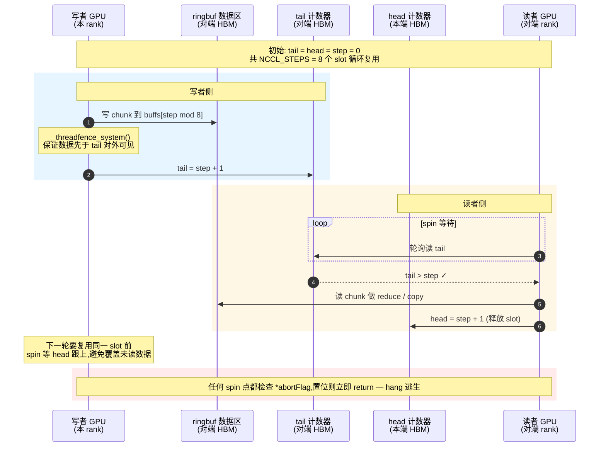

要点（与图对应）：
- **写入侧**：写数据到 `buffs[step % NCCL_STEPS]` → `__threadfence_system()` 保序 → 推 `tail` 通知对端。
- **读出侧**：在 `tail > step` 上 spin → 读 data → 推 `head` 释放 slot。
- **abortFlag 检查点**：每次 spin 迭代检查 `*abortFlag`，置位则立即 return，跳过剩余 chunk / 剩余 step——这是 hang 逃生的关键挂钩点（参见 §7.3）。

> 备注：本期只走"间接路径"——数据始终经本端 ringbuf 中转。不实现 Direct 路径（不通过 `ptrExchange` 拿到 peer output buffer 指针后直写），换得 transport 接口最小化。

#### 6.2.7 group 语义模块

**模块作用**：每次 `cudaLaunchKernel` 都有 ~5–10 μs 的固定调度开销；训练步内一轮 100+ 个梯度 AllReduce → 累计 0.5–1 ms 的纯 launch 开销，对小 batch / 高频迭代场景是显著浪费。同时多 comm（多并行流 / 多通信组）串行调用时各 rank 的执行顺序可能形成"A 等 B、B 等 A"循环死锁。group 模块通过"区间内延迟提交 + 区间末批量合并 launch"同时解决这两类问题。

**模块定位**：group 是 API 与 enqueue 之间的**线程局部装饰器**。它不持有 communicator 状态、不分配 GPU 资源、不参与拓扑——只维护 thread-local 的 `tlGroupDepth` 计数器 + per-thread `pendingWork[comm]` 队列，并通过修改 enqueue 第 5 步的行为（launch vs. queue）实现语义切换。enqueue 自身代码几乎不变，只在末步多一个 `if (tlGroupDepth > 0)` 分支。

**输入与输出**：

| 项 | 内容 |
|---|---|
| 入口 | `ncclGroupStart()` / `ncclGroupEnd()` 两个 thread-local 调用 |
| 区间内行为 | 应用照常调 `ncclAllReduce / Broadcast / ...`；enqueue 完成前 4 步（校验、查 dispatch、chunkSize、填 WorkElem）后**不 launch**，把 `(WorkElem, kernelSymbol, stream)` 三元组追加到 `pendingWork[comm]` |
| 区间末行为 | `GroupEnd` 把 `tlGroupDepth` 递减；归零时遍历所有有 pending 的 comm，按 **`(kernelSymbol, stream)` 二维分桶**聚合 → **每桶一次 `cudaLaunchKernel`**，参数为该桶 WorkElem 数组。桶数 K 取决于本次 group 内出现了多少种 kernel 与 stream：典型同型 batch（100 次同 algo / collOp / op / dtype 的 AllReduce）→ K = 1；混合原语（AllReduce + AllGather）或跨 dtype/op 调用 → K > 1 |
| 失败模式 | 区间中 enqueue 校验失败 → 同步返回错误码，pending 不清（允许应用层在 GroupEnd 前修复重试）；GroupEnd 中 launch 失败 → 写所有相关 comm 的 `fatalError`，让上层调 commAbort |

**核心机制**：

- **嵌套支持**：库 / 框架层可以各自包裹 group 而不互相干扰；只有最外层 `GroupEnd`（depth 归零）才真正 launch。简单实现：depth>0 全部 queue，depth=0 时 flush。
- **按 `(kernelSymbol, stream)` 二维分桶**：pending 期间记录每次调用的 `(WorkElem, kernelSymbol, stream)`；GroupEnd 时把 pending 列表按 (kernelSymbol, stream) 二元组分桶，**每桶一次 `cudaLaunchKernel`**。两层物理约束决定了为何必须二维分桶：① `cudaLaunchKernel` 单次只能 launch 一个 kernel 函数 → 不同 kernel 符号（algo / collOp / op / dtype / protocol 任一不同）必须拆；② CUDA stream 是独立并发单元 → 强行合并不同 stream 会破坏用户的 stream 并发语义。**典型场景：100 次同型 AllReduce → 1 桶 → 1 次 launch；AllReduce + AllGather → 2 桶 → 2 次 launch**。多桶情况下 launch 摊销收益减弱，但死锁消除收益（GroupEnd 全局编排）不变。
- **per-comm 顺序保证**：同一 comm 内 pending 按调用顺序追加；同一 stream 上的 launch 顺序与"不开 group 时串行调用"等价。跨 comm 之间无序约束（应用层自负）。
- **WorkElem 数组传参**：传统 launch 每次只带 1 个 WorkElem；group launch 传 N 个，GPU kernel 入口判断 N 后按 block 分配。

**device 端配合**（详见 §6.2.6 末尾补充）：
- kernel 接收 `ncclWorkElem* elems, int nElems` 两个参数。
- 每 block 取 `wi = blockIdx.x % nElems`（或更精细的"按 nChannels 加权分配"），从 `elems[wi]` 读取本 block 应该跑的 op 的 (sendbuff, recvbuff, count, channels, ...)，进入对应 algo 的步骤。
- nElems = 1 是 group 模块未激活时的退化形态，与本期 §6.2.6 描述完全一致；nElems > 1 是 group launch 的形态。

**线程模型**：

- `tlGroupDepth`、`pendingWork[]` 都是 `__thread` 变量，跨线程独立 —— 同时两个线程开 group 互不可见。
- 同一线程在 GroupStart...GroupEnd 中**只能在自己的线程内调用集合通信**（这与单调用模式一致）。
- group 模块自身**无锁**、**无跨线程同步**——所有状态都是 thread-local。

**典型场景**：

```c
// 场景 1：单 comm 多 op 批量（减少 launch 开销）
ncclGroupStart();
ncclAllReduce(g1, ..., comm, stream);
ncclAllReduce(g2, ..., comm, stream);
ncclAllReduce(g3, ..., comm, stream);
//  ... N 次 AllReduce
ncclGroupEnd();        // ← 1 次 cudaLaunchKernel + N 个 WorkElem

// 场景 2：多 comm 跨进程通信（避免死锁）
ncclGroupStart();
ncclSend(buf1, ..., commA, stream);   // rank 0 视角:发给 rank 1
ncclRecv(buf2, ..., commB, stream);   // rank 0 视角:收自 rank 1
ncclGroupEnd();        // ← 全局编排避免相互阻塞
                       //   （rank 1 那边也开 group → send/recv 配对发出 → 无死锁）

// 场景 3：嵌套（框架 + 库各自包裹）
ncclGroupStart();          // 框架层
  zeus_some_helper();      //   内部:
                           //     ncclGroupStart();
                           //       ncclAllReduce(...);
                           //     ncclGroupEnd();     // ← depth 仍>0, 不 launch
ncclGroupEnd();            // ← depth=0, flush
```

**整体流程图见 §7.4。SVG 见 [`group-flow.svg`](group-flow.svg)。**

> **设计要点**：group 是把"什么时候 launch"从单调用 API 中抽离的解耦层；enqueue 的 5 步流水保持不变，只是第 5 步可被 group 截胡。这种"装饰器位置"让单调用与批量调用共享同一份核心代码路径，最大限度避免行为分叉。

---

## 7. 关键流程

### 7.1 流程一：Communicator 初始化

> 图 7-1：init 时序（概念级）

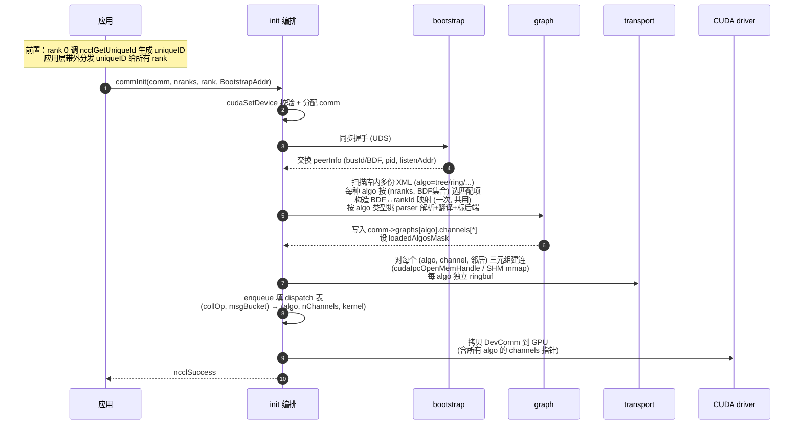

**关键决策**：同步握手是显式全局屏障；所有 rank 必须几乎同时调 `commInit`，否则会卡在握手上。**所有 algo 的拓扑都由 XML 给出**（一份 XML / algo / 机型），graph 模块只做 XML 加载 + BDF↔rankId 映射 + 边可达性探测，**无搜索、无代价矩阵、无现场拓扑扫描**。enqueue 在末段把 (collOp, msgBucket) → algo 路由策略物化为 dispatch 表，运行期一次查表即可分发。

### 7.2 流程二：集合通信热路径（含 algo 分发）

> 图 7-2：单次集合通信调用端到端——含 (collOp, msgBucket) → algo 分发

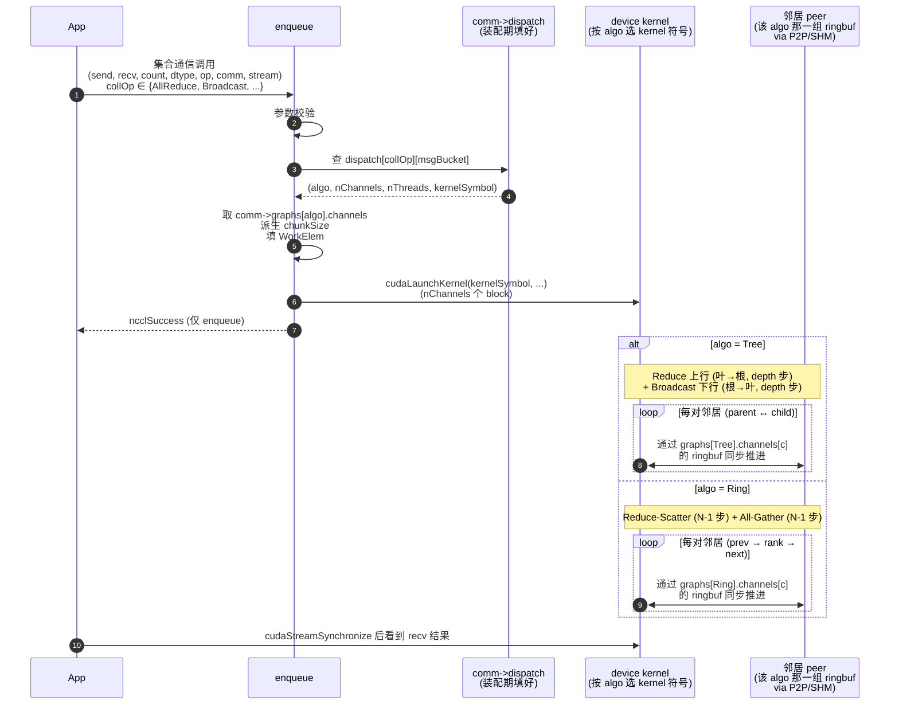

**关键决策**：
- 入队即返回：`ncclSuccess` 只表示"调度成功"，不代表运算已完成；完成由 CUDA stream 顺序提供。
- **algo 分发是一次 O(1) 查表**：`dispatch[collOp][msgBucket]` 在装配期就把"用哪个 algo / 哪几个 channel / 哪个 kernel 符号"全部物化，运行期没有任何分支决策。
- 不同 algo 共存但**互不干扰**：每个 algo 有独立的 channels / ringbuf / kernel 实例。运行期同时跑两个 collOp（如一个 AllReduce 走 Tree、一个 AllGather 走 Ring），不会因为共享底层资源而互相阻塞。
- GPU 内核 launch 后即在 device 上自主运行，依靠 ringbuf 的 head/tail 计数器与 peer 同步；**host 端不参与**，只需 `cudaStreamSynchronize` 等结果。

### 7.3 流程三：group 批量提交

> 图 7-4：group 区间内 N 次集合通信 → 1 次 launch + N 个 WorkElem
>
> 完整 SVG 见 [`group-flow.svg`](group-flow.svg)（左：不开 group 的 N 次 launch；右：开 group 的批量提交）。

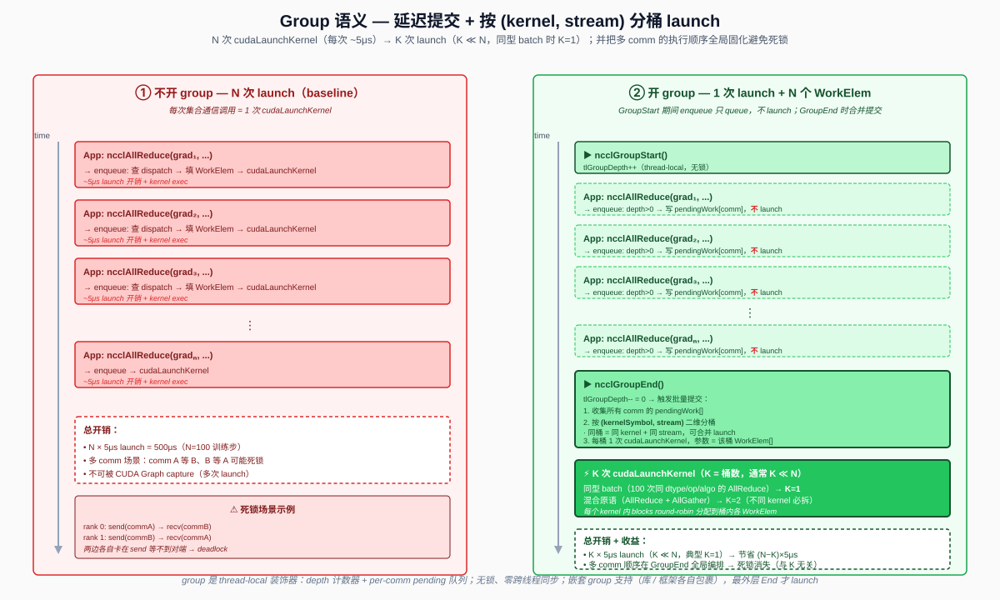

```mermaid
sequenceDiagram
  autonumber
  participant App as 应用
  participant Grp as group<br/>(thread-local)
  participant Enq as enqueue
  participant Pend as pendingWork[comm]<br/>(thread-local 队列)
  participant Kern as device kernel<br/>(多 WorkElem)

  App->>Grp: ncclGroupStart()
  Grp->>Grp: tlGroupDepth++ (= 1)

  loop N 次集合通信调用
    App->>Enq: ncclAllReduce / Send / ... (..., comm_i, stream_j)
    Enq->>Enq: ① 参数校验 ② 查 dispatch ③ chunkSize ④ 填 WorkElem
    Enq->>Grp: 第 5 步: 检查 tlGroupDepth
    Grp->>Pend: depth>0 → 写 (WorkElem, kernelSymbol, stream_j)
    Grp-->>App: ncclSuccess (无 cudaLaunchKernel)
  end

  App->>Grp: ncclGroupEnd()
  Grp->>Grp: tlGroupDepth-- (= 0)
  Note over Grp: depth = 0 → 触发批量提交
  Grp->>Pend: 收集所有 comm 的 pending
  Grp->>Grp: 按 (kernelSymbol, stream) 二维分桶<br/>得到 K 个桶（同型 batch 时 K=1，混合原语时 K&gt;1）
  loop 每个 (kernelSymbol, stream) 桶
    Grp->>Kern: cudaLaunchKernel(kernelSymbol, workElems[Mₖ], nElems=Mₖ, stream)
    Note over Kern: GPU: 该桶内 Mₖ 个 WorkElem 共享一次 launch<br/>blocks 按 blockIdx 索引到具体 WorkElem
  end
  Grp-->>App: ncclSuccess

  App->>Kern: cudaStreamSynchronize 后看到所有 recv 结果
```

**关键决策**：
- **GroupEnd 是唯一的提交时机**（非最外层 GroupEnd 不 launch）；嵌套 group 共享同一份 pending 队列。
- **按 `(kernelSymbol, stream)` 二维分桶**保留两层物理约束：① `cudaLaunchKernel` 单次只能绑定一个 kernel 函数（不同 algo / collOp / op / dtype 必须拆）；② CUDA stream 是独立并发单元（不同 stream 必须拆）。**桶数 K**：典型同型 batch（100 次同型 AllReduce）→ K=1；混合原语 / 跨 dtype → K>1。
- **launch 摊销收益与 K 成反比**：N 次调用合并为 K 次 launch，节省 (N−K)×~5μs。同型 batch（K=1）最佳；多桶时仍优于不开 group 的 N 次。
- **死锁消除收益与 K 无关**：无论 K=1 还是 K=多，所有 pending 在 GroupEnd 时已收齐 → 全局编排消除 Send/Recv 配对死锁。
- **失败原子性**：某桶 launch 失败 → 已 launch 的桶不可撤销 → 把 fatalError 写所有相关 comm；应用层通过 commGetAsyncError + commAbort 收尾。
- **死锁消失原理**：Send/Recv 配对场景中，单调用模式下 rank 0 先 send 阻塞等 rank 1 收，rank 1 先 send 阻塞等 rank 0 收 → 死锁；group 模式下两端 GroupEnd 时把所有 send/recv 一次性按桶提交到 GPU，GPU 端独立调度无依赖序问题。

### 7.4 流程四：异常退出

> 图 7-3：abortFlag / fatalError 两阶段

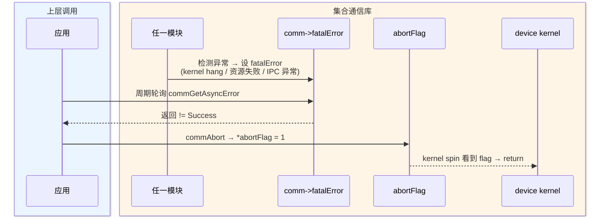

---

## 8. 后续 TODO

| 项 | 描述 | 主要触及模块 | 优先级 |
|---|---|---|---|
| **核函数内同步屏障** | 支持不同 rank 执行的核函数内同步会合 | device | P0 |
| **stream 支持增强** | CUDA Graph capture（group 区间被 capture 成单个 graph node）、multi-stream 并发、stream priority 透传 | enqueue / group | P0 |
| **XML 缺失时的兜底构造** | 当某 algo 在 `(nranks, BDF 集合)` 下没有匹配 XML 时，graph 模块从 NVML / sysfs 现场扫描拓扑，按该 algo 类型自动构造兜底拓扑并落盘成 XML（首次部署 / 临时机型自举），下次启动直接复用 | graph | P1 |
| **double binary tree XML** | 在 Tree XML 中常态化生成一对互补二叉树（NCCL Double-Tree）让根节点不再成为瓶颈；本期 XML schema 已支持多 channel，剩下的是把"如何生成互补树"沉淀到硬件团队的 XML 生成工具链 | graph / device（库内无改动） | P1 |
| **Ring kernel 与 XML** | 落地 `algo="ring"` 的 XML parser + Ring AllReduce / AllGather / ReduceScatter 的 device kernel 模板；enqueue 的 dispatch 策略已在本期预留 Ring 路由位 | graph / device | P1 |
| **LL / LL128 协议** | 低延迟传输协议，针对小消息优化（数据 + flag 同一 cache line）；与 Simple 协议并列，按消息大小切换 | transport / device | P2 |
| **自动 dispatch 策略调优** | 装配期按拓扑 / algo 实测延迟自动调整 (collOp, msgBucket) → algo 映射，去掉当前的硬编码默认 | enqueue | P2 |
| **其他集合通信原语** | broadcast / reduce / all-gather / reduce-scatter / all-to-all / gather / scatter——按当前多 algo 框架增量接入，每个原语在每种 algo 下独立 kernel 实例 | device / enqueue / public-api | P2 |
| **点对点通信** | `ncclSend` / `ncclRecv` 原语；直接走 transport 链路（P2P / SHM）；用于流水并行 (pipeline parallelism) 等场景 | device / enqueue / public-api | P2 |

---

## 附录

### 公开 ABI

```c
// 生命周期 (4)
// 启动流程:
//   ① rank 0 调 ncclGetUniqueId 生成 uniqueID
//      (含约定 BootstrapAddr: UDS 路径如 "/tmp/zeus-uid.sock")
//   ② 应用层通过 MPI / 文件 / 环境变量带外分发 uniqueID 给所有 rank
//   ③ 各 rank 从 uniqueID 解析出 BootstrapAddr,传给 ncclCommInit
// BootstrapAddr: 多进程场景所有 rank 必须传同一 UDS 路径
//                (用于交换 peerInfo + IPC handle);
//                单进程多 GPU 场景可传 NULL。
ncclResult_t ncclGetUniqueId(ncclUniqueId *out);
ncclResult_t ncclCommInit(ncclComm_t* comm, int nranks, int rank,
                          const char* BootstrapAddr);
ncclResult_t ncclCommDestroy(ncclComm_t comm);
ncclResult_t ncclCommAbort(ncclComm_t comm);

// Group 批量语义 (2)
// 用法:
//   ncclGroupStart();
//   ncclAllReduce(...);  // 不立即 launch,只入 pending 队列
//   ncclAllReduce(...);  // 同上
//   ncclGroupEnd();      // 合并所有 pending → 1 次 cudaLaunchKernel + N 个 WorkElem
//
// 语义:
//   - thread-local 深度计数,支持嵌套(库/框架各自包裹,最外层 End 才 launch)
//   - 区间内调用同步返回 ncclSuccess 不代表已 launch
//   - 区间内不同 stream 在 GroupEnd 时各自一次 launch(保持 CUDA 并发语义)
//   - 区间内不同 comm 的调用统一编排,消除"A 等 B、B 等 A"死锁
ncclResult_t ncclGroupStart(void);
ncclResult_t ncclGroupEnd(void);

// 集合通信原语
// 算法选择对调用方完全透明:enqueue 内部把 msgBytes(=count*sizeof(dtype))
// 落档为 msgBucket,再按 (collOp, msgBucket) 查 dispatch 表
// 自动挑 Tree / Ring / ...,与 algo 绑定的 kernel 在装配期已编译进库。
// 支持的 op:    Sum / Max / Min / Prod / Avg
// 支持的 dtype: int8 / uint8 / int32 / uint32 / int64 / uint64 /
//               float16 / bfloat16 / float32 / float64
// 合法 (op, dtype) 组合矩阵见 §6.2.6。
// fp16 / bf16 浮点归约默认采用 fp32 累加策略,不向用户暴露选项。
ncclResult_t ncclAllReduce(const void* sendbuff, void* recvbuff,
                           size_t count, ncclDataType_t dtype,
                           ncclRedOp_t op, ncclComm_t comm,
                           cudaStream_t stream);

// 以下原语按当前多 algo 框架增量接入(详见 §8 TODO):
ncclResult_t ncclBroadcast(const void* sendbuff, void* recvbuff,
                           size_t count, ncclDataType_t dtype,
                           int root, ncclComm_t comm, cudaStream_t stream);
ncclResult_t ncclReduce   (const void* sendbuff, void* recvbuff,
                           size_t count, ncclDataType_t dtype,
                           ncclRedOp_t op, int root,
                           ncclComm_t comm, cudaStream_t stream);
ncclResult_t ncclAllGather(const void* sendbuff, void* recvbuff,
                           size_t sendcount, ncclDataType_t dtype,
                           ncclComm_t comm, cudaStream_t stream);
ncclResult_t ncclReduceScatter(const void* sendbuff, void* recvbuff,
                           size_t recvcount, ncclDataType_t dtype,
                           ncclRedOp_t op, ncclComm_t comm,
                           cudaStream_t stream);

// 查询 (5)
ncclResult_t ncclCommCount(ncclComm_t comm, int* count);
ncclResult_t ncclCommUserRank(ncclComm_t comm, int* rank);
ncclResult_t ncclCommGetAsyncError(ncclComm_t comm, ncclResult_t* err);
const char*  ncclGetErrorString(ncclResult_t result);
ncclResult_t ncclGetVersion(int* version);
```

### 拓扑 XML 配置约定

| 项 | 值 |
|---|---|
| 携带位置 | `<lib_dir>/topo/*.xml`（库默认搜索路径） |
| 覆盖路径 | 环境变量 `ZEUS_TOPO_DIR=<dir>` 追加搜索目录 |
| 文件命名建议 | `topo_<arch>_<nranks>gpu_<algo>.xml`（如 `topo_h100_8gpu_tree.xml` / `topo_h100_8gpu_ring.xml`） |
| 根元素必备属性 | `version` / `arch` / `nranks` / `algo`（`tree` \| `ring` \| 后续扩展） |
| 加载规则 | 按 algo 分组，每种 algo 取 `(nranks, BDF 集合)` 第一个匹配项；至少一种 algo 命中即可启动 |
| dispatch 策略覆盖 | 环境变量 `ZEUS_COLL_ALGO=<collOp>:<algo>[,...]` 强制指定（如 `AllReduce:Ring`）；不指定走内置默认策略 |
